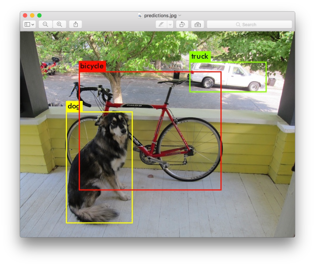
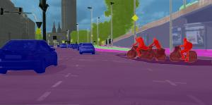
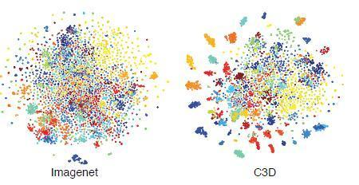
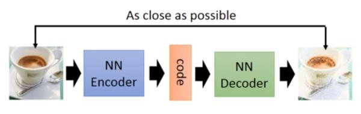

# 计算机视觉

## 应用分类

计算机视觉应用可以分为：**图片识别(Image Classification)、目标检测(Object Detection)、语义分割(Semantic Segmentation) 、视频理解(Video Understanding)和图片生成(Image Generation)** 等。下面对其进行详细介绍。

**图片识别(Image Classification)** 是常见的分类问题。神经网络的输入为图片数据，输出值为当前样本属于每个类别的概率，通常选取概率值最大的类别作为样本的预测类别。图片识别是最早成功应用深度学习的任务之一，经典的网络模型有 VGG 系列、Inception 系列、ResNet 系列等。

**目标 检测(Object Detection)**是指通过算法自动检测出图片中常见物体的大致位置，通常用边界框(Bounding box)表示，并分类出边界框中物体的类别信息。常见的目标检测算法有CNN，Fast RCNN，Faster RCNN，Mask RCNN，SSD,YOLO 系列等。

**语义分割(Semantic Segmentation)**是通过算法自动分割并识别出图片中的内容，可以将语义分割理解为每个像素点的分类问题，分析每个像素点属于物体的类别。常见的语义分割模型有 FCN，U-net，SegNet，DeepLab 系列等。

**视频理解(Video Understanding)** 随着深度学习在 2D 图片的相关任务上取得较好的效，具有时间维度信息的 3D 视频理解任务受到越来越多的关注。常见的视频理解任务有视频分类，行为检测，视频主体抽取等。常用的模型有 C3D，TSN，DOVF，TS_LSTM等。

**图片生成(Image Generation)** 通过学习真实图片的分布，并从学习到的分布中采样而获得逼真度较高的生成图片。目前主要的生成模型有 VAE 系列，GAN 系列等。其中 GAN 系列算法近年来取得了巨大的进展，最新 GAN 模型产生的图片样本达到了肉眼难辨真伪的效果。

## 学习路线

在开始学习计算机视觉之前，先来了解有关机器学习和python基础知识。

### 框架（Frameworks）

虽然不必从一开始就去考虑选择何种框架，但是实践应用新的知识是必要的。

对应框架并没有太多选择，主要为：**pytorch**或**keras**（TensorFlow）。Pytorch可能需要编写更多代码，但在返回方面具有很大的灵活性，因此我们可以先学习如何使用pytorch。此外，大多数深度学习研究人员也普遍使用pytoch。

**Albumentation**(图像增强库)和 **catalyst** (框架，pytorch顶部的高级API)在我们学习计算机视觉的过长中也是很常用的工具，我们也可以先学习和使用它们，尤其是第一个。

### 硬件

- Nvidia GPU 10xx +:（$ 300 +）
- Kaggle内核(免费):每周仅30个小时 （https://www.kaggle.com/kernels）
- Google Colab(免费): 12小时的会话限制，每周限制的使用时长不定 https://colab.research.google.com/notebooks/intro.ipynb#recent=true

### 理论与实践

#### 在线课程

- CS231n是非常好的在线教学课程，涵盖了计算机视觉的所有必要基础，是YouTube的在线视频。这门课程还包含了课后练习，对于新手来说，可以先不用完成练习。（免费） http://cs231n.stanford.edu/
- Fast.ai是我们应该学习的另一门课程。fast.ai是pytorch之上的高级框架，但是它们过于频繁地更改其API，并且缺乏文档使其使用不方便。但是，花些时间看这门课程的理论和有用的技巧是不错的选择。（免费） https://course.fast.ai/

#### 文章和代码

- ArXiv.org ——有关所有最新信息。（免费）https://arxiv.org/
- Browse State-of-the-Art: 最常见的深度学习任务的最新发展现状，而不仅仅是计算机视觉。（免费）https://paperswithcode.com/sota
- Github——对于实践的代码，你将在这里找到。（免费）https://github.com/topics/computer-vision?l=python

#### 书籍

虽然需要读的书籍不多，但是我相信这两本书都是有用的，无论你选择使用pytorch还是keras

- Keras创作者和Google AI研究人员FranoisChollet撰写的Python深度学习。易于使用，可能会获得你以前不知道的见识。（不是免费的） https://www.amazon.com/Deep-Learning-Python-Francois-Chollet/dp/1617294438
- pytorch团队Eli Stevens和Luca Antiga的Pytorch 深度学习（免费） https://pytorch.org/deep-learning-with-pytorch-thank-you

#### Kaggle

kaggle是各种机器学习竞赛的著名在线平台，其中很多是关于计算机视觉的。即使没有完成课程，你也可以开始参加比赛，因为从比赛中会有很多开放的内核（端对端代码），你可以直接从浏览器中运行它们。（免费） https://www.kaggle.com/competitions

### 论文

看论文方法可能很难，但是这种方法可以让你获得计算机视觉不同领域的知识，大家可以针对自己的研究方向选择具体的计算机视觉领域进行学习。视觉各个领域经典代表性项目列表如下: 

##### 网络架构

* AlexNet: https://papers.nips.cc/paper/4824-imagenet-classification-with-deep-convolutional-neural-networks
* ZFNet: https://arxiv.org/abs/1311.2901
* VGG16: https://arxiv.org/abs/1505.06798
* ResNet: https://arxiv.org/abs/1704.06904
* GoogLeNet: https://arxiv.org/abs/1409.4842
* Inception: https://arxiv.org/abs/1512.00567
* Xception: https://arxiv.org/abs/1610.02357
* MobileNet: https://arxiv.org/abs/1704.04861

##### 语义分割

* FCN: https://arxiv.org/abs/1411.4038
* SegNet: https://arxiv.org/abs/1511.00561
* UNet: https://arxiv.org/abs/1505.04597
* PSPNet: https://arxiv.org/abs/1612.01105
* DeepLab: https://arxiv.org/abs/1606.00915
* ICNet: https://arxiv.org/abs/1704.08545
* ENet: https://arxiv.org/abs/1606.02147

##### 生成对抗网络

* GAN: https://arxiv.org/abs/1406.2661
* DCGAN: https://arxiv.org/abs/1511.06434
* WGAN: https://arxiv.org/abs/1701.07875
* Pix2Pix: https://arxiv.org/abs/1611.07004
* CycleGAN: https://arxiv.org/abs/1703.10593

##### 目标检测

* RCNN: https://arxiv.org/abs/1311.2524
* Fast-RCNN: https://arxiv.org/abs/1504.08083
* Faster-RCNN: https://arxiv.org/abs/1506.01497
* SSD: https://arxiv.org/abs/1512.02325
* YOLO: https://arxiv.org/abs/1506.02640
* YOLO9000: https://arxiv.org/abs/1612.08242

##### 实例分割

* Mask-RCNN: https://arxiv.org/abs/1703.06870
* YOLACT: https://arxiv.org/abs/1904.02689

##### 姿态估计

* PoseNet: https://arxiv.org/abs/1505.07427
* DensePose: https://arxiv.org/abs/1802.00434

