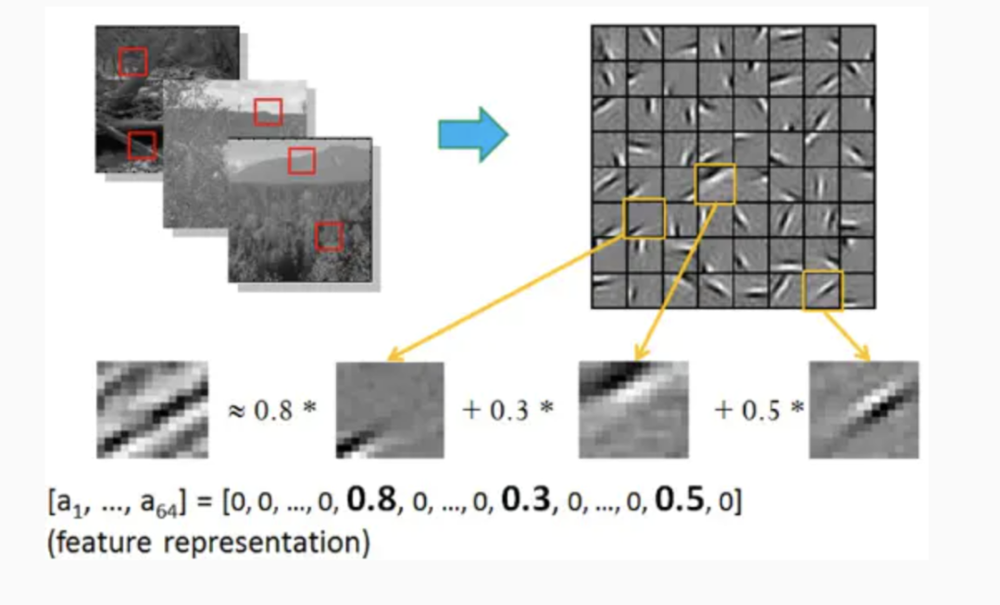
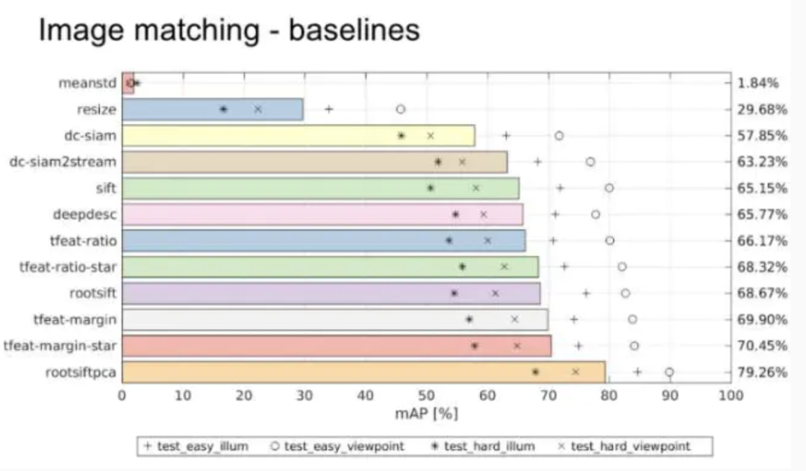
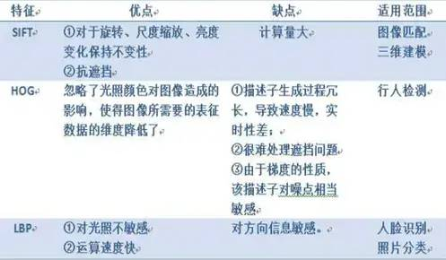

# 机器视觉特征提取

HOG、SIFT、SURF、ORB、LBP、HAAR

先对几个概念和问题做一个解释：

- **图像为什么要灰度化？**

1. 识别物体，最关键的因素是梯度（SIFT/HOG），梯度意味着边缘，这是最本质的部分，而计算梯度，自然就用到灰度图像了，可以把灰度理解为图像的强度。
2. 颜色，易受光照影响，难以提供关键信息，故将图像进行灰度化，同时也可以加快特征提取的速度。

- **仿射不变性**

平面上任意两条线，经过仿射变换后，仍保持原来的状态（比如平行的线还是平行，相交的线夹角不变等）

- **什么是局部特征？局部特征应该具有的特点？**

局部特征从总体上说是图像或在视觉领域中一些有别于其周围的地方；局部特征通常是描述一块区域，使其能具有高可区分度；局部特征的好坏直接会决定着后面分类、识别是否会得到一个好的结果。

**局部特征应该具有的特点：** 可重复性、可区分性、准确性、有效性（特征的数量、特征提取的效率）、鲁棒性（稳定性、不变性）。

## SIFT（尺度不变特征变换）

#### 1.1SIFT特征提取的实质

在不同的尺度空间上查找关键点(特征点)，并计算出关键点的方向。SIFT所查找到的关键点是一些十分突出、不会因光照、仿射变换和噪音等因素而变化的点，如角点、边缘点、暗区的亮点及亮区的暗点等。

#### 1.2SIFT特征提取的方法

**1. 构建DOG尺度空间：**

模拟图像数据的多尺度特征，大尺度抓住概貌特征，小尺度注重细节特征。通过构建高斯金字塔（每一层用不同的参数σ做高斯模糊（加权）），保证图像在任何尺度都能有对应的特征点，即保证**尺度不变性**。

**2.  关键点搜索和定位：**

确定是否为关键点，需要将该点与同尺度空间不同σ值的图像中的相邻点比较，如果该点为max或min，则为一个特征点。找到所有特征点后，要去除低对比度和不稳定的边缘效应的点，留下具有代表性的关键点（比如，正方形旋转后变为菱形，如果用边缘做识别，4条边就完全不一样，就会错误；如果用角点识别，则稳定一些）。去除这些点的好处是**增强匹配的抗噪能力和稳定性**。最后，对离散的点做曲线拟合，得到精确的关键点的位置和尺度信息。

**3. 方向赋值：**

为了实现**旋转不变性**，需要根据检测到的关键点的局部图像结构为特征点赋值。具体做法是用梯度方向直方图。在计算直方图时，每个加入直方图的采样点都使用圆形高斯函数进行加权处理，也就是进行高斯平滑。这主要是因为SIFT算法只考虑了尺度和旋转不变形，没有考虑**仿射不变性**。通过高斯平滑，可以使关键点附近的梯度幅值有较大权重，从而部分弥补没考虑仿射不变形产生的特征点不稳定。注意，一个关键点可能具有多个关键方向，这**有利于增强图像匹配的鲁棒性**。

**4. 关键点描述子的生成：**

关键点描述子不但包括关键点，还包括关键点周围对其有贡献的像素点。这样可使关键点**有更多的不变特性，提高目标匹配效率**。在描述子采样区域时，需要考虑旋转后进行双线性插值，防止因旋转图像出现白点。同时，为了保证**旋转不变性**，要以特征点为中心，在附近领域内旋转θ角，然后计算采样区域的梯度直方图，形成n维SIFT特征矢量（如128-SIFT）。最后，为了**去除光照变化的影响**，需要对特征矢量进行归一化处理。

- 如果对上述纯文字理解困难，可以参考文章：
  SIFT特征提取算法

#### **1.3 SIFT特征提取的优点**

1. SIFT特征是图像的局部特征，其对旋转、尺度缩放、亮度变化保持不变性，对视角变化、仿射变换、噪声也保持一定程度的稳定性；
2. 独特性（Distinctiveness）好，信息量丰富，适用于在海量特征数据库中进行快速、准确的匹配；
3. 多量性，即使少数的几个物体也可以产生大量的SIFT特征向量；
4. 高速性，**经优化的**SIFT匹配算法甚至可以达到实时的要求；
5. 可扩展性，可以很方便的与其他形式的特征向量进行联合；
6. 需要较少的经验主义知识，易于开发。

#### **1.4 SIFT特征提取的缺点**

1. 实时性不高，因为要不断地要进行下采样和插值等操作；
2. 有时特征点较少（比如模糊图像）；
3. 对边缘光滑的目标无法准确提取特征（比如边缘平滑的图像，检测出的特征点过少，对圆更是无能为力）。

**1.5 SIFT特征提取可以解决的问题：**

目标的自身状态、场景所处的环境和成像器材的成像特性等因素影响图像配准/目标识别跟踪的性能。而SIFT算法在一定程度上可解决：

1. 目标的旋转、缩放、平移（RST）
2. 图像仿射/投影变换（视点viewpoint）
3. 光照影响（illumination）
4. 目标遮挡（occlusion）
5. 杂物场景（clutter）
6. 噪声

近来不断有人改进，其中最著名的有 SURF（计算量小，运算速度快，提取的特征点几乎与SIFT相同）和 CSIFT（彩色尺度特征不变变换，顾名思义，可以解决基于彩色图像的SIFT问题）。

## 2 HOG（方向梯度直方图）

#### **2.1 HOG特征提取的实质**

通过计算和统计图像局部区域的梯度方向直方图来构成特征。Hog特征结合SVM分类器已经被广泛应用于图像识别中，尤其在行人检测中获得了极大的成功。

#### **2.2 HOG特征提取的方法**

1. 灰度化；
2. 采用Gamma校正法对输入图像进行颜色空间的标准化（归一化），目的是**调节图像的对比度，降低图像局部的阴影和光照变化所造成的影响，同时可以抑制噪音的干扰**；
3. 计算图像每个像素的梯度（包括大小和方向），主要是为了捕获轮廓信息，同时**进一步弱化光照的干扰**；
4. 将图像划分成小cells（例如6*6像素/cell）；
5. 统计每个cell的梯度直方图（不同梯度的个数），即可形成每个cell的descriptor；
6. 将每几个cell组成一个block（例如3*3个cell/block），一个block内所有cell的特征descriptor串联起来便得到该block的HOG特征descriptor。
7. 将图像image内的所有block的HOG特征descriptor串联起来就可以得到该image（你要检测的目标）的HOG特征descriptor了。这个就是最终的可供分类使用的特征向量了。

- 如果对上述纯文字理解困难，可以参考文章：
  目标检测的图像特征提取之（一）HOG特征

#### **2.3 HOG特征提取特点**

1. 由于HOG是在图像的局部方格单元上操作，所以它对图像几何的和光学的形变都能保持很好的不变性，这两种形变只会出现在更大的空间领域上。
2. 在粗的空域抽样、精细的方向抽样以及较强的局部光学归一化等条件下，只要行人大体上能够保持直立的姿势，可以容许行人有一些细微的肢体动作，这些细微的动作可以被忽略而不影响检测效果。因此HOG特征是特别适合于做图像中的人体检测的。

## 3 SIFT和HOG的比较

**共同点：**都是基于图像中梯度方向直方图的特征提取方法

**不同点：**

SIFT 特征通常与使用SIFT检测器得到的兴趣点一起使用。这些兴趣点与一个特定的方向和尺度相关联。通常是在对一个图像中的方形区域通过相应的方向和尺度变换后，再计算该区域的SIFT特征。

HOG特征的单元大小较小，故可以保留一定的空间分辨率，同时归一化操作使该特征对局部对比度变化不敏感。

结合SIFT和HOG方法，可以发现SIFT对于复杂环境下物体的特征提取具有良好的特性；而HOG对于刚性物体的特征提取具有良好的特性。

笔者曾做过一个自然场景分类的实验，发现SIFT的准确率比HOG高，而如果检测像人这种刚性的object，HOG的表现要比SIFT好。

## 4 SIFT/HOG与神经网络特征提取的比较

**众所周知，随着深度学习的发展，通过神经网络提取特征得到了广泛的应用，那么，神经网络提取的特征与传统的SIFT/HOG等特征提取方法有什么不同呢？**

#### **4.1 神经网络提取到的特征**

我们知道，对于一副图像，像素级的特征没有任何价值，而如果特征是一个具有结构性（或者说有含义）的时候，比如摩托车是否具有车把手，是否具有车轮，就很容易把摩托车和非摩托车区分，学习算法才能发挥作用。

早期，两个科学家Bruno Olshausen和 David Field通过实验研究了这个问题，发现一个复杂图像往往由一些基本结构组成。比如下图：一个图可通过用64种正交的edges（可以理解成正交的基本结构）来线性表示。比如样例的x可以用1-64个edges中的三个按照0.8,0.3,0.5的权重调和而成。而其他基本edges没有贡献，均为0 。

这就是神经网络每层提取到的特征。由于是通过神经网络自动学习到了，因此也是无监督的特征学习过程（Unsupervised Feature Learning） 。直观上说，就是找到make sense的小patch再将其进行combine，就得到了上一层的feature，递归地向上learning feature。在不同object上做training是，所得的edge basis 是非常相似的，但object parts和models 就会completely different了。

#### **4.2 传统特征提取方法与神经网络特征提取的比较**

**观点1：**传统特征提取方法的研究过程和思路是非常有用的，因为这些方法具有较强的可解释性，它们对设计机器学习方法解决此类问题提供启发和类比。有部分人认为（也有部分人反对）现有的卷积神经网络与这些特征提取方法有一定类似性，因为每个滤波权重实际上是一个线性的识别模式，与这些特征提取过程的边界与梯度检测类似。同时，池化（Pooling）的作用是统筹一个区域的信息，这与这些特征提取后进行的特征整合（如直方图等）类似。通过实验发现卷积网络开始几层实际上确实是在做边缘和梯度检测。不过事实上卷积网络发明的时候，还没有这些特征提取方法。

**观点2：** 深度学习的数据需求量大对于视觉来说是个伪命题。许多研究成果已经表明深度学习训练得到的模型具有很强的迁移能力，因此在大数据集上训练完成的模型只要拿过来在小数据集上用就可以，不需要完全重新训练。这种方式在小数据集上的结果往往也比传统方法好。

**观点3：**还是需要重新训练的，只能说大数据集训练好的模型提供了一个比较好的参数初始化。而且卷积前几层提取特征仅仅是对分类问题是对的，但是对于一些dense prediction还是不一样，毕竟提取特征不一定有用，还是task dependent。

**观点4：**深度学习是一种自学习的特征表达方法，比SIFT/HOG这些依靠先验知识设计的feature的表达效果高。早在13年大家都发现神经网络的最后一层的local特征和SIFT性质差不多，但是表达能力强太多。SIFT能做的事情CNN都能做，表达效果也强，那深度学习取代SIFT是迟早的事情（或者说已经发生的事情）。深度神经网络识别率的提高不需要建立在需求大量训练样本的基础上，拿pre-train好的模型直接用就可以了。在一些没有训练样本的应用（图像分割（image stithing）/ 立体匹配（stereo mathing）) ，可以把卷积层的activation提取出来做stitching的local feature（感觉是一个可以探索的方向）。未来还有SIFT/SURF这种固定特征提取算法的生存空间吗？除非是嵌入式这种计算资源极端受限的情况，但是现在大家都在试着implement CNN FPGA甚至ASIC了。

**观点5：**2016年ECCV上举办的一个local feature的工作会，发现在核心匹配问题上，CNN并没有什么突破性的进展。在Oxford大学的VGG组提供的Hpatch数据集上，发现rootsiftpca效果最好，如图：

那么提出两个问题：（1）现在流行的特征学习方法siamese或triplet等结构是否缺失了什么？（2）虽然CNN可以挖掘patch里面包含的信息并建立对于复杂几何和光照变化的不变性，但是这种学习到的不变性是否过度依赖于数据而无法有效泛化到真实匹配场景中所遇到的影像之间的复杂变化呢？

- 可以参考以下知乎话题，查看更多观点：
  https://www.zhihu.com/question/48315686

## 5 其他传统特征提取的方法（SURF、ORB、LBP、HAAR）

**SURF、ORB、LBP可以参考文章：**
图像特征检测描述(一):SIFT、SURF、ORB、HOG、LBP特征的原理概述及OpenCV代码实现

https://link.jianshu.com/?t=http://lib.csdn.net/article/opencv/41913

**5.1 SURF**

前面提到SITF的缺点是如果不借助硬件加速或专门的图像处理器很难达到实现，所以人们就要想办法对SITF算子进行改进，SURF算子便是对SIFT的改进，不过改进之后在算法的运行时间上还是没有质的飞跃。后面要介绍的ORB特征描述算子在运行时间上才是一种质的飞跃。

SURF主要是把SIFT中的某些运算作了简化。SURF把SIFT中的高斯二阶微分的模板进行了简化，使得卷积平滑操作仅需要转换成加减运算，这样使得SURF算法的鲁棒性好且时间复杂度低。SURF最终生成的特征点的特征向量维度为64维。

**5.2 ORB**

ORB特征描述算法的运行时间远优于SIFT与SURF，可用于实时性特征检测。ORB特征基于FAST角点的特征点检测与描述技术，具有尺度与旋转不变性，同时对噪声及透视仿射也具有不变性，良好的性能使得用ORB在进行特征描述时的应用场景十分广泛。

ORB特征检测主要分为以下两个步骤：

**①方向FAST特征点检测：** FAST角点检测是一种基于机器学习的快速角点特征检测算法，具有方向的FAST特征点检测是对兴趣点所在圆周上的16个像素点进行判断，若判断后的当前中心像素点为暗或亮，将候定其是否为角点。FAST角点检测计算的时间复杂度小，检测效果突出。FAST角点检测为加速算法实现，通常先对回周上的点集进行排序，排序使得其计算过程大大得到了优化。FAST对多尺度特性的描述是还是通过建立图像金字塔实现的，而对于旋转不变性即方向的特征则引入灰度质心法用于描述特征点的方向。

**②BRIEF特征描述：** BRIEF描述子主要是通过随机选取兴趣点周围区域的若干点来组成小兴趣区域，将这些小兴趣区域的灰度二值化并解析成二进制码串，将串特征作为该特征点的描述子，BRIEF描述子选取关键点附近的区域并对每一位比较其强度大小，然后根据图像块中两个二进制点来判断当前关键点编码是0还是1.因为BRIEF描述子的所有编码都是二进制数的，这样就节省了计算机存储空间。

**5.3 LBP**

LBP(Local Binary Pattern)，局部二值模式是一种描述图像局部纹理的特征算子，具有旋转不变性与灰度不变性等显著优点。LBP特征描述的是一种灰度范围内的图像处理操作技术，针对的是输入源为8位或16位的灰度图像。LBP特征是高效的图像特征分析方法，经过改进与发展已经应用于多个领域之中，特别是人脸识别、表情识别、行人检测领域已经取得了成功。LBP特征将窗口中心点与邻域点的关系进行比较，重新编码形成新特征以消除对外界场景对图像的影响，因此一定程度上解决了复杂场景下（光照变换）特征描述问题。

LBP算法根据窗口领域的不同分为经曲LBP和圆形LBP两种。下面分别介绍：

**①经典LBP：** 经典LBP算子窗口为3×3的正方形窗口，以窗口中心像素为阈值，将其相邻8领域像素灰度与中心像素值比较，若中心像素值小于周围像素值，则该中心像素位置被标记为1，否则为0（显然这种规则下，对于中心点大于或等于这两种情况，算法无法区分，后续经过改进引入LBP+与LBP-因子用来区分这两种情况）。图像经过这种遍历操作后，图像就被二值化了，每一个窗口中心的8邻域点都可以由8位二进制数来表示，即可产生256种LBP码，这个LBP码值可以用来反映窗口的区域纹理信息。LBP具体在生成的过程中，先将图像划分为若干个子区域，子区域窗口可根据原图像的尺寸进行调整，而不一定非得为3×3的正方形窗口。一般对于512×640的图像，子区域窗口区域选取大小为16×16。

**②圆形LBP：** 经典LBP用正方形来描述图像的纹理特征，其缺点是难以满足不同尺寸和频率的需求。Ojala等人对经典LBP进行了改进，提出了将3×3的正方形窗口领域扩展到任意圆形领域。由于圆形LBP采样点在圆形边界上，那么必然会导致部分计算出来的采样点坐标不是整数，因此这里就需要对得到的坐标像素点值进行处理，常用的处理方法是最近邻插值或双线性插值。

放一张SIFT/HOG/LBP优缺点、适用范围对比图：

**5.4 HAAR**

人脸检测最为经典的算法Haar-like特征+Adaboost。这是最为常用的物体检测的方法（最初用于人脸检测），也是用的最多的方法。

**训练过程：** 输入图像->图像预处理->提取特征->训练分类器（二分类）->得到训练好的模型；

**测试过程：**输入图像->图像预处理->提取特征->导入模型->二分类（是不是所要检测的物体）。

Haar-like特征是很简单的，无非就是那么几种，如两矩形特征、三矩形特征、对角特征。后来，还加入了边缘特征、线特征、中心环绕特征等。使用积分图可以加速计算特征。最后，使用集成的方法Adaboost进行训练。

- 具体细节可以参考文章：
  特征提取之Haar特征

  https://link.jianshu.com/?t=http://blog.csdn.net/xizero00/article/details/46929261

- 再附一个Haar和HOG比较的问题：
  为什么在行人检测中，HOG特征比Haar特征更精确？

https://link.jianshu.com/?t=http://blog.csdn.net/DuinoDu/article/details/51981327

**1、SIFT / HOG 不同点：** SIFT提取的关键点是角点，HOG提取的是边缘特征。
**2、传统特征提取 / CNN特征提取不同点：**传统特征提取方法的检测算子一般是人为设计好的，是经过大量的先验知识总结得到的；CNN特征提取相当于在训练一个个filter（过滤器、卷积核），这些filter相当于传统特征提取方法中的检测算子。因此，CNN特征提取是利用神经网络的自主学习得到的。