# NMS

由于目标在图像中的形状和大小可能是各种各样的，所以为了能够较好地在图像中检测这些目标，通常会设计去生成数量众多、长宽各异的候选边界框。但是对于一个目标检测任务来说，理想的情况是一个目标只需输出一个最准确的边界框即可。

## 前言

Non-Maximum Suppression（NMS）非极大值抑制。从字面意思理解，抑制那些非极大值的元素，保留极大值元素。其主要用于目标检测，目标跟踪，3D重建，数据挖掘等。**其核心思想在于抑制非极大值的目标（去冗余），从而搜索出局部极大值的目标（找最优）。**

目前NMS常用的有标准NMS, Soft  NMS, DIOU NMS等。后续出现了新的Softer NMS，Weighted NMS等改进版。

## 原始NMS

以目标检测为例，目标检测推理过程中会产生很多检测框（A,B,C,D,E,F等），其中很多检测框都是检测同一个目标，但最终每个目标只需要一个检测框，NMS选择那个得分最高的检测框（假设是C），再将C与剩余框计算相应的IOU值，当IOU值超过所设定的阈值（普遍设置为0.5，目标检测中常设置为0.7，仅供参考），即对超过阈值的框进行抑制，抑制的做法是将检测框的得分设置为0，如此一轮过后，在剩下检测框中继续寻找得分最高的，再抑制与之IOU超过阈值的框，直到最后会保留几乎没有重叠的框。这样基本可以做到每个目标只剩下一个检测框。

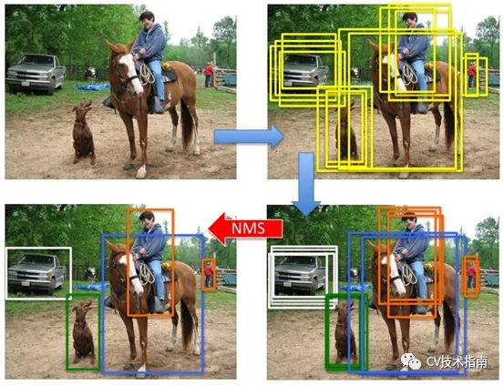

具体做法: 

1、选取这类box中scores最大的那一个，记为current_box，并保留它；(为什么保留它，因为它预测出当前位置有物体的概率最大，当前confidence越大说明当前box中包含物体的可能行就越大)

2、计算current_box与其余的box的IOU；

3、如果其IOU大于我们设定的阈值，那么就舍弃这些boxes；（为什么要删除，是因为超过设定阈值，认为两个框的里面的物体属于同一个类别，比如都属于狗这个类别。只需要留下一个类别的可能性框图即可。）

4、从最后剩余的boxes中，再找出最大scores的那一个(之前那个大的已经保存到输出的数组中，这个是从剩下的里面再挑一个最大的)，如此循环往复。

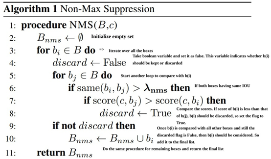

原始NMS算法伪代码如下：

实现代码：

**(手工版本)**

```

import numpy as np

def nms(dets, thresh):
    #x1、y1、x2、y2、以及score赋值
    x1 = dets[:, 0]
    y1 = dets[:, 1]
    x2 = dets[:, 2]
    y2 = dets[:, 3]
    scores = dets[:, 4]

    #每一个候选框的面积
    areas = (x2 - x1 + 1) * (y2 - y1 + 1)
    #order是按照score降序排序的
    order = scores.argsort()[::-1]

    keep = []
    while order.size > 0:
        i = order[0]
        keep.append(i)
        #计算当前概率最大矩形框与其他矩形框的相交框的坐标，会用到numpy的broadcast机制，得到的是向量
        xx1 = np.maximum(x1[i], x1[order[1:]])
        yy1 = np.maximum(y1[i], y1[order[1:]])
        xx2 = np.minimum(x2[i], x2[order[1:]])
        yy2 = np.minimum(y2[i], y2[order[1:]])

        #计算相交框的面积,注意矩形框不相交时w或h算出来会是负数，用0代替
        w = np.maximum(0.0, xx2 - xx1 + 1)
        h = np.maximum(0.0, yy2 - yy1 + 1)
        overlaps = w * h
        #计算重叠度IOU：重叠面积/（面积1+面积2-重叠面积）
        iou = inter / (areas[i] + areas[order[1:]] - overlaps)

        #找到重叠度不高于阈值的矩形框索引
        inds = np.where(iou <= thresh)[0]
        #将order序列更新，由于前面得到的矩形框索引要比矩形框在原order序列中的索引小1，所以要把这个1加回来
        order = order[inds + 1]
    return keep

# test
if __name__ == "__main__":
    dets = np.array([[30, 20, 230, 200, 1], 
                     [50, 50, 260, 220, 0.9],
                     [210, 30, 420, 5, 0.8],
                     [430, 280, 460, 360, 0.7]])
    thresh = 0.35
    keep_dets = nms(dets, thresh)
    print(keep_dets)
    print(dets[keep_dets])
```

**（以pytorch为例）**

```
def NMS(boxes,scores, thresholds):    
    x1 = boxes[:,0]    
    y1 = boxes[:,1]    
    x2 = boxes[:,2]    
    y2 = boxes[:,3]    
    areas = (x2-x1)*(y2-y1)    
    
    _,order = scores.sort(0,descending=True)    
    keep = []    
    while order.numel() > 0:        
        i = order[0]        
        keep.append(i)        
        if order.numel() == 1:            
            break        
        xx1 = x1[order[1:]].clamp(min=x1[i])        
        yy1 = y1[order[1:]].clamp(min=y1[i])        
        xx2 = x2[order[1:]].clamp(max=x2[i])        
        yy2 = y2[order[1:]].clamp(max=y2[i])  
        
        w = (xx2-xx1).clamp(min=0)        
        h = (yy2-yy1).clamp(min=0)        
        inter = w*h        
        
        ovr = inter/(areas[i] + areas[order[1:]] - inter)        
        ids = (ovr<=thresholds).nonzero().squeeze()     
        
        if ids.numel() == 0:            
            break        
        order = order[ids+1]    
    return torch.LongTensor(keep)
```

除了自己实现以外，也可以直接使用torchvision.ops.nms来实现。

```
torchvision.ops.nms(boxes, scores, iou_threshold)
```

上面这种做法是把所有boxes放在一起做NMS，没有考虑类别。即某一类的boxes不应该因为它与另一类最大得分boxes的iou值超过阈值而被筛掉。

对于多类别NMS来说，它的思想比较简单：每个类别内部做NMS就可以了。实现方法：把每个box的坐标添加一个偏移量，偏移量由类别索引来决定。

下面是torchvision.ops.batched_nms的实现源码以及使用方法

```
#实现源码
max_coordinate = boxes.max()
offsets = idxs.to(boxes) * (max_coordinate + torch.tensor(1).to(boxes))
boxes_for_nms = boxes + offsets[:, None]
keep = nms(boxes_for_nms, scores, iou_threshold)
return keep

#使用方法
torchvision.ops.boxes.batched_nms(boxes, scores, classes, nms_thresh)
```

这里偏移量用boxes中最大的那个作为偏移基准，然后每个类别索引乘以这个基准即得到每个类的box对应的偏移量。这样就把所有的boxes按类别分开了。

在YOLO_v5中，它自己写了个实现的代码。

```
c = x[:, 5:6] * (0 if agnostic else max_wh)  # classes
boxes, scores = x[:, :4] + c, x[:, 4]  # boxes (offset by class), score
si = torchvision.ops.nms(boxes, scores, iou_thres) 
```

这里的max_wh相当于前面的boxes.max()，YOLO_v5中取的定值4096。这里的agnostic用来控制是否用于多类别NMS还是普通NMS。

## NMS的缺点

从NMS算法的原理，可以比较容易想到该算法的缺点：

1. 仅依据边界框的置信度评价边界框的质量好坏，但是在目标检测任务中需要的是能准确框出目标的边界框，而边界框的置信度与其是否框得准确这二者之间并没有强相关，可能会出现框的更准但置信度低的边界框被其他置信度更高但框不准的边界框抑制掉；
2. 如果目标之间出现大面积重叠，目标A边界框的置信度大于目标B边界框的置信度，它们之间的IoU大于阈值，那么目标B的边界框就会被抑制，导致目标B被漏检。

原始NMS算法详细汇总如下: 

1. 需要手动设置阈值，阈值的设置会直接影响重叠目标的检测，太大造成误检，太小造成漏检。
2. 低于阈值的直接设置score为0，做法太hard。
3. 只能在CPU上运行，成为影响速度的重要因素。
4. 通过IoU来评估，IoU的做法对目标框尺度和距离的影响不同。

## NMS的改进思路

1. 根据手动设置阈值的缺陷，通过自适应的方法在目标系数时使用小阈值，目标稠密时使用大阈值。例如Adaptive NMS。
2. 将低于阈值的直接置为0的做法太hard，通过将其根据IoU大小来进行惩罚衰减，则变得更加soft。例如Soft NMS，Softer NMS。
3. 只能在CPU上运行，速度太慢的改进思路有三个，一个是设计在GPU上的NMS，如CUDA NMS，一个是设计更快的NMS，如Fast NMS，最后一个是掀桌子，设计一个神经网络来实现NMS，如ConvNMS。
4. IoU的做法存在一定缺陷，改进思路是将目标尺度、距离引进IoU的考虑中。如DIoU。

下面稍微介绍一下这些方法中常用的一部分，另一部分仅提供链接。

## Soft NMS

根据前面对目标检测中NMS的算法描述，易得出标准NMS容易出现的几个问题：**当阈值过小时，如下图所示，绿色框容易被抑制；当过大时，容易造成误检，即抑制效果不明显**。因此，出现升级版soft NMS。

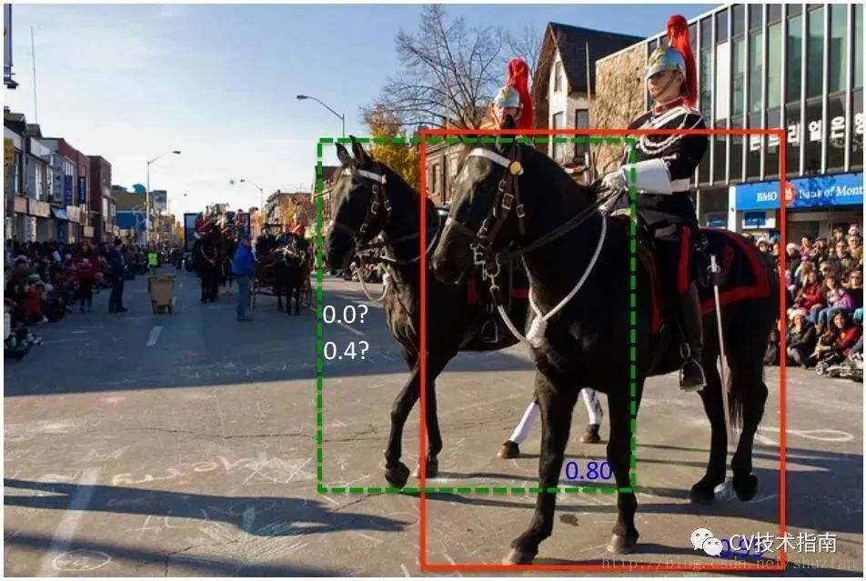

Soft NMS算法伪代码如下：

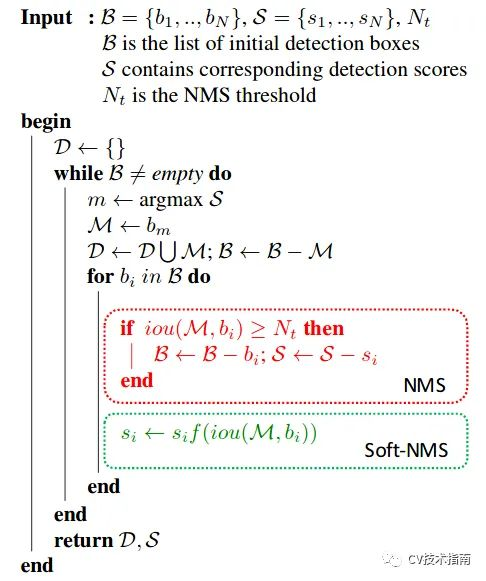

标准的NMS的抑制函数如下：

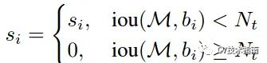

IOU超过阈值的检测框的得分直接设置为0，而soft NMS主张将其得分进行惩罚衰减，有两种衰减方式，第一种惩罚函数如下：

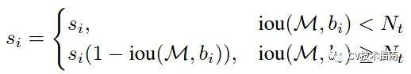

这种方式使用1-Iou与得分的乘积作为衰减后的值，但这种方式在略低于阈值和略高于阈值的部分，经过惩罚衰减函数后，很容易导致得分排序的顺序打乱，合理的惩罚函数应该是具有高iou的有高的惩罚，低iou的有低的惩罚，它们中间应该是逐渐过渡的。因此提出第二种高斯惩罚函数，具体如下：

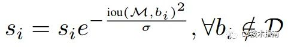

这样soft NMS可以避免阈值设置大小的问题。

Soft NMS还有后续改进版Softer-NMS，其主要解决的问题是：当所有候选框都不够精确时该如何选择，当得分高的候选框并不更精确，更精确的候选框得分并不是最高时怎么选择 。论文值得一看，本文不作更多的详解。

此外，针对这一阈值设置问题而提出的方式还有Weighted NMS和Adaptive NMS。

Weighted NMS主要是对坐标进行加权平均，实现函数如下：

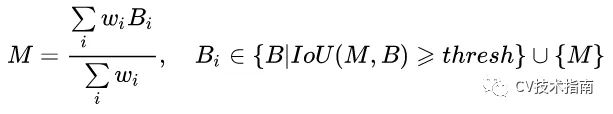

其中Wi = Si *IoU(M,Bi),表示得分与IoU的乘积。

Adaptive NMS在目标分布稀疏时使用小阈值，保证尽可能多地去除冗余框，在目标分布密集时采用大阈值，避免漏检。

Softer NMS论文链接：https://arxiv.org/abs/1809.08545

Softer NMS论文代码：https://github.com/yihui-he/softer-NMS

Weighted NMS论文链接：https://ieeexplore.ieee.org/document/8026312/

Adaptive NMS论文链接：https://arxiv.org/abs/1904.03629

## DIoU NMS

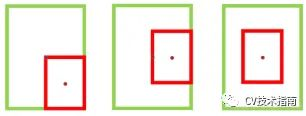

当IoU相同时，如上图所示，当相邻框的中心点越靠近当前最大得分框的中心点，则可认为其更有可能是冗余框。第一种相比于第三种更不太可能是冗余框。因此，研究者使用所提出的DIoU替代IoU作为NMS的评判准则，公式如下：

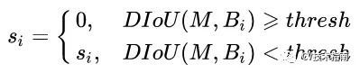

DIoU定义为DIoU=IoU-d²/c²，其中c和d的定义如下图所示。

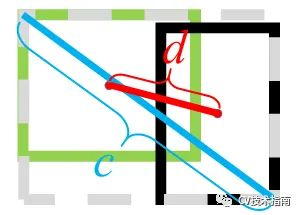

在DIoU实际应用中还引入了参数β，用于控制对距离的惩罚程度。

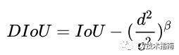

当 β趋向于无穷大时，DIoU退化为IoU，此时DIoU-NMS与标准NMS效果相当。

当 β趋向于0时，此时几乎所有中心点与得分最大的框的中心点不重合的框都被保留了。

注：除了DIoU外，还有GIoU，CIoU，但这两个都没有用于NMS，而是用于坐标回归函数，DIoU虽然本身也是用于坐标回归，但有用于NMS的。

## GIoU

GIoU的主要思想是引入将两个框的距离。寻找能完全包围两个框的最小框（计算它的面积Ac）。

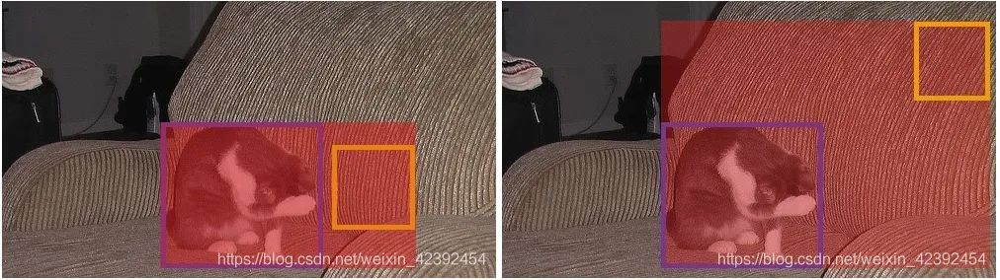

计算公式如下：

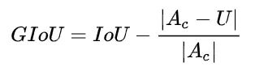

当两个框完全不相交时，没有抑制的必要。

当两个框存在一个大框完全包围一个小框时或大框与小框有些重合时，GIoU的大小在（-1，1）之间，不太好用来作为NMS的阈值。

GIoU的提出主要还是用于坐标回归的loss，个人感觉用于NMS不合适，CIoU也是如此，这里之所以提这个，是因为它与DIoU、CIoU一般都是放一起讲的。

## 其它相关NMS

为了避免阈值设置大小、目标太密集等问题，还有一些其他方法使用神经网络去实现NMS，但并不常用，这里只提一笔，感兴趣的读者请自行了解。如：

ConvNMS：A Convnet for Non-maximum Suppression

Pure NMS Network：Learning non-maximum suppression

Yes-Net: An effective Detector Based on Global Information

Fast NMS：https://github.com/dbolya/yolact

Cluster NMS：https://github.com/Zzh-tju/CIoU

Matrix NMS：https://github.com/WXinlong/SOLO