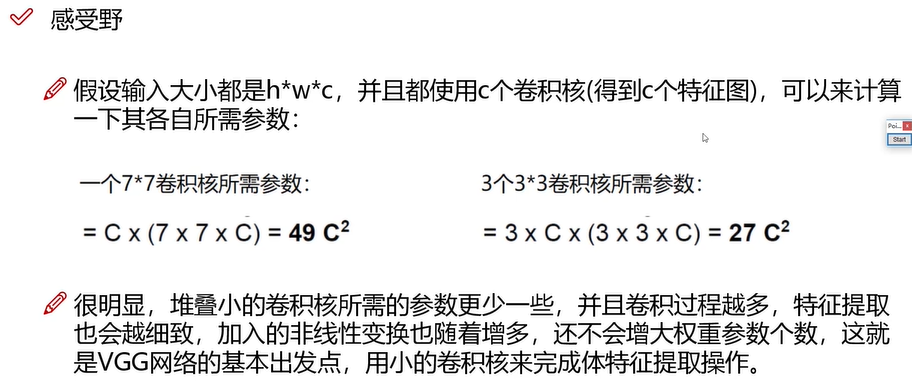

# 感受野

### 感受野

在卷积神经网络中，感受野（Receptive Field）的定义是卷积神经网络每一层输出的特征图（feature map）上每个像素点在原始图像上映射的区域大小，这里的原始图像是指网络的输入图像，是经过预处理（如resize，wrap，crop）后的图像。

神经元之所以无法对原始图像的所有信息进行感知，是因为在卷积神经网络中普遍使用卷积层和pooling层，在层与层之间均为局部连接。

神经元感受野的值越大表示其能接触到的原始图像范围就越大，也意味着它可能蕴含更为全局，语义层次更高的特征；相反，值越小则表示其所包含的特征越趋向局部和细节。因此**感受野的值可以用来大致判断每一层的抽象层次**.

### 感受野的计算

如图所示的原始图像，经过kernel_size=3, stride=2的Conv1，kernel_size=2, stride=1的Conv2后，输出特征图大小为2 * 2，很明显，原始图像的每个单元的感受野为1，Conv1的每个单元的感受野为3，而由于Conv2的每个单元都是由2 * 2范围的Conv1构成，因此回溯到原始图像，每个单元能够看到5 * 5大小的区域范围。

那么卷积神经网络的每一层感受野应该如何计算呢？

很明显，深层卷积层的感受野大小和它之前所有层的滤波器大小和步长有关系，而涉及到这两个参数的有卷积层和pooling层。

 以上公式只计算conv层和pooling层，以AlexNet为例：

| No.  | Layer    | Input Size | Kernel Size | Stride | Padding | Output Size | Receptive Field |
| :--- | :------- | :--------- | :---------- | :----- | :------ | :---------- | :-------------- |
| 1    | Conv1    | 227 * 227  | 11 * 11     | 4      | 0       | 55 * 55     | 11              |
| 2    | Pooling1 | 55 * 55    | 3 * 3       | 2      |         | 27 * 27     | 19              |
| 3    | Conv2    | 27 * 27    | 5 * 5       | 1      | 2       | 27 * 27     | 51              |
| 4    | Pooling2 | 27 * 27    | 3 * 3       | 2      |         | 13 * 13     | 67              |
| 5    | Conv3    | 13 * 13    | 3 * 3       | 1      | 1       | 13 * 13     | 99              |
| 6    | Conv4    | 13 * 13    | 3 * 3       | 1      | 1       | 13 * 13     | 131             |
| 7    | Conv5    | 13 * 13    | 3 * 3       | 1      | 1       | 13 * 13     | 163             |
| 8    | Pooling5 | 13 * 13    | 3 * 3       | 2      |         | 6* 6        | 195             |

其中Padding参数不影响感受野大小。

## 参数个数计算

## 拓展

通常上述公式求取的感受野通常很大,而实际的**有效感受野(Effective Receptive Field)**往往小于理论感受野,因为输入层中边缘点的使用次数明显比中间点要少,因此作出的贡献不同,所以经过多层的卷积堆叠后,输入层对于特征图点做出的贡献分布呈高斯分布形状

在使用Anchor作为强先验区域的物体检测算法中,如Faster RCNN和SSD,如何设置Anchor的大小,都应该考虑感受野,尤其是有效感受野,过大或过小都不好,来自

## 参考

1. [关于感受野的理解与计算](https://www.jianshu.com/p/9997c6f5c01e)

