# 相机标定

- 相机标定的目的和意义
- 相机成像过程的简化与建模
- 针孔相机模型的数学描述
- 标定针孔相机模型的参数

## 相机标定的目的和意义

我们所处的世界是三维的，而照片是二维的，这样我们可以把相机认为是一个函数，输入量是一个场景，输出量是一幅灰度图。这个从三维到二维的过程的函数是不可逆的。

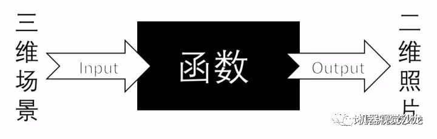

相机标定的目标是我们找一个合适的数学模型，求出这个模型的参数，这样我们能够近似这个三维到二维的过程，使这个三维到二维的过程的函数找到反函数。

这个逼近的过程就是「相机标定」，我们用简单的数学模型来表达复杂的成像过程，并且求出成像的反过程。标定之后的相机，可以进行三维场景的重建，即深度的感知，这是计算机视觉的一大分支。

## 相机成像过程的简化与建模

提到相机的成像，从根本上来说，就是在讨论相机的镜头。固定结构的相机镜头决定了一对固定的物像共轭关系，所谓「共轭」，意思是镜头前某个位置的物，它的像一定在镜头后的某个位置，这个关系是固定的。举个最简单的例子，无穷远处的物必然会在镜头的焦点处成像。这里说的固定结构，指的是镜头的焦距固定，光圈固定。

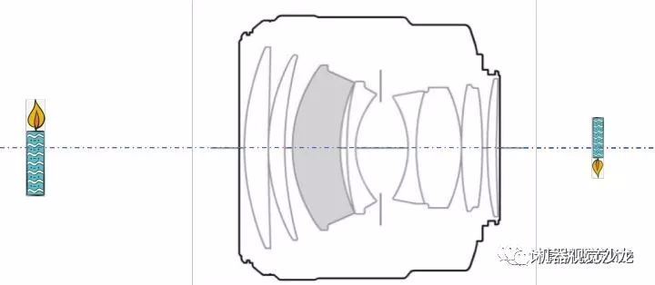

上图是Canon EF 85mm/F1.2L II USM，我们可以找一个与这个镜头具有相同的物像共轭关系的凸透镜来等效这个镜头，我们把这个凸透镜称作等效透镜，用朝外的双箭头表示，如下图。

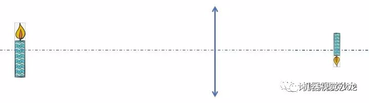

这里说的等效，只是针对物像共轭关系的等效，也就是光路的等效，镜头中之所以用了形态各异的透镜主要是为了消除各种各样的像差，提高清晰度。换句话说，等效透镜的目的绝不是为了在实际应用中取代镜头（毕竟一个镜头都好贵），只是为了帮助我们理解。这样我们就可以画出相机拍摄到清晰的蜡烛燃烧场景的草图，如下

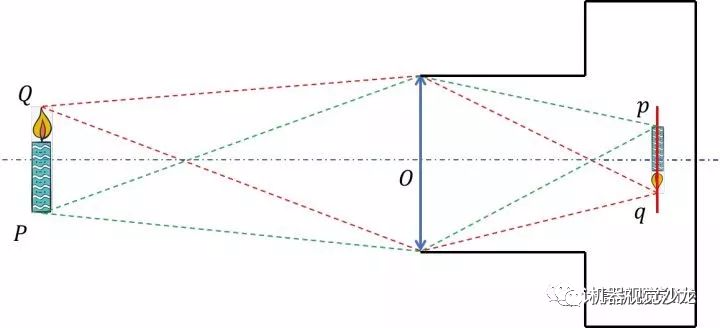

其中, Q是火苗尖的物点，q是火苗尖的像点 ，P是蜡烛根的物点，p是蜡烛根的像点， O是等效透镜的中心（也称为光心），红色虚线表达了物点Q到q像点成像光路中的两条，绿色虚线表达了物点P到像点p成像光路中的两条，红色是CCD面。
注意，刚刚说到我们画的是「相机拍摄到清晰的蜡烛燃烧场景的草图」，这表明像点q和像点p刚好落在CCD面上，那么假如像点没有落在CCD面上，也就是CCD拍摄的图像不清晰，我们如何确定像点的位置？

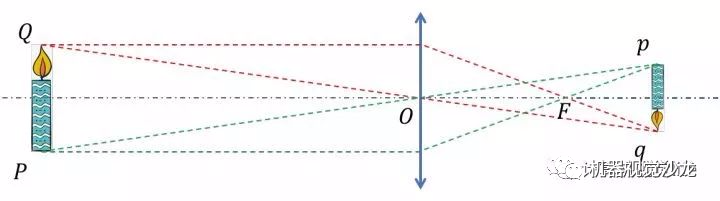

根据几何光学的作图法，由过等效透镜的焦点F的光线和过光心O的光线，我们可以作出像点p与q的位置，现在我们对「相机拍摄到清晰的蜡烛燃烧场景的草图」同样用作图法，只考虑Q与q点的物像关系。

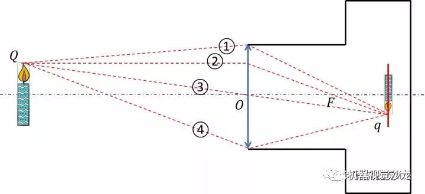

这样我们就能够得到成像光路中的4条：①是过透镜上边沿的光路，④是过透镜下边沿的光路，②是过等效透镜焦点的光路，③是过光心的光路。它们都表达了物点Q与像点q的物像共轭关系，显然③过光心的光路是最容易建立物像共轭关系数学模型，因此我们用③来代表成像光路，对相机成像过程进行简化。

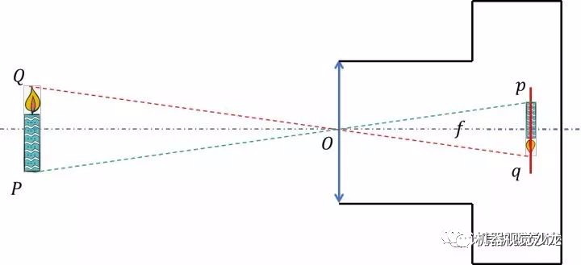

到这里我们发现，简化后的相机模型和针孔相机的成像原理很相似，因此我们把简化后的相机模型称为针孔相机模型。上图中的f是针孔相机模型的焦距，但请注意，此针孔相机「焦距」非彼等效透镜「焦距」，只是借用了「焦距」汇聚光线的概念，表达的是CCD面到光心的距离。

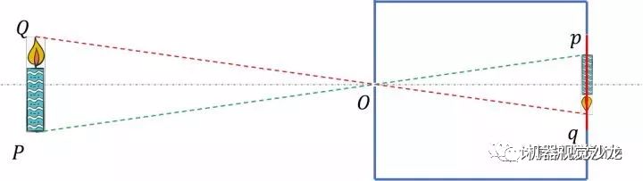

这里说的等效，只是针对物像共轭关系的等效，也就是光路的等效，镜头中之所以用了形态各异的透镜主要是为了消除各种各样的像差，提高清晰度。换句话说，等效透镜的目的绝不是为了在实际应用中取代镜头（毕竟一个镜头都好贵），只是为了帮助我们理解。这样我们就可以画出相机拍摄到清晰的蜡烛燃烧场景的草图，如下

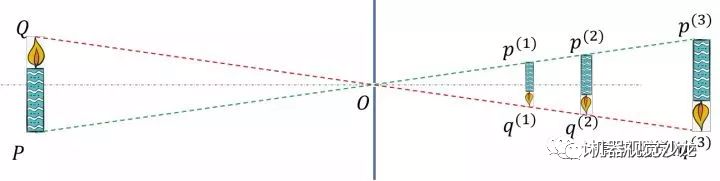

所以准确的讲把相机的成像过程简化成针孔相机模型，只是借用了针孔相机中简单的数学关系来表达一些本来难以表达的数学关系，使得数学上大大降低了复杂性，但是这个简化的代价同样很大，它本身不考虑像差（虽然针孔相机模型补充了消畸变模型）、不考虑景深（针孔相机模型物像关系不具有一一对应性，认为凡是物总能成清晰像），并且假定等效透镜是薄透镜。所以说针孔相机模型仅仅是一种真实相机的成像过程的近似，甚至于我们可以说这是一种非常粗糙的近似，这使得这个模型对越符合针孔相机模型的真实相机近似程度越高，如网络摄像头、手机镜头、监控探头等等。

## 针孔相机模型的描述

我们对相机成像过程进行简化和建模得到了针孔相机模型，如下图示。

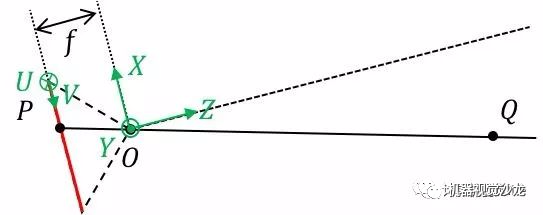

首先建立相机坐标系，我们以光心 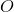为坐标系的原点， 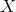与 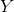方向是CCD像素排列的水平和竖直两个方向， 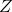方向垂直与CCD面，建立右手坐标系，这是一个三维坐标系。其次，我们还需要建立CCD标号坐标系：以CCD左上角像素标号为原点，CCD像素排列的水平和竖直两个方向为 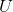与 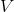方向，这是一个二维坐标系。为了方便描述，我们之后将把针孔相机模型对称翻转过来，如下图所示，从数学的角度，它们是等价的。

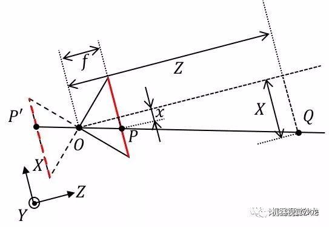

- 由光心 着光轴出发，像平面在 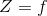上， 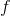是相机的物理焦距（单位：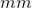）。

- 点 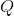在空间中，在相机坐标系下的位置是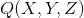

- 点 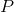在像平面上，有两个等价的位置描述：1. 在相机坐标系下的位置是 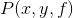；2. 在CCD标号坐标系下的位置是 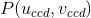。

- 在无镜头畸变的条件下，光心 、点 与点 在一条直线上。

- 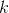与 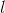是CCD单个像素在水平和竖直两个方向上的尺寸（单位：/像素），因此定义焦距为 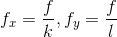（单位：像素）。

- CCD标号坐标系原点到光轴的偏移量为 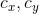（单位：像素）。根据相似三角形关系，可以得出：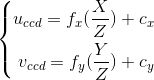

  **(1) 二维CCD标号坐标 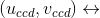二维CCD像素坐标 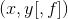**建立CCD像面上的点标号坐标与物理坐标之间关联，由于像平面在 上，可省略。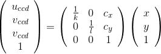

  **(2) 像点的二维像素坐标 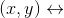物点的三维空间中的坐标 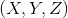**建立CCD像面上像点物理坐标与对应的三维空间中物点坐标之间关联。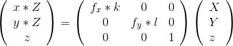

  **(3) 像点的二维CCD标号坐标 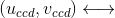物点的三维空间中的坐标 **连接(1)和(2)的两个关联，也是实际进行标定得到参数 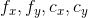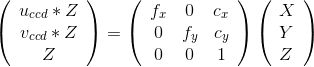

  由以上三个关联可以得到：像点标号 像点坐标 物点坐标 。

  在OpenCV及Matlab标定工具箱直接使用了(3)关联，不需要知道CCD单个像素的尺寸，因此在标定过程是得不到物理焦距 的，只能得到像素焦距 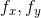。

  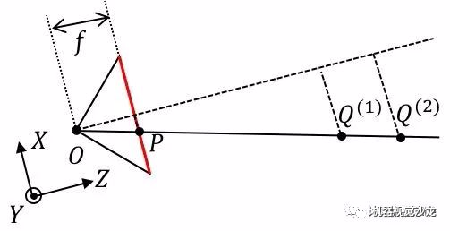

  很容易发现，(3)关联是不约束 的，也就是说，针孔相机模型本身是欠定的，通过被点亮的CCD像素 我们只能知道物点 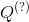在射线 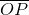上，但无法确定具体的点，所以我们讲，针孔相机模型是一个射线方程模型， 点的射线方程：

  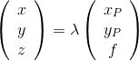

  以上的关系是在无镜头畸变的条件下建立的，但是实际上存在镜头畸变，可以理解成像点和物点之间的光线是弯曲的，要得到射线模型，要进行消除畸变。

  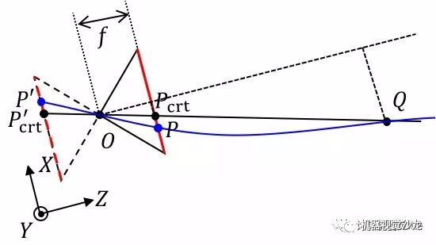

  (4) 补充消畸变模型以像面中心像素坐标 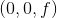为中心，像面上的点到中心的距离为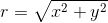

- 合成畸变 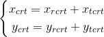其中：

- 径向畸变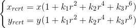

- 切向畸变 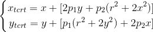

  把消畸变模型补充进针孔相机模型，因此「像点标号 像点坐标 物点坐标 」被修正为：像点标号 像点坐标 物点坐标 消畸变后的射线方程 是：

  

## 标定针孔相机模型的参数

针孔相机模型中，只要确定这9个参数就可以唯一的确定针孔相机模型， ，这个过程就称为「相机标定」。

其中前4个我们称为内参数，后5个称为畸变参数，畸变参数是为了补充内参的。所以一旦相机结构固定，包括镜头结构固定，对焦距离固定，我们就可以用这9个的参数去近似这个相机。

这里说的「镜头结构固定」，按我个人的理解，除了焦距固定之外，也应当包含光圈固定，因为改变光圈的大小，除了景深之外，是有可能改变针孔相机模型中的光心位置，但是影响并不是很大。这意味着标定好的相机如果改变光圈大小，会使得标定误差变大但应该不会大到难以接受的地步。

对于针孔相机本身需要拟合的方程如下：

其中 代表了畸变图像和消畸变图像之间的变换。因此，我们现在的任务就是找出一大堆具有对应关系的像点 和物点 的点对作为样本，来训练出模型的9个参数 。

那么这里就引发了两个问题：

(1) 这么多像点和物点到底谁和谁是一对儿？

(2) 即便我知道物点在哪里，可是我怎么样用相机坐标系来表达物点的位置 ?

为了解决上述的两个问题，标定板应运而生。

标定板的第一大作用，确定物点和像点的对应性。这里用到的原理主要是「透视不变性」，打个比方，你近看一个人和远看一个人，虽然他的鼻子大小变了，你看鼻子的视角也变了，但是拓扑结构肯定是不变的，你也不可能把鼻子看成是嘴巴。

所以在标定板中，印刷了拓扑结构，广泛应用的是棋盘格和圆点格，这两种之所以成为主流，不仅是因为它们的拓扑结构明确且均匀，更重要的是检测其拓扑结构的算法简单且有效。

棋盘格检测的是角点，只要对拍摄到的棋盘格图像横纵两个方向计算梯度就可获得；而圆点格的检测只需要对拍摄到的圆点格图样计算质心即可。

假如你开发了一套非常完美的检测人脸全部特征的算法，你完全可以用你的照片当作标定板。按照我的经验，圆点格的效果应该是好于棋盘格，因为圆点质心的「透视不变性」要比棋盘格的角点稳定的多。

下图是同样尺寸、同样比例棋盘格和圆点在最大重投影误差处的误差对比，红色十字是提取的角点/质心，绿色圆圈是针孔相机模型计算出来认为的角点/质心位置。

下图是棋盘格与圆点格的重投影误差图，显然圆点格的重投影误差的误差空间要小。

但是圆点格的检测似乎是Halcon的专利（存疑），因此OpenCV和Matlab标定工具箱用的是棋盘格，要用圆点格得要自己写算法。下文中提到的标定板说的都是棋盘格。

标定板的第二大作用是把标定板中的角点变换到相机坐标系下的坐标 。对于标定的初学者来说，很容易忽略的一点是标定板是具有标定板坐标系的。换句话说，标定板中的每个角点，在标定板坐标系下的位置是确定并且是已知的。

而标定板坐标系变换到相机坐标系的变换矩阵，我们称它的元素为外参数，所以在我眼中，相机标定的外参根本就是标定内参的副产品，它会随着标定板的摆放不同而不同，由标定板坐标系变换到相机坐标系的变换矩阵可以由下式表达：

其中， 称为旋转矩阵， 称为平移矩阵，下表 代表board to camera。注意这个坐标系的变换是一个线形变换，反应到物理上讲，这意味者标定板必须尽可能的平，如果标定板不平，这个变换就不是线形的了。我们把这个变换带到原本要拟合的方程中去：

如此一来，我们就把能够把CCD上拍摄的到角点的像素标号 和每一个角点已知的在标定板坐标系下的坐标 对应起来，通过各种各样的姿态作为样本，训练出全部参数 。

至于参数训练的方法，最小二乘，极大似然估计等等，很容易找到相关的资料，在此不再赘述。

如果用OpenCV或Matlab标定工具箱进行标定，需要给出棋盘格的物理尺寸，这其实就是在建立标定板坐标系，从测量的角度讲，标定板的精度是相机标定精度的基准，是误差传递链上的第一个环节。所以为了使针孔相机模型更逼近真实相机，对标定板的质量有以下要求（按重要性顺序)：

1. 标定板的平面度高，棋盘格是直角；
2. 标定板每个格子尺寸的高一致性；
3. 真实尺寸与标称尺寸的差异小。

## 代码实现

### OpenCV实现相机标定

## 参考

1. [相机标定究竟在标定什么？](https://mp.weixin.qq.com/s/cQyRkO2hfKaiNr-b-vSy1Q)