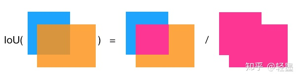
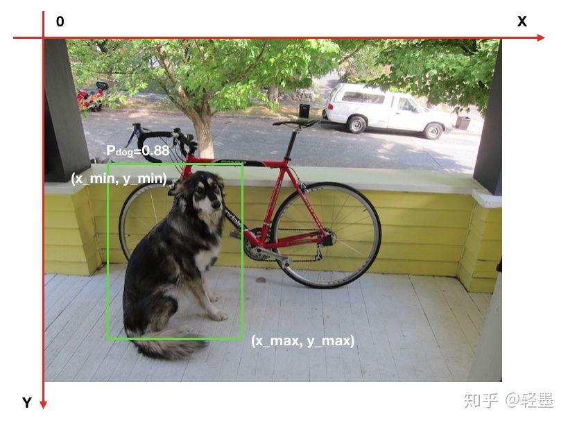
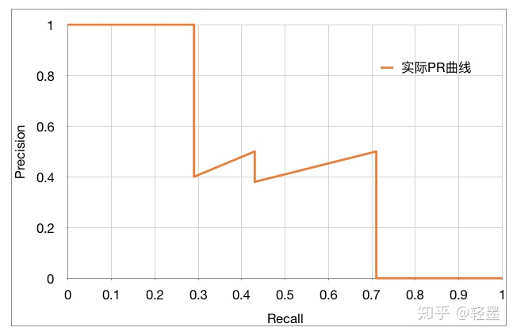
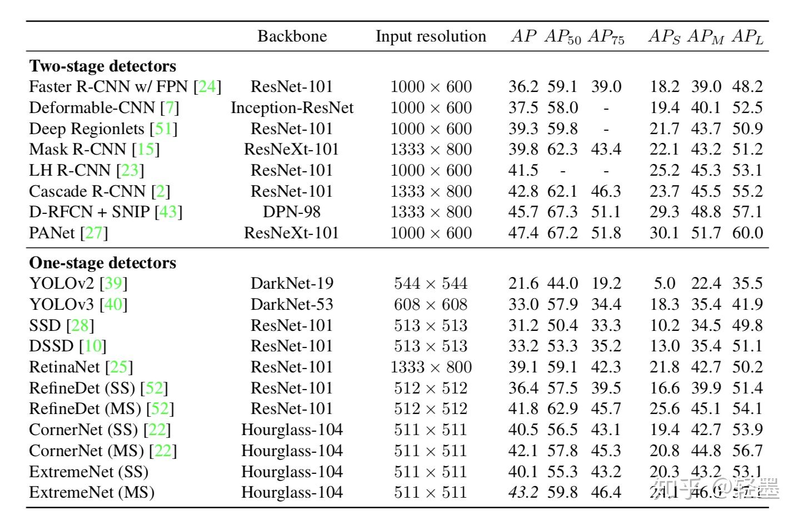

# 目标检测中的mAP

mAP是mean of Average Precision的缩写，意思是平均精确度（average precision）的平均（mean），是object detection中模型性能的衡量标准。object detection中，因为有物体定位框，分类中的accuracy并不适用，因此才提出了object detection独有的mAP指标，但这也导致mAP没有分类中的accuracy那么直观。但也没有那么复杂，本文将详细解释mAP的计算方法。首先，简单回顾几个基础概念。

## **查准率（Precision）和查全率（recall）**

查准率（Precision）是指在所有预测为正例中真正例的比率，也即预测的准确性。

查全率（Recall）是指在所有正例中被正确预测的比率，也即预测正确的覆盖率。

一个样本模型预测按正确与否分类如下：

真正例： ![[公式]](mAP.assets/equation.svg+xml)

真反例： ![[公式]](mAP.assets/equation-165166200669069.svg+xml)

假正例：![[公式]](mAP.assets/equation-165166200669070.svg+xml)

假反例：![[公式]](mAP.assets/equation-165166200669071.svg+xml)

则，查准率和查全率计算公式：

查准率： ![[公式]](mAP.assets/frac%7BTP%7D%7BTP%252BFP%7D.svg+xml)

查全率：![[公式]](mAP.assets/frac%7BTP%7D%7BTP%252BFN%7D.svg+xml)

## **交并比IoU(Intersection over union)**

交并比IoU衡量的是两个区域的重叠程度，是两个区域重叠部分面积占二者总面积（重叠部分只计算一次）的比例。如下图，两个矩形框的IoU是交叉面积（中间图片红色部分）与合并面积（右图红色部分）面积之比。

IoU计算重叠度

这里需要注意的是IoU=0.5，并不意味着每个框刚好有50%与另外一个框交叉部分，而是每个框大约有2/3被交叉。有点反直觉。

我当初看到IoU，非常疑惑为啥不按交叉面积占每个框的比例（IoA 也即Intersection over Area）取大值计算重叠度，更符合直觉。其实这种算法只反应小图片的被遮盖度，并不能反映互相之间的重叠度，一般情况下不可取。如下图，橙色部分较小，IoA很大，但对于蓝色部分，IoA就很小，只按橙色取IoA显然有失偏驳。

IoA计算重叠度

## **单类别AP(Average Precision)的计算**

物体检测中的每一个预测结果包含两部分，预测框（bounding box）和置信概率（Pc）。bounding box通常以矩形预测框的左上角和右下角的坐标表示，即x_min, y_min, x_max, y_max，如下图。置信概率Pc有两层意思，一是所预测bounding box的类别，二是这个类别的置信概率，如下图中的P_dog=0.88，代表预测绿色框为dog，并且置信概率为88%。



那么，怎么才叫预测正确呢？显而易见的，必须满足两个条件：

1. 类别正确且置信度大于一定阀值（P_threshold）
2. 预测框与真实框（ground truth）的IoU大于一定阀值（IoU_threshold）

如下图，假如P_threshold=0.6，IoU_threshold=0.5，则绿色框预测正确，记为True Positive。


而在衡量模型性能时，IoU_threshold先取一个定值，然后综合考虑各种P_threshold取值时的性能，进而得到一个与P_threshold选定无关的模型性能衡量标准。

AP是计算单类别的模型平均准确度。

假如目标类别为Dog，有5张照片，共包含7只Dog，也即GT（GroundTruth）数量为7，经模型预测，得到了Dog的10个预测结果，选定IoU_threshold=0.5，然后按confidence从高到低排序，如下图。其中，BB表示BoundingBox序号，GT=1表示有GT与所预测的BoundingBox的IoU>=IoU_threshold，BoundingBox序号相同代表所对应的GT是同一个。

```text
Rank | BB  | confidence | GT
----------------------------
1    | BB1 |  0.9       | 1
----------------------------
2    | BB2 |  0.8       | 1
----------------------------
3    | BB1 |  0.8       | 1
----------------------------
4    | BB3 |  0.5       | 0
----------------------------
5    | BB4 |  0.4       | 0
----------------------------
6    | BB5 |  0.4       | 1
----------------------------
7    | BB6 |  0.3       | 0
----------------------------
8    | BB7 |  0.2       | 0
----------------------------
9    | BB8 |  0.1       | 1
----------------------------
10   | BB9 |  0.1       | 1
----------------------------
```

因此，如果设置P_threshold=0，则有 TP=5 (BB1, BB2, BB5, BB8, BB9)，FP=5 (重复检测到的BB1也算FP)。除了表里检测到的5个GT以外，我们还有2个GT没被检测到，因此: FN = 2.

然后依次从上到下设定对应的rank为正反分界线，此rank之前（包含此rank）的预测为正，此rank之后的预测为反，然后计算对应的Precision和Recall：

```text
rank=1  precision=1.00 and recall=0.14
--------------------------------------
rank=2  precision=1.00 and recall=0.29
--------------------------------------
rank=3  precision=0.66 and recall=0.29
--------------------------------------
rank=4  precision=0.50 and recall=0.29
--------------------------------------
rank=5  precision=0.40 and recall=0.29
--------------------------------------
rank=6  precision=0.50 and recall=0.43
--------------------------------------
rank=7  precision=0.43 and recall=0.43
--------------------------------------
rank=8  precision=0.38 and recall=0.43
--------------------------------------
rank=9  precision=0.44 and recall=0.57
--------------------------------------
rank=10 precision=0.50 and recall=0.71
--------------------------------------
```

比如rank=4时，TP=2 (BB1, BB2)，则

```text
Precision=2/4=0.5，Recall=TP/GT=2/7=0.29
```

可以看出，随着预测正反分割线的向下移动，Recall稳步变大，Precision整体减小，局部上下跳动，PR曲线如下图：



AP(Average Precision)的计算基本等同于计算PR曲线下的面积，但略有不同。需要先将PR曲线平滑化。

方法是，查全率r对应的查准率p，取查全率大于等于r时最大的查准率p。即，

![[公式]](mAP.assets/tilde%7Br%7D)%7D.svg+xml)

平滑后的曲线如下图中的绿色曲线：


对于AP(Average Precision)的计算有两种方法：

**1. VOC2010之前的方法**

AP =（平滑后PR曲线上，Recall分别等于0，0.1，0.2，… , 1.0等11处Precision的平均值）。

![[公式]](mAP.assets/right)%7D.svg+xml)

这里则有：

```text
AP = (1 + 1 + 1 + 0.5 + 0.5 + 0.5 + 0.5 + 0.5 + 0 + 0 + 0) / 11 = 0.5
```

**2. VOC2010及以后的方法**

AP=平滑后PR曲线下包围的面积

这里则有：

```text
AP = (0.14-0) * 1 + (0.29-0.14) * 1 + (0.43-0.29) * 0.5 + (0.57-0.43) * 0.5 + (0.71-0.57) * 0.5 + (1-0.71) * 0 = 0.5
```

这里两种方案得出的AP值相同，但通常是不同的。

需要注意的是上述AP的计算并没有显式设定`P_threshold`，而是通过从上到下依次指定每一个rank为正反分界线来变相的反映`P_threshold`不同取值。

## **mAP的计算**

上述计算的AP只是针对dog这个类别，物体检测通常有多个类别，模型性能肯定是多个类别准度的综合度量。

**1. VOC数据集中的mAP**

VOC数据集中的mAP计算的是`IoU_threshold=0.5`时各个类别AP的均值。

**2. COCO数据集中的mAP**

检测是否正确有两个超参数，`P_threshold`和`IoU_threshold`。AP是固定了`IoU_threshold`，再综合考虑各个`P_threshold`下的模型平均准确度。

VOC认为`IoU_threshold`固定一个单值0.5即可，COCO则认为固定了`IoU_threshold`的取值，无法衡量`IoU_threshold`对模型性能的影响。

比如，

A模型在`IoU_threshold=0.5`时，`mAP=0.4`。

B模型在`IoU_threshold=0.7`时，`mAP`同样为0.4。

依据VOC的标准，AB模型的性能一样，但显然B模型的框更准，性能更优。

COCO在VOC标准的基础上，取`IoU_threshold=0.5，0.55， 0.6，… , 0.95`时各个mAP的均值。

下图给出了当前mAP最佳结果。



摘自文章[Bottom-up Object Detection by Grouping Extreme and Center Points](https://link.zhihu.com/?target=https%3A//arxiv.org/abs/1901.08043)

## **mAP的不足**

mAP虽然综合考虑了P_threshold和IoU_threshold各个取值时的平均模型准确度，使得模型优劣的评判标准不随P_threshold和IoU_threshold取值变化而变化，但在工程应用中，物体是否被正确检测到，还是需要具体的P_threshold和IoU_threshold，工程上更关心在固定的P_threshold和IoU_threshold下的准确率。这就需要我们自己实现与具体应用相符的评判标准。


$$ \Gamma(z) = \int_0^\infty t^{z-1}e^{-t}dt\,. $$
$$\Gamma(z) = \int_0^\infty t^{z-1}e^{-t}dt\,.$$