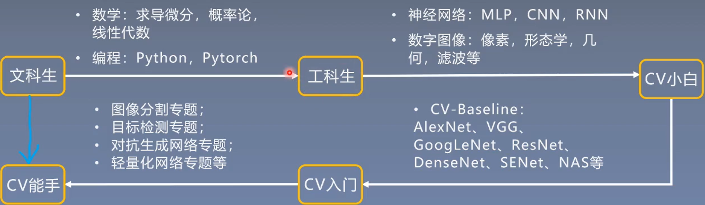
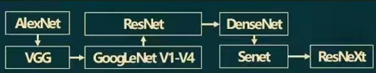
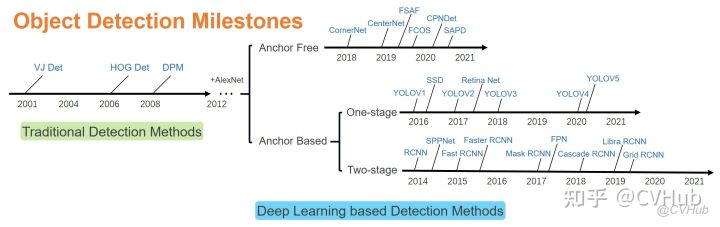

CV论文研读

学习方法

* 积极主动: 自己看论文，主动了解论文，多与别人探讨
* 勤动手
* 成体系: 构建知识体系，熟悉技术发展

---

## CV 综述

## CV baseline
入门的基石性论文

1. NIPS-2012,Alexnet:深度学习CV领域划时代论文，具有里程碑意义
2. ICLR-2015,VGG:开启3\*3卷积堆叠时代
3. CVPR-2015,GoogLeNet v1:Google系列论文开创论文，提出多尺度卷积模块一一Inception
4. arXiv-2015,GoogLeNet v2:Batch Normalization提出论文，BN层对深度学习快速发展起到加速作
5. CVPR-2016,GoogLeNet v3:提出GoogLeNeti系列应用最广模型一一InceptionV3
6. arXiv-2016,GoogLeNet v4:Inception与ResNet结构的尝试
7. CVPR-2016,ResNet:工业界标杆模型，最具影响力的卷积神经网络
8. CVPR-2017,DenseNet:ResNet的改进，2016-ILSVRC冠军
9. TPAM1-2017,SEnet:引入注意力机制的卷积神经网路，2017-ILSVRC(最后一届)冠军
10. CVPR-2017,ResNeXt:何凯明团队对ResNet重大改进

## 细分专题

### Part1 图像分割
1. 图像分割综述
2. FCN -- 深度学习语义分割开山之作，经典必读第一篇
3. U-Net&FusionNet -- 医学图像分割领头羊
4. SegNet&DeconvNet--语义分割必读算法
5. Deeplab系列 -- 带孔卷积，大有作为
6. GCN--开拓语义分割箭思想
7. DFN--从宏观角度重新看待语义分割
8. RefineNet -- 综合网络三部曲，前篇（经典）
9. ENet&LinkNet-- 实时分割入门必读
10. BiSeNet--旷世实时分割系列佳作一
11. DFANet -- 旷世实时分割系列佳作二
12. Light-Weight RefineNet-- 综合网络三部曲，中篇实时)
13. RedNet -- RGBD语义分割入门必读
14. RDFNet -- 综合网络三部曲，后篇(RGB-D)

### Part2 目标检测

1. 目标检测综述 
2. Faster RCNN -- 第一个端到端网络
3. YOLO -- 检测网络模型
4. FPN -- 第一个特征融合网络
5. CornerNet -- 第一个点检测网络
6. FCOS -- 特征融合点检测
7. Cascade RONN -- 多任务网络模型代表
8. mask RCNN -- Faster RON的进一步改进
9. SSD -- 早期单阶网络
10. DSSD -- SSD的进一步改进，可变形卷积
11. EfficeintDet -- 将多尺度特征融合和模型缩放结合

### Part3 GAN
1. GAN综述
2. 原生GAN -- 给出GA的基本框架和理论证明
3. Conditional GAN -- 在输入中加入额外的条件信息来控制输出
4. DCGAN GAN -- 使用深度卷积神经网络来实现生成器和判别器
5. Improved Gan -- 基于少量目标人脸图像就可以训川练一个模型
6. Pix2Pix -- 把输入由随机噪声改为图像
7. CycleGAN -- 输入和输出是无需一对应的两组图像
8. Progressively-Growing -- GAN使用新进式训练来逐步生成越来越大的图像
9. StackGAN -- 根据一段文本描述来生成对应的图像
10. BigGAN -- 大batc小、大网络、限制输入噪声的分布，训练稳定性trick
11. StyleGAN -- 基于Progressively-Growing GAN,可以精细控制输出图像不同尺度的特征

### Part4 0CR
1. QCR综述
2. EAST -- 全卷积网络+非极大值抑制，缩短检测时间
3. PSENet -- 多个尺度预测结果，准确检测区分临近文本行
4. PANNET -- 号称PSENet的二代
5. DBNet -- 将二值化融入网路，速度极快
6. PixelLink -- 经典文字检测网络
7. CRNN -- 任意长度输入，模型小，参数少
8. ASTER -- 整合矫正和识别，改善不规则文字识别
9. MORAN -- 加入注意力机制的文本识别
10. FOTS -- 解决了角度文本端到端识别的问题
11. Detectron -- Facebook开源的物体检测与分割框架

### Part5 轻量化网络
1. 轻量化网络综述
2. MobileNets -- Googe移动计算法宝
3. ShuffleNet -- 计算效率极高的CNN架构
4. SqueezeNet -- 又小又快的网络模型
5. Xception -- Inception网络的增强版
6. Distilling the Knowledge in a Neural Network -- 知识蒸馏开山之作
7. Network Slimming -- 利用剪枝进行网络瘦身
8. attention transfer -- 注意力转移
9. Pruning for Efficient Inference -- 英伟达迭代式剪枝策略
10. Learning Weights and Connections -- 三步法进行剪枝

### Part6 CV Tranformer
1. VIT -- 入门CV Transformer必读第一篇
2. PVT -- 将金字塔结构引入Transformer,使得该网络可以更好的无缝接入到各种下游任务中，如检测、分割
3. Swin Transformer -- 将Transformer与CNN结构设计相融合，构建CV方向通用的backbone
4. DETR -- transformer首次完整的出现在计算机视觉任务中
5. Deformable DETR -- 详细分析了detr的计算瓶颈，在deformable conv基础上改良出deformable attention,速度快，性能优
6. Sparse R-CNN -- detr后的检测器可以简洁到什么程度? 无Anchor,无IRPN,无NMS,还速度快，性能好

## 深度之眼资源

### PyTorch

1. 课程所有代码汇总github地址：https://github.com/JansonYuan/Pytorch-Camp
2. 作业讲解代码地址: https://github.com/greebear/pytorch-learning

## 经典论文

[经典论文](https://gitcode.net/AiShow/aipapers)

## 参考

1. [深度之眼的课程大纲](cv_paper_path/20220318233909.jpg)
