# 综述：目标检测二十年（2001-2021）
> 论文来源: [Object Detection in 20 Years: A Survey](https://arxiv.org/pdf/1905.05055.pdf) 

## **引言**

目标检测领域发展至今已有二十余载，从早期的传统方法到如今的深度学习方法，精度越来越高的同时速度也越来越快，这得益于深度学习等相关技术的不断发展。本文将对目标检测领域的发展做一个系统性的介绍，旨在为读者构建一个完整的知识体系架构，同时了解目标检测相关的技术栈及其未来的发展趋势。由于编者水平有限，本文若有不当之处还请指出与纠正，欢迎大家评论交流！

本文将从以下九大方面进行展开：

1. **背景**
2. **目标检测算法发展脉络**
3. **目标检测常用数据集及评价指标**
4. **目标检测任务普遍存在的六大难点与挑战**
5. **目标检测的五大技术及其演变**
6. **目标检测模型的加速技术**
7. **提高目标检测模型精度的五大技术**
8. **目标检测的五大应用场景**
9. **目标检测未来发展的七大趋势**

> 由于篇幅较长，本文已整理成PDF，方便大家在必要时查阅，在**极市平台**公众号后台回复"**目标检测综述**"即可领取。

## **1. 背景**

目标检测任务是找出图像或视频中人们感兴趣的物体，并同时检测出它们的位置和大小。不同于图像分类任务，目标检测不仅要解决分类问题，还要解决定位问题，是属于Multi-Task的问题。如下图1-1所示：

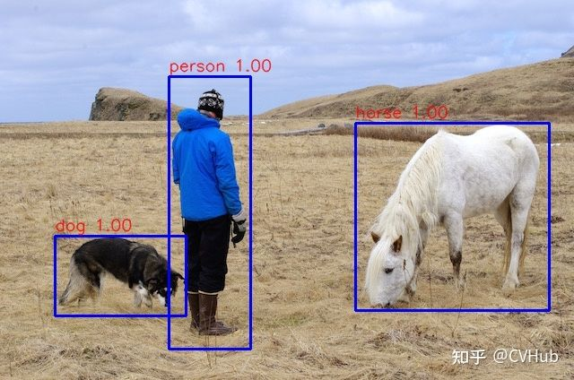图1-1.目标检测示例

作为计算机视觉的基本问题之一，目标检测构成了许多其它视觉任务的基础，例如实例分割，图像标注和目标跟踪等等；从检测应用的角度看：行人检测、面部检测、文本检测、交通标注与红绿灯检测，遥感目标检测统称为目标检测的五大应用。

## **2. 目标检测发展脉络**

目标检测的发展脉络可以划分为两个周期：传统目标检测算法时期(1998年-2014年)和基于深度学习的目标检测算法时期(2014年-至今)。而基于深度学习的目标检测算法又发展成了两条技术路线：**Anchor based**方法(一阶段，二阶段)和**Anchor free**方法。下图2-1展示了从2001年至2021年目标检测领域中，目标检测发展路线图。

图2-1.Object Detection Milestones

### **2.1 传统目标检测算法**

不同于现在的卷积神经网络可以自动提取高效特征进行图像表示，以往的传统目标检测算法主要基于手工提取特征。传统检测算法流程可概括如下：

1. 选取感兴趣区域，选取可能包含物体的区域
2. 对可能包含物体的区域进行特征提取
3. 对提取的特征进行检测分类

### **2.1.1 Viola Jones Detector**

**VJ[1]** (Viola Jones)检测器采用滑动窗口的方式以检查目标是否存在窗口之中，该检测器看起来似乎很简单稳定，但由于计算量庞大导致时间复杂度极高，为了解决该项问题，VJ检测器通过合并三项技术极大提高了检测速度，这三项技术分别是：1)特征的快速计算方法-积分图，2)有效的分类器学习方法-AdaBoost，以及3)高效的分类策略-级联结构的设计。

### **2.1.2 HOG Detector**

**HOG[2]**(Histogram of Oriented Gradients)检测器于2005年提出，是当时尺度特征不变性(Scale Invariant Feature Transform)和形状上下文(Shape Contexts)的重要改进，为了平衡特征不变性(包括平移，尺度，光照等)和非线性(区分不同的对象类别)，HOG通过在均匀间隔单元的密集网格上计算重叠的局部对比度归一化来提高检测准确性，因此HOG检测器是基于本地像素块进行特征直方图提取的一种算法，它在目标局部变形和受光照影响下都有很好的稳定性。HOG为后期很多检测方法奠定了重要基础，相关技术被广泛应用于计算机视觉各大应用。

### **2.1.3 DPM Detector**

作为VOC 2007-2009目标检测挑战赛的冠军，**DPM[3]** (Deformable Parts Model)是目标检测传统算法中当之无愧的SOTA(State Of The Art)算法。DPM于2008年提出，相比于HOG，DPM作了很多改进，因此该算法可以看作HOG的延申算法。DPM算法由一个主过滤器(Root-filter)和多个辅过滤器(Part-filters)组成，通过硬负挖掘(Hard negative mining)，边框回归(Bounding box regression)和上下文启动(Context priming)技术改进检测精度。作为传统目标检测算法的SOTA，DPM方法运算速度快，能够适应物体形变，但它无法适应大幅度的旋转，因此稳定性差。

### **2.1.4 局限性**

基于手工提取特征的传统目标检测算法主要有以下三个缺点：

1. 识别效果不够好，准确率不高
2. 计算量较大，运算速度慢
3. 可能产生多个正确识别的结果

### **2.2 Anchor-Based中的Two-stage目标检测算法**

基于手工提取特征的传统目标检测算法进展缓慢，性能低下。直到2012年卷积神经网络(Convolutional Neural Networks, CNNs)的兴起将目标检测领域推向了新的台阶。基于CNNs的目标检测算法主要有两条技术发展路线：anchor-based和anchor-free方法，而anchor-based方法则包括一阶段和二阶段检测算法(二阶段目标检测算法一般比一阶段精度要高，但一阶段检测算法速度会更快)。

二阶段检测算法主要分为以下两个阶段
**Stage1**：从图像中生成region proposals
**Stage2**：从region proposals生成最终的物体边框。

### **2.2.1 RCNN**

> 论文链接：https://openaccess.thecvf.com/contentcvpr2014/papers/GirshickRichFeatureHierarchies2014CVPRpaper.pdf
> 代码链接：https://github.com/rbgirshick/rcnn

**【简介】** **RCNN[4]** 由Ross Girshick于2014年提出，RCNN首先通过选择性搜索算法Selective Search从一组对象候选框中选择可能出现的对象框，然后将这些选择出来的对象框中的图像resize到某一固定尺寸的图像，并喂入到CNN模型(经过在ImageNet数据集上训练过的CNN模型，如AlexNet)提取特征，最后将提取出的特征送入到SVM分类器来预测该对象框中的图像是否存在待检测目标，并进一步预测该检测目标具体属于哪一类。

**【性能】** RCNN算法在VOC-07数据集上取得了非常显著的效果，平均精度由33.7%(DPM-V5, 传统检测的SOTA算法)提升到58.5%。相比于传统检测算法，基于深度学习的检测算法在精度上取得了质的飞跃。

**【不足】** 虽然RCNN算法取得了很大进展，但缺点也很明显：重叠框(一张图片大2000多个候选框)特征的冗余计算使得整个网络的检测速度变得很慢(使用GPU的情况下检测一张图片大约需要14S)。

为了减少大量重叠框带来的冗余计算，K. He等人提出了SPPNet。

### **2.2.2 SPPNet**

> 论文链接：https://link.springer.com/content/pdf/10.1007/978-3-319-10578-923.pdf
> 代码链接：https://github.com/yueruchen/sppnet-pytorch

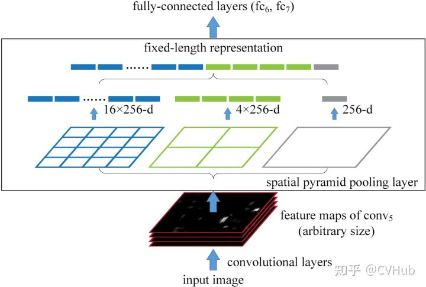

**【简介】** **SPPNet[5]** 提出了一种空间金字塔池化层(Spatial Pyramid Pooling Layer, SPP)。它的主要思路是对于一副图像分成若干尺度的图像块(比如一副图像分成1份，4份，8份等)，然后对每一块提取的特征融合在一起，从而兼顾多个尺度的特征。SPP使得网络在全连接层之前能生成固定尺度的特征表示，而不管输入图片尺寸如何。当使用SPPNet网络用于目标检测时，整个图像只需计算一次即可生成相应特征图，不管候选框尺寸如何，经过SPP之后，都能生成固定尺寸的特征表示图，这避免了卷积特征图的重复计算。

**【性能】** 相比于RCNN算法，SPPNet在Pascal-07数据集上不牺牲检测精度(VOC-07, mAP=59.2%)的情况下，推理速度提高了20多倍。

**【不足】** 和RCNN一样，SPP也需要训练CNN提取特征，然后训练SVM分类这些特征，这需要巨大的存储空间，并且多阶段训练的流程也很繁杂。除此之外，SPPNet只对全连接层进行微调，而忽略了网络其它层的参数。

为了解决以上存在的一些不足，2015年R. Girshick等人提出Fast RCNN

### **2.2.3 Fast RCNN**

> 论文链接：https://openaccess.thecvf.com/contenticcv2015/papers/GirshickFastR-CNNICCV2015paper.pdf
> 代码链接：https://github.com/rbgirshick/fast-rcnn

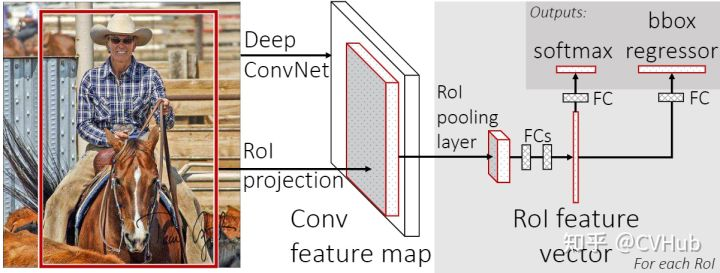

**【简介】** **Fast RCNN[6]** 网络是RCNN和SPPNet的改进版，该网路使得我们可以在相同的网络配置下同时训练一个检测器和边框回归器。该网络首先输入图像，图像被传递到CNN中提取特征，并返回感兴趣的区域ROI，之后再ROI上运用ROI池化层以保证每个区域的尺寸相同，最后这些区域的特征被传递到全连接层的网络中进行分类，并用Softmax和线性回归层同时返回边界框。

**【性能】** Fast RCNN在VOC-07数据集上将检测精度mAP从58.5%提高到70.0%，检测速度比RCNN提高了200倍。

**【不足】** Fast RCNN仍然选用选择性搜索算法来寻找感兴趣的区域，这一过程通常较慢，与RCNN不同的是，Fast RCNN处理一张图片大约需要2秒，但是在大型真实数据集上，这种速度仍然不够理想。

那么问题来了: “我们可以使用CNN模型来直接生成候选框吗？”，基于此，Faster RCNN的提出完美回答这一问题。

### **2.2.4 Faster RCNN**

> 论文链接：https://arxiv.org/pdf/1506.01497.pdf
> 代码链接：https://github.com/jwyang/faster-rcnn.pytorc

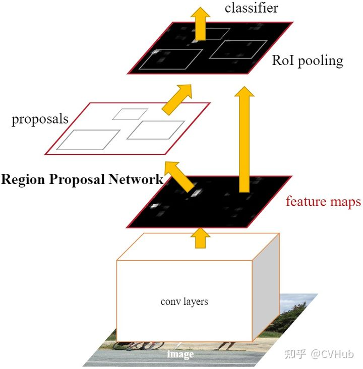

**【简介】** **Faster RCNN[7]** 是第一个端到端，最接近于实时性能的深度学习检测算法，该网络的主要创新点就是提出了区域选择网络用于申城候选框，能几大提升检测框的生成速度。该网络首先输入图像到卷积网络中，生成该图像的特征映射。在特征映射上应用Region Proposal Network，返回object proposals和相应分数。应用Rol池化层，将所有proposals修正到同样尺寸。最后，将proposals传递到完全连接层，生成目标物体的边界框。

**【性能】** 该网络在当时VOC-07，VOC-12和COCO数据集上实现了SOTA精度，其中COCO mAP@.5=42.7%, COCO mAP@[.5,.95]=21.9%, VOC07 mAP=73.2%, VOC12 mAP=70.4%, 17fps with ZFNet

**【不足】** 虽然Faster RCNN的精度更高，速度更快，也非常接近于实时性能，但它在后续的检测阶段中仍存在一些计算冗余；除此之外，如果IOU阈值设置的低，会引起噪声检测的问题，如果IOU设置的高，则会引起过拟合。

### **2.2.5 FPN**

> 论文链接：http://openaccess.thecvf.com/contentcvpr2017/papers/LinFeaturePyramidNetworksCVPR2017paper.pdf 
> 代码链接：https://github.com/jwyang/fpn.pytorch

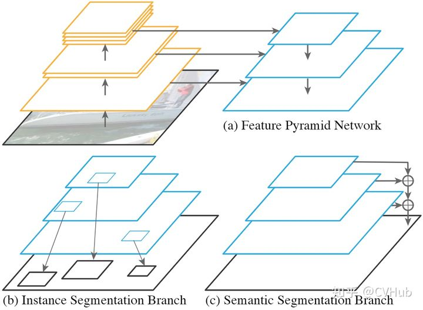

**【简介】** 2017年，T.-Y.Lin等人在Faster RCNN的基础上进一步提出了特征金字塔网络**FPN[8]**(Feature Pyramid Networks)技术。在FPN技术出现之前，大多数检测算法的检测头都位于网络的最顶层(最深层)，虽说最深层的特征具备更丰富的语义信息，更有利于物体分类，但更深层的特征图由于空间信息的缺乏不利于物体定位，这大大影响了目标检测的定位精度。为了解决这一矛盾，FPN提出了一种具有横向连接的自上而下的网络架构，用于在所有具有不同尺度的高底层都构筑出高级语义信息。FPN的提出极大促进了检测网络精度的提高(尤其是对于一些待检测物体尺度变化大的数据集有非常明显的效果)。

**【性能】** 将FPN技术应用于Faster RCNN网络之后，网络的检测精度得到了巨大提高(COCO mAP@.5=59.1%, COCO mAP@[.5,.95]=36.2%)，再次成为当前的SOTA检测算法。此后FPN成为了各大网络(分类，检测与分割)提高精度最重要的技术之一。

### **2.2.6 Cascade RCNN**

> 论文链接：https://openaccess.thecvf.com/contentcvpr2018/papers/CaiCascadeR-CNNDelvingCVPR2018paper.pdf
> 代码链接：https://github.com/zhaoweicai/cascade-rcnn

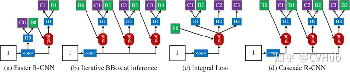

**【简介】** Faster RCNN完成了对目标候选框的两次预测，其中RPN一次，后面的检测器一次，而**Cascade RCNN[9]** 则更进一步将后面检测器部分堆叠了几个级联模块，并采用不同的IOU阈值训练，这种级联版的Faster RCNN就是Cascade RCNN。通过提升IoU阈值训练级联检测器，可以使得检测器的定位精度更高，在更为严格的IoU阈值评估下，Cascade R-CNN带来的性能提升更为明显。Cascade RCNN将二阶段目标检测算法的精度提升到了新的高度。

**【性能】** Cascade RCNN在COCO检测数据集上，不添加任何Trick即可超过现有的SOTA单阶段检测器，此外使用任何基于RCNN的二阶段检测器来构建Cascade RCNN，mAP平均可以提高2-4个百分点。

### **2.3 Anchor-based中的one-stage目标检测算法**

一阶段目标检测算法不需要region proposal阶段，直接产生物体的类别概率和位置坐标值，经过一个阶段即可直接得到最终的检测结果，因此有着更快的检测速度。

### **2.3.1 YOLO v1**

> 论文链接：https://www.cv-foundation.org/openaccess/contentcvpr2016/papers/RedmonYouOnlyLookCVPR2016paper.pdf
> 代码链接：https://github.com/abeardear/pytorch-YOLO-v1

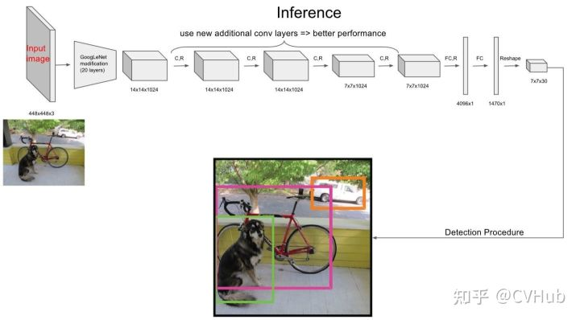

**【简介】** **YOLO v1[10]** 是第一个一阶段的深度学习检测算法，其检测速度非常快，该算法的思想就是将图像划分成多个网格，然后为每一个网格同时预测边界框并给出相应概率。例如某个待检测目标的中心落在图像中所划分的一个单元格内，那么该单元格负责预测该目标位置和类别。

**【性能】** YOLO v1检测速度非常快，在VOC-07数据集上的mAP可达52.7%，实现了155 fps的实时性能，其增强版性能也很好(VOC-07 mAP=63.4%, 45 fps, VOC-12 mAP=57.9%)，性能要优于DPM和RCNN。

**【不足】** 相比于二阶段的目标检测算法，尽管YOLO v1算法的检测速度有了很大提高，但精度相对教低(尤其是对于一些小目标检测问题)。

### **2.3.2 SSD**

> 论文链接：https://arxiv.org/pdf/1512.02325
> 代码链接：https://github.com/amdegroot/ssd.pytorch

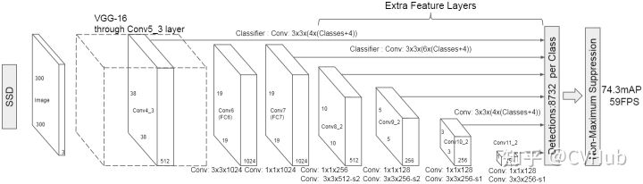

**【简介】** **SSD[11]** 算法的主要创新点是提出了Multi-reference和Multi-resolution的检测技术。SSD算法和先前的一些检测算法的区别在于：先前的一些检测算法只是在网络最深层的分支进行检测，而SSD有多个不同的检测分支，不同的检测分支可以检测多个尺度的目标，所以SSD在多尺度目标检测的精度上有了很大的提高，对小目标检测效果要好很多。

**【性能】** 相比于YOLO v1算法，SSD进一步提高了检测精度和速度(VOC-07 mAP=76.8%, VOC-12 mAP=74.9%, COCO mAP@.5=46.5%, mAP@[.5,.95]=26.8%, SSD的精简版速度达到59 fps)。

### **2.3.3 YOLO v2**

> 论文链接：https://openaccess.thecvf.com/contentcvpr2017/papers/RedmonYOLO9000BetterFasterCVPR2017paper.pdf
> 代码链接：https://github.com/longcw/yolo2\-pytorch

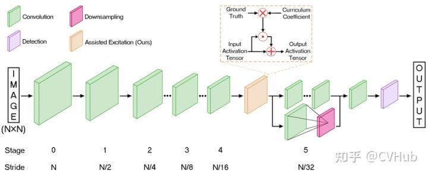

**【简介】** 相比于YOLO v1，**YOLO v2[12]** 在精度、速度和分类数量上都有了很大的改进。在速度上(Faster)，YOLO v2使用DarkNet19作为特征提取网络，该网络比YOLO v2所使用的VGG-16要更快。在分类上(Stronger)，YOLO v2使用目标分类和检测的联合训练技巧，结合Word Tree等方法，使得YOLO v2的检测种类扩充到了上千种。下图2-2展示了YOLO v2相比于YOLO v1在提高检测精度(Better)上的改进策略。

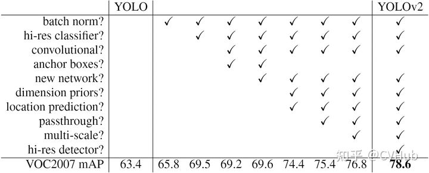图2-2.YOLO v2相比YOLO v1的改进策略

**【性能】** YOLO v2算法在VOC 2007数据集上的表现为67 FPS时，mAP为76.8，在40FPS时，mAP为78.6。

**【不足】** YOLO v2算法只有一条检测分支，且该网络缺乏对多尺度上下文信息的捕获，所以对于不同尺寸的目标检测效果依然较差，尤其是对于小目标检测问题。

### **2.3.4 RetinaNet**

> 论文链接：https://openaccess.thecvf.com/contentICCV2017/papers/LinFocalLossforICCV2017paper.pdf
> 代码链接：https://github.com/yhenon/pytorch-retinanet

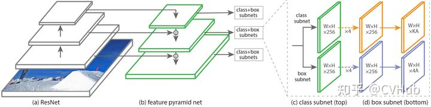

**【简介】** 尽管一阶段检测算推理速度快，但精度上与二阶段检测算法相比还是不足。**RetinaNet[13]** 论文分析了一阶段网络训练存在的类别不平衡问题，提出能根据Loss大小自动调节权重的Focal loss，代替了标准的交叉熵损失函数，使得模型的训练更专注于困难样本。同时，基于FPN设计了RetinaNet，在精度和速度上都有不俗的表现。

**【性能】** RetinaNet在保持高速推理的同时，拥有与二阶段检测算法相媲美的精度(COCO mAP@.5=59.1%, mAP@[.5, .95]=39.1%)。

### **2.3.5 YOLO v3**

> 论文链接：https://arxiv.org/pdf/1804.02767.pdf
> 代码链接：https://github.com/ultralytics/yolov3

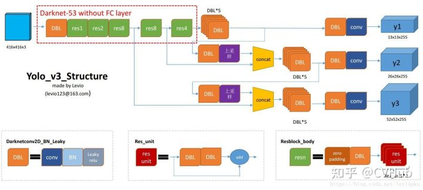

**【简介】** 相比于YOLO v2，**YOLO v3[14]** 将特征提取网络换成了DarkNet53，对象分类用Logistic取代了Softmax，并借鉴了FPN思想采用三条分支（三个不同尺度/不同感受野的特征图）去检测具有不同尺寸的对象。

**【性能】** YOLO v3在VOC数据集，Titan X上处理608×608图像速度达到20FPS，在COCO的测试数据集上mAP@0.5达到57.9%。其精度比SSD高一些，比Faster RCNN相比略有逊色(几乎持平)，比RetinaNet差，但速度是SSD、RetinaNet和Faster RCNN至少2倍以上，而简化后的Yolov3 tiny可以更快。

**【不足】** YOLO v3采用MSE作为边框回归损失函数，这使得YOLO v3对目标的定位并不精准，之后出现的IOU，GIOU，DIOU和CIOU等一系列边框回归损失大大改善了YOLO v3对目标的定位精度。

### **2.3.6 YOLO v4**

> 论文链接：https://arxiv.org/pdf/2004.10934
> 代码链接：https://github.com/Tianxiaomo/pytorch-YOLOv4

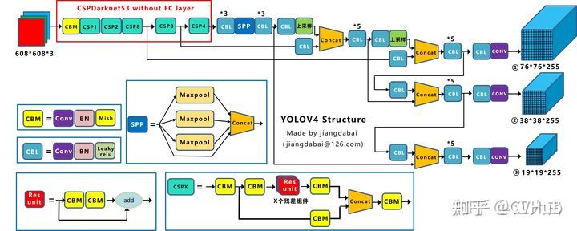

**【简介】** 相比于YOLO v4，**YOLO v4[15]** 在输入端，引入了Mosaic数据增强、cmBN、SAT自对抗训练；在特征提取网络上，YOLO v4将各种新的方式结合起来，包括CSPDarknet53，Mish激活函数，Dropblock；在检测头中，引入了SPP模块，借鉴了FPN+PAN结构；在预测阶段，采用了CIOU作为网络的边界框损失函数，同时将NMS换成了DIOU_NMS等等。总体来说，YOLO v4具有极大的工程意义，将近年来深度学习领域最新研究的tricks都引入到了YOLO v4做验证测试，在YOLO v3的基础上更进一大步。

**【性能】** YOLO v4在COCO数据集上达到了43.5%AP(65.7% AP50)，在Tesla V100显卡上实现了65 fps的实时性能，下图2-3展示了在COCO检测数据集上YOLO v4和其它SOTA检测算法的性能对比。

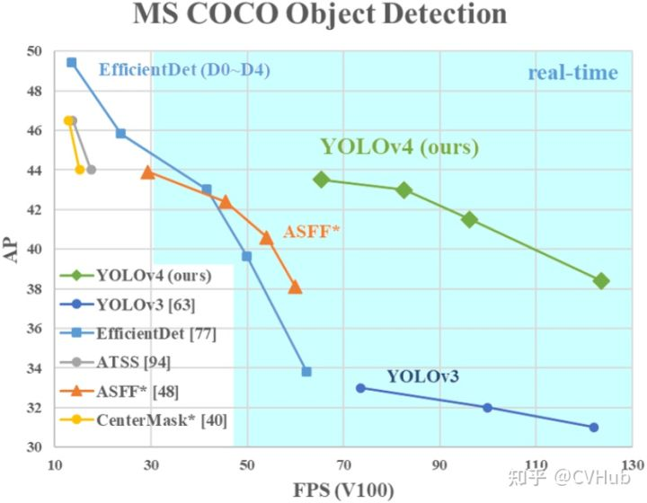图2-3.YOLO v4与其它模型性能对比

### **2.3.7 YOLO V5**

> 代码链接：https://github.com/ultralytics/yolov5

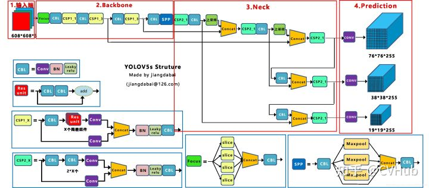

**【简介】** 目前YOLO V5公布了源代码，但尚未发表论文；与YOLO V4有点相似，都大量整合了计算机视觉领域的State-of-the-art，从而显著改善了YOLO对目标的检测性能。相比于YOLO V4，YOLO V5在性能上稍微逊色，但其灵活性与速度上远强于YOLO V4，而且在模型的快速部署上也具有极强优势。

**【性能】** 。如下图2-4展示了在COCO检测数据集上YOLO v5和其它SOTA检测算法的性能对比。

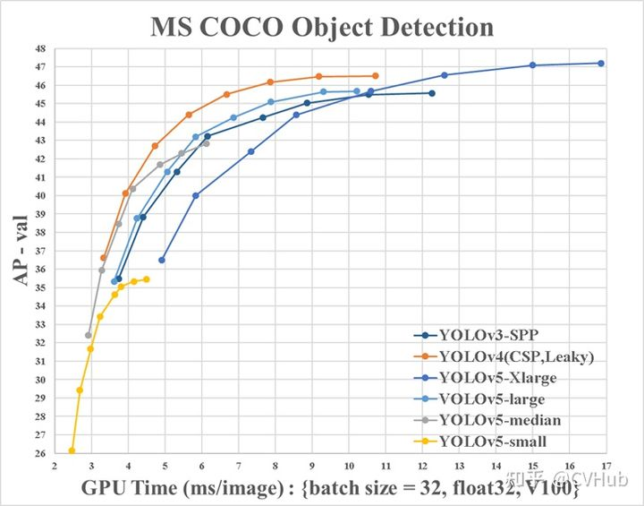图2-4.YOLO v5与其它模型性能对比

### **2.3.8 Anchor-based目标检测算法局限性**

基于Anchor的目标检测算法主要有以下四大缺点：

1. Anchor的大小，数量，长宽比对于检测性能的影响很大(通过改变这些超参数Retinanet在COCO benchmark上面提升了4%的AP)，因此Anchor based的检测性能对于anchor的大小、数量和长宽比都非常敏感。
2. 这些固定的Anchor极大地损害了检测器的普适性，导致对于不同任务，其Anchor都必须重新设置大小和长宽比。
3. 为了去匹配真实框，需要生成大量的Anchor，但是大部分的Anchor在训练时标记为负样本，所以就造成了样本极度不均衡问题(没有充分利用fore-ground)。
4. 在训练中，网络需要计算所有Anchor与真实框的IOU，这样就会消耗大量内存和时间。

### **2.4 Anchor-Free中的目标检测算法**

基于Anchor的物体检测问题通常被建模成对一些候选区域进行分类和回归的问题，在一阶段检测器中，这些候选区域就是通过滑窗方式产生Anchor box，而在二阶段检测器中，候选区域是RPN生成的Proposal，但是RPN本身仍然是对滑窗方式产生的Anchor进行分类和回归。基于Anchor的检测算法由于Anchor太多导致计算复杂，及其所带来的大量超参数都会影响模型性能。近年的Anchor free技术则摒弃Anchor，通过确定关键点的方式来完成检测，大大减少了网络超参数的数量。

### **2.4.1 CornerNet**

> 论文链接：http://openaccess.thecvf.com/contentECCV2018/papers/HeiLawCornerNetDetectingObjectsECCV2018paper.pdf
> 代码链接：https://github.com/princeton-vl/CornerNet

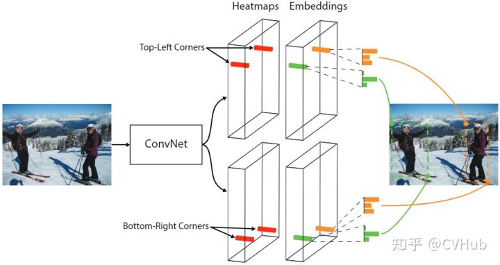

**【简介】** **CornerNet[16]** 是Anchor free技术路线的开创之作，该网络提出了一种新的对象检测方法，将网络对目标边界框的检测转化为一对关键点的检测(即左上角和右下角)，通过将对象检测为成对的关键点，而无需设计Anchor box作为先验框。

**【性能】** 实验表明，CornerNet在COCO数据集上实现了42.1%AP，该精度优于所有现有的单阶段检测网络。下图2-3展示了在COCO检测数据集上CornerNet和其它SOTA检测算法的性能对比。

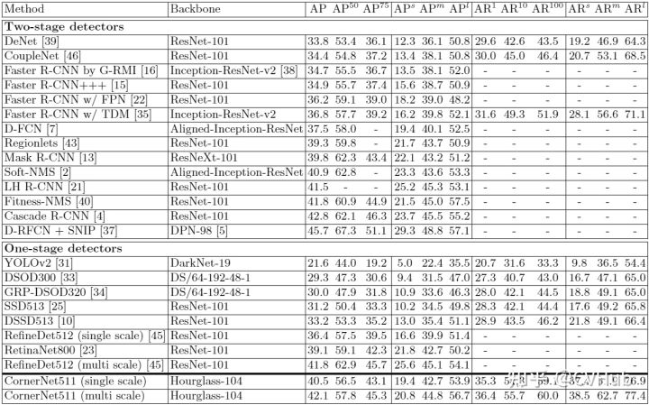图2-3.CornerNet与其它模型性能对比

**【不足】** CornerNet只关注边缘和角点，缺乏目标内部信息，容易产生FP；该网络还是需要不少的后处理，比如如何选取分数最高的点，同时用offset来微调目标定位，也还需要做NMS。

### **2.4.2 CenterNet**

> 论文链接：https://openaccess.thecvf.com/contentICCV2019/papers/DuanCenterNetKeypointTripletsforObjectDetectionICCV2019paper.pdf
> 代码链接：https://github.com/Duankaiwen/CenterNet

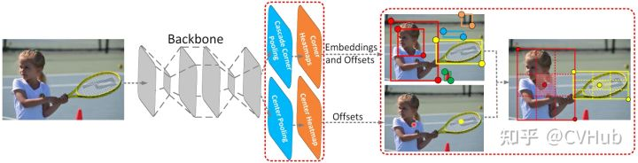

**【简介】** 与CornerNet检测算法不同，**CenterNet[17]** 的结构十分简单，它摒弃了左上角和右下角两关键点的思路，而是直接检测目标的中心点，其它特征如大小，3D位置，方向，甚至姿态可以使用中心点位置的图像特征进行回归，是真正意义上的Anchor free。该算法在精度和召回率上都有很大提高，同时该网络还提出了两个模块：级联角池化模块和中心池化模块，进一步丰富了左上角和右下角收集的信息，并提供了

**【性能】** 相比于一阶段和二阶段检测算法，CenterNet的速度和精度都有不少的提高，在COCO数据集上，CenterNet实现了47.0%的AP，比现有的一阶段检测器至少高出4.9%。下图2-4展示了在COCO检测数据集上CenterNet和其它SOTA检测算法的性能对比。

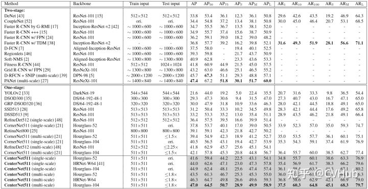

**【不足】** 在训练过程中，同一类别中的如果某些物体靠的比较近，那么其Ground Truth中心点在下采样时容易挤到一块，导致两个物体GT中心点重叠，使得网络将这两个物体当成一个物体来训练(因为只有一个中心点了)；而在模型预测阶段，如果两个同类物体在下采样后的中心点也重叠了，那么网络也只能检测出一个中心点。

### **2.4.3 FSAF**

> 论文链接：http://openaccess.thecvf.com/contentCVPR2019/papers/ZhuFeatureSelectiveAnchor-FreeModuleforSingle-ShotObjectDetectionCVPR2019paper.pdf
> 代码链接：https://github.com/hdjang/Feature-Selective-Anchor-Free-Module-for-Single-Shot-Object-Detection

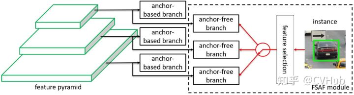

**【简介】** **FSAF[18]** 网络提出了一种FSAF模块用于训练特征金字塔中的Anchor free分支，让每一个对象都自动选择最合适的特征。在该模块中，Anchor box的大小不再决定选择哪些特征进行预测，使得Anchor的尺寸成为了一种无关变量，实现了模型自动化学习选择特征。

**【性能】** 下图2-5展示了在COCO检测数据集上FSAF算法和其它SOTA检测算法的性能对比。

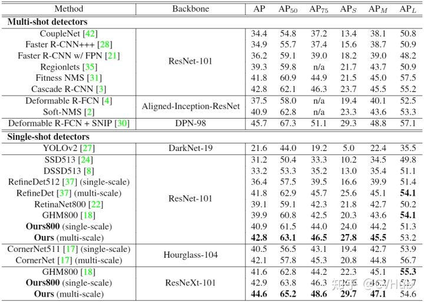图2-5.FSAF与其它模型性能对比

### **2.4.4 FCOS**

> 论文链接：https://openaccess.thecvf.com/contentICCV2019/papers/TianFCOSFullyConvolutionalOne-StageObjectDetectionICCV2019paper.pdf
> 代码链接：https://github.com/tianzhi0549/FCOS

**【简介】** **FCOS[19]** 网络是一种基于FCN的逐像素目标检测算法，实现了无锚点(Anchor free)，无提议(Proposal free)的解决方案，并且提出了中心度Center ness的思想。该算法通过去除Anchor，完全避免了Anchor的复杂运算，节省了训练过程中大量的内存占用，将总训练内存占用空间减少了2倍左右。

**【性能】** FCOS的性能优于现有的一阶段检测器，同时FCOS还可用作二阶段检测器Faster RCNN中的RPN，并且很大程度上都要优于RPN。下图2-6展示了在COCO检测数据集上FCOS算法和其它SOTA检测算法的性能对比。

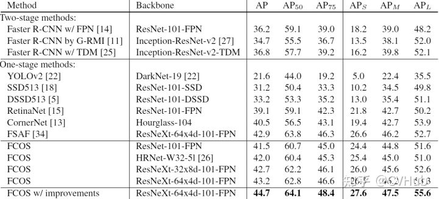图2-6.FCOS与其它模型性能对比

### **2.4.5 SAPD**

> 论文链接：https://arxiv.org/pdf/1911.12448
> 代码链接：https://github.com/xuannianz/SAPD

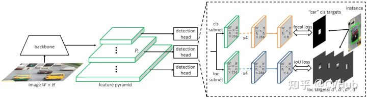

**【简介】** **SAPD[20]** 论文作者认为Anchor point的方法性能不高主要还是在于训练的不充分，主要是注意力偏差和特征选择。因而作者提出了两种策略：1)Soft-weighted anchor points对不同位置的样本进行权重分配 2)Soft-selected pyramid levels，将样本分配到多个分辨率，并进行权重加权。而在训练阶段，作者前6个epoch采用FSAF的方式，而后6个epoch会将特征选择的预测网络加入进行联合训练。

**【性能】** 下图2-6展示了在COCO检测数据集上SAPD算法和其它SOTA检测算法的性能对比。

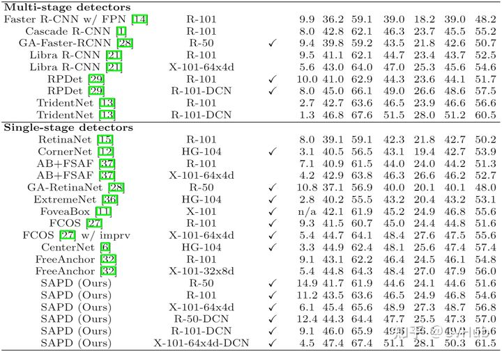图2-6.SAPD与其它模型性能对比

## **3. 常用数据集及评价指标**

### **3.1 常用数据集**

### **3.1.1 四大公共数据集**

**Pascal VOC[21]**，**ILSVRC[22]**，**MS-COCO[23]**，和**OID[24]** 数据集是目标检测使用最多的四大公共数据集，至于这四大数据集的介绍，此处不一一展开，大家可根据下方给出的链接了解：

- PASCAL VOC数据集详细介绍可参考：[https://arleyzhang.github.io/articles/1dc20586/](https://link.zhihu.com/?target=https%3A//arleyzhang.github.io/articles/1dc20586/)
- ILSVRC数据集详细介绍可参考：[https://cloud.tencent.com/developer/article/1747599](https://link.zhihu.com/?target=https%3A//cloud.tencent.com/developer/article/1747599)
- MS-COCO数据集详细介绍可参考：[https://blog.csdn.net/qq_41185868/article/details/82939959](https://link.zhihu.com/?target=https%3A//blog.csdn.net/qq_41185868/article/details/82939959)
- Open Images(QID)数据集详细介绍可参考：[https://bbs.easyaiforum.cn/thread-20-1-1.html](https://link.zhihu.com/?target=https%3A//bbs.easyaiforum.cn/thread-20-1-1.html)

下图3-1展示了这四大检测数据集的样例图片及其标签

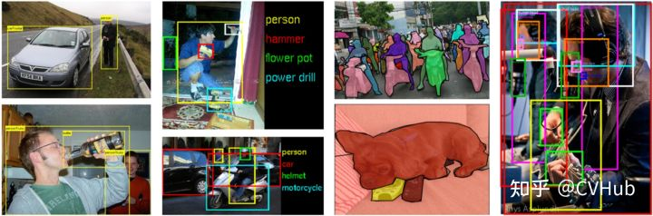

下表3-1展示了这四大检测数据集的数据统计结果：

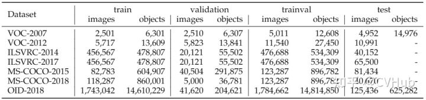

### **3.1.2 其它数据集**

检测任务包含了很多种，其中比较常见的检测任务有行人检测，脸部检测，文本检测，交通灯与交通标志检测，遥感图像目标检测。下表3-2至3-6分别列举了各检测任务下的常用公共检测数据集。

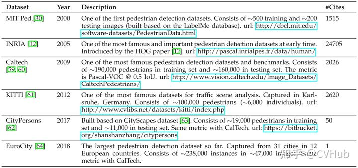表3-2.行人检测常用数据集

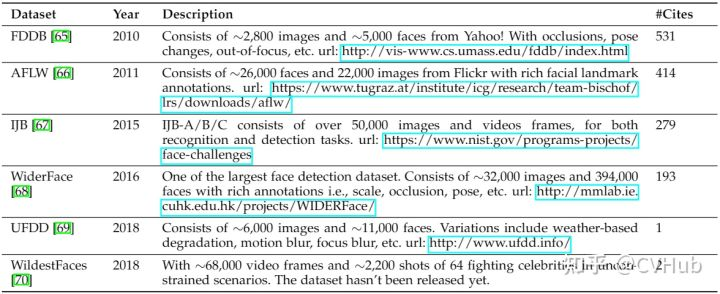表3-3.脸部检测常用数据集

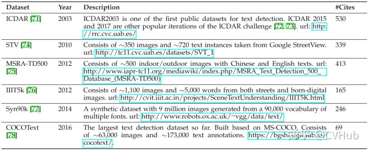表3-4.文本检测常用数据集

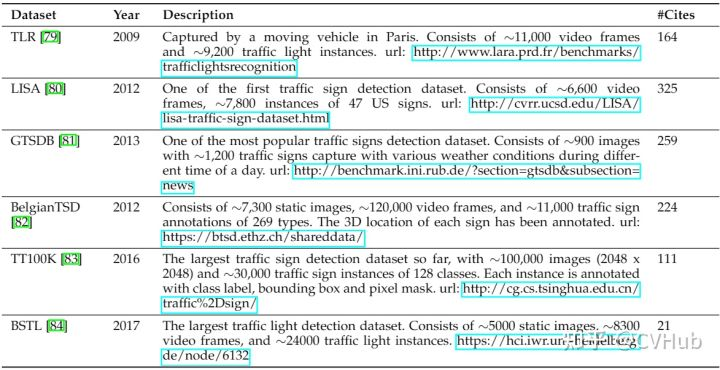表3-5.交通标注检测常用数据集

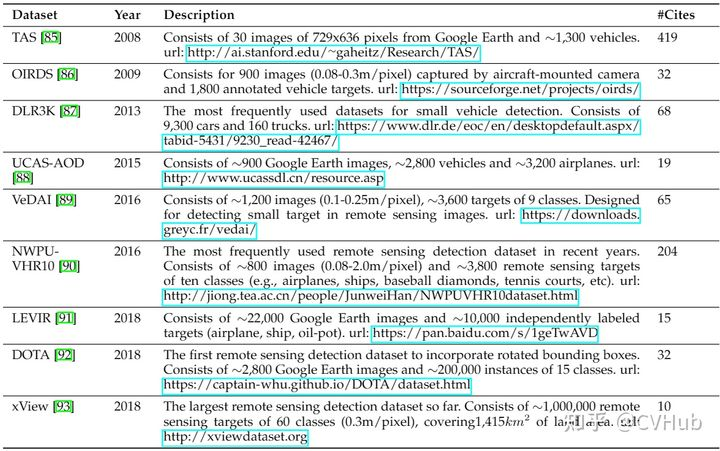表3-6.遥感图像目标检测常用数据集

### **3.2 常用评价指标**

目标检测常用的评价指标有：**交并比**，**准确率**，**精度**，**召回率**，**FPR**，**F1-Score**，**PR曲线-AP值**，**ROC曲线-AUC值**，和**mAP值**和**FPS**。

### **3.2.1 交并比(IOU)**

IOU = 两个矩形交集的面积 / 两个矩形并集的面积

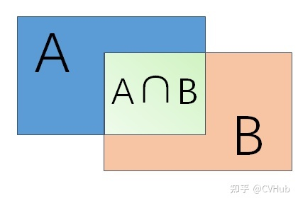

如上图3-2，假设A是模型检测结果，B为Ground Truth，那么IOU = (A ∩ B) / (A ∪ B)，一般情况下对于检测框的判定都会存在一个阈值，也就是IOU的阈值，一般将IOU值设置为大于0.5的时候，则可认为检测到目标物体。

### **3.2.2 准确率/精度/召回率/F1值/FPR**

> True positives (TP,真正): 预测为正,实际为正
> True negatives (TN,真负): 预测为负,实际为负
> False positives(FP,假正): 预测为正,实际为负
> False negatives(FN,假负): 预测为负,实际为正

Accuracy=TP+TNTP+TN+FP+FNPrecision=TPTP+FPRecall=TPTP+FNF1−Score=2×TP2×TP+FP+FNFPR=FPFP+TN

### **3.2.3 PR曲线-AP值**

模型精度，召回率，FPR和F1-Score值无法往往不能直观反应模型性能，因此就有了PR曲线-AP值 和 ROC曲线-AUC值

PR曲线就是Precision和Recall的曲线，我们以Precision作为纵坐标，Recall为横坐标，可绘制PR曲线如下图3-3所示：

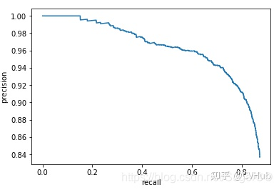

**评估标准**：如果模型的精度越高，且召回率越高，那么模型的性能自然也就越好，反映在PR曲线上就是PR曲线下面的面积越大，模型性能越好。我们将PR曲线下的面积定义为AP(Average Precision)值，反映在AP值上就是AP值越大，说明模型的平均准确率越高。

### **3.2.4 ROC曲线-AUC值**

ROC曲线就是RPR和TPR的曲线，我们以FPR为横坐标，TPR为纵坐标，可绘制ROC曲线如下图3-4所示：

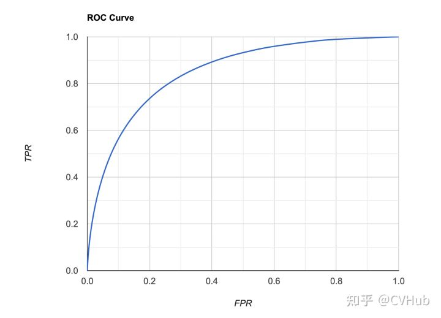

**评估标准**：当TPR越大，FPR越小时，说明模型分类结果是越好的，反映在ROC曲线上就是ROC曲线下面的面积越大，模型性能越好。我们将ROC曲线下的面积定义为AUC(Area Under Curve)值，反映在AUC值上就是AUC值越大，说明模型对正样本分类的结果越好。

### **3.2.5 mAP**

Mean Average Precision(mAP)是平均精度均值，具体指的是不同召回率下的精度均值。在目标检测中，一个模型通常会检测很多种物体，那么每一类都能绘制一个PR曲线，进而计算出一个AP值，而多个类别的AP值的平均就是mAP。

**评估标准**：mAP衡量的是模型在所有类别上的好坏，属于目标检测中一个最为重要的指标，一般看论文或者评估一个目标检测模型，都会看这个值，这个值(0-1范围区间)越大越好。

**划重点！！！**

一般来说mAP是针对整个数据集而言的，AP则针对数据集中某一个类别而言的，而percision和recall针对单张图片某一类别的。

### **3.2.6 FPS**

Frame Per Second(FPS)指的是模型一秒钟能检测图片的数量，不同的检测模型往往会有不同的mAP和检测速度，如下图3-5所示：

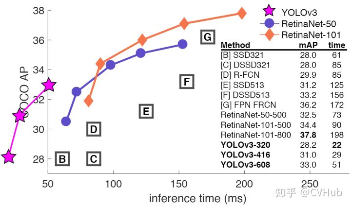图3-5.不同模型的准确率与检测速度

目标检测技术的很多实际应用在准确度和速度上都有很高的要求，如果不计速度性能指标，只注重准确度表现的突破，其代价是更高的计算复杂度和更多内存需求，对于行业部署而言，可扩展性仍是一个悬而未决的问题。因此在实际问题中，通常需要综合考虑mAP和检测速度等因素。本小节参考**目标检测中的评价指标有哪些[25]**

## **4. 存在的六大难点与挑战**

每一个检测任务都有其特有的检测难点，比如背景复杂，目标尺度变化大，颜色对比度低等挑战，这就导致某个检测算法在检测任务A上可能表现SOTA，但在检测任务B上表现得可能不尽如人意。因此，分析研究每一个检测任务存在的难点与挑战至关重要，这有利于我们针对不同的检测难点设计出不同的技术以解决该项问题，从而使得我们提出的算法能够在特定的任务上表现SOTA。

我们对大部分检测任务加以分析，概括出了以下几点在检测任务可能存在的检测难点与挑战:

1. **待检测目标尺寸很小，导致占比小，检测难度大**
2. **待检测目标尺度变化大，网络难以提取出高效特征**
3. **待检测目标所在背景复杂，噪音干扰严重，检测难度大**
4. **待检测目标与背景颜色对比度低，网络难以提取出具有判别性的特征**
5. **各待检测目标之间数量极度不均衡，导致样本不均衡**
6. **检测算法的速度与精度难以取得良好平衡**

**划重点！！！**

以上六大检测难点基本覆盖检测任务中存在的所有挑战，对于我们所做过的每一份检测任务数据集，都可以在上述找到相应难点与挑战，并针对具体的检测难点提出相应的解决方案！

## **5. 目标检测的五大技术及其演变**

### **5.1 Multi-Scale检测技术的演变**

不同尺度，不同形状物体的检测是目标检测面临的主要挑战之一，而多尺度检测技术是解决多尺度问题的主要技术手段。目标检测发展的几十年来，多尺度检测技术的演变经历了以下过程：

1. Feature pyramids and sliding windows(2014年前)
2. Detection with object proposals(2010-2015年)
3. Deep regression(2013-2016年)
4. Multi-reference detection(2015年后)
5. Multi-resolution detection(2016年后)

如下图5-1展示了多尺度检测技术的演变历程。

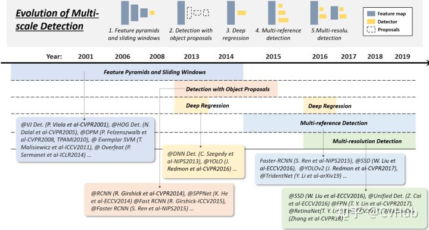图5-1.多尺度检测技术的演变历程

### **5.2 边框回归技术的演变**

边框回归(The Bounding Box regression)是目标检测非常重要的技术。它的目的是根据初始设定的anchor box来进一步改进修正预测框的位置。目标检测发展的几十年来，多尺度检测技术的演变经历了以下过程：

1. Without BB regression(2008年之前)
2. From BB to BB(2008-2013年)
3. From feature to BB(2013年后)

如下图5-2展示了边框回归技术的演变历程。

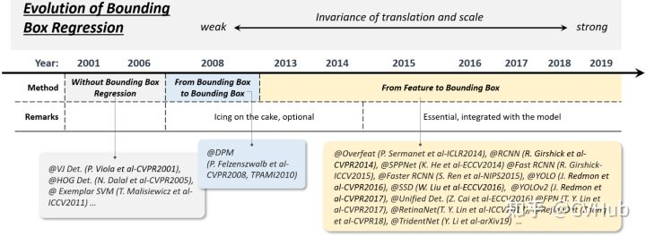图5-2.边框回归技术的演变历程

### **5.3 上下文信息提取技术的演变**

目标检测领域中每一个目标都被周围背景所包围，而我们对于一个目标的认知会根据其周围的环境作出判断，于是我们将目标周围的环境信息称作上下文信息。上下文可以作为网络判断目标类别和定位的重要辅助信息，可大大提高网络检测的精度。为网络提取上下文信息有以下三种常用的方法：

1. 提取局部上下文信息用于目标检测
2. 提取全局上下文信息用于目标检测
3. 上下文信息交互提取高效上下文信息用于目标检测

如下图5-3展示了上下文信息提取技术的演变历程。

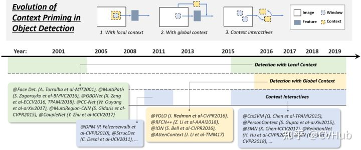图5-3.上下文信息提取技术的演变历程

### **5.4 非极大值抑制技术的演变**

目标检测的过程中在同一目标的位置上会产生大量的候选框，这些候选框相互之间可能会有重叠，此时我们需要利用非极大值抑制找到最佳的目标边界框，消除冗余的边界框。非极大值抑制算法的流程如下：

1. 根据置信度得分进行排序
2. 选择置信度最高的比边界框添加到最终输出列表中，将其从边界框列表中删除
3. 计算所有边界框的面积
4. 计算置信度最高的边界框与其它候选框的IoU。
5. 删除IoU大于阈值的边界框
6. 重复上述过程，直至边界框列表为空。

非极大值抑制算法逐渐发展成为以下三条路线：

1. Greedy selection
2. Bounding box aggregation
3. Learning to NMS

如下图5-4展示了非极大值抑制算法的技术演变历程。

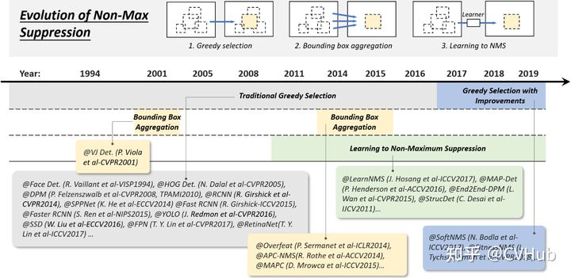图5-4.非极大抑制技术的演变历程

### **5.5 难分负样本挖掘技术的演变**

目标检测的训练过程本质上还是一个样本数据不平衡的学习过程，因为检测算法中需要用到很多检测框，而真正包含目标的检测框占比却极少。在网络训练过程中，大量简单的负样本(背景)会主导学习方向而不利于网络往正确的方向加以优化，因此这需要采取一定的策略来解决这一问题。难分负样本挖掘(Hard Negative Mining, HNM)技术正是解决训练过程中的数据不平衡问题的一项关键技术。

难分负样本挖掘技术的演变主要经历了以下过程：

1. Bootstrap
2. HNM in deep learning based detectors

如下图5-5展示了难分负样本挖掘技术的演变历程。

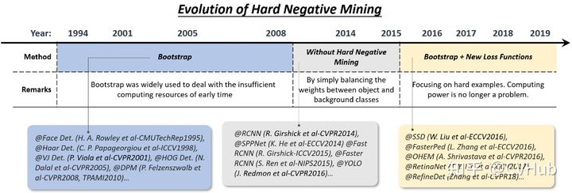图5-5.难分负样本挖掘技术的演变历程

## **6. 模型加速技术**

目前卷积神经网络在移动端的部署仍然具有不小挑战，一个高精度的模型若计算量大，则在工业落地的时候需要购买昂贵的设备去运行该模型，这会极大提高工业生产成本，阻碍模型落地进程。因此模型在高精度的同时，还需要速度快。学术界研究学者致力于研究出高精度的轻量化网络架构，而工业界工程师则致力于从硬件的角度出发，开发一系列模型压缩与量化技术来提高模型运算速度。近年来出现的一些加速技术大体可分为以下三类：

1. 轻量化网络设计
2. 模型压缩与量化
3. 模型数值加速

### **6.1 轻量化网络设计**

设计轻量化网络架构可以使模型在轻量化的同时保持较高的精度，在轻量化网络设计中，除了降低网络通道数和卷积层数等一些通用的网络设计准则外，一些其它的方法也被用于构建轻量化的网络：

1. 卷积分解
2. 分组卷积
3. 深度可分离卷积
4. Bottle-neck设计
5. 神经架构搜索

### **6.1.1 卷积分解**

卷积分解是最简单也最常用的用于构建轻量级网络的技巧，卷积分解的方式主要有两种：

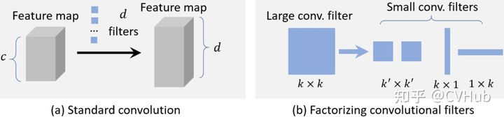图6-1.普通卷积和核分解卷积

第一种方法是：将大卷积核分解为多个小卷积核，如上图6-1(b)所示，可以将一个7×7的卷积核分解成3个3×3的卷积核，它们拥有相同的感受野，但后者计算效率会更高；或者将ab×b的卷积核分解为ab×1和a×b的卷积核。

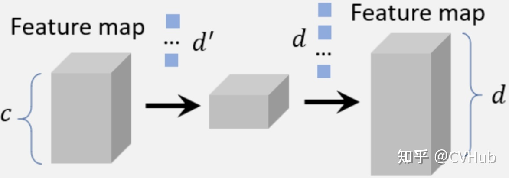图6-2.通道分解卷积

第二种方法是：将一组大卷积在其通道维度上分解为两小组卷积，如上图6-2所示，我们可以用d′个卷积核将特征图的通道数从c降到d′，然后再运用d个卷积核将特征图的通道数调整为d。通过此种方式，复杂度O(dk2c)可以降低到O(d′k2c)+O(dd′)

### **6.1.2 分组卷积**

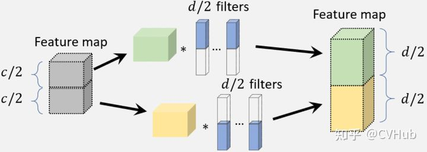图6-3.分组卷积(Groups=2)

分组卷积的目的是通过将特征通道分成多个不同的组来减少卷积层中的参数数量，然后对每个组独立进行卷积，如上图6-3所示。如果我们将特征通道平均划分成m组，卷积的计算复杂度理论上会降低到之前的1/m。

### **6.1.3 深度可分离卷积**

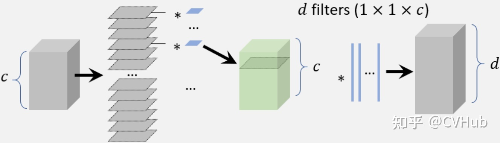图6-4.深度可分离卷积

如上图6-4所示，深度可分离卷积是用于构建轻量化网络的一种常见方法，当组数设置为通道数时，可以将其视为组卷积的特例。假设我们有一个带有d个卷积滤波器的卷积层和一个具有c个通道数的特征图，每个卷积滤波器的大小是k×k。对于深度可分离卷积，每个k×k×c的卷积滤波器首先分成大小为k×k×1的切片，然后在每个通道中对滤波器的每个切片单独进行卷积,最后使用多个1×1卷积滤波器进行维度变换，以便最终输出相同的通道。通过使用深度可分离卷积，计算复杂度可以从 O(dk2c)降低到O(ck2)+O(dc)。

### **6.1.4 Bottle-neck设计**

Bottle-neck已被广泛用于设计轻量级网络，Bottle-neck的核心思想就是运用少量的参数/计算量进行信息压缩。在Bottle-neck的设计中，一种常见的方法是压缩检测器的输入层使得检测器在一开始就减少计算量；另一种方法是压缩检测器的输出来降低通道数，从而使其在后续检测阶段更加高效。

### **6.1.5 神经架构搜索NAS**

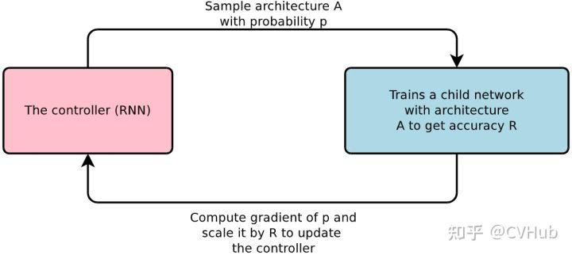图6-5.神经网络架构搜索

NAS技术已应用于大规模图像分类、对象检测和图像分割任务，神经网络架构搜索主要有三大流程：

1. 定义搜索空间
2. 执行搜索策略采样网络
3. 对采样的网络进行性能评估

定义搜索空间是指待搜索网络结构的候选集合，搜索空间大致分为全局搜索空间和局部搜索空间，前者代表搜索整个网络结构，后者只搜索一些小的结构，通过堆叠、拼接的方法组合成完整的大网络；执行搜索策略即如何在搜索空间进行选择，根据方法不同，搜索策略可大致分为：1)基于强化学习的方法 2)基于进化算法的方法 3)基于梯度的方法；而性能评估即在目标数据集上评估网络结构的性能好坏，从而筛选出最优网络结构。

### **6.2 模型压缩与量化**

模型压缩与量化是两种常用于加速CNN模型的技术，这其中所涉及到的技术有模型剪枝，量化与知识蒸馏。其中模型剪枝是指修剪网络结构或权重从而减小规模的一种技术；模型量化则是指将模型一些浮点计算转成低Bit的定点计算的技术，它可以有效降低模型计算强度、参数大小和内存消耗；而知识蒸馏则是指将大网络所学习到的"知识"有效传递到小网络中的一种技术。

### **6.2.1 网络剪枝**

网络剪枝最早可以追溯到1980年代，而近年来的网络剪枝方法通常采用迭代训练的方式进行剪枝，即在每个训练阶段后仅去除一小部分不重要的权重，并重复此操作直到模型达到较小量级且精度满足落地要求。由于传统的网络剪枝只是简单的去除一些不重要的权重，这可能会导致卷积滤波器连的连接变得稀疏，因此不能直接用于压缩CNN模型。而解决这一问题的方案就是移除整个过滤器而不是独立的权重。

### **6.2.2 模型量化**

近年来关于模型量化的工作主要集中在网络二值化，其目的是通过将网络的参数权重量化为二进制变量(例如0或1)来进行网络加速，以便将一些浮点运算转换为AND，OR，NOT等逻辑运算。模型参数的二值化可以显著加快其计算速度并减少网络存储，从而使得网络更容易地部署在移动设备上。而实现以上思路的一种方法就是用最小二乘法通过二进制变量来近似卷积操作，并使用多个二值化卷积的线性组合来不断提高模型精度。此外，一些研究人员还进一步开发了用于二值化计算的GPU加速库，并取得了更显著的模型加速效果。

### **6.2.3 知识蒸馏**

知识蒸馏是一种将大型网络所学习到的"知识"有效传递到小网络中，使得小网络接近于大网络预测能力的一种技术，此处我们将大网络称作“Teacher Net”，将小网络称作“Student Net”，近年来这一技术成功用于目标检测算法的加速。使用知识蒸馏一个最直接的方法就是使用Teacher Net来指导轻量级的Student Net，以便Student Net可以用于检测的加速；而知识蒸馏的另一个方法就是对候选区域进行变换，以最小化Student Net和Teacher Net之间特征的距离，这种方法直接使得模型的检测速度提高了2倍，而同时又保持了很高的检测精度。

### **6.3 数值加速技术**

目标检测中常用的数值加速方法主要有以下四种，具体实现方法此处就不一一展开了，有兴趣的读者可自行搜索资料进行了解。

1. 积分图像加速
2. 频域加速
3. 矢量量化
4. 降阶逼近

## **7. 提高目标检测模型精度的五大技术**

接下来，本小节带你简单回顾近几年年目标检测领域中用于提高模型精度的几大技术。

### **7.1 特征提取网络**

特征提取网络(Backbone)对于目标检测模型性能的提升至关重要，一些经典的特征提取网络对目标检测任务精度起到了重要的推动作用，如AlexNet、VGG、GoogLeNet、ResNet、DenseNet、SENet等等。随着卷积神经网络的发展，业界不断涌现出了一些新的特征提取网络，性能更是步步攀升。一些先进的特征提取网络被应用于目标检测模型的特征提取Backbone，使得目标检测模型的精度与速度不断提升，比如STDN，DSOD，TinyDSOD和DenseNet等等。作为当时实力分割的SOTA算法，Mask RCNN采用了ResNeXt作为网络的Backbone。

### **7.2 高效的特征融合**

高效的特征表示是提升目标检测性能的关键，近年来，许多研究学者在特征提取网络中加入一些Trick去提高网络的特征提取能力。而用于提高网络表征能力的两项最重要的方法便是：1)高效的特征融合 和2)学习出具备大感受野的高分辨率特征表示。

### **7.2.1 为什么特征融合如此重要呢？**

平移不变性和等变性是图像特征表示中的两个重要特性：特征的平移不变性有利于图像分类，因为它旨在学习高级语义信息；而特征的平移等变性更有利于目标定位，因为它旨在区分位置和尺度变化。由于目标检测由图像识别和目标定位两个子任务组成，因此目标检测算法需要同时学习特征平移不变性和等变性。

近年来，特征融合在目标检测中得到了广泛的应用，由于CNN模型由一系列卷积和池化层组成，因此更深层的特征具有更强的平移不变性但缺乏一定的平移等变性，这虽然更有利于物体识别，但它对目标定位的精度低。相反，较浅层的特征具有更强的平移等变性且包含更多的边缘轮廓信息，这虽然有利于目标定位，但由于缺乏一定的语义信息而不利于物体分类。因此CNN模型中深层和浅层特征的融合有助于提高特征的平移不变性和等变性，这对提高目标检测的精度是非常重要的。

### **7.2.2 实现高效特征融合的一些方法**

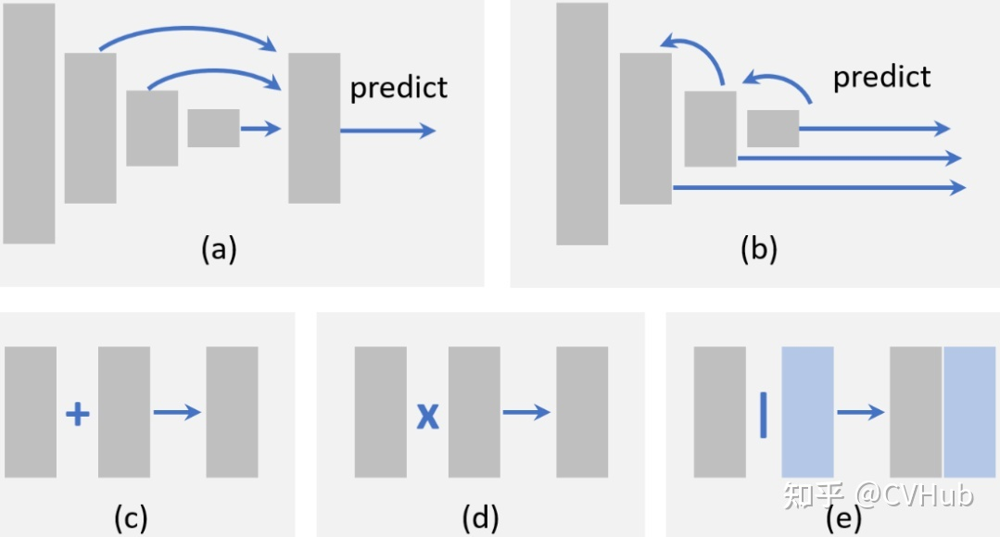图7-1.特征融合方法

在目标检测中实现特征融合，首先需要确定要融合哪些特征，比如我们可以采取自底向上的特征融合，将浅层特征通过跳跃连接融入到深层特征中，如上图7-1(a)所示；也可以采用自顶向下的特征融合，将深层特征通过跳跃连接融入到浅层特征中，如上图7-1(b)所示；同样也可以采用的跨不同层进行特征融合的方式。确定要融合哪些特征之后，再确定融合的方式，比如逐元素求和，如上图7-1(c)；还是逐元素相乘，如上图7-1(d)；还是Concat融合，如上图7-1(e)所示。

### **7.2.3 具备大感受野的高分辨率特征表示**

特征的感受野和分辨率是CNN模型需要考虑的两个重要因素，具有较大感受野的网络能够捕获更大尺度的上下文信息，而具备较小感受野的网络可能更专注于图像的局部细节。高分辨率的特征有利于检测小物体，由于感受野较小缺乏一定的语义信息，因此不利于检测大尺寸物体，而为了增大感受野最直接的办法是引入池化层，但这会导致特征的分辨率降低而不利于检测小物体。为了解决这一矛盾，在增加感受野的同时又丧失特征分辨率，空洞卷积是一种比较好的解决办法，空洞卷积无需额外的参数和计算成本即可有效提高检测算法的精度。

### **7.3 目标定位改进**

为了改善检测算法对于目标定位的精度，近年来出些的一些主要改进方法是：1)边框微调，2)设计新的损失函数用于更精准的定位。

### **7.3.1 边框微调技术**

边框微调是对检测结果进行后处理。尽管边界框回归已经集成到大多数现代目标检测器中，但仍有一些目标无法被Anchor box很好的锚定，这导致边框的预测并不精确，因此一些研究学者提出边界框微调技术，通过将检测结果迭代输入BB回归器，直到模型的预测收敛到正确的位置和大小。

### **7.3.2 改进损失函数以提高定位精度**

目标定位被认为是一个坐标回归问题，定位损失函数的演变经历了MSE->IOU->GIOU->DIOU->CIOU这一过程

### **7.4 语义分割促进目标检测**

目标检测和语义分割是计算机视觉最基本的两大任务，近年来一些研究发现语义分割可以促进目标检测性能的提升。

### **7.4.1 为什么分割可以改善检测性能呢？**

分割改善检测性能的原因主要有以下三点

1. 分割可以帮助类别分类
2. 分割可以促进目标的精准定位
3. 分割可以作为一种上下文信息嵌入到检测网络

### **7.4.2 分割如何改善检测性能**

通过分割改善检测性能主要有两种方法：1)学习丰富的特征表示，2)多任务损失促进网络的学习

1. 学习丰富的特征表示

最简单的方法就是将分割网络视为固定的特征提取器嵌入到检测算法中，这种方式的优点是容易实现，缺点是分割网络会带来额外的计算。

1. 多任务损失促进网络学习

另一种方法是在原始检测算法中引入一个额外的分割分支，并使用多任务损失函数(分割损失 + 检测损失)来训练该模型。而在模型推理阶段，将分割分支去除即可。这种方法的优点是检测速度不会受到影响，缺点是该算法在训练时还需要像素级别的图像标注。在此基础上，一些研究人员引入了弱监督学习的思想：不基于像素级别的图像标注进行模型训练，而是简单地基于边界框标注来训练该分割分支。

### **7.5 旋转和尺度变化的鲁棒性检测**

物体的旋转和尺度变换是目标检测面临的重要挑战，CNN的平移不变性使得越来越多人投入到该项挑战的研究当中。

### **7.5.1 旋转的鲁棒性检测**

物体旋转在目标检测任务中非常常见，而解决这一问题最直接方法就是数据增强，使得任何方向的对象都可以被增强数据很好地覆盖，而解决这一问题的另一个方案就是为每个方向训练独立的检测器，除了这些方法外，近年来还出现了一些新的改进方法。

1. 旋转不变性损失函数
2. 旋转校准
3. 旋转ROI池化

### **7.5.2 尺度鲁棒性检测**

近年来的一些研究也有从训练和检测阶段两个方面来改善尺度变换的鲁棒性检测

1. 自适应尺度训练方法
2. 自适应尺度检测方法

## **8. 五大应用场景**

在本节中，我们将回顾过去几年中出现的一些重要检测应用：行人检测、人脸检测、文本检测、交通信号和遥感目标检测。

### **8.1 行人检测**

行人检测作为一种目标检测一项重要的应用，在自动驾驶、视频监控、刑事侦查等诸多领域受到广泛关注。一些早期的行人检测方法(如HOG检测器和ICF检测器)在特征表示、分类器设计和检测加速方面为目标检测技术奠定了坚实的基础。近年来一些通用的目标检测算法，例如Faster RCNN被用于行人检测，这极大地推动了行人检测领域的进步。

### **8.1.1 难点与挑战**

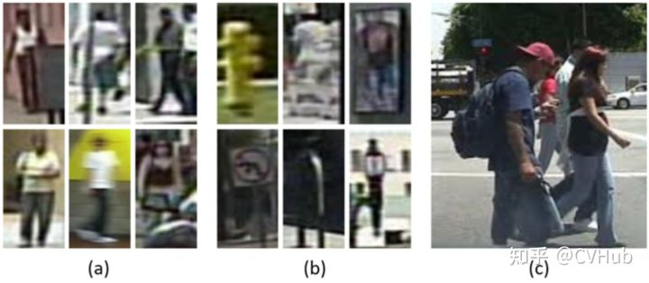图8-1.行人检测存在的难点与挑战

行人检测任务中存在的难点与挑战可简要概括为如下四点：

1. 小尺寸行人

上图8-1(a)展示了一些小尺寸行人的样例，在Caltech数据集中，据统计大约15%的行人其高度都小于30个像素点。

1. 困难负样本

如上图8-1(b)所示，由于场景图像中一些背景在视觉上与行人非常相似，这导致网络很难将负样本进行正确分类，往往会将一些很像行人的背景物体预测成为行人。

1. 行人密集且遮挡情况

如上图8-1(c)所示，由于图像中多存在行人密集且行人遮挡情况，这导致网络难以精准检测出被遮挡的行人，在Caltech数据集中，据统计行人未遮挡的个体约占行人总数的29%。

1. 固有的实时检测性能

由于一些自动驾驶和视频监控等应用需要检测算法能够实时提供检测结果以便系统快速做出决断，因此视频的实时行人检测至关重要。

### **8.1.2 解决方法**

1. 改善小尺寸行人检测

即使Fast/Faster RCNN算法在当时表现SOTA，但由于检测头所提取出的低分辨率特征，导致它对小目标的检测效果并不理想。近年来针对这个问题的一些解决方案包括：1)**特征融合[26]**，2)引入**超高分辨率手工提取的特征[27]**，以及3)在多个分辨率特征图上**集成检测结果[28]**。

1. 改善困难负样本检测

近年来对于改善困难负样本的检测方法主要有：决策树增强和**语义分割[29]**(作为一种上下文信息引入)，此外，还引入了跨模态学习的思想，通过使用RGB和红外图像的方式来**丰富困难负样本的特征[30]**。

1. 改善行人密集且遮挡的检测

CNN中深层的特征具有更丰富的语义信息，但对密集物体的检测是无效的，为此一些研究学者通过考虑目标的吸引和目标周围背景的排斥关系，设计了一种**新的损失函数[31]**。而目标遮挡则是伴随行人密集所出现的另一个问题，**部分检测器的集成[32]和注意力机制[33]** 是解决行人遮挡问题最常见的方法。

### **8.2 人脸检测**

早期的人脸检测(如VJ检测器)极大促进了目标检测的发展，其中许多检测思想即使在今天的目标检测也仍然发昏这重要作用。目前人脸检测已应用到各行各业，如数码相机中的微笑检测，电子商务中的刷脸，手机应用中的面部化妆等等。

### **8.2.1 难点与挑战**

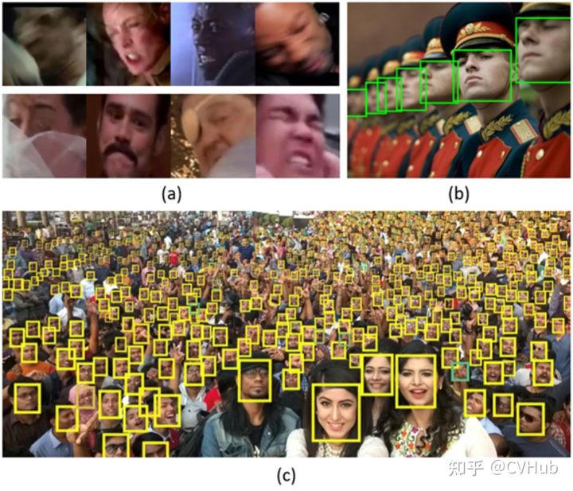图8-2.人脸检测存在的难点与挑战

人脸检测任务中存在的难点与挑战可简要概括为如下四点：

1. 人脸姿态变化大

如上图8-2(a)所示，人类脸部可能出现各种变化，如表情，肤色，姿势和运动等变化。

1. 脸部遮挡问题

如上图8-2(b)所示，人脸可能被其它物体所遮挡。

1. 多尺度检测问题

如上图8-2(c)所示，在检测大尺寸人脸的时候，也经常要检测小尺寸的人脸，因此存在多尺度检测挑战。

1. 实时检测要求

移动设备上的人脸检测应用还需要在CPU上实现实时检测的性能。

### **8.2.2 解决方法**

1. 人脸检测加速技术

**级联检测[34]** 是加速人脸检测最常用的一种方式。其它的一些加速方法则是通过在一张图片上**预测出人脸尺度的分布[35]**，然后在选择某些尺度进行人脸检测。

1. 改善人脸多姿态和脸部遮挡问题

通过估计校准后的参数或使用渐进校准技术可以实现人脸校准，人脸校准是改善多姿态人脸检测的主要技术手段。为了改善脸部遮挡后的人脸检测，近年来提出了两种方法：第一个是**结合注意力机制[36]**，以增强人脸特征；第二个则是使用**Detection based on parts[37]**来解决人脸遮挡问题，该项技术借鉴了DPM的思想。

1. 改善多尺度人脸检测

改善多尺度人脸检测的解决方法主要是**多尺度特征融合[38]**与多分辨率检测。

### **8.3 文本检测**

文本检测的任务是判断一张图片中是否存在文字，若有文字，则需要计算机对图片中的文字进行定位并识别文字的具体内容，所以文本检测具有两个子任务：文本定位与文本识别。文本检测可以帮助视障人士阅读路牌或货币，在地理信息系统中，门牌号和街道标值的检测与识别也使数字地图的构建变得更加容易。

### **8.3.1 难点与挑战**

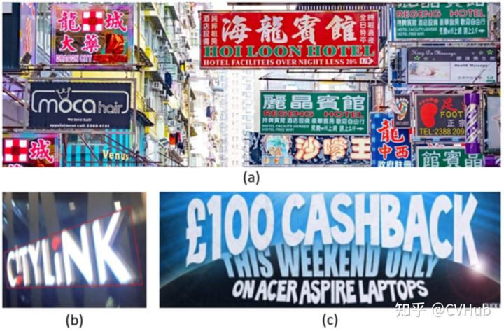图8-3.文本检测存在的难点与挑战

文本检测任务中存在的难点与挑战可简要概括为如下四点：

1. 字体与语言差异大

如上图8-3(a)所示，图像中可能会出现不同字体，颜色和不同语言的文本。

1. 文本旋转与透视变化

如上图8-3(b)所示，图像中可能会出现具有不同视角和方向的文本。

1. 文本密集

如上图8-3(c)所示，具有大宽高比和高密集文本的文字导致文本检测算法难以精确定位。

1. 字体缺失与模糊
   在街景图像中，字体的缺失与模糊是经常存在的一个问题。

### **8.3.2 解决方法**

1. 改善文本旋转和透视变化

对此问题最常见的方法是在Anchor box中，和通过旋转与**透视变化分区[39]** 的ROI引入额外的参数。

1. 改善文本密集检测问题

基于分割的方法在密集型检测任务中展现了许多优势，为了区分相邻的文本行，近年来一些研究学者提出了两种解决方案：第一个是**段连接方法[40]**，其中段指的是字符热图，而连接指的是两个相邻段之间的连接，这表明它们属于同一单词或文本行；第二个是**增加一个额外的边界检测任务[41]** 来帮助分离密集排列的文本。

1. 改善字体缺失与模糊问题

处理字体缺失与模糊问题的最近解决方案是**使用单词或句子级别的识别[42]**，而处理不同字体的文本，最有效的方法是使用**合成样本[43]**进行训练。

### **8.4 交通信号检测**

随着自动驾驶技术的发展，交通标志和红绿灯的自动检测近年来备受关注。对于像交通灯和交通标志这样的固定场景的标志检测，仍然具有不小的挑战。

### **8.4.1 难点与挑战**

图8-4.交通标志检测存在的难点与挑战

交通标志检测任务中存在的难点与挑战可简要概括为如下四点：

1. 照明变化

如上图8-4(a)所示，当夜晚或者有强烈光照的时候，交通标志的检测将变得异常困难。

1. 标志模糊

如上图8-4(b)所示，由于车辆在高速行驶的时候所拍摄出来交通标志照片会出现模糊的情况。

1. 天气变化导致问题
   如上图8-4(c)所示，在一些雨雪天气，车辆所拍摄的交通标志图片质量会大大下降，导致检测困难。
2. 实时检测

交通标志的检测对于自动驾驶非常重要，所以此任务需要有很高的实时性能。

### **8.4.2 解决方法**

在深度学习时代，一些经典的检测算法如Faster RCNN和SSD被应用于交通标志/灯光的检测任务，而后在这些检测算法的基础上，出现的一些新技术，如**注意力机制[44]和对抗性训练[45]**，已被用于改进复杂交通环境下的算法检测性能。

### **8.5 遥感目标检测**

近年来，随着遥感图像分辨率的提高，遥感图像目标检测(如飞机、船舶、油罐等的检测)成为研究热点，遥感图像目标检测具有广泛的应用，如军事侦查、灾害救援、城市交通管理等等。

### **8.5.1 难点与挑战**

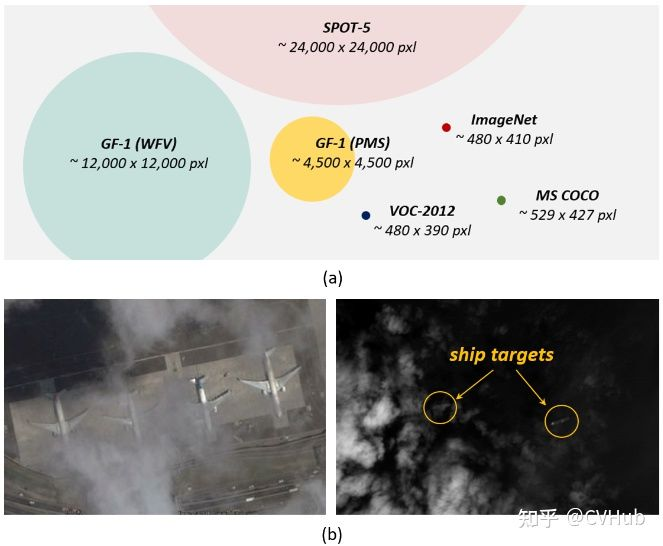图8-5.遥感目标检测存在的难点与挑战

交通标志检测任务中存在的难点与挑战可简要概括为如下四点：

1. 遥感图像分辨率巨大

如上图8-5(a)所示，由于遥感图像分辨率巨大，因此如何快速准确的检测出遥感目标仍然是一个挑战性的问题。

1. 目标遮挡问题

如上图8-5(b)所示，超过50%的目标被云雾所遮挡，因此目标遮挡问题也是遥感图像目标检测所面临的一个挑战。
\3. 域适应问题

由不同传感器所捕获的遥感图像仍然存在很大差异。

### **8.5.2 解决方法**

在2014年RCNN取得巨大成功后，深度卷积神经网络很快便应用于遥感图像目标检测，之后通用目标检测网络Faster RCNN和SSD的提出，吸引了一大批研究学者将越来越多的注意力集中到遥感图像目标检测中。

为了检测不同方向的目标，一些研究人员改进了**ROI池化层[46]**，以获得更好的旋转不变性；为了提高领域适应性，一些研究人员会从**贝叶斯的角度[47]**进行检测，从而在检测阶段，模型会基于测试图像的分布完成自适应更新。此外，注意力机制和特征融合策略也被用于**改进小目标检测[48]**问题。

## **9. 七大发展趋势**

在过去的十几年里，目标检测取得了显着的成就。本文不仅回顾了一些具备里程碑意义的检测算法(例如VJ检测器、HOG检测器、DPM、Faster-RCNN、YOLO、SSD等)、关键技术、加速方法、检测应用、数据集和指标；还讨论了检测任务所遇到的几大挑战，以及如何解决这几大挑战作了充分讨论。在未来的一些研究工作中，目标检测领域可能主要呈现以下七大发展趋势：

### **9.1 轻量型目标检测**

为了加快目标检测的推理速度并使其能够在移动设备上快速流畅的运行，比如在一些重要的应用：增强现实、智能相机、人脸验证等等，近年来一些研究学者为此做了大量的努力，但目前的一些检测算法速度仍然较慢。这将导致工业界不得不花费更多的资金来购买算力更高的设备去运行该检测算法，这在一定程度上阻碍了检测算法的落地进程。因此检测算法在未来的一个发展趋势中，轻量快速且高精度是目标检测永恒的主题。

### **9.2 与AutoML结合的目标检测**

近年来基于深度学习的检测算法变得越来越复杂且严重依赖于经验设计，为了在使用神经架构搜索NAS技术设计检测算法时减少人为参与(如何设计检测算法的Backbone，如何设计先验框等等)，未来的一个发展方向就是将目标检测与AutoML技术结合，因此AutoML可能是目标检测的未来。

### **9.3 领域自适应的目标检测**

任何目标检测算法的训练过程本质上都可以看成数据在独立同分布(i.i.d.)下的似然估计过程，而对于不满足(i.i.d.)的目标检测数据(特别是对于一些现实世界的应用程序)仍然是一个挑战，GAN在领域自适应方面已经显示出 了强大的效果，这对于目标检测技术来讲应该具有很大的促进作用。

### **9.4 弱监督目标检测**

基于深度学习检测算法的训练通常依赖于大量高质量标注的图像数据集，而标准过程通常比较耗时且效率低下。运用弱监督目标检测技术，可以使检测算法使用部分边界框标注的数据集进行训练，因此弱监督技术对于降低人力成本和提高检测灵活性非常重要。

### **9.5 小目标检测**

在场景图像中检测小目标一直是目标检测领域长期以来所面临的一个挑战，小目标检测研究方向的一些潜在应用包括：利用遥感图像统计野生动物的数量，和检测一些重要军事目标的状态，因此如何解决小目标问题一直是研究者研究的热点。

### **9.6 视频检测**

高清视频中的实时目标检测/跟踪对于视频监控和自动驾驶具有重要意义，现有的目标检测算法通常是为单张图像的物体检测而设计的，而忽略了视频帧与帧之间的相关性，通过探索视频帧序列之间的空间和时间相关性来改善检测性能是一个重要的研究方向。

### **9.7 信息融合目标检测**

具有多种数据源(多模态,例如RGB-D图像、3d 点云、激光雷达等)的目标检测对于自动驾驶和无人机应用非常重要，一些未解决的问题包括：如何将训练好的的检测模型迁移到不同模态的数据中，如何通过信息融合以改进检测性能等也是未来发展的一个重要研究方向。

## **总结**

本文介绍了传统目标检测算法到基于深度学习的目标检测算法发展进程，详细介绍了基于CNN目标检测算法发展的三条技术路线：一阶段、二阶段和Anchor free的检测算法，同时分析了为了提高检测模型精度和速度，近年来所出现的一些技术及其演变历程，最后本文简单介绍了目标检测的几大应用场景及其未来发展的趋势。希望本文能帮助各位读者在目标检测领域构建一个清晰的知识体系架构，并在目标检测发展的快车道上尽快找到属于自己的研究方向并有所建树！

### **References**

[1] Rapid object detection using a boosted cascade of simple features

[2] Histograms of oriented gradients for human detection

[3] A discriminatively trained, multiscale, deformable part model

[4] Rich feature hierarchies for accurate object detection and semantic segmentation

[5] Spatial pyramid pooling in deep convolutional networks for visual recognition

[6] Fast r-cnn

[7] Faster r-cnn: Towards real-time object detection with region proposal networks

[8] Feature pyramid networks for object detection

[9] Cascade R-CNN: Delving into High Quality Object Detection

[10] You only look once: Unified, real-time object detection

[11] SSD: Single shot multibox detector

[12] YOLO9000: better, faster, stronger

[13] Focal loss for dense object detection

[14] Yolov3: An incremental improvement

[15] Yolov4: Optimal speed and accuracy of object detection

[16] Cornernet: Detecting objects as paired keypoints

[17] Centernet: Keypoint triplets for object detection

[18] Feature selective anchor-free module for single-shot object detection

[19] Fcos: Fully convolutional one-stage object detection

[20] Soft Anchor-Point Object Detection

[21] http://host.robots.ox.ac.uk/pascal/VOC/

[22] http://image-net.org/challenges/LSVRC/

[23] http://cocodataset.org/

[24] https://storage.googleapis.com/openimages/web/index.html

[25] https://cloud.tencent.com/developer/article/1624811

[26] Is faster r-cnn doing well for pedestrian detection\?

[27] What can help pedestrian detection\?

[28] Pushing the limits of deep cnns for pedestrian detection

[29] Pedestrian detection aided by deep learning semantic tasks

[30] Learning cross-modal deep representations for robust pedestrian detection

[31] Repulsion loss: Detecting pedestrians in a crowd

[32] Jointly learning deep features, deformable parts, occlusion and classification for pedestrian detection

[33] Occluded pedestrian detection through guided attention in cnns

[34] Joint face detection and alignment using multitask cascaded convolutional networks

[35] Scale-aware face detection

[36] Face attention network: An effective face detector for the occluded faces

[37] Faceless-net:Face detection through deep facial part responses

[38] Faceless-net:Face detection through deep facial part responses

[39] Arbitrary-oriented scene text detection via rotation proposals

[40] Deep matching prior network: Towardtighter multi-oriented text detection

[41] Multi-oriented scene text detection via corner localization and region segmentation

[42] Attention-based extraction of structured information from street view imagery

[43] Reading text in the wild with convolutional neural networks

[44] Traffic signal detection and classification in street views using an attention model

[45] Perceptual generative adversarial networks for small object detection

[46] Rotated region-based cnn for ship detection

[47] Random access memories: A new paradigm for target detection in high resolution aerial remote sensing images

[48] Fully convolutional network with task partitioning for inshore ship detection in optical remote sensing images

## 来源参考
1. https://zhuanlan.zhihu.com/p/383616728
2. [Object Detection in 20 Years: A Survey](https://arxiv.org/pdf/1905.05055.pdf) 