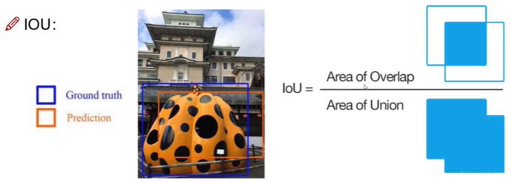

# Yolo系列

> You Only Look Once!

Yolov1-Yolov5

深度学习经典检测方法

* two-stage：Fast-Rcnn, Mask-Rcnn(5FPS)
  * 优点：
  * 缺点：
* one-stage：Yolo系列
  * 优点：速度快，适合做实时检测任务
  * 缺点：通常效果不会太好

## 指标分析

FPS(运行速度):

mAP(准确度): 综合衡量检测效果;但看精度和recall不行？

IOU(交并比):

准度(查准率) Precision=TP/(TP+FP)     

召回(查全率) Recall=TP/(TP+FN)

TP: 真的正例 , FP: 假的正例(通俗理解为判断错的正例)

TN: 真的负例 , FN: 假的负例(通俗理解为该判断对的没有判断对)

TP+FP 就是自己判断出的正例量总和。

TP+FN 就是真正的所有正例总和。

检测任务中精度和召回率代表什么？

基于置信度阈值计算，mAP实际上就是 P-R曲线所围成的面积。

## YOLOv1

* 把检测问题转换为回归问题，一个CNN搞定。
* 主要对视频进行实时检测，应用领域很广!

## 参考

1. [B站 YOLO目标检测实战教程](https://www.bilibili.com/video/BV1ha411r7cK)

