# Yolo系列

> You Only Look Once!

Yolov1-Yolov5

深度学习经典检测方法

* two-stage：Fast-Rcnn, Mask-Rcnn(5FPS)
  * 优点：
  * 缺点：
* one-stage：Yolo系列
  * 优点：速度快，适合做实时检测任务
  * 缺点：通常效果不会太好

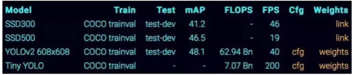

## 指标分析

FPS(运行速度):

mAP(准确度): 综合衡量检测效果;但看精度和recall不行？

IOU(交并比):

准度(查准率) Precision=TP/(TP+FP)     

召回(查全率) Recall=TP/(TP+FN)

TP: 真的正例 , FP: 假的正例(通俗理解为判断错的正例)

TN: 真的负例 , FN: 假的负例(通俗理解为该判断对的没有判断对)

TP+FP 就是自己判断出的正例量总和。

TP+FN 就是真正的所有正例总和。

检测任务中精度和召回率代表什么？

基于置信度阈值计算，mAP实际上就是 P-R曲线所围成的面积。mAP值越高越好，mAP=1是最好的。

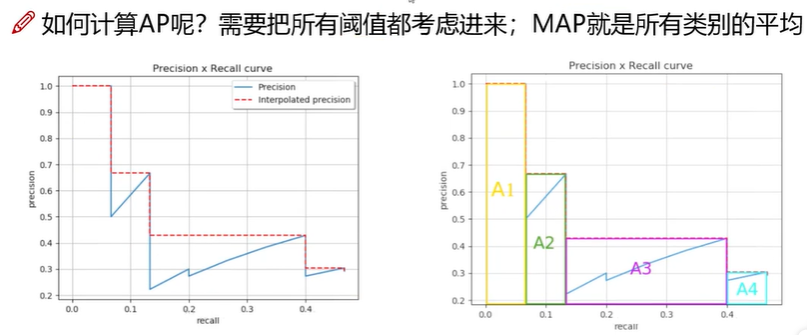

详细参考[map](https://sfyh.hnbdata.cn/aipath/cv/necessary/mAP.html)

## YOLOv1

* 把检测问题转换为回归问题，一个CNN搞定。
* 主要对视频进行实时检测，应用领域很广!

### 核心思想

### 网络架构

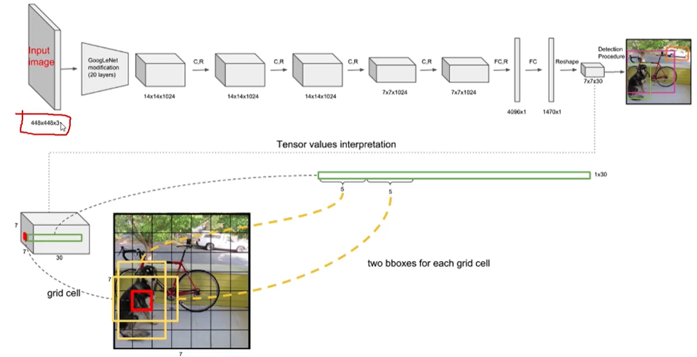

### 具体含义

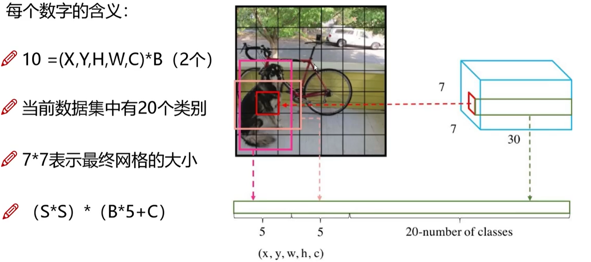

### 损失函数

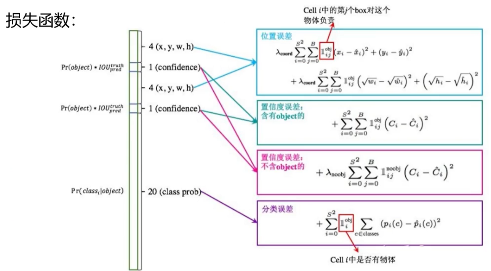

### NMS(非极大值抑制)

### 总结

* 优点: 快速，简单
* 问题
  * 每个Cell只预测一个类别，如果重叠无法解决
  * 小物体检测效果一般，长宽比可选但单一

## YOLOv2

> 更快! 更强！

### 改进点

Batch Normalization

* V2版本舍弃了Dropout,卷积后全部加入Batch Normalization
* 网络的每一层的输入都做归一化，收敛相对容易
* 经过Batch Normalization处理后的网络会提升2%的mAP
* 从现在来看，Batch Normalization已经成为网络处理标配

更大的分辨率

* V1版本用的是224\*224，测试用的是 448\*448
* 可能导致模型水土不服，V2训练时额外进行了10次448\*448的微调
* 使用高分辨率分类器后，mAP提升约4%

网络结构的改进

* DarkNet, 实际输入为 416\*416
* 没有FC层，5次降采样。
* 1\*1卷积节省了很多参数

聚类提取先验框

* faster-rcnn系列选择的先验比例都是常规的，但不一定是适合数据集的

* K-means聚类中的距离:

  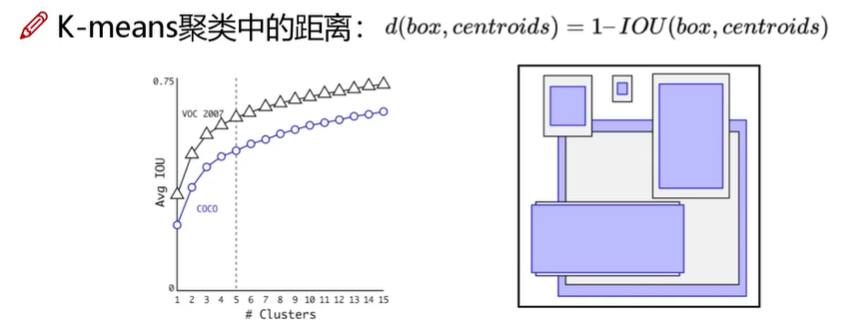

Anchor Box

* 通过引入 anchor boxes，使得预测的box数量更多(13\*13\*n)

* 跟faster-rcnn系列不同的是先验框并不是直接安装长宽固定比给定

  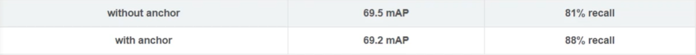

Directed Location Prediction

* V1版本中bbox: 中心为(xp,yp)，宽和高为(wp,hp),则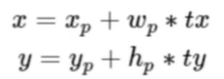

  tx=1,则将bbox在x轴向右移动wp;tx=-1,则向左移动wp。

  这会导致收敛问题，模型不稳定，尤其是刚开始训练时。

* V2版本中没有直接使用偏移量，而是选择相对grid cell的偏移量

  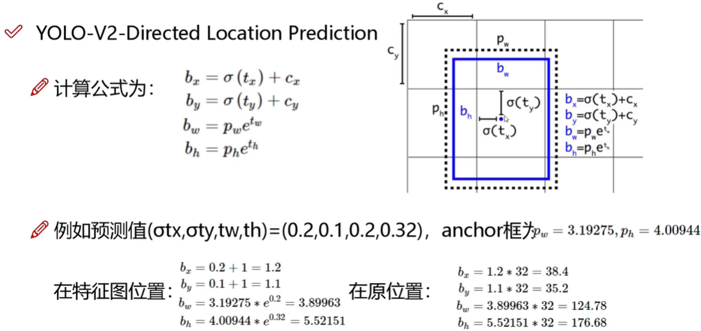

* Fine-Grained Features

  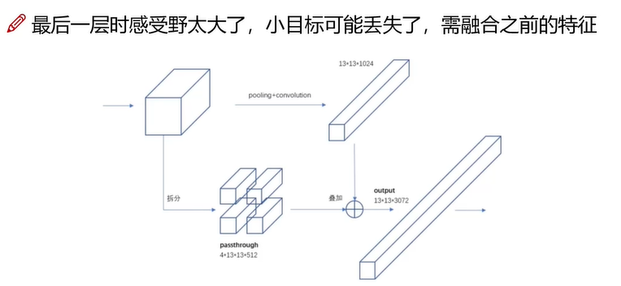

* 图片多尺度 Multi-Scale

  

## YOLOv3

### 改进点

* 最大的改进就是网络结构,使其更适合小目标检测。
* 特征做的更细致，融入多持续特征图信息来预测不同规格物体。
* 先验框更丰富了，3中scale，每种3个规格，一共9种
* softmax改进，预测多标签任务

多scale

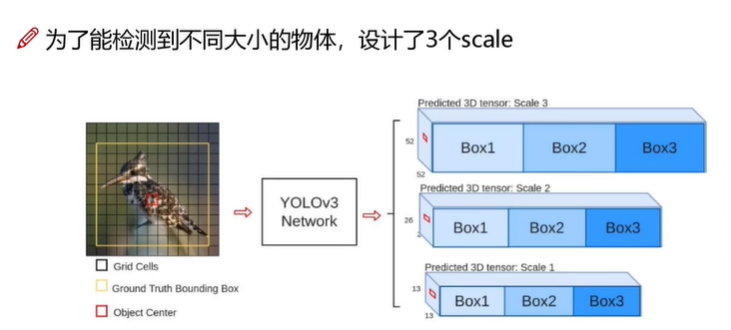

## 参考

1. [B站 YOLO目标检测实战教程](https://www.bilibili.com/video/BV1ha411r7cK)

