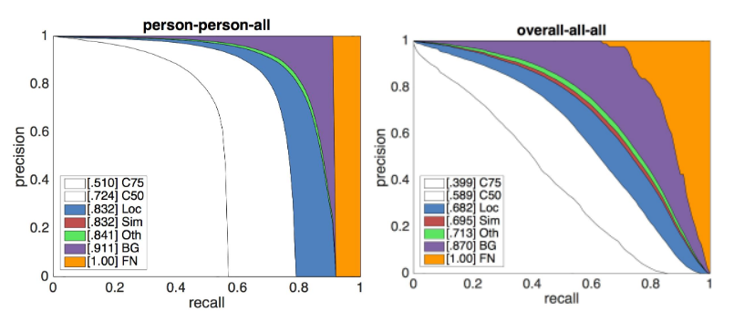
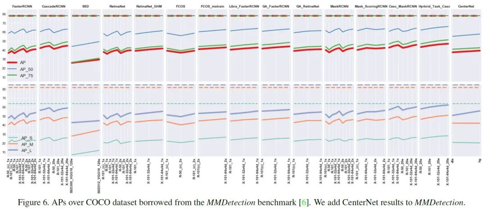
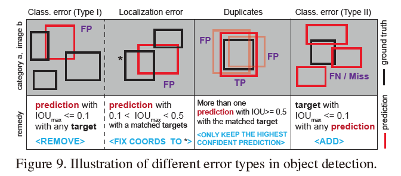
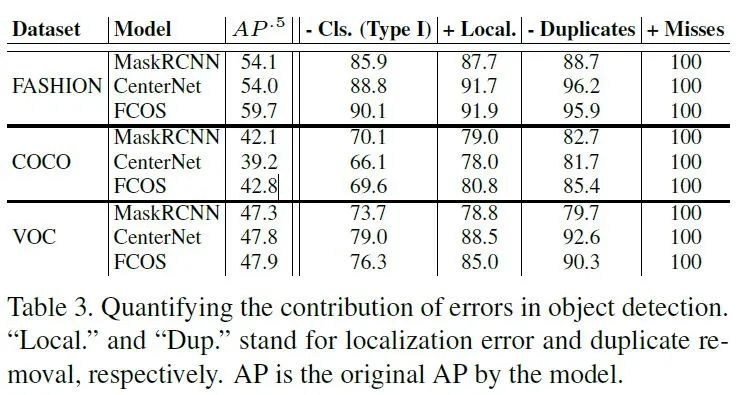
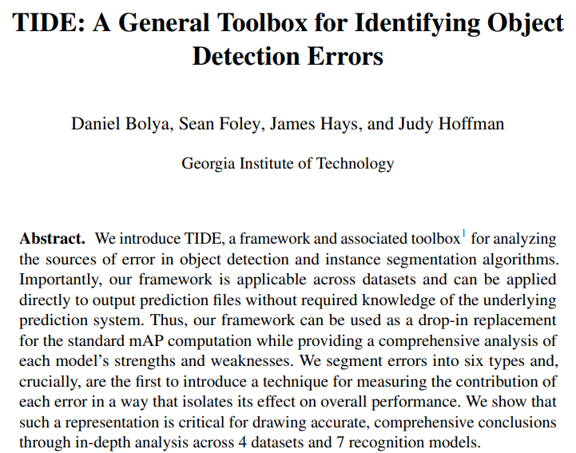
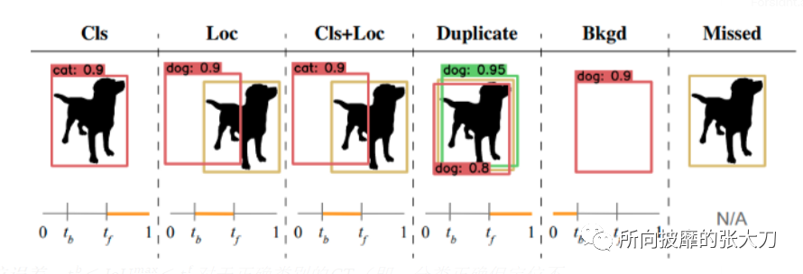
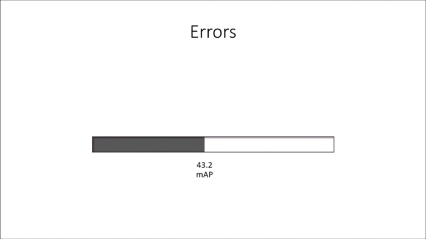
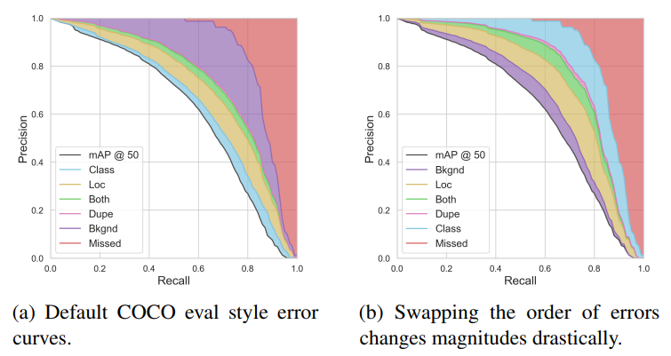
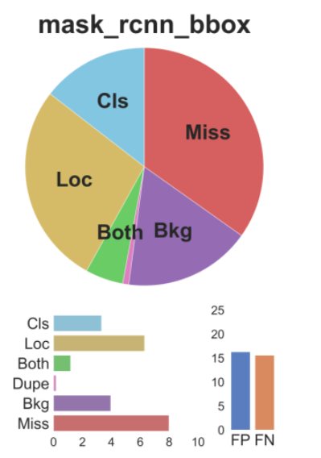

# 目标检测map精细化工具

map能大概评估目标检测模型的性能，在实际的检测过程中，还要对map庖丁解牛。然后在读TIDE模块时，意外发现几个其他几个优秀的工具，对于白嫖党的我，只想说：

## COCO Analysis Toolkit

COCO官网上不仅公布了计算map的python和matlab代码，在最后面加入了对误报和漏检的分析。以下是 Derek Hoiem等人对Resnet检测器的结果分析：



1. **C75**：PR at IoU=.75（AP at strict IoU），曲线下面积对应于 AP IoU=.75。
2. **C50**：PR at IoU=.50（AP at PASCAL IoU），曲线下面积对应于 AP IoU=.50。
3. **Loc**：IoU=.10 的 PR（忽略定位错误，但不重复检测）。所有剩余的设置都使用 IoU=.1。
4. **Sim** : 删除超类别误报 (fps) 后的 PR。具体来说，与具有不同类标签但属于同一超类别的对象的任何匹配都不算作 fp（或 tp）。通过将同一超类别中的所有对象设置为具有与所讨论的类别相同的类别标签并将其忽略标志设置为 1 来计算 Sim。请注意，人是单例超类别，因此其 Sim 结果与 Loc 相同。
5. **Oth**：在消除所有类混淆之后的 PR。与 Sim 类似，但现在如果检测与*任何*其他对象匹配，则它不再是 fp（或 tp）。Oth 是通过将所有其他对象设置为与所讨论的类具有相同的类标签并将它们的忽略标志设置为 1 来计算的。
6. **BG** : PR 在所有背景（和类混淆） fps 被删除后。对于单个类别，BG 是一个阶梯函数，在达到最大召回率之前为 1，然后下降到 0（跨类别平均后曲线更平滑）。
7. **FN**：移除所有剩余错误后的 PR（通常 AP=1）。

每条曲线下的面积显示在图例的括号中。在 ResNet 检测器下，IoU=.75 时的整体 AP 为 0.399，完美定位将 AP 增加到 0.682。而消除所有类别混淆（在超类别内和跨超类别）只会将 AP 略微提高到 0.713。删除背景 FP会将性能提升到 .870 AP，并且其余错误都缺少检测（尽管可能如果添加更多检测，这也会增加很多FP）。综上，ResNet 的错误主要是定位不完善和背景混淆。

Derek Hoiem有分析一堆的pdf结果。

## FiftyOne

**FiftyOne**，提供对象检测评估分析的可视化工具，不仅可以计算 AP，还可以轻松地 可视化单个样本和对象级别的结果， 查看精确召回曲线，并绘制**交互式混淆矩阵**等，一开始以为FiftyOne只用于目标检测中，看完官网后发现强大的不行，分类、目标检测、语义分割、关键点检测等预测结果均可以可视化，是一个优化模型的强大工具[2]。


## UAP

19年的一篇文章，本来作者大佬是在主流检测框架 mmdetection，detectron2上，基于多个数据集探讨多个检测器所能达到的性能上限，人为的消除定位问题，看分类达到的性能效果，再基于分类达到的性能极限去评估AP的上界。

评估完的结果可以参见原文，这里放一张图：



定义四种错误类型：



对于每种错误，**人为地消除**后观察其提升，没有了分类方面的错误后，性能提升最明显：



最后公布了他的**分析工具UAP**[5],在众佬都在刷map的时候，作者愿意分析统计各个算法的性能等，冲这个也要点赞一波。


## TIDE



ECCV2020的一篇文章，这里相对于Uap，将错误类型从4类增加到6类：



1. **分类错误**：IoUᵐᵃˣ ≥ tᶠ 对于错误类别的box（即，定位正确但分类错误）。

2. **定位误差**：tᵇ ≤ IoUᵐᵃˣ ≤ tᶠ 对于正确类别的box（即，分类正确但定位不正确）。

3. **Cls 和 Loc 错误**：tᵇ ≤ IoUᵐᵃˣ ≤ tᶠ 对于错误类别的box（即，分类错误和定位错误）。

4. **重复检测错误**：IoUᵐᵃˣ ≥ tᶠ 用于正确类别的box，但另一个更高得分的检测已经与该 GT 匹配（即，如果不是更高得分的检测，将是正确的）。

5. **背景误差**：IoUᵐᵃˣ ≤ tᵇ for all box（即，检测到的背景为前景）。

6. **Missed GT Error**：分类或定位错误尚未涵盖的所有未检测到的ground truth（假阴性）。

作者采用渐进式，将每一类错误的占比划分出来：



作者又从另外一个维度分析：



作者还从数据集和模型各个维度都有分析，感兴趣查看原论文。

TIDE提供了目标检测的分析工具通过：

*pip install tidecv* 

导入安装，输入正确结果和预测结果：

```
from tidecv import TIDE, datasets

tide = TIDE()
tide.evaluate(datasets.COCO(), datasets.COCOResult('path/to/your/results/file'), mode=TIDE.BOX) # Use TIDE.MASK for masks
tide.summarize()  # Summarize the results as tables in the console
tide.plot()       # Show a summary figure. Specify a folder and it'll output a png to that folder.
```

运行显示如下：

```
-- mask_rcnn_bbox --

bbox AP @ 50: 61.80

                         Main Errors
=============================================================
  Type      Cls      Loc     Both     Dupe      Bkg     Miss
-------------------------------------------------------------
   dAP     3.40     6.65     1.18     0.19     3.96     7.53
=============================================================

        Special Error
=============================
  Type   FalsePos   FalseNeg
-----------------------------
   dAP      16.28      15.57
============================
```

可视化结果：



## 总结

以上是在阅读论文时发现的几个关于目标检测模型评价精细化的工具，可以作为在目标检测模型优化时的思路，昨天试了下TIDE效果，对于自己项目中十几万的数据集，有种抽丝剥茧的清爽感扑面而来。

## 参考
1. [实战工具|目标检测评价map精细化系列工具](https://mp.weixin.qq.com/s/-5XmukT12TTD5JBG4tOOQQ)