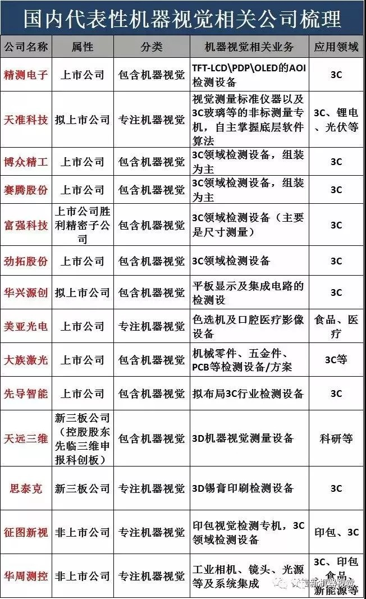
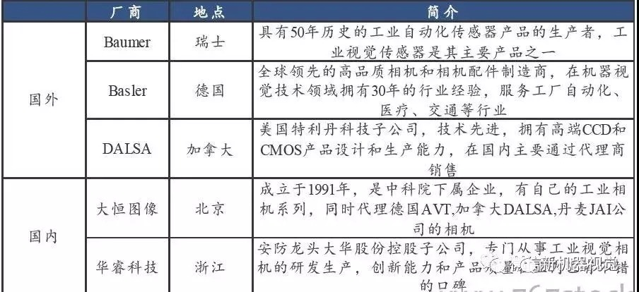
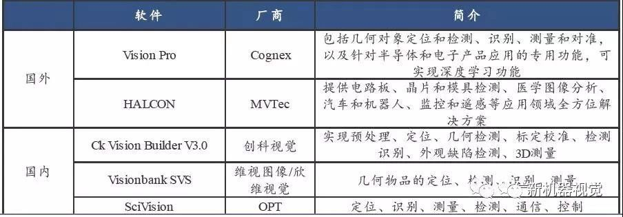
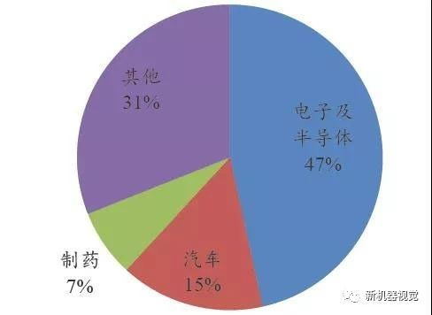
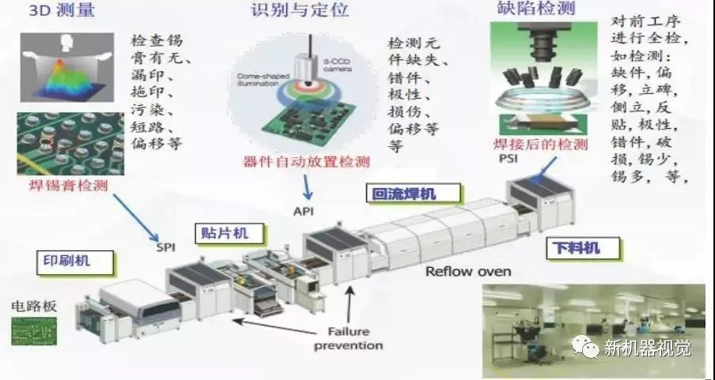
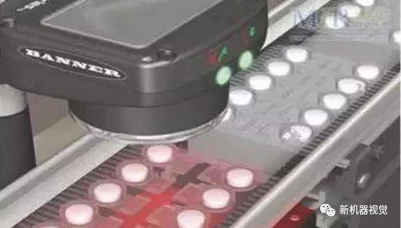
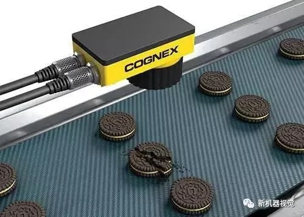

# 机器视觉产业链全解析

**机器视觉（Machine Vision）**指的是通过光学的装置和非接触的传感器自动的接收和处理真实物体的图像，以获得所需信息或控制机器人运动的装置，通俗的说就是应用在工业领域的视觉应用。

▲机器视觉产业链

## 机器视觉系统组成

另一个当下关注度非常高的概念**计算机视觉（Computer Vision）**主要强调的是让计算机具备对客观三维场景的感知、识别和理解（侧重对质的分析），例如无人驾驶、人脸识别等都可以归类为计算机视觉的范畴。

▲机器视觉系统组成

## 机器视觉的四大基本功能

目前，机器视觉的基础功能主要可以分为四大类：**模式识别/计数、视觉定位、尺****寸测量和外观检测**，当前的应用也基本是基于这四大类功能来展开。

▲机器视觉的四大基本功能

- 模式识别/计数主要指对已知规律的物品进行分辨，比较容易的包含外形、颜色、图案、数字、条码等的识别，也有信息量更大或更抽象的识别如人脸、指纹、虹膜识别等。
-  视觉定位主要指在识别出物体的基础上精确给出物体的坐标和角度信息。定位在机器视觉应用中是非常基础且核心的功能，一个软件的好坏大概率与其定位算法的好坏密切相关。
- 尺寸测量主要指把获取的图像像素信息标定成常用的度量衡单位，然后在图像中精确的计算出需要知道的几何尺寸。优势在于对高精度、高通量以及复杂形态的测量，例如有些高精度的产品由于人眼测量困难以前只能抽检，有了机器视觉后就可以实现全检了。
- 外观检测主要检测产品的外观缺陷，最常见的包括表面装配缺陷（如漏装、混料、错配等）、表面印刷缺陷（如多印、漏印、重印等）以及表面形状缺陷（如崩边、凸起、凹坑等）。由于产品外观缺陷一般情况下种类繁杂，所以检测在机器视觉中的应用中属于相对较难的一类。

从技术实现难度上来说，识别、定位、测量、检测的难度是递增的，而基于四大基础功能延伸出的多种细分功能在实现难度上也有差异，目前看3D视觉功能是当前机器视觉应用技术中最先进的方向之一。

## 国内机器视觉产业链梳理

简单的，我们可以把机器视觉产业链可以分为底层开发商（核心零部件和软件提供商）、集成和软件服务商（二次开发），核心零部件及软件又可以再细分为光源、镜头、工业相机、图像采集卡、图像处理软件等。在目前的整个机器视觉系统成本构成中，零部件及软件开发占据了80%的比例，是产业链中绝对的核心环节和价值获取者。

从技术壁垒来看: 1）软件是主要壁垒，底层算法库是核心。目前是外资企业垄断，做得好例如康耐视以及MVTec，主要是靠国外几十年的自动化进程培养起来的；国内自动化进程时间不长，软件算法还多处于研发阶段，应用做得好的不多; 2）应用层面的技术也非常关键，主要是要掌握不同应用环境的Know-How，做出适应性的产品。

目前来看，国内机器视觉行业的市场参与者主要有四种类型：国际综合自动化公司、国际专业机器视觉公司、国内专业机器视觉公司以及国内自动化设备公司。其中，在底层开发商层面还是国际企业占主导地位，国内公司更多是在附加值更低的二次开发层面布局(形式包括系统集成以及组装生产自动化专机)，并在此基础上逐渐向上游核心环节进行尝试。

## 机器视觉系统成本构成

### 1.光源

**光源是国产化最充分环节。**光源的好坏在于对比度、亮度和对位置变化的敏感程度，机器视觉行业主要采用LED 光源产品。目前没有通用的机器视觉照明设备，针对每个特定的应用实例有个性化的方案，以达到最佳效果 。目前光源行业国产化程度高，竞争比较激烈。

▲国内外光源参与企业

### 2.镜头

**低端镜头国内企业具备一定竞争力，高端镜头基本依赖进口。**镜头的基本功能是实现光束调制，将目标成像在图像传感器的光敏面上完成信号传递。工业镜头主要可以分为定焦镜头、定倍镜头、远心镜头、连续变倍镜头等，不同的镜头根据要求应用于不同的工业现场，价格差距也较大。

▲国内外镜头参与企业

### 3.工业相机

**工业相机以欧美进口为主，国产品牌从低端市场开始逐步进口替代。**工业相机是工业视觉系统的核心部件，其本质功能完成是将光信号转变成电信号的过程，要求更高的传输力、抗干扰力以及稳定的成像能力。

▲国内外工业相机参与企业

### 4.图像采集卡

**图像采集卡国内发展较为完善和成熟**，也称为视频抓取卡，这个部件通常是一张插在 PC 上的卡。这张采集卡的作用将摄像头与 PC 连接起来。它从摄像头中获得数据（模拟信号或数字信号），然后转换成PC 能处理的信息。

### 5. 图像处理软件

**图像处理软件基本被国外企业垄断，国内企业在二次开发中有所布局。**工业视觉软件则对数字信号进行各种运算来抽取目标的特征，进而根据判别的结果来控制现场的设备动作，自动完成对图像采集、显示、存储和处理。当前比较流行的开发模式是“软件平台+视觉开发包”，开发包是基于软件平台对常用各种图像处理算法进行了封装，软件工程师可以直接调用封装好的算法实现各种复杂的图像处理功能，降低二次开发难度和工作量。

▲国内外图像处理软件参与企业

### 6.系统集成

国内厂商在集成端发展迅速，尤其是在一些外资还没有布局的领域、或者非标自动化领域如3C 等。国内集成厂商单纯进行二次开发利润空间较小，在某一行业下游完成良好布局之后，会尝试逐步向上游底层开发延伸，进行核心软硬件的进口替代。

## 机器视觉下游应用

机器视觉广泛应用于电子及半导体、汽车制造、食品包装、制药等领域，**其中电子汽车和电子是当前机器视觉最重要的应用领域。**

### 1.下游应用领域——电子

根据前瞻研究院数据，电子行业贡献了机器视觉近50%左右的需求，主要用于晶圆切割、3C表面检测、触摸屏制造、AOI光学检测、PCB印刷电路、电子封装、丝网印刷、SMT表面贴装、SPI锡膏检测、半导体对位和识别等的高精度制造和质量检测。

以iPhone为例，其生产全过程就需70套以上系统。未来在全球智能手机、平板电脑和可穿戴设备等消费电子领域的需求有望爆发。

以3C行业为例，我们判断未来行业的机器视觉需求还会持续较快增长，主要需求来自几个方面：1）视觉技术进步（现在好多玻璃、屏的缺陷检测技术上还不能实现）推动适用领域拓宽；2）随着国内智能手机逐渐中高端化带来手机厂商利润率提升，视觉检测在国产手机产线中的应用有望推广开来。

▲机器视觉在SMT装配线上的典型应用

### 2.下游应用领域——汽车

根据前瞻研究院数据，汽车行业贡献了机器视觉15%左右的需求，主要用于车身装配检测、面板印刷质量检测、字符检测、零件尺寸的精密测量、工件表面缺陷检测、自由曲面检测、间隙检测等几乎所有系统和部件的制造流程。目前一条产线大概配备十几个机器视觉系统，未来随着汽车质量把控、汽车智能化、轻量化趋势对检测提出更高要求，对机器视觉技术的需求还会逐步提高。

例如，3D视觉系统可以以高精度测量间隙并对准每一辆车，并对装配的所有车门和车身进行全面检测。3D 视觉系统还能帮助底盘制造商使货架中车身板件的上架、下架和检测实现自动化，在自动设备拾取缺陷元件之前检测货架上是否存在缺陷元件，从而减少将缺陷元件焊接到一起。

▲机器视觉在车身检测领域的应用

### 3.下游应用领域——制药

根据前瞻研究院数据，制药行业贡献了机器视觉7%左右的需求，主要应用在药瓶封装缺陷检测、胶囊封装质量检测、药粒却是检测、生产日期打码检测、药片颜色识别及分拣等。目前大多数企业流水线上有1-2套机器视觉系统，而实际需求至少应该在5处，未来随着制药行业自动化升级改造提速，渗透率会持续提升。

例如，在药品包装后的检测环节中，可以利用机器视觉快速、准确地检测到对象是否完好无缺，通过设定图像传感器，获取包装后的对象图片信息，通过预先设定的面积参数对每个药粒或者药瓶进行检测对比，这样，破损的药粒或者缺瓶的包装都将被检测出来，正确的正常通过。

▲药粒泡罩检测示意图

▲缺瓶检测示意图

### 4.下游应用领域——食品

食品及包装也是机器视觉应用的重要下游领域，主要用于高速检测、外观封装检测、食品封装缺漏检测、外观和内部质量检测、分拣与色选等，单条产线用量在不同产品中差异较大。目前机器视觉在大型食品企业（如伊利、蒙牛）中应用较多，而在行业整体的渗透率并不高。

例如，欧洲鲜货市场广泛使用食品分拣器，一般采用多台摄像机捕获产品整个表面影像。当产品基本为圆形时，在漏洞内设有机构，让产品在摄像机下进行旋转。形状可以根据最大直径和最小直径、比例关系等进行分选。颜色一般根据已扫描的整个表面情况来决定。鉴定方法如简单百分比、强度值直方图、定义最大面积或最小面积等。

▲机器视觉在食品行业中的典型应用示意图

## 展望未来

展望未来，机器视觉行业主要有几个发展趋势：

1）更多更快的图像数据传输、更先进的软件算法带来实现数字化、实时化和智能化的性能提升；

2）硬件性能的提升（更高分辨率、更快扫描率等）和产品软件价格的下降推动机器视觉渗透率提升；

3）产品向着小型化、集成化发展。