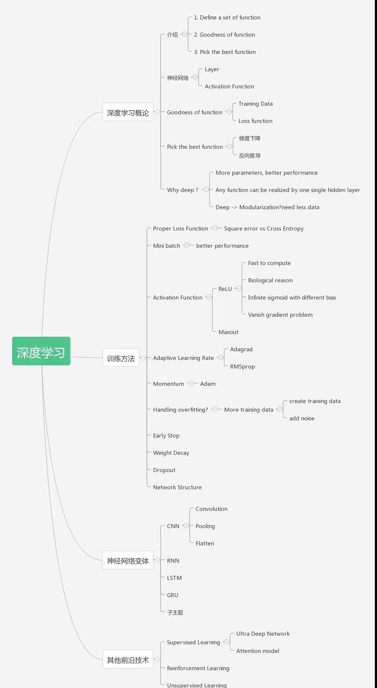

# 深度学习
> 深度学习: 用更深的网络模型去学习。

## 学习

1. [TensorFlow](https://tensorflow.google.cn/)
   1. [简单粗暴TensorFlow v1](https://v1.tf.wiki/zh/preface.html)
   2. [简单粗暴TensorFlow 2](https://tf.wiki/zh_hans/preface.html) [B站视频](https://www.bilibili.com/video/av89601743/?p=2&spm_id_from=pageDriver)
   3. [掘金 tensorflow教程](https://tensorflow.juejin.im/get_started/)
   4. [莫烦AI课程](https://mofanpy.com/)
2. [YOU CAN DETECT AND TRACK ANY OBJECT WITH COMPUTER VISION](https://pysource.com/)