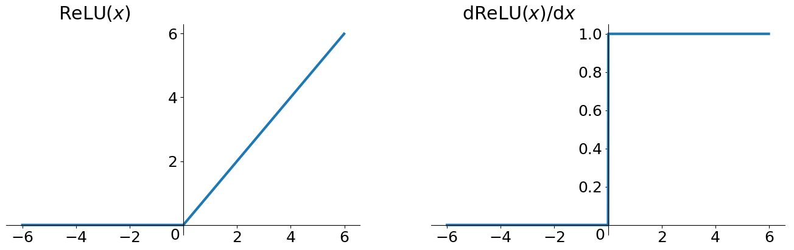
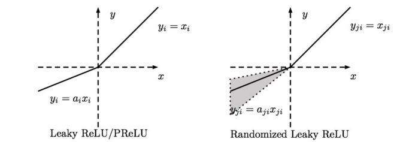
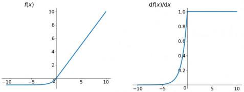

# 激活函数和优化器

深度学习的基本原理是基于人工神经网络，输入信号经过非线性的active function，传入到下一层神经元；再经过下一层神经元的activate，继续往下传递，如此循环往复，直到输出层。正是因为这些active functions的堆砌，深度学习才被赋予了解决非线性问题的能力。当然，仅仅靠active functions还不足于使得深度学习具有"超能力"，训练过程中的优化器对于组织神经网络中的各个神经元起到了至关重要的角色。本文简单汇总一些常用的active functions和optimizers，不求最全，但是尽量保证简单易懂。

## 激活函数

当然，在介绍这些active functions之前，先简单汇总下active functions应该具备的性质。

- 非线性
- 可微性：当优化方法是基于梯度的时候，这个性质是必须的。
- 单调性：当激活函数是单调的时候，单层网络能够保证是凸函数。
- f(x)≈xf(x)≈x：当激活函数满足这个性质的时候，如果参数的初始化是random的很小的值，那么神经网络的训练将会很高效；如果不满足这个性质，那么就需要很用心的去设置初始值。
- 输出值的范围：当激活函数输出值是有限的时候，基于梯度的优化方法会更加稳定，因为特征的表示受有限权值的影响更显著；当激活函数的输出是无限的时候，模型的训练会更加高效，不过在这种情况小，一般需要更小的learning rate.

### 1. sigmoid

sigmoid函数是深度学习中最基本，也是最为常见的一种激活函数。sigmoid函数公式如下：

sigmoid函数的导函数形式为：

函数曲线和导函数曲线分别如下图所示：

 sigmoid函数的优点在于函数平滑且易于求导，但是其缺点也比较突出，例如：

- 容易出现梯度弥散（具体可参考博文《[[Deep Learning\] 深度学习中消失的梯度](http://www.cnblogs.com/maybe2030/p/6336896.html)》）
- 输出不具有zero-centered性质
- 幂运算相对比较耗时

### 2. tanh

tanh读作hyperbolic tangent，相对于sigmoid函数的缺点，它具有zero-centered形式的输出，因此被认为tanh一般总是好于sigmoid，因为函数值介于[-1,1]之间，激活函数的平均值接近于0，这样可以使得下一层的神经元学习的更好。其公式表示如下：

f(x)=ex−e−xex+e−xf(x)=ex−e−xex+e−x

对应的导数形式为：g(x)=1−f(x)2g(x)=1−f(x)2

函数曲线和导函数曲线分别如下图所示：

 

实际上tanh是sigmoid平移后的结果。因为tanh总是优于sigmoid，所以sigmoid目前基本不用，但有一个例外的场景，那就是sigmoid更适合于做二分类系统的输出层。因为sigmoid的输出值介于[0,1]之间，可以很容易的去表征概率。

### 3. ReLU

tanh和sigmoid函数的共同缺点就是当输入*特别小或者特别大时，容易引起梯度弥散或梯度爆炸。而ReLU（Rectified Linear Units）可以在一定程度上缓解梯度弥散和梯度爆炸的问题，使得深度神经网络的训练可以更快速地达到收敛。因此目前神经网络中的隐含层中最为常用的默认激活函数就是ReLU了。其函数形式表示如下：*

f(x)=max(0,x)f(x)=max(0,x)

*函数和导函数曲线如下图所示：*

**

 

通过上图可以发现，ReLU在0点是不可导的，因此ReLU在应用的时候有个小trick，在实践的时候可以将0点的导数强制赋值为0或者1。

ReLU虽然简单，但却是深度学习激活函数方面几乎最为重要的成果，它有以下几大优点：

- 解决了梯度弥散的问题（输出均大于0）
- 计算速度非常快，只需要判断输入是否大于0（阈值计算）
- 收敛速度远快于sigmoid和tanh

但其实ReLU也不是万能的，它的缺点可以简单提两点：

- 输出不是zero-centered
- 具有dying ReLU problem

dying ReLU problem：由于ReLU特殊的函数形式，在训练过程中某些神经元可能永远不会被激活，导致相应的参数永远不能被更新，而且这个问题会随着训练的进行持续恶化。

导致dying ReLU problem的原因主要有两个：

- 初始化，这种概率比较小
- Learning rate太大

dying ReLU problem详细细节可以参考这里：《[What is the "dying ReLU" problem in neural networks?](https://www.quora.com/What-is-the-dying-ReLU-problem-in-neural-networks)》

即使ReLU存在上述问题，但是ReLU目前是应用最为广泛和实用的激活函数。

### 4. Leaky ReLU

Leaky ReLU就是针对dying ReLU problem而进行改进的，相对于ReLU而言，函数前半段不再为0，而是一段线性函数。用公式表达如下：

f(x)=αx,ifx<0f(x)=αx,ifx<0

f(x)=x,ifx≥0f(x)=x,ifx≥0

其中，参数αα一般为远小于1的实数，比如0.01。下图显示了Leaky ReLU的两种函数形式，一种αα为定值，另外一种αα为某范围内的随机值（也被称为Randomized Leaky ReLU）：

除了具备ReLU的所有优点以外，Leaky ReLU不存在dying ReLU problem。从理论上讲，Leaky ReLU应该完全优于ReLU的性能，但是实际应用中并没有表现可以证明Leaky ReLU绝对优于ReLU。

## 5. ELU

同Leaky ReLU一样，ELU（Exponential Linear Unit）也是针对dying ReLU problem提出的。具体公式如下：

f(x)=α(ex−1),ifx<0f(x)=α(ex−1),ifx<0

f(x)=x,ifx≥0f(x)=x,ifx≥0

具体函数曲线如下：

ELU也可以有效地解决dying ReLU problem，而且是近似zero-centered，但随之而来的缺点就是ELU不再是简单的阈值计算，计算相对ReLU稍加复杂。

激活函数汇总

下表汇总了常用的一些active functions：

## 参考

1. Adrew Ng 深度学习课程
2. [谷歌考察：深度学习的activation function哪家强](http://www.sohu.com/a/127679690_410611)
3. [仙道菜的博客](https://blog.csdn.net/cyh_24/article/details/50593400)
4. [Marcovaldong的博客](https://blog.csdn.net/majordong100/article/details/51428642)