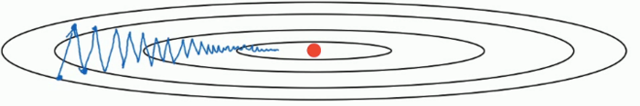
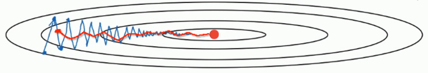

# 优化器

## 1. batch GD & SGD & Mini-batch GD

三种梯度下降算法可以参考之前博文《[[Machine Learning\] 梯度下降法的三种形式BGD、SGD以及MBGD](http://www.cnblogs.com/maybe2030/p/5089753.html)》

上述三种梯度下降的优化算法均存在如下问题：

- Learning rate如果选择的太小，收敛速度会很慢，如果太大，loss function就会在极小值处不停地震荡甚至偏离。
- 对所有参数更新时应用同样的Learning rate，如果我们的数据是稀疏的，我们更希望对出现频率低的特征进行大一点的更新。
- 对于非凸函数，还要避免陷于局部极小值或者鞍点处，因为鞍点周围的error 是一样的，所有维度的梯度都接近于0，纯梯度下降很容易被困在这里。

关于鞍点的解释：

　　鞍点：一个光滑函数的鞍点邻域的曲线，曲面，或超曲面，都位于这点的切线的不同边。 例如下图这个二维图形，像个马鞍：在x轴方向往上曲，在y轴方向往下曲，鞍点就是(0,0)。

目前对于优化器的研究基本围绕上述三个问题进行展开。

## 2. Momentum

SGD算法的更新公式如下：

W:=W−αdWW:=W−αdW

b:=b−αdbb:=b−αdb

我们可以示意化的画出SGD优化路线图如下：

Momentum的改进思想是针对SGD算法波动大、收敛速度慢问题，简单来说就是防止波动，取前几次波动的均值作为新的参数值。Momentum利用了梯度的指数加权平均数，引入了一个新的超参数ββ（一般取0.9），具体更新公式如下：

VdW=βVdW+(1−β)dWVdW=βVdW+(1−β)dW

Vdb=βVdb+(1−β)dbVdb=βVdb+(1−β)db

W:=W−αVdWW:=W−αVdW

b:=b−αVdbb:=b−αVdb

改进后的Momentum优化路线示意图如下：

Momentum背后的物理含义可以简单的这样理解：

当我们将一个小球从山上滚下来时，没有阻力的话，它的动量会越来越大，但是如果遇到了阻力，速度就会变小。 加入这一项，可以使得梯度方向不变的维度上速度变快，梯度方向有所改变的维度上的更新速度变慢，这样就可以加快收敛并减小震荡。

## 3. RMSprop

RMSprop是Geoff Hinton提出的一种自适应学习率方法，全称为Root Mean Square Prop，它的基本思想和Momentum类似，同样引入了额外的超参数ββ（一般取值0.999），其更新公式如下：

SdW=βSdW+(1−β)dW2SdW=βSdW+(1−β)dW2

Sdb=βSdb+(1−β)db2Sdb=βSdb+(1−β)db2

W:=W−αdWSdW−−−−√W:=W−αdWSdW

b:=b−αdbSdb−−−√b:=b−αdbSdb

针对上述更新公式，为了防止WW和bb更新过程中分母项为0，一般在应用中加上特别小的一个实数ϵϵ（一般取值为10−810−8）：

W:=W−αdWSdW+ϵ−−−−−−√W:=W−αdWSdW+ϵ

b:=b−αdbSdb+ϵ−−−−−−√b:=b−αdbSdb+ϵ

RMSprop示意图如下：

具体关于RMSprop更详细的讲解可以参考这篇博文《[机器学习中使用的神经网络第六讲笔记](https://blog.csdn.net/majordong100/article/details/51428642)》

## 4. Adam

研究者们其实提出了很多的优化算法，可以解决一些特定的优化问题，但是很难扩展到多种神经网络。而Momentum，RMSprop是很长时间来最经得住考研的优化算法，适合用于不同的深度学习结构。所以有人就有想法，何不将这俩的方法结合到一起呢？Adam算法，全称Adaptive Moment Estimation，就随即问世了。由于Adam是Momentum+RMSprop，所以需要引入两个超参数，我们表示为β1=0.9β1=0.9，β2=0.999β2=0.999。

VdW=β1VdW+(1−β1)dWVdW=β1VdW+(1−β1)dW

Vdb=β1Vdb+(1−β1)dbVdb=β1Vdb+(1−β1)db

SdW=β2SdW+(1−β2)dW2SdW=β2SdW+(1−β2)dW2

Sdb=β2Sdb+(1−β2)db2Sdb=β2Sdb+(1−β2)db2

VcorrecteddW=VdW1−βt1VdWcorrected=VdW1−β1t

Vcorrecteddb=Vdb1−βt2Vdbcorrected=Vdb1−β2t

ScorrecteddW=SdW1−βt1SdWcorrected=SdW1−β1t

Scorrecteddb=Sdb1−βt2Sdbcorrected=Sdb1−β2t

W:=W−αVdWScorrecteddW−−−−−−−√W:=W−αVdWSdWcorrected

b:=b−αVdbScorrecteddb−−−−−−−√b:=b−αVdbSdbcorrected

因为Adam结合上述两种优化算法的优点于一身，所以现在经常用的是Adam优化算法。

5. 各Optimizers优化效果
除了上述三种常用的改进算法，还有例如Adagrad等Optimizer，这里就不一一介绍了，感兴趣的可以去了解下各算法改进的motivation。

下面两个图分别展示了几种算法在鞍点和等高线上的表现：

# 参考

1. Adrew Ng 深度学习课程
2. [关于深度学习优化器optimizer的选择，你需要了解这些](https://www.leiphone.com/news/201706/e0PuNeEzaXWsMPZX.html)