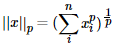
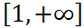
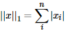
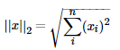
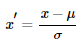
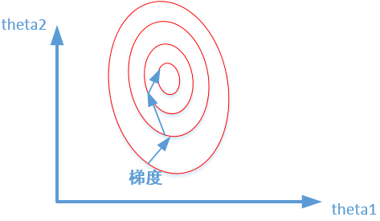

# 正则化

- LP范数
- L1范数
- L2范数
- L1范数和L2范数的区别
- Dropout
- Batch Normalization
- 归一化、标准化 & 正则化
- Reference

在总结正则化（Regularization）之前，我们先谈一谈正则化是什么，为什么要正则化。

正则化这个字眼有点太过抽象和宽泛，其实正则化的本质很简单，就是对某一问题加以先验的限制或约束以达到某种特定目的的一种手段或操作。在算法中使用正则化的目的是防止模型出现过拟合。一提到正则化，很多同学可能马上会想到常用的L1范数和L2范数，在汇总之前，我们先看下LP范数是什么鬼。

### LP范数

范数简单可以理解为用来表征向量空间中的距离，而距离的定义很抽象，只要满足非负、自反、三角不等式就可以称之为距离。

LP范数不是一个范数，而是一组范数，其定义如下：

p的范围是。p在(0,1)范围内定义的并不是范数，因为违反了三角不等式。

根据p的变化，范数也有着不同的变化，借用一个经典的有关P范数的变化图如下：

上图表示了p从0到正无穷变化时，单位球（unit ball）的变化情况。在P范数下定义的单位球都是凸集，但是当0<p<1时，该定义下的单位球不是凸集（这个我们之前提过，当0<p<1时并不是范数）。

那问题来了，L0范数是啥玩意？

L0范数表示向量中非零元素的个数，用公式表示如下：

我们可以通过最小化L0范数，来寻找最少最优的稀疏特征项。但不幸的是，L0范数的最优化问题是一个NP hard问题（L0范数同样是非凸的）。因此，在实际应用中我们经常对L0进行凸松弛，理论上有证明，L1范数是L0范数的最优凸近似，因此通常使用L1范数来代替直接优化L0范数。

### L1范数

根据LP范数的定义我们可以很轻松的得到L1范数的数学形式：

通过上式可以看到，L1范数就是向量各元素的绝对值之和，也被称为是"稀疏规则算子"（Lasso regularization）。那么问题来了，为什么我们希望稀疏化？稀疏化有很多好处，最直接的两个：

- 特征选择
- 可解释性

### L2范数

L2范数是最熟悉的，它就是欧几里得距离，公式如下：

L2范数有很多名称，有人把它的回归叫“岭回归”（Ridge Regression），也有人叫它“权值衰减”（Weight Decay）。以L2范数作为正则项可以得到稠密解，即每个特征对应的参数w都很小，接近于0但是不为0；此外，L2范数作为正则化项，可以防止模型为了迎合训练集而过于复杂造成过拟合的情况，从而提高模型的泛化能力。

### L1范数和L2范数的区别

引入PRML一个经典的图来说明下L1和L2范数的区别，如下图所示：

 

如上图所示，蓝色的圆圈表示问题可能的解范围，橘色的表示正则项可能的解范围。而整个目标函数（原问题+正则项）有解当且仅当两个解范围相切。从上图可以很容易地看出，由于L2范数解范围是圆，所以相切的点有很大可能不在坐标轴上，而由于L1范数是菱形（顶点是凸出来的），其相切的点更可能在坐标轴上，而坐标轴上的点有一个特点，其只有一个坐标分量不为零，其他坐标分量为零，即是稀疏的。所以有如下结论，L1范数可以导致稀疏解，L2范数导致稠密解。

从贝叶斯先验的角度看，当训练一个模型时，仅依靠当前的训练数据集是不够的，为了实现更好的泛化能力，往往需要加入先验项，而加入正则项相当于加入了一种先验。

- L1范数相当于加入了一个Laplacean先验；

- L2范数相当于加入了一个Gaussian先验。

  

  

更详细的L1范数和L2范数区别，请点击[《比较详细的L1和L2正则化解释》](https://mp.weixin.qq.com/s?__biz=MzU0MDQ1NjAzNg==&mid=2247484454&idx=1&sn=b3404eefaa68a78b770adb092d2fb48f&chksm=fb39a12dcc4e283b132138583ecd9848aa175b4cffd4036be07a2e132cb616e18ce8fe8c9adb&token=1308490709&lang=zh_CN&scene=21#wechat_redirect)。

如下图所示：

### Dropout

Dropout是深度学习中经常采用的一种正则化方法。它的做法可以简单的理解为在DNNs训练的过程中以概率p丢弃部分神经元，即使得被丢弃的神经元输出为0。Dropout可以实例化的表示为下图：

我们可以从两个方面去直观地理解Dropout的正则化效果：

- 在Dropout每一轮训练过程中随机丢失神经元的操作相当于多个DNNs进行取平均，因此用于预测具有vote的效果。
- 减少神经元之间复杂的共适应性。当隐藏层神经元被随机删除之后，使得全连接网络具有了一定的稀疏化，从而有效地减轻了不同特征的协同效应。也就是说，有些特征可能会依赖于固定关系的隐含节点的共同作用，而通过Dropout的话，就有效地组织了某些特征在其他特征存在下才有效果的情况，增加了神经网络的鲁棒性。

### Batch Normalization

批规范化（Batch Normalization）严格意义上讲属于归一化手段，主要用于加速网络的收敛，但也具有一定程度的正则化效果。

这里借鉴下魏秀参博士的知乎回答中对covariate shift的解释。

注以下内容引自魏秀参博士的知乎回答：

大家都知道在统计机器学习中的一个经典假设是“源空间（source domain）和目标空间（target domain）的数据分布（distribution）是一致的”。如果不一致，那么就出现了新的机器学习问题，如transfer learning/domain adaptation等。而covariate shift就是分布不一致假设之下的一个分支问题，它是指源空间和目标空间的条件概率是一致的，但是其边缘概率不同。大家细想便会发现，的确，对于神经网络的各层输出，由于它们经过了层内操作作用，其分布显然与各层对应的输入信号分布不同，而且差异会随着网络深度增大而增大，可是它们所能“指示”的样本标记（label）仍然是不变的，这便符合了covariate shift的定义。

BN的基本思想其实相当直观，因为神经网络在做非线性变换前的激活输入值（X = WU + B，U是输入），随着网络深度加深，其分布逐渐发生偏移或者变动（即上述的covariate shift）。之所以训练收敛慢，一般是整体分布逐渐往非线性函数的取值区间的上下限两端靠近（对于Sigmoid函数来说，意味着激活输入值（X = WU + B）是大的负值和正值。所以这导致后向传播时低层神经网络的梯度消失，这是训练深层神经网络收敛越来越慢的本质原因。而 BN 就是通过一定的规范化手段，把每层神经网络任意神经元这个输入值的分布强行拉回到均值为0方差为1的标准正态分布，避免因为激活函数导致的梯度弥散问题。所以与其说BN的作用是缓解covariate shift，倒不如说BN可缓解梯度弥散问题。

### 归一化、标准化 & 正则化

正则化我们以及提到过了，这里简单提一下归一化和标准化。

归一化（Normalization）：归一化的目标是找到某种映射关系，将原数据映射到[a,b]区间上。一般a，b会取[-1,1]，[0,1]这些组合 。

一般有两种应用场景：

- 把数变为(0, 1)之间的小数
- 把有量纲的数转化为无量纲的数

常用min-max normalization：

标准化（Standardization）：用大数定理将数据转化为一个标准正态分布，标准化公式为：

**归一化和标准化的区别：**

我们可以这样简单地解释：

归一化的缩放是“拍扁”统一到区间（仅由极值决定），而标准化的缩放是更加“弹性”和“动态”的，和整体样本的分布有很大的关系。

值得注意：

归一化：缩放仅仅跟最大、最小值的差别有关。

标准化：缩放和每个点都有关系，通过方差（variance）体现出来。与归一化对比，标准化中所有数据点都有贡献（通过均值和标准差造成影响）。

**为什么要标准化和归一化？**

- 提升模型精度：归一化后，不同维度之间的特征在数值上有一定比较性，可以大大提高分类器的准确性。
- 加速模型收敛：标准化后，最优解的寻优过程明显会变得平缓，更容易正确的收敛到最优解。如下图所示：

### 参考

1. Andrew Ng深度学习教程

2. [Must Know Tips/Tricks in Deep Neural Networks (by Xiu-Shen Wei)](http://lamda.nju.edu.cn/weixs/project/CNNTricks/CNNTricks.html)
3. [Poll的笔记:正则化]( https://www.cnblogs.com/maybe2030/p/9231231.html) 