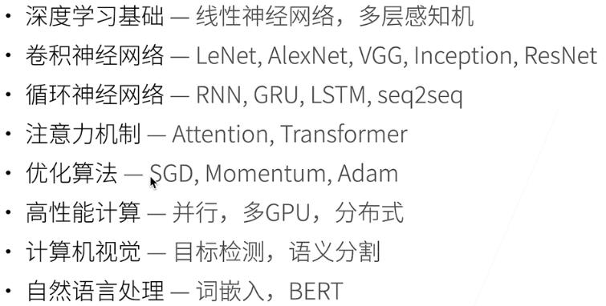

# 跟李沐深度学习



## 安装环境

### EN

```
conda create --name d2l python=3.8 -y
conda activate d2l
```


### ZH

初始化python环境

```
conda create -n d2l-zh -y python=3.8 pip
conda activate d2l-zh
#conda deactivate
```

安装需要的包

```
pip install jupyter d2l torch torchvision
```

下载代码并运行

```
curl https://zh-v2.d2l.ai/d2l-zh-2.0.0.zip -o d2l-zh.zip
unzip d2l-zh.zip && rm d2l-zh.zip
cd pytorch
jupyter notebook
```


## 从零初始化环境

以Ubuntu18.04为例

```
sudo apt update
sudo apt install build-essential #装GCC之类的的开发依赖
sudo apt install python3.8
wget https://repo.anaconda.com/miniconda/Miniconda3-py38_4.11.0-Linux-x86_64.sh
bash Miniconda3-py38_4.11.0-Linux-x86_64.sh
bash
```

端口映射

```
ssh -L8888:100.22.22.3:8888 ubuntu@100.22.22.3
```

> 把本地8888端和远端8888端口映射起来

## 检查显卡

在run窗口中打开DirectX诊断程序
```
dxdiag
```


## 参考

1. https://zh.d2l.ai/