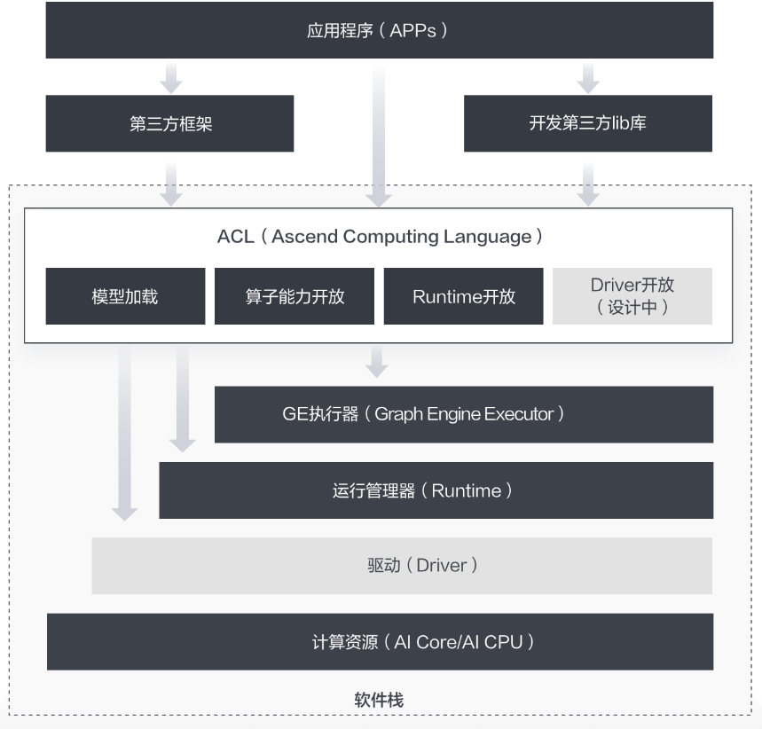
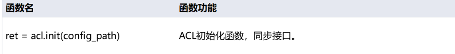
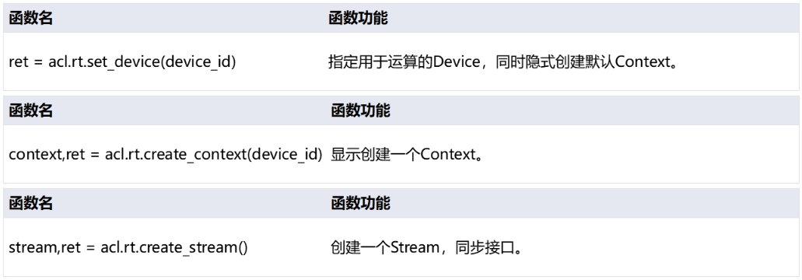
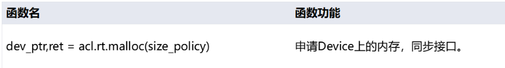
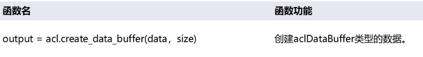
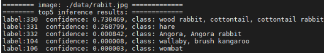
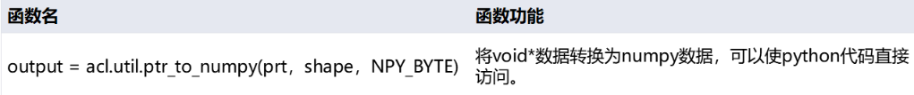

# ACL应用案例(python版)


# 1. 课程目标
学完本课程，您应该能够：

1.了解ACL的基本概念，清楚ACL具备哪些能力，能为我们做什么

2.了解ACL定义的编程模型，理解各类运行资源的概念及其相互关系

3.能够区分Host和Device的概念，并学会管理这两者各自的内存

4.加载一个离线模型进行推理，并为推理准备输入输出数据结构


## 为了达成上述目标，您应该具备如下知识：

1.熟练的Python语言编程能力

2.深度学习基础知识，理解神经网络模型输入输出数据结构

# 2. 基础知识
## 2.1 ATC介绍
ATC（Ascend Tensor Compiler）是华为昇腾软件栈提供的一个编译工具，它的主要功能是将基于开源框架的网络模型（如Caffe、TensorFlow等）以及单算子Json文件，转换成昇腾AI处理器支持的离线模型Offline-Model文件（简称OM文件）。在编译过程中，可以实现算子调度的优化、权值数据重排、内存使用优化等，并且可以脱离设备完成模型的预处理。更详细的ATC介绍，可参看<a href="https://support.huaweicloud.com/atctool-cann502alpha5infer/atlasatc_16_0001.html" target="_self">官方文档</a> 。

ATC工具架构图


## 2.2 ACL介绍
对已训练好的权重文件，比如caffe框架下的caffemodel, tensorflow框架下得到的checkpoint或者pb文件，再经过ATC工具转换后得到的离线模型文件，ACL（Ascend Computing Language，昇腾计算语言）提供了一套用于在昇腾系列处理器上进行加速计算的API。基于这套API，您能够管理和使用昇腾软硬件计算资源，并进行机器学习相关计算。更详细的ACL介绍，可参看<a href="https://support.huaweicloud.com/aclpythondevg-cann502alpha5infer/atlaspython_01_0001.html" target="_self">官方文档</a> 。

当前ACL为您提供了C/C++和Python编程接口，能够很方便的帮助您达成包括但不限于如下这些目标：

1.加载深度学习模型进行推理

2.加载单算子进行计算

3.图像、视频数据的预处理



# 3. 准备工作
本实验的最终结果是使用Resnet50对3张图片进行分类推理。为了达成这个结果，首先我们准备了如下两个素材：

+ 三张待推理分类的图片数据，如：


+ 使用ATC工具，将tensorflow的googlenet.pb模型转换成昇腾支持的om(offine-model)文件。

#### 推理后我们将打印每张图片置信度排前5位的标签及其置信度。

# 4. 开启征途
## 4.1 初始化
在开始调用ACL的任何接口之前，首先要做ACL的初始化。初始化的代码很简单，只有一行：

`acl.init(config_path)`

这个接口调用会帮您准备好ACL的运行时环境。其中调用时传入的参数是一个配置文件在磁盘上的路径，这里我们暂时不必关注。

有初始化就有去初始化，在确定完成了ACL的所有调用之后，或者进程退出之前，要做去初始化操作，接口调用也十分简单：

`acl.finalize()`


### 导入Python包：


```python
import argparse
import numpy as np
import struct
import acl
import os
from PIL import Image
```

### 接口介绍：


### 函数示例：


```python
def init():
    ret = acl.init()
    check_ret("acl.init", ret)
```

## 4.2申请计算资源
想要使用昇腾处理器提供的加速计算能力，需要对运行管理资源申请，包括Device、Context、Stream。且需要按顺序申请，主要涉及以下三个接口：

`acl.rt.set_device(device_id)`

这个接口指定计算设备，告诉运行时环境我们想要用哪个设备，或者更具体一点，哪个芯片。但是要注意，芯片和我们在这里传入的编号之间并没有物理上的一一对应关系。

`acl.rt.create_context(device_id)`

Context作为一个容器，管理了所有对象（包括Stream、Event、设备内存等）的生命周期。不同Context的Stream、不同Context的Event是完全隔离的，无法建立同步等待关系。

`acl.rt.create_stream()`

Stream用于维护一些异步操作的执行顺序，确保按照应用程序中的代码调用顺序在Device上执行。基于Stream的kernel执行和数据传输能够实现Host运算操作、Host与Device间的数据传输、Device内的运算并行。

### 接口介绍：


### 函数示例：


```python
import sys
import os
from IPython.core.interactiveshell import InteractiveShell
InteractiveShell.ast_node_interactivity = "all" 

home_path = !echo ${HOME}
sys.path.append(os.path.join(home_path[0] , "jupyter-notebook/"))
print('System init success.')

# atlas_utils是本团队基于pyACL封装好的一套工具库，如果您也想引用的话，请首先将
# https://gitee.com/ascend/samples/tree/master/python/common/atlas_utils
# 这个路径下的代码引入您的工程中
from atlas_utils.acl_resource import AclResource
from constants import *

#创建一个AclResource类的实例
acl_resource = AclResource()
#AscendCL资源初始化（封装版本）
acl_resource.init()

# 上方“init”方法具体实现（仅供参考）
# 请阅读“init(self)”方法，观察初始化和运行时资源申请的详细操作步骤
def init(self):
    """
    Init resource
    """
    print("init resource stage:")
    ret = acl.init()
    utils.check_ret("acl.init", ret)
    #指定用于运算的Device
    ret = acl.rt.set_device(self.device_id)
    utils.check_ret("acl.rt.set_device", ret)
    print("Set device n success.")

    #显式创建一个Context
    self.context, ret = acl.rt.create_context(self.device_id)
    utils.check_ret("acl.rt.create_context", ret)

    #创建一个Stream
    self.stream, ret = acl.rt.create_stream()
    utils.check_ret("acl.rt.create_stream", ret)

    #获取当前昇腾AI软件栈的运行模式
    #0：ACL_DEVICE，表示运行在Device的Control CPU上或开发者版上
    #1：ACL_HOST，表示运行在Host CPU上
    self.run_mode, ret = acl.rt.get_run_mode()
    utils.check_ret("acl.rt.get_run_mode", ret)

    print("Init resource success")

```

## 4.3 加载模型
既然要调用模型进行推理，首先当然是要把模型加载进来。ACL提供了多种模型加载和内存管理方式，这里我们只选取其中相对简单的一种，即从磁盘上加载离线模型，并且加载后的模型内存由ACL自动管理:

`model_path = "./model/resnet50.om";  #模型文件在磁盘上的路径
 model_id, ret = acl.mdl.load_from_file(model_path)  #加载模型
`

其中，model_id是系统完成模型加载后生成的模型ID对应的指针对象 加载后生成的modelId，全局唯一

记得这个“model_id”，后边我们使用模型进行推理，以及卸载模型的时候还要用到。

有加载自然就有卸载，模型卸载的接口比较简单：

`acl.mdl.unload(model_id)`

至此，您脑海中应该有这样一个概念，即使用了任何的资源，加载了任何的素材，都要记得用完后销毁和卸载。

### 接口介绍：


### 函数示例：


```python
def load_model(model_path):
    model_path = "./model/googlenet_yuv.om"
    model_id, ret = acl.mdl.load_from_file(model_path)
    check_ret("acl.mdl.load_from_file", ret)
    return model_id
```

## 4.4 获取模型信息
模型描述需要特殊的数据类型，使用以下函数来创建并获取该数据类型。

acl.mdl.create_desc()

acl.mdl.get_desc(model_desc, model_id)

获取到模型类型后，还需要根据该类型来获取模型的输入输出个数，调用函数如下：

acl.mdl.get_num_inputs(model_desc)

acl.mdl.get_num_outputs(model_desc)

### 接口介绍：


### 函数示例：


```python
def get_model_data(model_id):
    global model_desc
    model_desc = acl.mdl.create_desc()
    ret = acl.mdl.get_desc(model_desc, model_id)
    check_ret("acl.mdl.get_desc", ret)

    input_size = acl.mdl.get_num_inputs(model_desc)
    output_size = acl.mdl.get_num_outputs(model_desc)
    return input_size, output_size
```

## 4.5 申请device内存
要使用NPU进行加速计算，首先要申请能够被NPU直接访问到的专用内存。在讲解内存申请之前，首先我们要区分如下两个概念：

Host：Host指与Device相连接的X86服务器、ARM服务器，会利用Device提供的NN（Neural-Network ）计算能力，完成业务。
Device：Device指安装了芯片的硬件设备，利用PCIe接口与Host侧连接，为Host提供NN计算能力。

简而言之，我们的数据需要先从Host侧进行加载，即读进Host侧内存，随后将其拷贝到Device侧内存，才能进行计算。计算后的结果还要传回Host侧才能进行使用。

申请Device侧内存：

`dev_ptr, ret = acl.rt.malloc(size, policy)   #申请device侧内存`

dev_ptr;  //device侧内存指针

size;   //device侧内存大小

这里我们分配了跟Host侧同样大小的内存，准备用于在Device侧存放推理数据。本接口最后一个参数policy是内存分配规则。

ACL_MEM_MALLOC_HUGE_FIRST ----- 优先申请大页内存，如果大页内存不够，则使用普通页的内存。

ACL_MEM_MALLOC_HUGE_ONLY ----- 仅申请大页，如果大页内存不够，则返回错误。

ACL_MEM_MALLOC_NORMAL_ONLY ----- 仅申请普通页。

**使用完别忘了释放申请过的内存：
acl.rt.malloc-> acl.rt.free**

### 接口介绍：


### 函数示例：


```python
def gen_data_buffer(size, des):
    global model_desc
    func = buffer_method[des]
    for i in range(size):
        temp_buffer_size  = acl.mdl.get_output_size_by_index(model_desc, i)
        temp_buffer, ret = acl.rt.malloc(temp_buffer_size,
                                         const.ACL_MEM_MALLOC_NORMAL_ONLY)
        check_ret("acl.rt.malloc", ret)
        if des == "in":
            input_data.append({"buffer": temp_buffer,
                                    "size": temp_buffer_size})
        elif des == "out":
            output_data.append({"buffer": temp_buffer,
                                     "size": temp_buffer_size})

def malloc_device(input_num, output_num):
    gen_data_buffer(input_num, des="in")
    gen_data_buffer(output_num, des="out")
```

## 4.6图片处理(DVPP)
数字视觉预处理模块(DVPP)作为昇腾AI软件栈中的编解码和图像转换模块，为神经网络发挥着预处理辅助功能。当来自系统内存和网络的视频或图像数据进入昇腾AI处理器的计算资源中运算之前，由于Davinci架构对输入数据有固定的格式要求，如果数据未满足架构规定的输入格式、分辨率等要求，就需要调用数字视觉处理模块进行格式的转换，才可以进行后续的神经网络计算步骤。

##### DVPP相关接口介绍：

读取、初始化图片：`AclImage(image_file)`

图片预处理：`yuv_image=jpegd(image)`

将输入图片缩放为输出尺寸：`resized_image = _dvpp.resize(yuv_image, MODEL_WIDTH, MODEL_HEIGHT)`


```python
def image_process_dvpp():
    global run_mode
    global images_list
    
    stream, ret = acl.rt.create_stream()
    check_ret("acl.rt.create_stream", ret)

    run_mode, ret = acl.rt.get_run_mode()
    check_ret("acl.rt.get_run_mode", ret)

    _dvpp = Dvpp(stream, run_mode)
    _dvpp.init_resource()
    IMG_EXT = ['.jpg', '.JPG', '.png', '.PNG', '.bmp', '.BMP', '.jpeg', '.JPEG']
    images_list = [os.path.join("./data", img)
                    for img in os.listdir("./data")
                    if os.path.splitext(img)[1] in IMG_EXT]
    img_list = []
    for image_file in images_list:
        image = AclImage(image_file)
        image_input = image.copy_to_dvpp()
        yuv_image = _dvpp.jpegd(image_input)
        resized_image = dvpp.resize(yuv_image, 
                        MODEL_WIDTH, MODEL_HEIGHT)
        img_list.append(resized_image)
        print("dvpp_process image: {} success".format(image_file))
    return img_list
```

## 4.7 数据传输

### 4.7.1  host传输数据至device
把数据从Host侧拷贝至Device侧：

`acl.rt.memcpy(dst, dest_max, src, count, direction)`

参数的顺序是：目的内存地址，目的内存最大大小，源内存地址，拷贝长度，拷贝方向。

direction拷贝方向当前支持四种:

ACL_MEMCPY_HOST_TO_HOST ----- host->host

ACL_MEMCPY_HOST_TO_DEVICE ----- host->device

ACL_MEMCPY_DEVICE_TO_HOST ----- device->host

ACL_MEMCPY_DEVICE_TO_DEVICE ----- device->device


**该步骤已在DVPP接口内自动完成。**

### 接口介绍：


### 函数示例：


```python
def _data_interaction_in(dataset):
    global input_data
    temp_data_buffer = input_data
    for i in range(len(temp_data_buffer)):
        item = temp_data_buffer[i]
        ptr = acl.util.numpy_to_ptr(dataset)
        ret = acl.rt.memcpy(item["buffer"],
                            item["size"],
                            ptr,
                            item["size"],
                            ACL_MEMCPY_HOST_TO_DEVICE)
        check_ret("acl.rt.memcpy", ret)
```

### 4.7.2 准备推理所需数据结构
模型推理所需的输入输出数据，是通过一种特定的数据结构来组织的，这种数据结构叫“dataSet”，即所有的输入，组成了1个dateset，所有的输出组成了一个dataset。而对于很多模型来讲，输入其实不止一个，那么所有的输入集合叫“dataSet”，其中的每一个输入叫什么呢？
答案是“dataBuffer”。
即一个模型的多个输入，每个输入是一个“dataBuffer”，所有的dataBuffer构成了一个“dataSet”。

下面我们从构建dataBuffer开始。
dataBuffer的创建很简单，还记得前边我们申请了Device侧的内存，并且把数据传过去了吗？现在要用到了。
我们当时的device侧内存地址：data
这段内存的长度：size
使用上边两个对象来创建一个dataBuffer:

`acl.create_data_buffer(data, size)`

现在，这个“buffer”就是我们的第一个输入了。

### 接口介绍：


### 函数示例：


```python
def create_buffer(dataset, type="in"):
    global input_data, output_data
    if type == "in":    
        temp_dataset = input_data
    else:
        temp_dataset = output_data
    for i in range(len(temp_dataset)):
        item = temp_dataset[i]
        data = acl.create_data_buffer(item["buffer"], item["size"])
        if data is None:
            ret = acl.destroy_data_buffer(dataset)
            check_ret("acl.destroy_data_buffer", ret)
        _, ret = acl.mdl.add_dataset_buffer(dataset, data)
        if ret != ACL_ERROR_NONE:
            ret = acl.destroy_data_buffer(dataset)
            check_ret("acl.destroy_data_buffer", ret)
```

针对本实验所用到的resnet50模型，我们只需要一个输入即可，那现在有了dataBuffer，要如何构建dataSet呢？
很简单：

`acl.mdl.create_dataset()`

dataset有了，下面就是向这个dataset中放置DataBuffer了：

`acl.mdl.add_dataset_buffer(dataset, data)`

这样，我们在dataset中添加了一个databuffer，输入准备好了。

创建输出数据结构同理，当您拿到一个模型，您应该是清楚这个模型的输出数据结构的，根据其输出个数、每个输出占用内存的大小来申请相应的device内存、dataBuffer以及dataSet即可。
现在假设我们已经创建好了输出的dataset，其变量名称叫做：
outputDataSet

至此，我们准备好了推理所需的所有素材。
当然，将来用完之后别忘了销毁：

acl.create_data_buffer-> acl.destory_data_buffer;     acl.mdl.create_dataset-> acl.mdl.destroy_dataset

### 接口介绍：


### 函数示例：


```python
def _gen_dataset(type="in"):
    global load_input_dataset, load_output_dataset
    dataset = acl.mdl.create_dataset()
    if type == "in":    
        load_input_dataset = dataset
    else:
        load_output_dataset = dataset
    create_buffer(dataset, type)
```

## 4.8 推理
所有素材准备好之后，模型推理已经是顺理成章的事情了，还记得我们的几个关键素材吗？

model_id

load_input_dataset

load_output_dataset

最终的推理，其实只需要一行代码：

`ret = acl.mdl.execute(model_id, input, output)`

这是个同步接口，线程会阻塞在这里直到推理结束。推理结束后就可以提取load_output_dataset中的数据进行使用了。

### 接口介绍：


### 函数示例：


```python
def inference(model_id, _input, _output):
    global load_input_dataset, load_output_dataset
    ret = acl.mdl.execute(model_id,
                    load_input_dataset,
                    load_output_dataset)
    check_ret("acl.mdl.execute", ret)

```

## 4.9 后处理

### 4.9.1释放资源
资源有申请就要有释放，调用以下接口释放之前申请的dataset和databuffer：

`ret = acl.mdl.destroy_dataset(dataset)`

`ret = acl.destory_data_buffer(data_buffer)`

### 接口介绍：


### 函数示例：


```python
def _destroy_data_set_buffer():
    global load_input_dataset, load_output_dataset
    for dataset in [load_input_dataset, load_output_dataset]:
        if not dataset:
            continue
        num = acl.mdl.get_dataset_num_buffers(dataset)
        for i in range(num):
            data_buf = acl.mdl.get_dataset_buffer(dataset, i)
            if data_buf:
                ret = acl.destroy_data_buffer(data_buf)
                check_ret("acl.destroy_data_buffer", ret)
        ret = acl.mdl.destroy_dataset(dataset)
        check_ret("acl.mdl.destroy_dataset", ret)
```

### 4.9.2 申请host内存
建立outputDataset的时候，您应该使用了device侧的内存，将这部分内存拷贝回host侧，即可直接使用了。

申请Host侧内存：

`host_ptr, ret= acl.rt.malloc_host(size)  #申请host侧内存`

host_ptr;   //host侧内存指针

随后即可使用host_ptr指向的内存来暂存推理输入数据。

把数据从device侧拷贝至host侧：

`ret = acl.rt.memcpy(dst, dest_max, src, count, direction)`

参数的顺序是：目的内存地址，目的内存最大大小，源内存地址，拷贝长度，拷贝方向。（支持host->host, host->device, device->host,  device->device四种,与申请device内存相同）

使用完别忘了释放申请过的内存：
acl.rt.malloc_host-> acl.rt.free_host

### 接口介绍：


### 函数示例：


```python
def _data_interaction_out(dataset):
    global output_data
    temp_data_buffer = output_data
    if len(dataset) == 0:
        for item in output_data:
            temp, ret = acl.rt.malloc_host(item["size"])
            if ret != 0:
                raise Exception("can't malloc_host ret={}".format(ret))
            dataset.append({"size": item["size"], "buffer": temp})
    for i in range(len(temp_data_buffer)):
        item = temp_data_buffer[i]
        ptr = dataset[i]["buffer"]
        ret = acl.rt.memcpy(ptr,
                            item["size"],
                            item["buffer"],
                            item["size"],
                            ACL_MEMCPY_DEVICE_TO_HOST)
        check_ret("acl.rt.memcpy", ret)
```

### 4.9.3 获取推理结果并打印
将推理后的结果数据转换为numpy类型，然后按照图片分类置信度前五的顺序打印出来。
结果示例如下：


### 接口介绍：


### 函数示例：


```python
def print_result(result):
    global images_list, INDEX
    dataset = []
    for i in range(len(result)):
        temp = result[i]
        size = temp["size"]
        ptr = temp["buffer"]
        data = acl.util.ptr_to_numpy(ptr, (size,), 1)
        dataset.append(data)
    st = struct.unpack("1000f", bytearray(dataset[0]))
    vals = np.array(st).flatten()
    top_k = vals.argsort()[-1:-6:-1]
    print()
    print("======== image: {} =============".format(images_list[INDEX]))
    print("======== top5 inference results: =============")
    INDEX+=1
    for n in top_k:
        object_class = get_image_net_class(n)
        print("label:%d  confidence: %f, class: %s" % (n, vals[n], object_class))
```

# 5. 样例演示

## 执行以下单元格，查看ACL完整程序示例：


```python
import argparse
import numpy as np
import struct
import acl
import os
from PIL import Image
import sys

home_path = !echo ${HOME}
sys.path.append(os.path.join(home_path[0] , "jupyter-notebook/"))
print('System init success.')

from src.acl_dvpp import Dvpp
import src.constants as const
from src.acl_image import AclImage
from src.image_net_classes import get_image_net_class


WORK_DIR = os.getcwd()
ACL_MEM_MALLOC_HUGE_FIRST = 0
ACL_MEMCPY_HOST_TO_DEVICE = 1
ACL_MEMCPY_DEVICE_TO_HOST = 2
ACL_ERROR_NONE = 0
MODEL_WIDTH = 224
MODEL_HEIGHT = 224
IMG_EXT = ['.jpg', '.JPG', '.png', '.PNG', '.bmp', '.BMP', '.jpeg', '.JPEG']

ret = acl.init()

# GLOBAL
load_input_dataset = None
load_output_dataset = None
input_data = []
output_data = []
_output_info = []
images_list = []
model_desc = 0
run_mode = 0
INDEX = 0

if WORK_DIR.find("src") == -1:
    MODEL_PATH = WORK_DIR + "/src/model/googlenet_yuv.om"
    DATA_PATH = WORK_DIR + "/src/data"
else:
    MODEL_PATH = WORK_DIR + "/model/googlenet_yuv.om"
    DATA_PATH = WORK_DIR + "/data"

buffer_method = {
    "in": acl.mdl.get_input_size_by_index,
    "out": acl.mdl.get_output_size_by_index
    }

def check_ret(message, ret):
    if ret != ACL_ERROR_NONE:
        raise Exception("{} failed ret={}"
                        .format(message, ret))

    
def init():
    ret = acl.init()
    check_ret("acl.init", ret)
    print("init success")

    
def allocate_res(device_id):   
    ret = acl.rt.set_device(device_id)
    check_ret("acl.rt.set_device", ret)
    context, ret = acl.rt.create_context(device_id)
    check_ret("acl.rt.create_context", ret)
    print("allocate_res success")
    return context


def load_model(model_path):
    model_id, ret = acl.mdl.load_from_file(model_path)
    check_ret("acl.mdl.load_from_file", ret)
    print("load_model success")
    return model_id

def get_model_data(model_id):
    global model_desc
    model_desc = acl.mdl.create_desc()
    ret = acl.mdl.get_desc(model_desc, model_id)
    check_ret("acl.mdl.get_desc", ret)

    input_size = acl.mdl.get_num_inputs(model_desc)
    output_size = acl.mdl.get_num_outputs(model_desc)
    print("get_model_data success")
    return input_size, output_size

def gen_data_buffer(num, des):
    global model_desc
    func = buffer_method[des]
    for i in range(num):
        #temp_buffer_size = (model_desc, i)
        temp_buffer_size  = acl.mdl.get_output_size_by_index(model_desc, i)
        temp_buffer, ret = acl.rt.malloc(temp_buffer_size,
                                         const.ACL_MEM_MALLOC_NORMAL_ONLY)
        check_ret("acl.rt.malloc", ret)
        if des == "in":
            input_data.append({"buffer": temp_buffer,
                                    "size": temp_buffer_size})
        elif des == "out":
            output_data.append({"buffer": temp_buffer,
                                     "size": temp_buffer_size})


def malloc_device(input_num, output_num):
    gen_data_buffer(input_num, des="in")
    gen_data_buffer(output_num, des="out")

    
def image_process_dvpp(dvpp):
    global run_mode
    global images_list   
 
   # _dvpp.init_resource()
    IMG_EXT = ['.jpg', '.JPG', '.png', '.PNG', '.bmp', '.BMP', '.jpeg', '.JPEG']
    images_list = [os.path.join(DATA_PATH, img)
                    for img in os.listdir(DATA_PATH)
                    if os.path.splitext(img)[1] in IMG_EXT]
    img_list = []
    for image_file in images_list:
        #读入图片
        image = AclImage(image_file)
        image_input = image.copy_to_dvpp()
        #对图片预处理
        yuv_image = dvpp.jpegd(image_input)
        resized_image = dvpp.resize(yuv_image, 
                        MODEL_WIDTH, MODEL_HEIGHT)
        img_list.append(resized_image)
        
        print("dvpp_process image: {} success".format(image_file))
    return img_list

def _data_interaction_in(dataset):
    global input_data
    temp_data_buffer = input_data
    for i in range(len(temp_data_buffer)):
        item = temp_data_buffer[i]
        ptr = acl.util.numpy_to_ptr(dataset)
        ret = acl.rt.memcpy(item["buffer"],
                            item["size"],
                            ptr,
                            item["size"],
                            ACL_MEMCPY_HOST_TO_DEVICE)
        check_ret("acl.rt.memcpy", ret)
    print("data_interaction_in success")

def create_buffer(dataset, type="in"):
    global input_data, output_data
    if type == "in":    
        temp_dataset = input_data
    else:
        temp_dataset = output_data
    for i in range(len(temp_dataset)):
        item = temp_dataset[i]
        data = acl.create_data_buffer(item["buffer"], item["size"])
        if data is None:
            ret = acl.destroy_data_buffer(dataset)
            check_ret("acl.destroy_data_buffer", ret)
        _, ret = acl.mdl.add_dataset_buffer(dataset, data)
        if ret != ACL_ERROR_NONE:
            ret = acl.destroy_data_buffer(dataset)
            check_ret("acl.destroy_data_buffer", ret)
    #print("create data_buffer {} success".format(type))

def _gen_dataset(type="in"):
    global load_input_dataset, load_output_dataset
    dataset = acl.mdl.create_dataset()
    #print("create data_set {} success".format(type))
    if type == "in":    
        load_input_dataset = dataset
    else:
        load_output_dataset = dataset
    create_buffer(dataset, type)

def inference(model_id, _input, _output):
    global load_input_dataset, load_output_dataset
    ret = acl.mdl.execute(model_id,
                    load_input_dataset,
                    load_output_dataset)
    check_ret("acl.mdl.execute", ret)
   

def _destroy_data_set_buffer():
    global load_input_dataset, load_output_dataset
    for dataset in [load_input_dataset, load_output_dataset]:
        if not dataset:
            continue
        num = acl.mdl.get_dataset_num_buffers(dataset)
        for i in range(num):
            data_buf = acl.mdl.get_dataset_buffer(dataset, i)
            if data_buf:
                ret = acl.destroy_data_buffer(data_buf)
                check_ret("acl.destroy_data_buffer", ret)
        ret = acl.mdl.destroy_dataset(dataset)
        check_ret("acl.mdl.destroy_dataset", ret)

def _data_interaction_out(dataset):
    global output_data
    temp_data_buffer = output_data
    if len(dataset) == 0:
        for item in output_data:
            temp, ret = acl.rt.malloc_host(item["size"])
            if ret != 0:
                raise Exception("can't malloc_host ret={}".format(ret))
            dataset.append({"size": item["size"], "buffer": temp})
    for i in range(len(temp_data_buffer)):
        item = temp_data_buffer[i]
        ptr = dataset[i]["buffer"]
        ret = acl.rt.memcpy(ptr,
                            item["size"],
                            item["buffer"],
                            item["size"],
                            ACL_MEMCPY_DEVICE_TO_HOST)
        check_ret("acl.rt.memcpy", ret)

def print_result(result):
    global images_list, INDEX
    dataset = []
    for i in range(len(result)):
        temp = result[i]
        size = temp["size"]
        ptr = temp["buffer"]
        data = acl.util.ptr_to_numpy(ptr, (size,), 1)
        dataset.append(data)
    st = struct.unpack("1000f", bytearray(dataset[0]))
    vals = np.array(st).flatten()
    top_k = vals.argsort()[-1:-6:-1]
    print()
    print("======== image: {} =============".format(images_list[INDEX]))
    print("======== top5 inference results: =============")
    INDEX+=1
    for n in top_k:
        object_class = get_image_net_class(n)
        print("label:%d  confidence: %f, class: %s" % (n, vals[n], object_class))

def release(model_id, context):
    global input_data, output_data
    ret = acl.mdl.unload(model_id)
    check_ret("acl.mdl.unload", ret)
    while input_data:
        item = input_data.pop()
        ret = acl.rt.free(item["buffer"])
        check_ret("acl.rt.free", ret)
    while output_data:
        item = output_data.pop()
        ret = acl.rt.free(item["buffer"])
        check_ret("acl.rt.free", ret)
    if context:
        ret = acl.rt.destroy_context(context)
        check_ret("acl.rt.destroy_context", ret)
        context = None
    ret = acl.rt.reset_device(0)
    check_ret("acl.rt.reset_device", ret)
    print('release source success')
    


def main():
    global input_data 
    #init()
    context = allocate_res(0)
    model_id = load_model(MODEL_PATH)
    input_num, output_num = get_model_data(model_id)
    malloc_device(input_num, output_num) 
    dvpp = Dvpp()
    img_list = image_process_dvpp(dvpp)
    for image  in img_list:
        image_data = {"buffer":image.data(), "size":image.size}
        input_data[0] = image_data
        _gen_dataset("in")
        _gen_dataset("out")
        inference(model_id, load_input_dataset, load_output_dataset)
        _destroy_data_set_buffer()
        res = []
        _data_interaction_out(res)
        print_result(res)
    release(model_id,context)

if __name__ == '__main__':
    main()

```

结果如下

```
System init success.
allocate_res success
load_model success
get_model_data success
dvpp_process image: /home/2600860002518529687b1/jupyter-notebook/ACL_sample_python/src/data/dog1_1024_683.jpg success
dvpp_process image: /home/2600860002518529687b1/jupyter-notebook/ACL_sample_python/src/data/dog2_1024_683.jpg success
dvpp_process image: /home/2600860002518529687b1/jupyter-notebook/ACL_sample_python/src/data/rabit.jpg success

======== image: /home/2600860002518529687b1/jupyter-notebook/ACL_sample_python/src/data/dog1_1024_683.jpg =============
======== top5 inference results: =============
label:162  confidence: 0.880371, class: beagle
label:166  confidence: 0.053711, class: Walker hound, Walker foxhound
label:167  confidence: 0.047760, class: English foxhound
label:161  confidence: 0.009262, class: basset, basset hound
label:164  confidence: 0.002182, class: bluetick

======== image: /home/2600860002518529687b1/jupyter-notebook/ACL_sample_python/src/data/dog2_1024_683.jpg =============
======== top5 inference results: =============
label:267  confidence: 0.617188, class: standard poodle
label:266  confidence: 0.255127, class: miniature poodle
label:265  confidence: 0.109802, class: toy poodle
label:160  confidence: 0.008598, class: Afghan hound, Afghan
label:222  confidence: 0.000872, class: kuvasz

======== image: /home/2600860002518529687b1/jupyter-notebook/ACL_sample_python/src/data/rabit.jpg =============
======== top5 inference results: =============
label:330  confidence: 0.685059, class: wood rabbit, cottontail, cottontail rabbit
label:331  confidence: 0.313477, class: hare
label:332  confidence: 0.001323, class: Angora, Angora rabbit
label:104  confidence: 0.000010, class: wallaby, brush kangaroo
label:106  confidence: 0.000005, class: wombat
release source success
```

更多有关ACL的介绍，请详见官方<a href="https://support.huaweicloud.com/aclpythondevg-cann502alpha5infer/atlaspython_01_0001.html" target="_self">参考文档</a> 。
