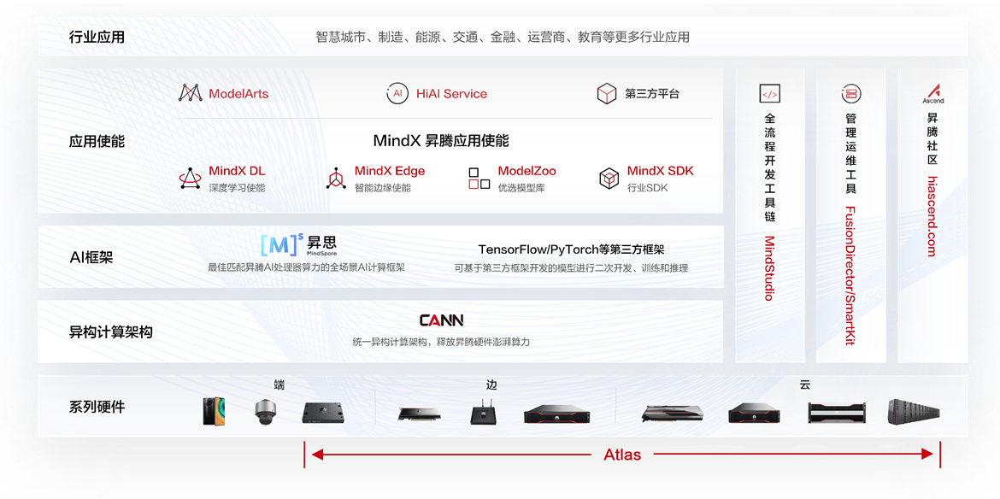
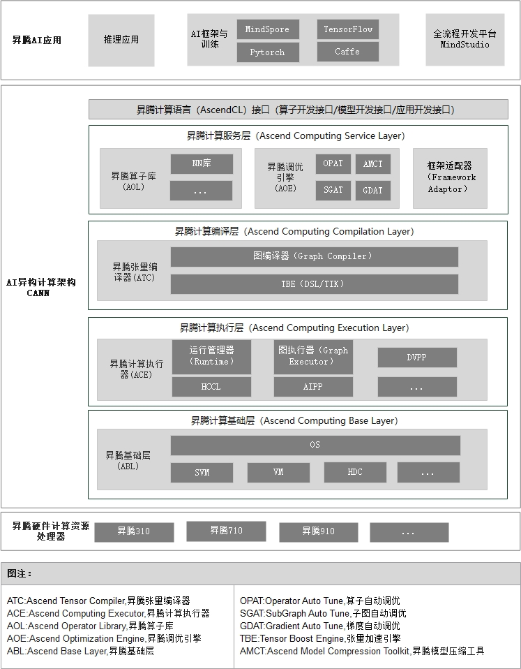
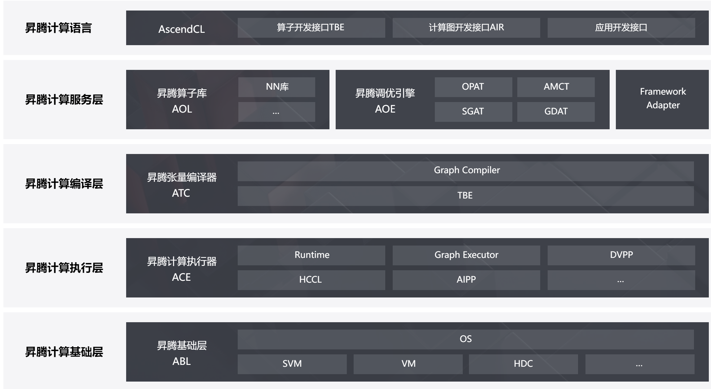
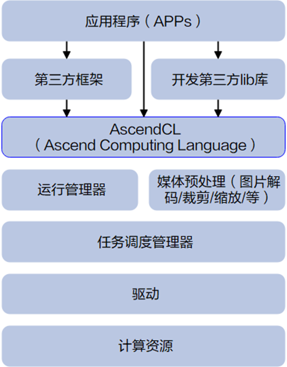

# 昇腾AI全栈介绍

## 昇腾AI基本架构

### 昇腾AI全栈的四个大部分

1. 应用使能层面，此层面通常包含用于部署模型的软硬件，例如API、SDK、部署平台，模型库等等。
2. AI框架层面，此层面包含用于构建模型的训练框架，例如华为的MindSpore、TensorFlow、Pytorch等。

3. 异构计算架构，偏底层、偏通用的计算框架，用于针对上层AI框架的调用进行加速，力求向上支持多种AI框架，并在硬件上进行加速。

4. 计算硬件，本层是AI计算的底座，有了强力的芯片及硬件设备，上层的加速才有实施的基础。

## 异构计算架构 CANN

### CANN 抽象的五层架构

华为公司面向计算机视觉、自然语言处理、推荐系统、类机器人等领域量身打造了基于“达芬奇（DaVinci）架构”的昇腾（Ascend）AI处理器，开启了智能之旅。为提升用户开发效率和释放昇腾AI处理器澎湃算力，同步推出针对AI场景的异构计算架构CANN（Compute Architecture for Neural Networks），CANN通过提供多层次的编程接口，以全场景、低门槛、高性能的优势，支持用户快速构建基于Ascend平台的AI应用和业务。

昇腾AI异构计算架构（Compute Architecture for Neural Networks，CANN）被抽象成五层架构，如下图所示。

参考[cann技术堆栈](https://www.hiascend.com/software/cann)

1. **昇腾计算语言接口**(ACL): 昇腾计算语言（Ascend Computing Language，AscendCL）接口是昇腾计算开放编程框架，是对低层昇腾计算服务接口的封装。它提供Device（设备）管理、Context（上下文）管理、Stream（流）管理、内存管理、模型加载与执行、算子加载与执行、媒体数据处理、Graph（图）管理等API库，供用户开发人工智能应用调用。

2. **昇腾计算服务层**: 本层主要提供昇腾计算库，例如神经网络（Neural Network，NN）库、线性代数计算库（Basic Linear Algebra Subprograms，BLAS）等；昇腾计算调优引擎库，例如算子调优、子图调优、梯度调优、模型压缩以及AI框架适配器。

3. **昇腾计算编译引擎**: 本层主要提供图编译器（Graph Compiler）和TBE（Tensor Boost Engine）算子开发支持。前者将用户输入中间表达（Intermediate Representation，IR）的计算图编译成NPU运行的模型。后者提供用户开发自定义算子所需的工具。

4. **昇腾计算执行引擎**:本层负责模型和算子的执行，提供如运行时（Runtime）库（执行内存分配、模型管理、数据收发等）、图执行器（Graph Executor）、数字视觉预处理（Digital Vision Pre-Processing，DVPP）、人工智能预处理（Artificial Intelligence Pre-Processing，AIPP）、华为集合通信库（Huawei Collective Communication Library，HCCL）等功能单元。

5. **昇腾计算基础层**:本层主要为其上各层提供基础服务，如共享虚拟内存（Shared Virtual Memory，SVM）、设备虚拟化（Virtual Machine，VM）、主机-设备通信（Host Device Communication，HDC）等。

### Cann三层逻辑架构

#### 应用层

包括基于 Ascend 平台开发的各种应用，以及 Ascend 提供给用户进行算法开发、调优的应用类工具。

1. 推理应用: 基于 AscendCL 提供的 API 构建推理应用

2. AI 框架: 包括 TensorFlow、Caffe、MindSpore 以及第三方框架

3. 模型小型化工具: 实现对模型进行量化，加速模型

4. AutoML 工具: 基于 MindSpore 自动学习工具，根据昇腾芯片特点进行搜索生成亲和性网络，充分发挥昇腾性能

5. 加速库: 基于 AscendCL 构建的加速库（当前支持 Blas 加速库）

6. MindStudio: 提供给开发者的集成开发环境和调试工具，可以通过MindStudio进行离线模型转换、离线推理算法应用开发调试、算法调试、自定义算子开发和调试、日志查看、性能调优、系统故障查看等

#### 芯片使能层

实现解决方案对外能力开放，以及基于计算图的业务流的控制和运行。

1. **昇腾计算语言**（Ascend Computing Language，AscendCL）: 接口是昇腾计算开放编程框架，对开发者屏蔽底层多种处理器差异，提供算子开发接口TBE、标准图开发接口AIR、应用开发接口，提供 Device/Context/Stream/ 内存等的管理、模型及算子的加载与执行、媒体数据处理、Graph 管理等 API 库，供用户开发深度神经网络应用，支持用户快速构建基于Ascend平台的AI应用和业务。

2. **昇腾计算服务层:** 主要提供昇腾算子库AOL，通过神经网络（Neural Network，NN）库、线性代数计算库（Basic Linear Algebra Subprograms，BLAS）等高性能算子加速计算；昇腾调优引擎AOE，通过算子调优OPAT、子图调优SGAT、梯度调优GDAT、模型压缩AMCT提升模型端到端运行速度。同时提供AI框架适配器Framework Adaptor用于兼容Tensorflow、Pytorch等主流AI框架。

3. **昇腾计算编译层**: 通过图编译器（Graph Compiler）将用户输入中间表达（Intermediate Representation，IR）的计算图编译成昇腾硬件可执行模型；同时借助张量加速引擎TBE（Tensor Boost Engine）的自动调度机制，高效编译算子。统一的 IR 接口对接不同前端，支持 TensorFlow/Caffe/MindSpore 表达的计算图的解析/优化/编译，提供对后端计算引擎最优化部署能力

   - Graph Engine：图编译和运行的控制中心
   - Fusion Engine：管理算子融合规则
   - 算子编译和算子库
     - TBE：编译生成算子及算子开发工具

     - 算子库：神经网络加速库

4. **昇腾计算执行层**: 负责模型和算子的执行，提供运行时库（Runtime）、图执行器（Graph Executor）、数字视觉预处理（Digital Vision Pre-Processing，DVPP）、人工智能预处理（Artificial Intelligence Pre-Processing，AIPP）、华为集合通信库（Huawei Collective Communication Library，HCCL）等功能单元。

   * AICPU Engine：AICPU 算子信息管理
   * HCCL：HCCL 算子信息管理
   * DVPP: 数字视觉预处理，实现视频编解码（VENC/VDEC）、JPEG 编解码（JPEG/E）、PNG 解码（PNGD）、VPC（预处理）

   * 执行引擎
     * Runtime：为神经网络的任务分配提供资源管理通道
     * Task Scheduler：计算图 Task 序列的管理和调度、执行

#### 计算资源层

主要实现系统对数据的处理和对数据的运算执行。

1. 计算设备

   - AI Core：执行 NN 类算子

   - AI CPU：执行 CPU 算子

   - [DVPP](https://support.huawei.com/enterprise/zh/doc/EDOC1100107784/1680540e)：视频/图像编解码、预处理。提供了图像处理单元以及视频编解码能力的调用接口，用户可以根据实际情况，将图像的解码/视频的解码放到Device上，以减少从Host到Device传输的数据量，同时降低数据传输时间开销和带宽压力。
   - [AIPP（Artificial Intelligence Pre-Processing）](https://support.huawei.com/enterprise/zh/doc/EDOC1100234054/a502617): 人工智能预处理，用于在AI Core上完成图像预处理，包括改变图像尺寸、色域转换（转换图像格式）、减均值/乘系数（改变图像像素），数据处理之后再进行真正的模型推理。该模块功能与DVPP相似，都是用于图像数据预处理。与DVPP不同的是，AIPP主要用于在AI Core上完成数据预处理，通过AIPP提供的色域转换功能，输出满足要求的图片格式；通过改变图像尺寸中的补边（Padding）功能，输出满足长宽对齐的图片等，AIPP的出现是对DVPP能力的有效补充。AIPP根据配置方式不同 ，分为静态AIPP和动态AIPP；如果要将原始图片输出为满足推理要求的图片格式，则需要使用色域转换功能；如果要输出固定大小的图片，则需要使用AIPP提供的Crop（抠图）、Padding（补边）功能。

2. 通信链路

   - PCIe：芯片间或芯片与 CPU 间高速互联

   - HCCS：实现芯片间缓存一致性功能

   - RoCE：实现芯片内存 RDMA 功能

## 昇腾计算语言接口 AscendCL

### AscendCL 简介

AscendCL（Ascend Computing Language，昇腾计算语言）是昇腾计算开放编程框架，是对底层昇腾计算服务接口的封装，它提供运行时资源（例如设备、内存等）管理、模型加载与执行、算子加载与执行、图片数据编解码/裁剪/缩放处理等API库，实现在昇腾CANN平台上进行深度学习推理计算、图形图像预处理、单算子加速计算等能力。简单来说，就是统一的API框架，实现对所有资源的调用。

### AscendCL 的优势

- 高度抽象：算子编译、加载、执行的API归一，相比每个算子一个API，AscendCL大幅减少API数量，降低复杂度。
- 向后兼容：AscendCL具备向后兼容，确保软件升级后，基于旧版本编译的程序依然可以在新版本上运行。
- 零感知芯片：一套AscendCL接口可以实现应用代码统一，多款昇腾处理器无差异。

### AscendCL 的主要应用场景

- 开发应用：用户可以直接调用AscendCL提供的接口开发图片分类应用、目标识别应用等。
- 供第三方框架调用：用户可以通过第三方框架调用AscendCL接口，以便使用昇腾AI处理器的计算能力。

- 供第三方开发lib库：用户还可以使用AscendCL封装实现第三方lib库，以便提供昇腾AI处理器的运行管理、资源管理等能力。

### AscendCL 的分层能力开放

AscendCL 提供的是分层开放能力的管控，通过不同的组件对不同的使能部件进行对接。包含 GE 能力开放、算子能力开放、Runtime 能力开放、Driver 能力开放等。

- 模型加载能力开放：处理om模型加载，但接口的开放是通过AscendCL。
- 算子能力开放：算子能力实现在CANN中，但算子能力开放是通过AscendCL。
- Runtime 能力开放：处理基于stream的设备能力、内存、event等资源能力开发诉求，对app屏蔽底层实现。

# 参考

1. [昇腾Ascend 随记 —— 昇腾 AI 的基本架构](https://blog.csdn.net/qq_21484461/article/details/126201874)
