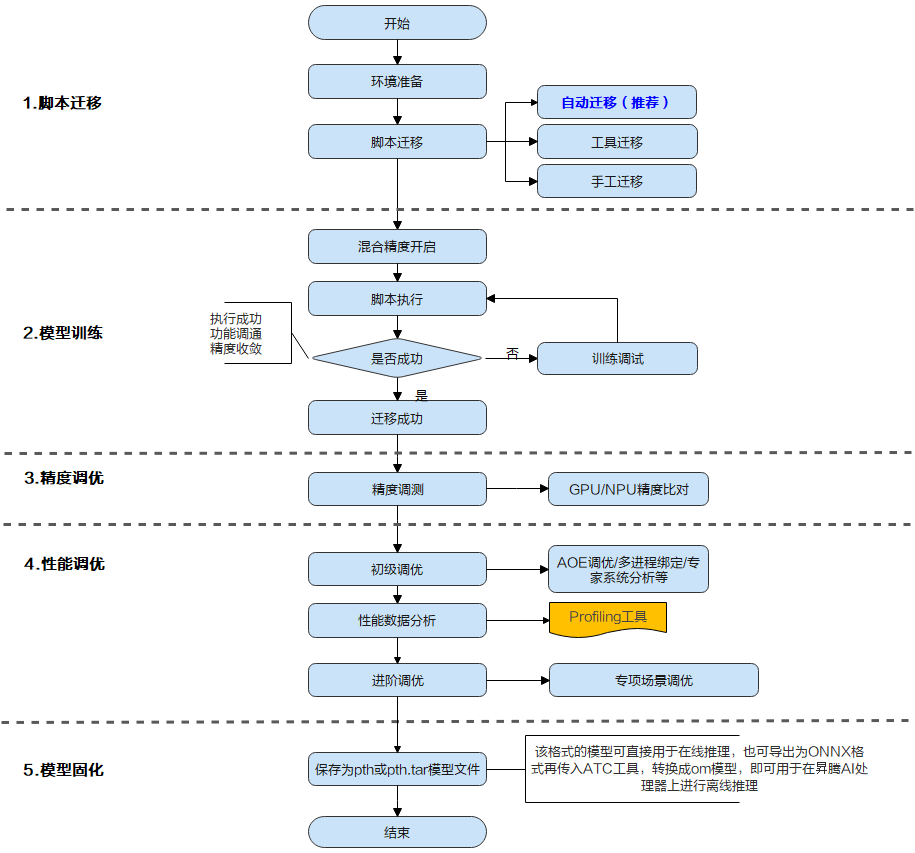
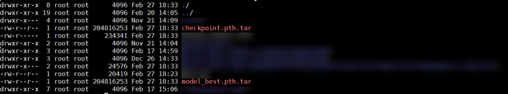

PyTorch训练模型迁移

[TOC]

## 一、介绍

PyTorch是业界流行的深度学习框架，用于开发深度学习训练脚本，默认运行在CPU/GPU上。为了使这些脚本能够利用昇腾AI处理器的强大算力执行训练，需要对PyTorch的训练脚本进行迁移。

首先，我们了解下模型迁移的全流程：



通过上图可以看出，模型迁移包括“脚本迁移 –> 模型训练 –> 精度调优 –> 性能调优 –> 模型固化”几个流程，其中：

- “脚本迁移”是对PyTorch训练脚本进行少量修改，使其可以运行在昇腾AI处理器上。目前支持自动迁移、工具迁移和手动迁移三种迁移方式，推荐使用自动迁移，用户仅需在脚本中添加一行导入训练转换库的代码即可完成PyTorch训练脚本到NPU的迁移。在迁移完成、训练开始之前，基于NPU的架构特性，用户需要开启混合精度，用于提升模型性能。
- “模型训练”是根据模型参数进行多轮训练迭代，并在训练过程中评估模型准确度，使其在训练结束时能够完成某种AI任务（例如图像识别）。
- “精度调优”与“性能调优”是在用户完成模型训练后，比对、分析模型的精度和性能是否达到用户要求，并指导用户对精度或性能进行进一步提升的操作。
- “模型固化”是将训练好的、精度性能达标的模型保存为pth或pth.tar模型文件用于在线推理，或导出为ONNX模型再通过ATC工具转换为om模型，使其可以在昇腾AI处理器上进行离线推理。

本文我们针对“脚本迁移”和“模型训练”两个阶段进行详细的介绍。

## 二、脚本迁移

将PyTorch训练脚本迁移到昇腾平台有自动迁移（推荐）、工具迁移和手工迁移三种方式。

自动迁移仅需开发者在脚本中引入转换库，脚本执行时边训练边转换；工具迁移需要开发者配置拉起命令参数，工具可自动分析PyTorch训练脚本的算子支持情况；手动迁移需要用户对训练脚本以及NPU的接口支持有一定了解，然后手动进行脚本代码修改。**自动迁移的代码实现方式最为简单，推荐开发者优先使用自动迁移**。

### 自动迁移

在训练脚本中导入脚本转换库，然后拉起脚本执行训练。训练脚本在运行的同时，会自动将脚本中的CUDA接口替换为昇腾AI处理器支持的NPU接口。整体过程为边训练边转换。代码实现方式如下：

1.配置环境变量

```shell
export PYTHONPATH={CANN软件目录}/ascend-toolkit/latest/tools/ms_fmk_transplt/torch_npu_bridge:$PYTHONPATH
```

2.在训练脚本中引入以下头文件。

```python
import torch
import torch_npu
.....
from torch_npu.contrib import transfer_to_npu
```

### 工具迁移

训练前，通过脚本迁移工具，自动将训练脚本中的CUDA接口替换为昇腾AI处理器支持的NPU接口，并生成迁移报告（包含脚本转换日志、不支持算子的列表、脚本修改记录）。训练时，运行转换后的脚本。整体过程为先转换脚本，再进行训练。

1.安装依赖

```shell
pip3 install pandas    
pip3 install libcst     # Python语法树解析器 
pip3 install jedi       # 用于跨文件解析，建议安装
```

2.进入迁移工具所在路径。

```shell
cd CANN软件安装目录/ascend-toolkit/latest/tools/ms_fmk_transplt/
```

3.进入分析迁移工具所在路径，执行脚本迁移任务。

```shell
./pytorch_gpu2npu.sh -i 原始脚本路径 -o 脚本迁移结果输出路径 -v 原始脚本框架版本 [-r 自定义规则json文件路径] [-s] [-sim] [-a 模型名称] [-m] [distributed -t 目标模型变量名 -m 训练脚本的入口文件]
```

4.脚本迁移完成后，进入脚本迁移结果输出路径查看结果文件，以GPU单卡脚本迁移为NPU多卡脚本为例：

```shell
├── xxx_msft/xxx_msft_multi     // 迁移结果输出目录
│   ├── 训练脚本文件存储目录      // 与迁移前目录结构一致                 
│   ├── msFmkTranspltlog.txt    // 脚本迁移过程日志文件
│   ├── cuda_op_list.csv        //分析出的cuda算子列表
│   ├── unknown_api.csv         //支持情况存疑的API列表
│   ├── unsupported_api.csv     //不支持的API列表
│   ├── change_list.csv         // 修改记录文件
│   ├── run_distributed_npu.sh  // 多卡启动shell脚本
│   ├── ascend_function         // 如果启用了自动替换不支持API功能，生成包含等价算子的目录
```

### 手工迁移

手工迁移需要用户对AI模型有迁移基础，了解GPU与NPU的代码异同点。手工迁移过程中各个模型的迁移方法均有不同，下文只给出手工迁移的核心要点。

#### 单卡迁移

1.导入NPU相关库。

```python
import torch
import torch_npu 
```

2.迁移适配GPU的模型脚本，指定NPU作为训练设备。

迁移前：

```python
device = torch.device('cuda:{}'.format(args.gpu))
```

迁移后：

```python
device = torch.device('npu:{}'.format(args.gpu))
```

3.替换CUDA接口：将训练脚本中的CUDA接口替换为NPU接口，例如CUDA接口、模型、损失函数、数据集等迁移到NPU上。样例代码如下：

迁移前：

```python
model.cuda(args.gpu)
```

迁移后：

```python
model.npu(args.gpu)
```

#### 多卡迁移

除单卡迁移包含的3个修改要点外，在分布式场景下，还需要切换通信方式，直接修改init_process_group的值。

修改前，GPU使用nccl方式：

```python
dist.init_process_group(backend='nccl',init_method = "tcp//:127.0.0.1:**", ...... ,rank = args.rank)
```

修改后，NPU使用hccl方式：

```python
dist.init_process_group(backend='hccl',init_method = "tcp//:127.0.0.1:**", ...... ,rank = args.rank)
```

**为端口号，根据实际选择一个闲置端口填写。

## 三、混合精度开启

混合精度训练是在训练时混合使用单精度（float32）与半精度(float16)数据类型，将两者结合在一起，并使用相同的超参数实现了与float32几乎相同的精度。在迁移完成、训练开始之前，基于NPU芯片的架构特性，用户需要开启混合精度，可以提升模型的性能。推荐用户使用PyTorch1.8.1及以上版本框架内置的AMP功能模块来使能混合精度训练。在典型模型训练场景中，代码实现方式如下。

1.在构建神经网络前，我们需要导入torch_npu中的AMP模块。

```python
import time
import torch
import torch.nn as nn
import torch_npu
from torch_npu.npu import amp    # 导入AMP模块
```

2.在模型、优化器定义之后，定义AMP功能中的GradScaler。

```python
model = CNN().to(device)
train_dataloader = DataLoader(train_data, batch_size=batch_size)    # 定义DataLoader
loss_func = nn.CrossEntropyLoss().to(device)    # 定义损失函数
optimizer = torch.optim.SGD(model.parameters(), lr=0.1)    # 定义优化器
scaler = amp.GradScaler()    # 在模型、优化器定义之后，定义GradScaler
```

3.在训练代码中添加AMP功能相关的代码开启AMP。

```python
for epo in range(epochs):
    for imgs, labels in train_dataloader:
        imgs = imgs.to(device)
        labels = labels.to(device)
        with amp.autocast():
            outputs = model(imgs)    # 前向计算
            loss = loss_func(outputs, labels)    # 损失函数计算
        optimizer.zero_grad()
        # 进行反向传播前后的loss缩放、参数更新
        scaler.scale(loss).backward()    # loss缩放并反向传播
        scaler.step(optimizer)    # 更新参数（自动unscaling）
        scaler.update()    # 基于动态Loss Scale更新loss_scaling系数
```

## 四、模型训练

迁移成功后的脚本可在昇腾AI处理器上执行单卡训练，也可以在多卡上执行分布式训练。

执行训练前用户需要确保已经完成CANN基础环境变量的配置，并已经将数据集上传到运行环境中。

1.拉起训练脚本。

用户可以点击[链接](https://github.com/pytorch/examples/blob/main/imagenet/main.py)下载基于Imagenet数据集的ResNet50训练模型代码脚本main.py，进行自动迁移后，以如下示例命令拉起训练。

单卡训练示例：

```python
python3 main.py /home/data/resnet50/imagenet --batch-size 128 --lr 0.1 --epochs 90 --arch resnet50 --world-size 1 --rank 0 --workers 40 --momentum 0.9 --weight-decay 1e-4 --gpu 0
```

多卡分布式训练示例：

```python
python3 main.py /home/data/resnet50/imagenet --workers 160 --lr 0.8 --arch resnet50 --dist-url 'tcp://127.0.0.1:**' --dist-backend 'hccl' --multiprocessing-distributed --world-size 1 --batch-size 2048 --epochs 90 --rank 0 --amp
```

- --dist-url：为多卡训练时使用的端口号，配置为任一空闲端口号即可。
- --amp：代表开启混合精度，仅多卡训练时需要显示开启，单卡训练时已默认开启。

2.查看训练后是否生成权重文件，生成了如下图模型文件则说明迁移训练成功。



以上就是PyTorch模型迁移训练的相关知识点，更多详细操作可参见“昇腾社区文档中心[1]”，您也可以在“昇腾社区在线课程[2]”板块学习视频课程，学习过程中的任何疑问，都可以在“昇腾论坛[3]”互动交流！

相关参考

[1][昇腾文档中心](https://www.hiascend.com/zh/document)

[2][昇腾社区在线课程](https://www.hiascend.com/zh/edu/courses)

[3][昇腾论坛](https://www.hiascend.com/forum/)