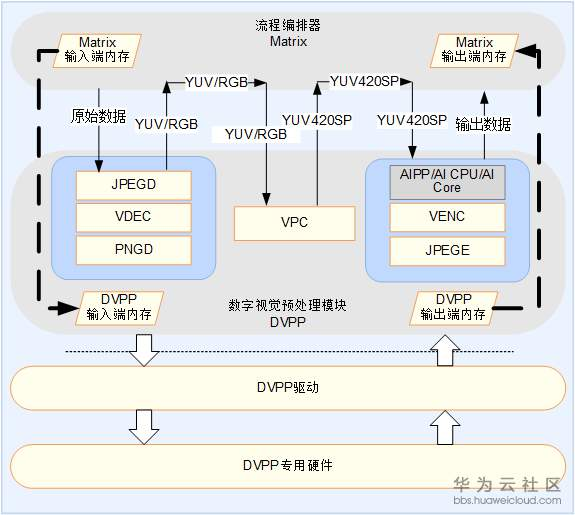
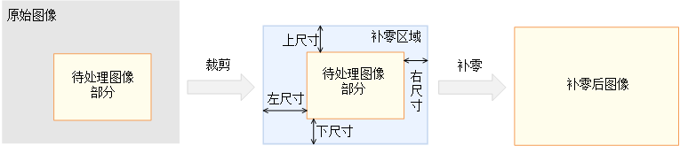

# 数字视觉预处理（DVPP）

数字视觉预处理模块作为昇腾AI软件栈中的编解码和图像转换模块，为神经网络发挥着预处理辅助功能。当来自系统内存和网络的视频或图像数据进入昇腾AI处理器的计算资源中运算之前，由于Davinci架构对输入数据有固定的格式要求，如果数据未满足架构规定的输入格式、分辨率等要求，就需要调用数字视觉处理模块进行格式的转换，才可以进行后续的神经网络计算步骤。

## 功能架构

数字视觉预处理对外提供6个模块，分别为视频解码（VDEC）模块、视频编码（VENC）模块、JPEG解码（JPEGD）模块、JPEG编码（JPEGE）模块、PNG解码（PNGD）模块和视觉预处理（VPC）模块。

- VDEC模块提供H.264/H.265的视频解码功能，对输入的视频码流进行解码输出图像，用于视频识别等场景的前处理。

- VNEC模块提供输出视频的编码功能。对于视觉预处理模块的输出数据或原始输入的YUV格式数据，视频编码模块进行编码输出H.264/H.265视频，便于直接进行视频的播放和显示。

- JPEGD模块对JPEG格式的图片进行解码，将原始输入的JPEG图片转换成YUV数据，对神经网络的推理输入数据进行预处理。

- JPEG图片处理完成后，需要用JPEGE编码模块对处理后的数据进行JPEG格式还原，用于神经网络的推理输出数据的后处理。

- 当输入图片格式为PNG时，需要调用PNGD解码模块进行解码，将PNG图片以RGB格式进行数据输出给昇腾AI处理器进行推理计算。

- VPC模块提供对图片和视频其它方面的处理功能，如格式转换（例如YUV/RGB格式到YUV420格式转换）、大小缩放、裁剪等功能。

- 数字视觉处理（DVPP）模块的执行流程如下图所示，需要由Matrix、DVPP、DVPP驱动和DVPP硬件模块共同协作完成。

- 位于框架最上层是Matrix，负责调度DVPP中的功能模块进行相应处理以及管理数据流。

- DVPP位于功能架构的中上层，为Matrix提供调用视频图形处理模块的编程接口，通过这些接口可以配置编解码和视觉预处理模块的相关参数。

- DVPP驱动位于功能架构的中下层，最贴近于DVPP的硬件模块，主要负责设备管理、引擎管理和引擎模组的驱动。驱动会根据DVPP下发的任务分配对应的DVPP硬件引擎，同时还对硬件模块中的寄存器进行读写，完成其他一些硬件初始化工作。

- 最底层的是真实的硬件计算资源DVPP模块组，是一个独立于昇腾AI处理器中其他模块的单独专用加速器，专门负责执行与图像和视频相对应的编解码和预处理任务。

## 预处理机制

当输入数据进入数据引擎时，引擎一旦检查发现数据格式不满足后续AI Core的处理需求，则可开启数字视觉预处理模块进行数据预处理。如下图所示的数据流所示，以图片预处理为例：

1.首先Matrix会将数据从内存搬运到DVPP的缓冲区进行缓存。

2.根据具体数据的格式，预处理引擎通过DVPP提供的编程接口来完成参数配置和数据传输。

3.编程接口启动后，DVPP将配置参数和原始数据传递给驱动程序，由DVPP驱动调用PNG或JPEG解码模块进行初始化和任务下发。

4.DVPP专用硬件中的PNG或JPEG解码模块启动实际操作来完成图片的解码，得到YUV或者RGB格式的数据，满足后续处理的需要。

5.解码完成后，Matrix以同样机制继续调用VPC进一步把图片转化成YUV420SP格式，因为YUV420SP格式数据存储效率高且占用带宽小，所以同等带宽下可以传输更多数据来满足AI Core强大计算吞吐量的需求。同时DVPP也可以完成图像的裁剪与缩放。

如下图展示了一种典型改变图像尺寸的裁剪和补零操作，VPC在原图像中取出的待处理图像部分，再将这部分进行补零操作，在卷积神经网络计算过程中保留边缘的特征信息。补零操作需要用到上、下、左、右四个填充尺寸，在补零区域中进行图像边缘扩充，最后得到可以直接计算的补零后图像。

6.经过一系列的预处理后的图像数据有以下两种处理方式：

- 图像数据可以根据模型要求经过AIPP进行进一步预处理（可选，若DVPP输出的数据满足图像要求，则可以不经过AIPP的处理），然后将满足要求的图像数据在AI CPU的控制下进入AI Core进行所需的神经网络计算。

- 将输出的图像数据统一通过JPEG编码模块进行编码，完成编码后处理，将数据放入DVPP的缓冲器中，最终由Matrix取出数据进行后续操作，同时也会释放DVPP的计算资源并回收缓存。

整个预处理过程中，Matrix完成不同模块的功能调用。DVPP作为定制化的数据补给模块，采用了异构或专用的处理方式来对图像数据进行快速变换，为AI Core提供了充足的数据源，从而满足了神经网络计算中大数据量、大带宽的需求。
