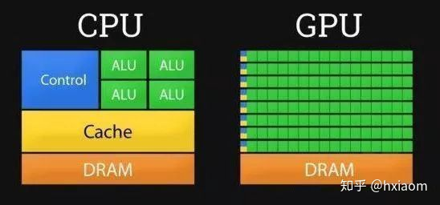
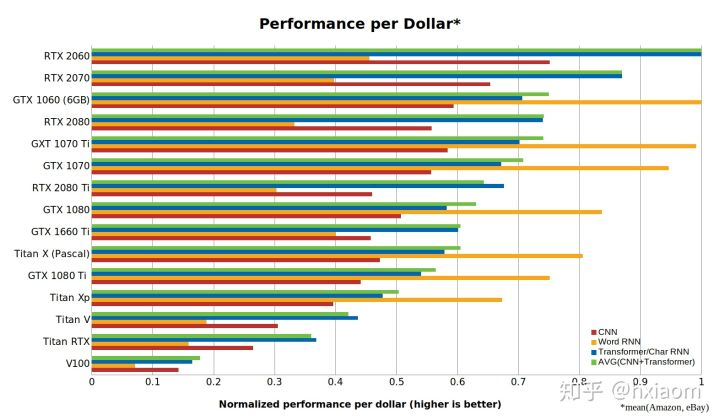

# GPU选型

NVIDIA的显卡在最基本的可以分为两种：有一种的（Geforce）游戏卡，另一种是（Quadro）专用卡也被称为专业显卡是用来做一些C4D、3D MAX等专业领域的显卡。Tesla显卡，既不能拿来打游戏也不能用来作渲染、建模、特效制作等，它主要就是用来做高强度科学计算。泰坦显卡, 虽然不能像Tesla一样做高强度的科学计算但却拥有肩并专业卡和游戏卡的能力。 

## 深度学习选购显卡

### 为什么深度学习需要GPU？

我们先来比较一下CPU和GPU的不同，下图是一个简化的处理器内部结构图，其中：

- **DRAM**即动态随机存取存储器，是常见的系统内存。
- **Cache**存储器：电脑中作高速缓冲存储器，是位于CPU和主存储器DRAM之间，规模较小，但速度很高的存储器。
- **ALU**算术逻辑单元是能实现多组算术运算和逻辑运算的组合逻辑电路。

我们可以很明显地看出，GPU拥有更多ALU，能够进行强大的计算。CPU是一个有多种功能的优秀领导者，优点在于调度、管理、协调能力强，计算能力则位于其次。GPU相当于一个接受CPU调度的“拥有大量计算能力”的员工。

深度学习需要进行大量的矩阵运算，GPU刚好满足了这一要求。同时GPU还有其他优点：

- **高带宽：**CPU更擅长于快速获取少量的内存，GPU则更擅长于获取大量的内存。运算矩阵乘法A×B=C为例，将A、B复制到显存上比直接计算A×B更耗费资源。也就是说，如果你想用LSTM等处理大量小型矩阵乘法的循环神经网络，显存带宽是GPU最重要的属性。
- **多线程并行：**GPU提供了多核并行计算的基础结构，且核心数非常多，可以支撑大量数据的并行计算。 并行计算或称平行计算是相对于串行计算来说的。它是一种一次可执行多个指令的算法，目的是提高计算速度，及通过扩大问题求解规模，解决大型而复杂的计算问题。

### 如何选购显卡？

针对不同深度学习架构，GPU参数的选择优先级是不一样的，总体来说分两条路线：

**卷积网络和Transformer**：张量核心(GPU)>FLOPs（每秒浮点运算次数）>显存带宽>16位浮点计算能力

**循环神经网络**：显存带宽>16位浮点计算能力>张量核心(GPU)>FLOPs

Tim Dettmers对比了各个厂商的显卡，绘制了下图：

总之，根据量子位对Tim Dettmers博文的翻译，在GPU的选择上有三个原则：

1. 使用GTX 1070或更好的GPU；
2. 购买带有张量核心的RTX GPU；
3. 在GPU上进行原型设计，然后在TPU或云GPU上训练模型。

针对不同研究目的、不同预算，给出了如下的建议：

- **最佳GPU**：RTX 2070
- **避免的坑**：所有Tesla、Quadro、创始人版（Founders Edition）的显卡，还有Titan RTX、Titan V、Titan XP
- **高性价比**：RTX 2070（高端），RTX 2060或GTX 1060 (6GB)（中低端）
- **穷人之选**：GTX 1060 (6GB)
- **破产之选**：GTX 1050 Ti（4GB），或者CPU（原型）+ AWS / TPU（训练），或者Colab
- **Kaggle竞赛**：RTX 2070
- **计算机视觉或机器翻译研究人员**：采用鼓风设计的GTX 2080 Ti，如果训练非常大的网络，请选择RTX Titans
- **NLP研究人员**：RTX 2080 Ti
- **已经开始研究深度学习**：RTX 2070起步，以后按需添置更多RTX 2070
- **尝试入门深度学习**：GTX 1050 Ti（2GB或4GB显存）

## 英伟达Tesla系列

### NVIDIA Tesla GPU系列P4、T4、P40以及V100

NVIDIA Tesla系列GPUP4、T4、P40以及V100性能规格参数对比表，[阿里云GPU云服务器](https://www.aliyun.com/product/ecs/gpu?source=5176.11533457&userCode=r3yteowb&type=copy)提供的实例GN4（Nvidia M40）、GN5（Nvidia P100）、GN5i（Nvidia P4）及GN6（Nvidia V100），也会基于NVIDIA Tesla GPU系列。

| GPU型号          | Tesla T4：世界领先的推理加速器 | Tesla V100：通用数据中心 GPU           | 适用于超高效、外扩型服务器的 | Tesla P4 适用于推理吞吐量服务器的 Tesla P40 |
| :------------------ | :----------------------------- | :------------------------------------- | :--------------------------- | :------------------------------------------ |
| 单精度性能 (FP32)   | 8.1 TFLOPS                     | 14 TFLOPS (PCIe) 15.7 teraflops (SXM2) | 5.5 TFLOPS                   | 12 TFLOPS                                   |
| 半精度性能 (FP16)   | 65 TFLOPS                      | 112 TFLOPS (PCIe)125 TFLOPS (SXM2)     | —                            | —                                           |
| 整数运算能力 (INT8) | 130 TOPS                       | —                                      | 22 TOPS*                     | 47 TOPS*                                    |
| 整数运算能力 (INT4) | 260 TOPS                       | —                                      | —                            | —                                           |
| GPU 显存            | 16GB                           | 32/16GB HBM2                           | 8GB                          | 24GB                                        |
| 显存带宽            | 320GB/秒                       | 900GB/秒                               | 192GB/秒                     | 346GB/秒                                    |
| 系统接口/外形规格   | PCI Express 半高外形           | PCI Express 双插槽全高外形 SXM2/NVLink | PCI Express 半高外形         | PCI Express 双插槽全高外形                  |
| 功率                | 70 W                           | 250 W (PCIe) 300 W (SXM2)              | 50 W/75 W                    | 250 W                                       |
| 硬件加速视频引擎    | 1 个解码引擎，2 个编码引擎     | —                                      | 1 个解码引擎，2 个编码引擎   | 1 个解码引擎，2 个编码引擎                  |

### 关于NVIDIA TESLA系列GPU详细介绍如下：

#### NVIDIA TESLA V100

NVIDIA Tesla V100采用NVIDIA Volta架构，非常适合为要求极为苛刻的双精度计算工作流程提供加速，并且还是从P100升级的理想路径。该GPU的渲染性能比Tesla P100提升了高达80%，借此可缩短设计周期和上市时间。

Tesla V100的每个GPU均可提供125 teraflops的推理性能，配有8块Tesla V100的单个服务器可实现1 petaflop的计算性能。

#### NVIDIA TESLA P40

The Tesla P40能够提供高达2倍的专业图形性能。Tesla P40能够对组织中每个vGPU虚拟化加速图形和计算（NVIDIA CUDA® 和 OpenCL）工作负载。支持多种行业标准的2U服务器。

Tesla P40可提供出色的推理性能、INT8精度和24GB板载内存。

#### NVIDIA TESLA T4

NVIDIA Tesla T4的帧缓存高达P4的2倍，性能高达M60的2倍，对于利用NVIDIA Quadro vDWS软件开启高端3D设计和工程工作流程的用户而言，不失为一种理想的解决方案。凭借单插槽、半高外形特性以及低至70瓦的功耗，Tesla T4堪称为每个服务器节点实现最大GPU密度的绝佳之选。

#### NVIDIA TESLA P4

Tesla P4可加快任何外扩型服务器的运行速度，能效高达CPU的60倍。

## 英伟达消费级系列

参考 [桌面显卡性能天梯图](https://www.mydrivers.com/zhuanti/tianti/gpu/)

## 参考

1. [NVIDIA Tesla GPU系列P4、T4、P40以及V100参数性能对比](https://developer.aliyun.com/article/753454)