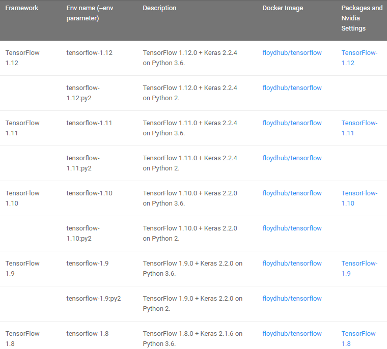

**python 3.6 下 的 keras** 

# 1. 使用 keras
贴入以下代码即可
```
export PATH="/opt/anaconda3/bin:$PATH"
source activate py36 
```
# 2. 安装 TensorFlow 1.13.1 + Keras 2.2.4 on Python 3.6
1. 激活 py36 环境
    ```
    export PATH="/opt/anaconda3/bin:$PATH"
    source activate py36 
    ```

2. 安装tensorflow-gpu
    ```
    conda install -n py36 -y tensorflow-gpu==1.13.1
    ```

3. 安装Keras
    ```
    conda install -y -n py36 keras==2.2.4
    ```

4. 测试
    ```
    import keras
    print(keras.__version__);
    ```
# 其他说明
1. keras 兼容性表 

 

# 参考
1. Keras Environments . https://docs.floydhub.com/guides/environments/
2. Keras:基于Python的深度学习库 . https://keras-cn.readthedocs.io/en/latest/