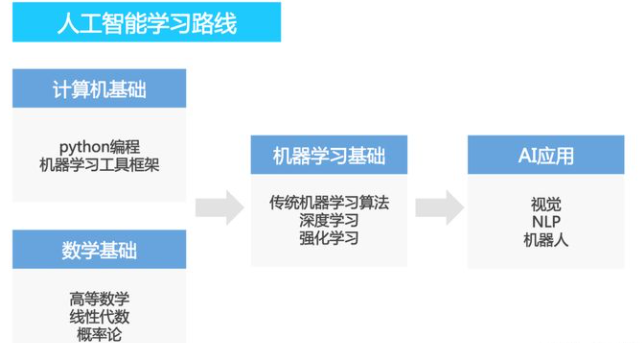
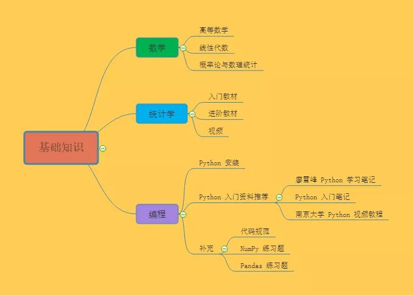
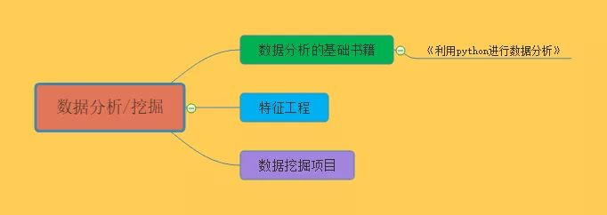
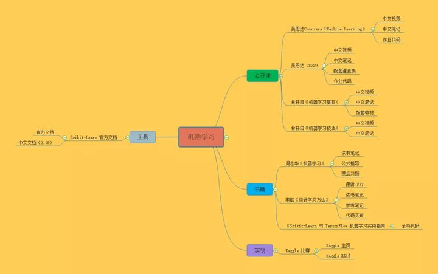
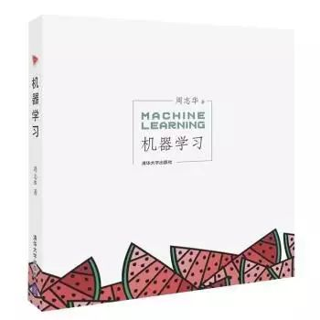
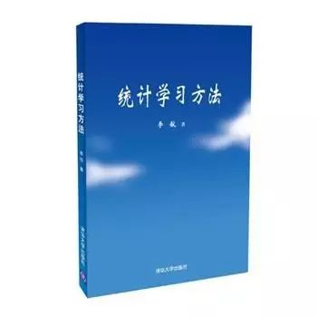
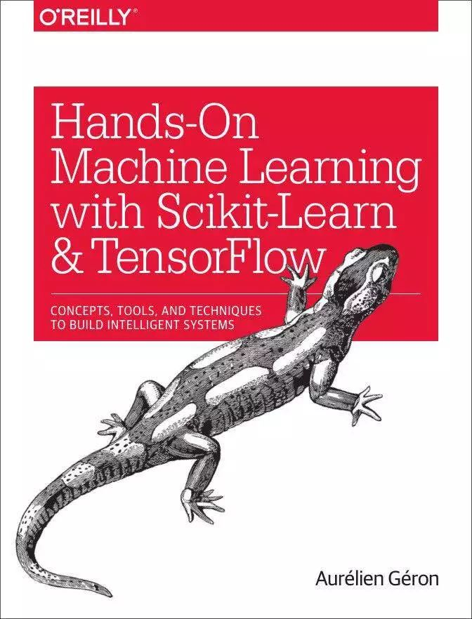
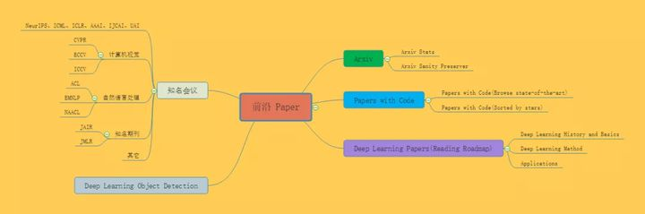
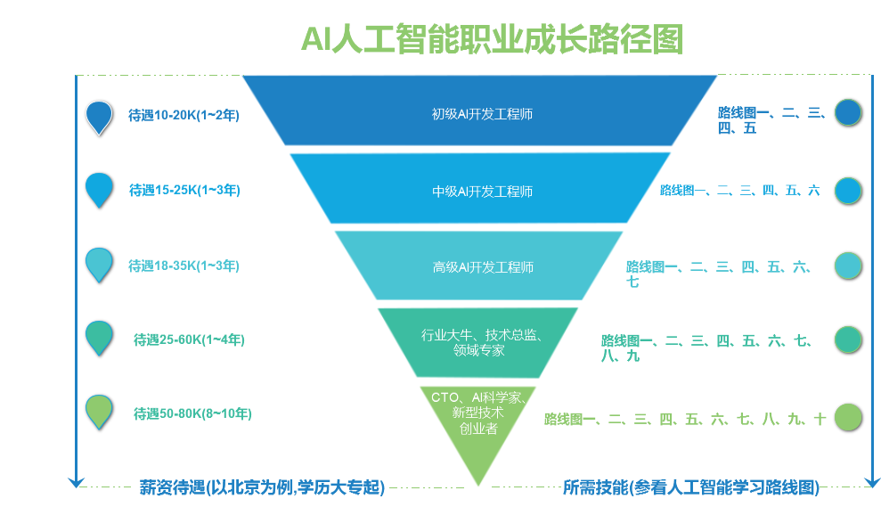

# 人工智能学习路线

### 前言

谈到人工智能（AI）算法，常见不外乎有两方面信息：铺天盖地各种媒体提到的高薪就业【贩卖课程】、知乎上热门的算法岗“水深火热 灰飞烟灭”的梗【贩卖焦虑】。

其实，这两方面都是存在的，但都很片面，这里不加赘述。客观地说，数字化、智能化是人类社会发展的趋势，而当下人工智能无疑是一大热门，那是蓝海还是火海？我们回到老道理——水的深度，只有你自己去试试水才知道。

当你对上面情况有了初步的了解并想试试水，需要面对的问题是：AI入门容易吗？

答案其实是否定的，难！

AI领域需要钻研算法原理、大量复杂的公式及符号、无所适从的项目都是劝退一时热度初学者的原因。但对于一个初学者，这些原因根本上就是**面对这样困难的学科却缺乏合适方法**导致的。

```text
反问一个玩笑，程序员怎么会没有方法呢？随手就定义一个Python方法（funtion）。。。

def funtion():
       
    return 'haha，往下看，下面会介绍方法'
```

回到笔者，一名普普通通的程序员，当初也是”误打误撞“学习Python入门到机器学习、深度学习，至今有4个年头，踩了很多坑，下文说到的**学习方法、具体化的学习路线**也就填坑试错的经验罢了。

## 一、学习方法是？

说到学习方法，其实我们谈到的人工智能之所以智能，核心也在于其学习方法。而人工智能学习过程有两个要素：

1、学习**目标**是什么？（——什么目标函数）

2、如何**达到目标**？（——什么算法）

可以发现这两个问题也是我们学习这门学科需要回答的**，**所谓的**学习方法也就是明确学习目标以及如何达到的方法。**人工智能领域很多思路和人类学习是很共恰的！

### 1.1 学习目标是什么？

我们的学习目标比较清楚，就是入门人工智能领域，能完成一个AI相关的任务，或者找到相关的工作。

### 1.2 如何达到目标？

1、入门人工智能是个宽泛的目标，因此还得 将目标拆分成**阶段性目标才易于执行**，可以对应到下面--学习路线及建议资源的各个节点。

2、学习人工智能这门学科，需要提醒的是这本来就是件难事，所以实在搞不懂的知识可以放在后面补下，不要奢求一步到位（当然天赋了得另说），不要想一下子成为专家，可以从：懂得调用现成的算法模块(scikit-learn、tensorflow)做项目 -进阶-》懂得算法原理进一步精用、调优算法 -进阶-》领域专家。**保持学习，循序渐进**才是啃硬骨头的姿势。

3、啃硬骨头过程无疑是艰难的，所以慢慢地培养兴趣和及时的结果反馈是很重要的。在这方面，**边学边敲代码**是必须的，结合代码实践学习效率会比较高，还可以及时看到学习成果，就算是啃硬骨头看到牙印越来越深，不也是成果，也比较不容易放弃！

## 二、整体的学习路线及建议资源

本学习路线的基本的框架是：

→ **首先宽泛了解领域，建立一定兴趣**

**→ 基础知识、工具准备**

**→ 机器学习|深度学习的入门课程、书籍及项目实践**

**→ （面试准备）**

**→ 自行扩展：工作中实战学习 或 学术界特定领域钻研，经典算法原理、项目实践**



### 2.1 了解领域及培养兴趣

我们首先要对人工智能领域有个宽泛的了解，有自己的全局性的认识，产生一些判断，才不会人云亦云地因为“薪资高、压力大”等去做出选择或者放弃。再者你做的准备调研越多，确认方向后越不容易放弃（等门槛效应）。当然，最重要还是慢慢培养兴趣，这个事情如果没有兴趣不走心，能做得很好吗？

人工智能（Artificial Intelligence，AI）之研究目的是通过探索智慧的实质，扩展人类智能——促使智能主体**会听**（语音识别、机器翻译等）、**会看**（图像识别、文字识别等）、**会说**（语音合成、人机对话等）、**会思考**（人机对弈、专家系统等）、**会学习**（知识表示，机器学习等）、**会行动**（机器人、自动驾驶汽车等）。一个经典的AI定义是：“ 智能主体可以理解数据及从中学习，并利用知识实现特定目标和任务的能力。”

从**技术层面**来看（如下图），现在所说的人工智能技术基本上就是**机器学习**方面的（也就是，机器学习技术是我们入门AI的核心技术）。

> AI除了机器学习，其他方面的如知识库、专家系统等技术较为没落。关于人工智能的发展历程，可以看看我之前一篇文章**[人工智能简史](https://link.zhihu.com/?target=https%3A//mp.weixin.qq.com/s/miTIbd9PlgdV5cw3SrrH_A)**。
> 机器学习是指非显式的计算机程序可以从数据中学习，以此提高处理任务的水平。机器学习常见的任务有分类任务（如通过逻辑回归模型判断邮件是否为垃圾邮件类）、回归预测任务（线性回归模型预测房价）等等。
> 深度学习是机器学习的一个子方向，是当下的热门，它通过搭建深层的神经网络模型以处理任务。


从**应用领域**上看，人工智能在众多的应用领域上面都有一定的发展，有语言识别、自然语言处理、图像识别、数据挖掘、推荐系统、智能风控、机器人等方面。值得注意的的是，不同应用领域上，从技术层面是比较一致，但结合到实际应用场景，所需要的业务知识、算法、工程上面的要求，差别还是相当大的。回到应用领域的选择，可以结合技术现在的发展情况、自己的兴趣领域再做判断。

### 2.2 基础知识、工具准备

学习人工智能需要先掌握编程、数学方面的基本知识：AI算法工程师首先是一名程序员，掌握编程实现方法才不将容易论知识束之高阁。而数学是人工智能理论的奠基，是必不可少的。

### 2.2.1 编程语言方面

编程语言之于程序员，如宝剑之于侠士。编程语言就是程序员改变、创造数字虚拟世界的交互工具。

先简单介绍信息技术(IT)行业的情况，IT领域广泛按职能可以分为前端、后端、人工智能、嵌入式开发、游戏开发、运维、测试、网络安全等方面。前端领域常用技术栈为js\css\html，后端领域常用技术栈有Java\go\C++\php\Python等。

在人工智能领域，Python使用是比较广泛的，当然其他的语言也是可行的，如Java、C++、R语言等。语言也就工具，选择个适合的就好。结合自己的历程及语言的特性，AI小白还是建议可以从Python学起，理由如下：

1、因为其简单的语法及灵活的使用方法，Python很适合零基础入门；

2、Python有丰富的机器学习库，极大方便机器学习的开发；

3、Python在机器学习领域有较高的使用率，意味着社区庞大，应用范围广，市场上有较多的工作机会（具体可到招聘软件了解下）；

- **学习编程语言的两点建议：**

1、**多敲代码：**只看书、视频而不敲代码是初学者的一个通病。要记住的是“纸上得来终觉浅”，程序员是一个工匠活，需要动手敲代码实践，熟能生巧。

2、 **多谷歌：** 互联网的信息无所不包的，学会利用互联网自己解决问题是一项基本功。不懂可以谷歌，业界一句有趣的话：程序员是面向谷歌/stackoverflow编程的。

- **建议资源：**

以下资源只是一些个人的偏好推荐，挑一两种适合自己的资源学习就可以，不用全部都学浪费精力。如果都觉得不合适，按照自己的学习方式即可。

1、【Python入门书】首推Python经典书**[《Python编程从入门到实践.pdf(https://github.com/aialgorithm/AiPy/》](https://link.zhihu.com/?target=https%3A//github.com/aialgorithm/AiPy/tree/master/Python)**，知识点通俗易懂，而且结合了项目实践，很适合初学者。注：Python在爬虫、web开发、游戏开发等方向也有应用，推荐本书主要学习下Python语法，而书后面的项目实战像有游戏开发\web开发，和机器学习关系不大，可以略过\自行了解下就好。

2、【Python入门教程】**[廖雪峰的Python在线学习教程](https://link.zhihu.com/?target=https%3A//www.liaoxuefeng.com/wiki/1016959663602400)**，一个很大的特色是可以直接在线运行Python代码。

3、【Python入门视频】如果看书过于枯燥，可以结合视频学习，Python入门学习报培训班学习有点浪费，可以直接网易云课堂、Bilibili搜索相关的Python学习视频。我之前是看**[小甲鱼](https://link.zhihu.com/?target=https%3A//study.163.com/course/introduction/378003.htm)**零基础入门学习Python课程，边看边敲敲代码，觉得还不错。

4、【Python机器学习库】学习完Python语法，再学习了解下Python上现成的机器学习库（模块包），了解基本功能学会调用它们（熟练掌握它们，主要还是要结合后面项目边学边实践才比较有效的。），一个初级的算法工程师（调包侠）基本就练成了。

重要的机器学习库有： pandas 数据分析、numpy 数值计算库、matplotlib可视化工具，推荐**[《利用pandas数据分析》](https://link.zhihu.com/?target=https%3A//github.com/aialgorithm/AiPy/tree/master/%E6%95%B0%E6%8D%AE%E5%88%86%E6%9E%90)**有涵盖了这几部分内容。

scikit-learn 包含机器学习建模工具及算法，可以了解下官方文档[https://scikit-learn.org.cn](https://link.zhihu.com/?target=https%3A//scikit-learn.org.cn)。

用于搭建深度学习的神经网络模型的库有：keras、tensorflow、Pytorch等，其中keras更为简单易用，可以参考Keras官方文档[https://keras.io/zh](https://link.zhihu.com/?target=https%3A//keras.io/zh)，以及Keras之父写的**[《Python深度学习》](https://link.zhihu.com/?target=https%3A//github.com/aialgorithm/AiPy/tree/master/%E6%B7%B1%E5%BA%A6%E5%AD%A6%E4%B9%A0)**

5、【Python进阶书】**[《Python Cookbook》、《流畅的Python》](https://link.zhihu.com/?target=https%3A//github.com/aialgorithm/AiPy/tree/master/Python)** 这两本内容难度有提升，适合Python语法的进阶。

### 2.2.2 数学方面

1、数学无疑是重要的，有良好的数学基础对于算法原理的理解及进阶至关重要。但这一点对于入门的初学者反而影响没那么大，对于初学者如果数学基础比较差，有个思路是先补点“数学的最小必要知识”：如线性代数的矩阵运算；高等数学的梯度求导；概率的条件、后验概率及贝叶斯定理等等。这样可以应付大部分算法的理解。

2、如果觉得数学有难度，数学公式、知识的理解建议不用硬啃，不懂时再反查，遇到再回来补效果会好很多。（如果你的数学没有问题，忽略这些，直接复习大学教材补下基础）

- **建议资源**

【数学基础知识】推荐黄博翻译整理的机器学习相关的数学基础知识，内容简要，还是挺不错的。

**[高等数学](https://link.zhihu.com/?target=https%3A//mp.weixin.qq.com/s%3F__biz%3DMzIwODI2NDkxNQ%3D%3D%26mid%3D2247485707%26idx%3D3%26sn%3D7d785108792eb64126812de876245387%26chksm%3D970482b7a0730ba1099dcc3e2b05342907c0057d3d61eb125aa99c8649f186a49cad9e8a4660%26scene%3D21%23wechat_redirect)** **[线性代数](https://link.zhihu.com/?target=https%3A//mp.weixin.qq.com/s%3F__biz%3DMzIwODI2NDkxNQ%3D%3D%26mid%3D2247485221%26idx%3D2%26sn%3D105073d243e1d39e10c7ad3dd22043c8%26chksm%3D97048c99a073058fd51d33990ed476ff34acbe22aa7f52cdcd396f2283b22312feafbffb0e5b%26scene%3D21%23wechat_redirect)** **[概率与数理统计](https://link.zhihu.com/?target=https%3A//mp.weixin.qq.com/s%3F__biz%3DMzIwODI2NDkxNQ%3D%3D%26mid%3D2247485293%26idx%3D2%26sn%3D2650e61d6268f667333e86cb52ab1df1%26chksm%3D97048cd1a07305c73229a0b3daf887ac4960fcbd3f378bbc0b40b9b38203fca387b29218fcbd%26scene%3D21%23wechat_redirect)**

### 2.2.3 工具准备

对于程序员，好的工具就是生产力！

1、 搜索引擎：学习开发的过程，很经常搜索问题、解决bug。搜索引擎的内容质量 首推谷歌，其次bing，再者才是百度、知乎等。谷歌如果使用不了，试试谷歌助手、科学翻墙、谷歌镜像网站，网上有教程自行了解。

2、翻译：AI领域最新的研究成果、论文基本都是英文的，而如果英文阅读比较一般，可以备个有道词典、wps文档翻译。

3、Python编辑器（Python环境）：首推JupyterLab，JupyterLab很方便数据分析操作，可以单元格中逐步运行代码验证结果。建议直接下载安装个[anaconda](https://link.zhihu.com/?target=https%3A//www.anaconda.com/products/individual)，里面都有。

## 2.3 机器学习\深度学习入门

深度学习是机器学习的子分支，整体的内容是比较一致的，与传统机器学习有些差异的地方（如特征生成、模型定义方面）， 因此两者可以分开学习。都学习的话，建议可以先学机器学习再学深度学习。

机器学习\深度学习的内容可以分为两部分，**一部分是算法原理的理解**，如神经网络模型正向反向传播原理、SVM原理、GBDT原理等等，这部分内容的理解相对较难，学习周期较长。**另一部分是算法工程实现的知识**，如现实问题的理解、如何清洗数据、生成特征、选择模型及评估，具体可以看我之前的文章**[《一文全览机器学习建模流程（Python代码）》](https://link.zhihu.com/?target=https%3A//mp.weixin.qq.com/s/_YTpJ9hCWBfwfuDVPQKPnw)**与**[《一文搞定深度学习全流程》](https://zhuanlan.zhihu.com/p/432825733)**，这部分是比较通用的一套操作流程，学习周期比较短且容易看到实际成果。

对于初学者的建议，**可以“先知其然，再知其所以然”，跟着课程\书学习，明白大致的算法原理及工程上是如何做的。再用简单的算法整个流程走一遍，结合实践过程中不断的比较和尝试各种算法，更容易搞透算法原理，而且这样可以避免云里雾里地学习各种算法原理。**

以下相关资源推荐，同样找一两种合适的资源学习即可。

- **建议资源**

1、【机器学习视频】**[《吴恩达的机器学习课程》github.com/aialgorithm/AiPy/](https://link.zhihu.com/?target=https%3A//github.com/aialgorithm/AiPy/)**，很经典的入门课程，附笔记解析及代码。

2、【机器学习书】**[《machine learning yearning_吴恩达》 ](https://link.zhihu.com/?target=https%3A//github.com/aialgorithm/AiPy/tree/master/%E6%9C%BA%E5%99%A8%E5%AD%A6%E4%B9%A0)**是吴恩达历时两年，根据自己多年实践经验整理出来的一本机器学习、深度学习实践经验宝典。

3、【机器学习书】**[《统计学习方法》](https://link.zhihu.com/?target=https%3A//github.com/aialgorithm/AiPy/tree/master/%E6%9C%BA%E5%99%A8%E5%AD%A6%E4%B9%A0)** 李航老师经典的机器学习书，书中的算法原理讲解还是比较细的。链接的资源有附上书中算法的代码实现、课件及第一版的书。（现在已经有第二版的书，可以买一本慢慢看）

4、【机器学习书】**[《机器学习(西瓜书)_周志华》](https://link.zhihu.com/?target=https%3A//github.com/aialgorithm/AiPy/tree/master/%E6%9C%BA%E5%99%A8%E5%AD%A6%E4%B9%A0)** 机器学习经典教材，难度适合进阶，里面的一些概念公式还是要有一定基础的，不太适合入门自学。（可搭配datawhale的南瓜书本理解难点公式）

5、【深度学习视频】**[《吴恩达的深度学习课程》github.com/aialgorithm/AiPy/](https://link.zhihu.com/?target=https%3A//github.com/aialgorithm/AiPy/)**应该是国内大多数人的入门课程，附笔记解析及代码。

6、【深度学习书】**[《深度学习(花书)》](https://link.zhihu.com/?target=https%3A//github.com/aialgorithm/AiPy/tree/master/%E6%B7%B1%E5%BA%A6%E5%AD%A6%E4%B9%A0)** AI大佬Ian Goodfellow的深度学习领域经典著作，知识点很系统全面，但还是需要一定基础才好看懂，初学者可以结合视频、花书笔记辅助理解。

7、【深度学习书】**[《python深度学习》](https://link.zhihu.com/?target=https%3A//github.com/aialgorithm/AiPy/tree/master/%E6%B7%B1%E5%BA%A6%E5%AD%A6%E4%B9%A0)**keras之父的经典著作，通俗易懂适合入门。

8、【深度学习书】**[《深度学习实战》](https://link.zhihu.com/?target=https%3A//github.com/aialgorithm/AiPy/tree/master/%E6%B7%B1%E5%BA%A6%E5%AD%A6%E4%B9%A0)** 这本书的结果和《花书》有些相似之处，原理讲解比较通俗，还有详细的代码实践。不足的地方是代码是用Python2写的有些过时。

9、【深度学习书】**[《动手学深度学习》](https://link.zhihu.com/?target=https%3A//github.com/aialgorithm/AiPy/tree/master/%E6%B7%B1%E5%BA%A6%E5%AD%A6%E4%B9%A0)** 李沐大佬合著的深度学习入门教程及代码实践。

10、【深度学习论文】**[深度学习综述](https://link.zhihu.com/?target=https%3A//www.cs.toronto.edu/~hinton/absps/NatureDeepReview.pdf)** ：2015年Nature上的论文，由深度学习界的三巨头所写，读这一篇论文就可以概览深度学习了。这篇论文有同名的**[中文翻译](https://link.zhihu.com/?target=https%3A//xueshu.blogchina.com/901611070.html)**。

注：要全面了解一个技术领域，找找这个领域的综述论文是一个超实用的技巧。

11、【实战项目】 推荐实战下国外的**[Kaggle](https://link.zhihu.com/?target=https%3A//www.kaggle.com/competitions)**、国内天池等竞赛项目。从头到尾地参加一两个机器学习项目，并取得不错的分数，基本上就差不多了。安利个Datawhale小队整理的国内外经典竞赛的项目方案及代码实现 [https://github.com/datawhalechina/competition-baseline](https://link.zhihu.com/?target=https%3A//github.com/datawhalechina/competition-baseline)

## 2.4 工作面试准备

对于大部分入门的初学者，要真正算入门人工智能领域，找一份相关的工作是必不可少的，当你有（哪怕一点点）相关的工作经验后，这个领域工作面试就比较好混得开了。

很多初学者可能有个困惑，学习到什么样程度、多久才能找到相关的工作机会呢？这个不好回答，和学习准备的程度、市场招聘情况、运气等有关，只能说觉得学得差不多了就可以找面试机会试下水（以个人学习为例，学习了Python+吴恩达机器学习\深度学习视频+几个书本\数据竞赛项目+刷面试题，前前后后差不多用了半年。）

准备面试找工作，首先要了解下市场情况及招聘要求，通常无非要求有相关的论文著作、工作经历、项目经验、对算法的理解。撇开第一、二项的论文、工作经历不谈。对于初学者，面试的主要比重是项目经验及算法的理解。

项目经验就结合项目实战的做法和理解（这些最好有博客记录）。而算法原理除了平时的积累，刷下面试题是很关键的，毕竟面试内容与实际工作内容很多时候像是“造火箭与拧螺丝的关系”。

- **推荐些经典的面试题库**

1、 基础数据结构与算法，LeetCode算法题库：[https://github.com/apachecn/Interview/tree/master/docs/Algorithm](https://link.zhihu.com/?target=https%3A//github.com/apachecn/Interview/tree/master/docs/Algorithm)；

2、Python基础算法实现： [https://github.com/TheAlgorithms/Python](https://link.zhihu.com/?target=https%3A//github.com/TheAlgorithms/Python)；

3、Python面试题 [https://github.com/taizilongxu/interview_python](https://link.zhihu.com/?target=https%3A//github.com/taizilongxu/interview_python)

4、Datawhale小队整理的面试宝典，内容包括基础算法数据结构、机器学习，CV，NLP，推荐，开发等。[https://github.com/datawhalechina/daily-interview](https://link.zhihu.com/?target=https%3A//github.com/datawhalechina/daily-interview)

5、机器学习面试题，这仓库后面就没有更新了，有些内容可能有点过时[https://github.com/DarLiner/Algorithm_Interview_Notes-Chinese](https://link.zhihu.com/?target=https%3A//github.com/DarLiner/Algorithm_Interview_Notes-Chinese)

6、面试技巧：推荐阅读**[程序员面试完全指南](https://link.zhihu.com/?target=https%3A//mp.weixin.qq.com/s/QzfPAq1DBfCi941UaRsQqw)**

## 总结

学习到这里，可以说是踏入AI领域的门了。俗话说“师傅领进门，修行在个人”，本文仅能帮助有兴趣的同学简单入门这个领域，而要在这领域成为专家是很困难的，是需要长期的努力积累的。再者，IT行业技术更新迭代快，保持学习才是王道。最后，希望这篇文章可以帮助到大家，共同学习进步。

# 中英文资源整理

**基础知识**



1

数学

数学是学不完的，也没有几个人能像博士一样扎实地学好数学基础，入门人工智能领域，其实只需要掌握必要的基础知识就好。AI的数学基础最主要是**高等数学、线性代数、概率论与数理统计**三门课程，这三门课程是本科必修的。这里整理了一个简易的数学入门文章：

数学基础：高等数学

https://zhuanlan.zhihu.com/p/36311622

数学基础：线性代数

https://zhuanlan.zhihu.com/p/36584206

数学基础：概率论与数理统计

https://zhuanlan.zhihu.com/p/36584335

机器学习的数学基础资料下载：

**1) 机器学习的数学基础.docx**

中文版，对高等数学、线性代数、概率论与数理统计三门课的公式做了总结。

**2) 斯坦福大学机器学习的数学基础.pdf**

原版英文材料，非常全面，建议英语好的同学直接学习这个材料。

下载链接:

[https://pan.baidu.com/s/1LaUlrJzy98CG1Wma9FgBtg](https://link.zhihu.com/?target=https%3A//pan.baidu.com/s/1LaUlrJzy98CG1Wma9FgBtg) 提取码: hktx

国外经典数学教材：

相比国内浙大版和同济版的数学教材更加通俗易懂，深入浅出，便于初学者更好地奠定数学基础。下载链接：

[https://blog.csdn.net/Datawhale/article/details/81744961](https://link.zhihu.com/?target=https%3A//blog.csdn.net/Datawhale/article/details/81744961)

2

统计学

入门教材：深入浅出统计学

进阶教材：商务与经济统计

推荐视频：可汗学院统计学

[http://open.163.com/special/Khan/khstatistics.html](https://link.zhihu.com/?target=http%3A//open.163.com/special/Khan/khstatistics.html)

3

编程

入门人工智能领域，首推Python这门编程语言。

**1) Python安装：**

Python安装包，我推荐下载Anaconda，Anaconda是一个用于科学计算的Python发行版，支持 Linux, Mac, Windows系统，提供了包管理与环境管理的功能，可以很方便地解决多版本Python并存、切换以及各种第三方包安装问题。

下载地址：

[https://www.anaconda.com/download/](https://link.zhihu.com/?target=https%3A//www.anaconda.com/download/)

推荐选Anaconda （python 3.7版本）

IDE：推荐使用pycharm，社区版免费

下载地址：[https://www.jetbrains.com/](https://link.zhihu.com/?target=https%3A//www.jetbrains.com/)

**安装教程：**

Anaconda+Jupyter notebook+Pycharm：

https://zhuanlan.zhihu.com/p/59027692

Ubuntu18.04深度学习环境配置(CUDA9+CUDNN7.4+TensorFlow1.8)：

https://zhuanlan.zhihu.com/p/50302396

**2) python入门的资料推荐**

a.廖雪峰python学习笔记

[https://blog.csdn.net/datawhale/article/category/7779959](https://link.zhihu.com/?target=https%3A//blog.csdn.net/datawhale/article/category/7779959)

b.python入门笔记

作者李金，这个是jupyter notebook文件，把python的主要语法演示了一次，值得推荐。下载链接:

[https://pan.baidu.com/s/1IPZI5rygbIh5R5OuTHajzA](https://link.zhihu.com/?target=https%3A//pan.baidu.com/s/1IPZI5rygbIh5R5OuTHajzA) 提取码: 2bzh

c.南京大学python视频教程

这个教程非常值得推荐，python主要语法和常用的库基本涵盖了。

查看地址：

[https://www.icourse163.org/course/0809NJU004-1001571005?from=study](https://link.zhihu.com/?target=https%3A//www.icourse163.org/course/0809NJU004-1001571005%3Ffrom%3Dstudy)

看完这三个资料后python基本达到入门水平，可以使用scikit-learn等机器学习库来解决机器学习的问题了。

**3）补充**

代码规范：

https://zhuanlan.zhihu.com/p/59763076

numpy练习题：

https://zhuanlan.zhihu.com/p/57872490

pandas练习题：

https://zhuanlan.zhihu.com/p/56644669

**数据分析/挖掘**



1

数据分析的基础书籍

《利用python进行数据分析》

这本书含有大量的实践案例，你将学会如何利用各种Python库（包括NumPy，Pandas、Matplotlib以及IPython等）高效地解决各式各样的数据分析问题。如果把代码都运行一次，基本上就能解决数据分析的大部分问题了。

2

特征工程

[https://blog.csdn.net/Datawhale/article/details/83033869](https://link.zhihu.com/?target=https%3A//blog.csdn.net/Datawhale/article/details/83033869)

3

数据挖掘项目

[https://blog.csdn.net/datawhale/article/details/80847662](https://link.zhihu.com/?target=https%3A//blog.csdn.net/datawhale/article/details/80847662)

**机器学习**



公开课

吴恩达《Machine Learning》

这绝对是机器学习入门的首选课程，没有之一！即便你没有扎实的机器学习所需的扎实的概率论、线性代数等数学基础，也能轻松上手这门机器学习入门课，并体会到机器学习的无穷趣味。

**课程主页：**

[https://www.coursera.org/learn/machine-learning](https://link.zhihu.com/?target=https%3A//www.coursera.org/learn/machine-learning)

**中文视频：**

网易云课堂搬运了这门课，并由黄海广等人翻译了中文字幕。

**中文笔记及作业代码：**

[https://github.com/fengdu78/Coursera-ML-AndrewNg-Notes](https://link.zhihu.com/?target=https%3A//github.com/fengdu78/Coursera-ML-AndrewNg-Notes)

公开课

吴恩达 CS229

吴恩达在斯坦福教授的机器学习课程 CS229 与 吴恩达在 Coursera 上的《Machine Learning》相似，但是有**更多的数学要求和公式的推导**，难度稍难一些。该课程对机器学习和统计模式识别进行了广泛的介绍。

**课程主页：**

[http://cs229.stanford.edu/](https://link.zhihu.com/?target=http%3A//cs229.stanford.edu/)

**中文视频：**

[http://open.163.com/special/opencourse/machinelearning.html](https://link.zhihu.com/?target=http%3A//open.163.com/special/opencourse/machinelearning.html)

**中文笔记：**

[https://kivy-cn.github.io/Stanford-CS-229-CN/#/](https://link.zhihu.com/?target=https%3A//kivy-cn.github.io/Stanford-CS-229-CN/%23/)

**速查表：**

这份给力的资源贡献者是一名斯坦福的毕业生 Shervine Amidi。作者整理了一份超级详细的关于 CS229的速查表

https://zhuanlan.zhihu.com/p/56534902

**作业代码：**

[https://github.com/Sierkinhane/CS229-ML-Implements](https://link.zhihu.com/?target=https%3A//github.com/Sierkinhane/CS229-ML-Implements)

公开课

林轩田《机器学习基石》

台湾大学林轩田老师的《机器学习基石》课程由浅入深、内容全面，基本涵盖了机器学习领域的很多方面。其作为机器学习的入门和进阶资料非常适合。而且林老师的教学风格也很幽默风趣，总让读者在轻松愉快的氛围中掌握知识。这门课比 Ng 的《Machine Learning》稍难一些，侧重于机器学习理论知识。

**中文视频：**

[https://www.bilibili.com/video/av36731342](https://link.zhihu.com/?target=https%3A//www.bilibili.com/video/av36731342)

**中文笔记：**

[https://redstonewill.com/category/ai-notes/lin-ml-foundations/](https://link.zhihu.com/?target=https%3A//redstonewill.com/category/ai-notes/lin-ml-foundations/)

**配套教材**

配套书籍为《Learning From Data》，在线书籍主页：[http://amlbook.com/](https://link.zhihu.com/?target=http%3A//amlbook.com/)

公开课

林轩田《机器学习技法》

《机器学习技法》课程是《机器学习基石》的进阶课程。主要介绍了机器学习领域经典的一些算法，包括支持向量机、决策树、随机森林、神经网络等等。难度要略高于《机器学习基石》，具有很强的实用性。

**中文视频：**

[https://www.bilibili.com/video/av36760800](https://link.zhihu.com/?target=https%3A//www.bilibili.com/video/av36760800)

**中文笔记：**

[https://redstonewill.com/category/ai-notes/lin-ml-techniques/](https://link.zhihu.com/?target=https%3A//redstonewill.com/category/ai-notes/lin-ml-techniques/)

书籍

《机器学习》

周志华的《机器学习》被大家亲切地称为“西瓜书”。这本书非常经典，讲述了机器学习核心数学理论和算法，适合有作为学校的教材或者中阶读者自学使用，入门时学习这本书籍难度稍微偏高了一些。



配合《机器学习实战》一起学习，效果更好！

**读书笔记：**

[https://www.cnblogs.com/limitlessun/p/8505647.html#_label0](https://link.zhihu.com/?target=https%3A//www.cnblogs.com/limitlessun/p/8505647.html%23_label0)

**公式推导：**

[https://datawhalechina.github.io/pumpkin-book/#/](https://link.zhihu.com/?target=https%3A//datawhalechina.github.io/pumpkin-book/%23/)

**课后习题：**

https://zhuanlan.zhihu.com/c_1013850291887845376

书籍

《统计学习方法》

李航的这本《统计学习方法》堪称经典，包含更加完备和专业的机器学习理论知识，作为夯实理论非常不错。



**讲课 PPT：**

[https://github.com/fengdu78/lihang-code/tree/master/ppt](https://link.zhihu.com/?target=https%3A//github.com/fengdu78/lihang-code/tree/master/ppt)

**读书笔记：**

[http://www.cnblogs.com/limitlessun/p/8611103.html](https://link.zhihu.com/?target=http%3A//www.cnblogs.com/limitlessun/p/8611103.html)

[https://github.com/SmirkCao/Lihang](https://link.zhihu.com/?target=https%3A//github.com/SmirkCao/Lihang)

**参考笔记：**

https://zhuanlan.zhihu.com/p/36378498

**代码实现：**

[https://github.com/fengdu78/lihang-code/tree/master/code](https://link.zhihu.com/?target=https%3A//github.com/fengdu78/lihang-code/tree/master/code)

书籍

《Scikit-Learn 与 TensorFlow 机器学习实用指南》

在经过前面的学习之后，这本《Scikit-Learn 与 TensorFlow 机器学习实用指南》非常适合提升你的机器学习实战编程能力。

这本书分为两大部分，第一部分介绍机器学习基础算法，每章都配备 Scikit-Learn 实操项目；第二部分介绍神经网络与深度学习，每章配备 TensorFlow 实操项目。如果只是机器学习，可先看第一部分的内容。



全书代码：

[https://github.com/ageron/handson-ml](https://link.zhihu.com/?target=https%3A//github.com/ageron/handson-ml)

实战

Kaggle 比赛

比赛是提升自己机器学习实战能力的最有效的方式，**首选 Kaggle 比赛。**

**Kaggle 主页:**

[https://www.kaggle.com/](https://link.zhihu.com/?target=https%3A//www.kaggle.com/)

**Kaggle 路线:**

[https://github.com/apachecn/kaggle](https://link.zhihu.com/?target=https%3A//github.com/apachecn/kaggle)

工具

Scikit-Learn 官方文档

Scikit-Learn 作为机器学习一个非常全面的库，是一份不可多得的实战编程手册。

**官方文档：**

[https://scikit-learn.org/stable/index.html](https://link.zhihu.com/?target=https%3A//scikit-learn.org/stable/index.html)

**中文文档（0.19）：**

[http://sklearn.apachecn.org/#/](https://link.zhihu.com/?target=http%3A//sklearn.apachecn.org/%23/)

**深度学习**


公开课

吴恩达《Deep Learning》

在吴恩达开设了机器学习课程之后，发布的《Deep Learning》课程也备受好评，吴恩达老师的课程最大的特点就是将知识循序渐进的传授给你，是入门学习不可多得良好视频资料。

整个专题共包括五门课程：01.神经网络和深度学习；02.改善深层神经网络-超参数调试、正则化以及优化；03.结构化机器学习项目；04.卷积神经网络；05.序列模型。

**课程视频**

网易云课堂：

[https://mooc.study.163.com/university/deeplearning_ai#/c](https://link.zhihu.com/?target=https%3A//mooc.study.163.com/university/deeplearning_ai%23/c)

Coursera:

[https://www.coursera.org/specializations/deep-learning](https://link.zhihu.com/?target=https%3A//www.coursera.org/specializations/deep-learning)

**课程笔记**

之前编写过吴恩达老师机器学习个人笔记黄海广博士带领团队整理了中文笔记：

[https://github.com/fengdu78/deeplearning_ai_books](https://link.zhihu.com/?target=https%3A//github.com/fengdu78/deeplearning_ai_books)

**参考论文**

吴恩达老师在课程中提到了很多优秀论文，黄海广博士整理如下：

[https://github.com/fengdu78/deeplearning_ai_books/tree/master/%E5%8F%82%E8%80%83%E8%AE%BA%E6%96%87](https://link.zhihu.com/?target=https%3A//github.com/fengdu78/deeplearning_ai_books/tree/master/%E5%8F%82%E8%80%83%E8%AE%BA%E6%96%87)

**课程PPT及课后作业**

吴恩达深度学习课程，包含课程的课件、课后作业和一些其他资料：

[https://github.com/stormstone/deeplearning.ai](https://link.zhihu.com/?target=https%3A//github.com/stormstone/deeplearning.ai)

公开课

Fast.ai《程序员深度学习实战》

说到深度学习的公开课，与吴恩达《Deep Learning》并驾齐驱的另一门公开课便是由Fast.ai出品的《程序员深度学习实战》。这门课最大的特点便是**“自上而下”**而不是**“自下而上”**,是绝佳的通过实战学习深度学习的课程。

**视频地址**

B站地址(英文字幕)：

[https://www.bilibili.com/video/av18904696?from=search&seid=10813837536595120136](https://link.zhihu.com/?target=https%3A//www.bilibili.com/video/av18904696%3Ffrom%3Dsearch%26seid%3D10813837536595120136)

CSDN地址(2017版中文字幕):

[https://edu.csdn.net/course/detail/5192](https://link.zhihu.com/?target=https%3A//edu.csdn.net/course/detail/5192)

**课程笔记**

英文笔记原文：

[https://medium.com/@hiromi_suenaga/deep-learning-2-part-1-lesson-1-602f73869197](https://link.zhihu.com/?target=https%3A//medium.com/%40hiromi_suenaga/deep-learning-2-part-1-lesson-1-602f73869197)

由ApacheCN组织的中文翻译：

[https://github.com/apachecn/fastai-ml-dl-notes-zh](https://link.zhihu.com/?target=https%3A//github.com/apachecn/fastai-ml-dl-notes-zh)

公开课

CS230 Deep Learning

斯坦福的深度学习课程CS230在4月2日刚刚开课，对应的全套PPT也随之上线。从内容来看，今年的课程与去年的差别不大，涵盖了CNNs, RNNs, LSTM, Adam, Dropout, BatchNorm, Xavier/He initialization 等深度学习的基本模型，涉及医疗、自动驾驶、手语识别、音乐生成和自然语言处理等领域。

Datawhale整理了该门课程的详细介绍及参考资料:

[吴恩达CS230深度学习开课了！视频配套PPT应有尽有](https://link.zhihu.com/?target=http%3A//mp.weixin.qq.com/s%3F__biz%3DMzIyNjM2MzQyNg%3D%3D%26mid%3D2247484343%26idx%3D1%26sn%3Dc2dbdafe4b5c2542b8b7058357776e93%26chksm%3De870d2fadf075bec6fe0252e9f1a44fde4ad4126d3c71004decd15b3f73ad33fb232219bf90b%26scene%3D21%23wechat_redirect)

书籍

神经网络与深度学习 - 复旦邱锡鹏

本书是入门深度学习领域的极佳教材，主要介绍了神经网络与深度学习中的基础知识、主要模型（前馈网络、卷积网络、循环网络等）以及在计算机视觉、自然语言处理等领域的应用。

[复旦教授邱锡鹏开源发布《神经网络与深度学习》](https://link.zhihu.com/?target=http%3A//mp.weixin.qq.com/s%3F__biz%3DMzIyNjM2MzQyNg%3D%3D%26mid%3D2247484296%26idx%3D1%26sn%3Ded0cc963ad04783f9b39fe051f61a0f8%26chksm%3De870d2c5df075bd37971aded1484865686a671058285c76be28030673c7c91d45c57e3d85e2d%26scene%3D21%23wechat_redirect)

书籍

《深度学习》


完成以上学习后，想要更加系统的建立深度学习的知识体系，阅读《深度学习》准没错。该书从浅入深介绍了基础数学知识、机器学习经验以及现阶段深度学习的理论和发展，它能帮助人工智能技术爱好者和从业人员在三位专家学者的思维带领下全方位了解深度学习。

**书籍介绍**

《深度学习》通常又被称为花书，深度学习领域最经典的畅销书。由全球知名的三位专家IanGoodfellow、YoshuaBengio和AaronCourville撰写，是深度学习领域奠基性的经典教材。该书被大众尊称为“AI圣经”。

**在线阅读**

该书由众多网友众包翻译，电子版在以下地址获得：

[https://github.com/exacity/deeplearningbook-chinese](https://link.zhihu.com/?target=https%3A//github.com/exacity/deeplearningbook-chinese)

书籍

《深度学习 500 问》

当你看完了所有的视频，研习了AI圣经，一定充满了满脑子问号，此时不如来深度学习面试中常见的500个问题。

**书籍介绍**

DeepLearning-500-questions，作者是川大的一名优秀毕业生谈继勇。该项目以深度学习面试问答形式，收集了 500 个问题和答案。内容涉及了常用的概率知识、线性代数、机器学习、深度学习、计算机视觉等热点问题，该书目前尚未完结，却已经收获了Github 2.4w stars。

**项目地址：**

[https://github.com/scutan90/DeepLearning-500-questions](https://link.zhihu.com/?target=https%3A//github.com/scutan90/DeepLearning-500-questions)

工具

TensorFlow 官方文档

学深度学习一定离不开TensorFlow

**官方文档：**

[https://www.tensorflow.org/api_docs/python/tf](https://link.zhihu.com/?target=https%3A//www.tensorflow.org/api_docs/python/tf)

**中文文档：**

[https://github.com/jikexueyuanwiki/tensorflow-zh](https://link.zhihu.com/?target=https%3A//github.com/jikexueyuanwiki/tensorflow-zh)

工具

PyTorch官方文档

PyTorch是学深度学习的另一个主流框架

**官方文档：**

[https://pytorch.org/docs/stable/index.html](https://link.zhihu.com/?target=https%3A//pytorch.org/docs/stable/index.html)

**中文文档(版本0.3)：**

[https://github.com/apachecn/pytorch-doc-zh](https://link.zhihu.com/?target=https%3A//github.com/apachecn/pytorch-doc-zh)

**强化学习**


公开课

Reinforcement Learning-David Silver

与吴恩达的课程对于机器学习和深度学习初学者的意义相同，David Silver的这门课程绝对是大多数人学习强化学习必选的课程。

课程从浅到深，把强化学习的内容娓娓道来，极其详尽。不过由于强化学习本身的难度，听讲这门课还是有一定的门槛，建议还是在大致了解这个领域之后观看该视频学习效果更佳，更容易找到学习的重点。

**视频地址**

B站地址(中文字幕)：

[https://www.bilibili.com/video/av45357759?from=search&seid=9547815852611563503](https://link.zhihu.com/?target=https%3A//www.bilibili.com/video/av45357759%3Ffrom%3Dsearch%26seid%3D9547815852611563503)

课程原地址：

[https://www.youtube.com/watch?v=2pWv7GOvuf0](https://link.zhihu.com/?target=https%3A//www.youtube.com/watch%3Fv%3D2pWv7GOvuf0)

**课程资料**

课程PPT：

[http://www0.cs.ucl.ac.uk/staff/d.silver/web/Teaching.html](https://link.zhihu.com/?target=http%3A//www0.cs.ucl.ac.uk/staff/d.silver/web/Teaching.html)

课程笔记：

https://www.zhihu.com/people/qqiang00/posts

公开课

李宏毅《深度强化学习》

David Silver的课程虽然内容详尽，但前沿的很多内容都没有被包括在内，这时，台大李宏毅的《深度强化学习》就是学习前沿动态的不二之选。

**视频地址**

B站地址(中文字幕)：

[https://www.bilibili.com/video/av24724071?from=search&seid=9547815852611563503](https://link.zhihu.com/?target=https%3A//www.bilibili.com/video/av24724071%3Ffrom%3Dsearch%26seid%3D9547815852611563503)

课程原地址：

[https://www.youtube.com/watch?v=2pWv7GOvuf0](https://link.zhihu.com/?target=https%3A//www.youtube.com/watch%3Fv%3D2pWv7GOvuf0)

**课程资料**

课程PPT：

[http://speech.ee.ntu.edu.tw/~tlkagk/courses_MLDS18.html](https://link.zhihu.com/?target=http%3A//speech.ee.ntu.edu.tw/~tlkagk/courses_MLDS18.html)

课程笔记：

[https://blog.csdn.net/cindy_1102/article/details/87905272](https://link.zhihu.com/?target=https%3A//blog.csdn.net/cindy_1102/article/details/87905272)

**前沿Paper**



1

Arxiv

**Arxiv Stats**

Arxiv 机器学习最新论文检索主页地址：

[https://arxiv.org/list/stat.ML/recent?ref=bestofml.com](https://link.zhihu.com/?target=https%3A//arxiv.org/list/stat.ML/recent%3Fref%3Dbestofml.com)

**Arxiv Sanity Preserver**

Andrej Karpathy 开发了 Arxiv Sanity Preserver，帮助分类、搜索和过滤特征

主页地址：

[http://www.arxiv-sanity.com/?ref=bestofml.com](https://link.zhihu.com/?target=http%3A//www.arxiv-sanity.com/%3Fref%3Dbestofml.com)

2

Papers with Code

**Papers with Code(Browse state-of-the-art)**

这个网站叫做 Browse state-of-the-art。它将 ArXiv 上的最新深度学习论文与 GitHub 上的开源代码联系起来。该项目目前包含了 651 个排行榜，1016 个深度学习任务，795 个数据集，以及重磅的 10257 个含复现代码的优秀论文。简直就是一个寻找论文和代码的利器。它将 1016 个深度学习任务分成了 16 大类，涉及了深度学习的各个方面。

主页地址：

[https://paperswithcode.com/sota](https://link.zhihu.com/?target=https%3A//paperswithcode.com/sota)

举两个例子：

CV：

[https://paperswithcode.com/area/computer-vision](https://link.zhihu.com/?target=https%3A//paperswithcode.com/area/computer-vision)

NLP：

[https://paperswithcode.com/area/natural-language-processing](https://link.zhihu.com/?target=https%3A//paperswithcode.com/area/natural-language-processing)

**Papers with Code(Sorted by stars)**

这份资源收集了 AI 领域从 2013 - 2018 年所有的论文，并按照在 GitHub 上的标星数量进行排序。

GitHub 项目地址：

[https://github.com/zziz/pwc](https://link.zhihu.com/?target=https%3A//github.com/zziz/pwc)

3

Deep Learning Papers 阅读路线

如果你是深度学习领域的新手，你可能会遇到的第一个问题是“我应该从哪篇论文开始阅读？”下面是一个深入学习论文的阅读路线图！

GitHub 项目地址：

[https://github.com/floodsung/Deep-Learning-Papers-Reading-Roadmap](https://link.zhihu.com/?target=https%3A//github.com/floodsung/Deep-Learning-Papers-Reading-Roadmap)

这份深度学习论文**阅读路线**分为三大块：

1 Deep Learning History and Basics

2 Deep Learning Method

3 Applications

4

Deep Learning Object Detection

目标检测（Object Detection）是深度学习 CV 领域的一个核心研究领域和重要分支。纵观 2013 年到 2019 年，从最早的[R-CNN](https://link.zhihu.com/?target=https%3A//mp.weixin.qq.com/s%3F__biz%3DMzA3MzI4MjgzMw%3D%3D%26mid%3D2650761248%26idx%3D1%26sn%3D25b306cb5e4e39730e960f109bfaf044%26chksm%3D871aac5eb06d2548a75eda9f2accf50aad8be315f71514c347fec2fc0b9b17a3ea898a4ba3eb%26token%3D654066133%26lang%3Dzh_CN)、Fast R-CNN 到后来的 YOLO v2、YOLO v3 再到今年的 M2Det，新模型层出不穷，性能也越来越好！

本资源对目标检测近几年的发展和相关论文做出一份系统介绍，总结一份超全的文献 paper 列表。


GitHub 项目地址：

[https://github.com/hoya012/deep_learning_object_detection](https://link.zhihu.com/?target=https%3A//github.com/hoya012/deep_learning_object_detection)

5

知名会议

**会议**

NeurIPS：[https://nips.cc/](https://link.zhihu.com/?target=https%3A//nips.cc/)

ICML：[https://icml.cc/](https://link.zhihu.com/?target=https%3A//icml.cc/)

ICLR：[https://iclr.cc/](https://link.zhihu.com/?target=https%3A//iclr.cc/)

AAAI：[https://aaai.org/Conferences/AAAI-19/](https://link.zhihu.com/?target=https%3A//aaai.org/Conferences/AAAI-19/)

IJCAI：[https://www.ijcai.org/](https://link.zhihu.com/?target=https%3A//www.ijcai.org/)

UAI：[http://www.auai.org/uai2019/index.php](https://link.zhihu.com/?target=http%3A//www.auai.org/uai2019/index.php)

**计算机视觉：**

CVPR：[http://cvpr2019.thecvf.com/](https://link.zhihu.com/?target=http%3A//cvpr2019.thecvf.com/)

ECCV：[https://eccv2018.org/program/main-conference/](https://link.zhihu.com/?target=https%3A//eccv2018.org/program/main-conference/)

ICCV：[http://iccv2019.thecvf.com/](https://link.zhihu.com/?target=http%3A//iccv2019.thecvf.com/)

**自然语言处理：**

ACL：[http://www.aclcargo.com/](https://link.zhihu.com/?target=http%3A//www.aclcargo.com/)

EMNLP：[https://www.aclweb.org/portal/content/emnlp-2018](https://link.zhihu.com/?target=https%3A//www.aclweb.org/portal/content/emnlp-2018)

NAACL：[https://naacl2019.org/](https://link.zhihu.com/?target=https%3A//naacl2019.org/)

**知名期刊:**

JAIR：[https://www.jair.org/index.php/jair](https://link.zhihu.com/?target=https%3A//www.jair.org/index.php/jair)

JMLR：[http://www.jmlr.org/](https://link.zhihu.com/?target=http%3A//www.jmlr.org/)

**其它**

机器人方面，有 CoRL（学习）、ICAPS（规划，包括但不限于机器人）、ICRA、IROS、RSS；

对于更理论性的研究，有 AISTATS、COLT、KDD。

**理论应用**


自然语言处理

1

NLP是什么

自然语言处理（NLP，Natural Language Processing）是研究计算机处理人类语言的一门技术，目的是弥补人类交流（自然语言）和计算机理解（机器语言）之间的差距。NLP包含句法语义分析、信息抽取、文本挖掘、[机器翻译](https://link.zhihu.com/?target=https%3A//mp.weixin.qq.com/s%3F__biz%3DMzA3MzI4MjgzMw%3D%3D%26mid%3D2650761248%26idx%3D1%26sn%3D25b306cb5e4e39730e960f109bfaf044%26chksm%3D871aac5eb06d2548a75eda9f2accf50aad8be315f71514c347fec2fc0b9b17a3ea898a4ba3eb%26token%3D654066133%26lang%3Dzh_CN)、信息检索、[问答系统](https://link.zhihu.com/?target=https%3A//mp.weixin.qq.com/s%3F__biz%3DMzA3MzI4MjgzMw%3D%3D%26mid%3D2650761248%26idx%3D1%26sn%3D25b306cb5e4e39730e960f109bfaf044%26chksm%3D871aac5eb06d2548a75eda9f2accf50aad8be315f71514c347fec2fc0b9b17a3ea898a4ba3eb%26token%3D654066133%26lang%3Dzh_CN)和对话系统等领域。

2

课程推荐

**CS224n 斯坦福深度自然语言处理课**

17版中文字幕：

[https://www.bilibili.com/video/av41393758/?p=1](https://link.zhihu.com/?target=https%3A//www.bilibili.com/video/av41393758/%3Fp%3D1)

课程笔记：

[http://www.hankcs.com/?s=CS224n%E7%AC%94%E8%AE%B0](https://link.zhihu.com/?target=http%3A//www.hankcs.com/%3Fs%3DCS224n%E7%AC%94%E8%AE%B0)

2019版课程主页：

[http://web.stanford.edu/class/cs224n/](https://link.zhihu.com/?target=http%3A//web.stanford.edu/class/cs224n/)

**自然语言处理 - Dan Jurafsky 和 Chris Manning**

B站英文字幕版：

[https://www.bilibili.com/video/av35805262/](https://link.zhihu.com/?target=https%3A//www.bilibili.com/video/av35805262/)

学术激流网：

[http://academictorrents.com/details/d2c8f8f1651740520b7dfab23438d89bc8c0c0ab](https://link.zhihu.com/?target=http%3A//academictorrents.com/details/d2c8f8f1651740520b7dfab23438d89bc8c0c0ab)

3

书籍推荐

Python自然语言处理

入门读物，整本书不仅涉及了语料库的操作，也对传统的基于规则的方法有所涉及。全书包括了分词（tokenization）、词性标注（POS）、语块（Chunk）标注、句法剖析与语义剖析等方面，是nlp中不错的一本实用教程。

自然语言处理综论

By Daniel Jurafsky和James H. Martin

本书十分权威，是经典的NLP教科书，涵盖了经典自然语言处理、统计自然语言处理、语音识别和计算语言学等方面。

统计自然语言处理基础

By Chris Manning和HinrichSchütze

更高级的统计NLP方法，在统计基本部分和n元语法部分介绍得都很不错。

4

博客推荐

我爱自然语言处理

地址：[http://www.52nlp.cn/](https://link.zhihu.com/?target=http%3A//www.52nlp.cn/)

TFIDF、文档相似度等等在这个网站上都有通俗易懂的解释

语言日志博客（Mark Liberman）

地址：

[http://languagelog.ldc.upenn.edu/nll/](https://link.zhihu.com/?target=http%3A//languagelog.ldc.upenn.edu/nll/)

natural language processing blog

地址：[https://nlpers.blogspot.com/](https://link.zhihu.com/?target=https%3A//nlpers.blogspot.com/)

美国Hal Daumé III维护的一个natural language processing的 博客，经常评论最新学术动态，值得关注。有关于ACL、NAACL等学术会议的参会感想和对论文的点评

5

项目推荐

基于LSTM的中文问答系统

[https://github.com/S-H-Y-GitHub/QA](https://link.zhihu.com/?target=https%3A//github.com/S-H-Y-GitHub/QA)

基于RNN的文本生成器

[https://github.com/karpathy/char-rnn](https://link.zhihu.com/?target=https%3A//github.com/karpathy/char-rnn)

基于char-rnn的汪峰歌词生成器

[https://github.com/phunterlau/wangfeng-rnn](https://link.zhihu.com/?target=https%3A//github.com/phunterlau/wangfeng-rnn)

用RNN生成手写数字

[https://github.com/skaae/lasagne-draw](https://link.zhihu.com/?target=https%3A//github.com/skaae/lasagne-draw)

6

开源NLP工具包

中文NLP相关：[https://github.com/crownpku/Awesome-Chinese-NLP](https://link.zhihu.com/?target=https%3A//github.com/crownpku/Awesome-Chinese-NLP)

英文NLP相关：

NLTK: [http://www.nltk.org/](https://link.zhihu.com/?target=http%3A//www.nltk.org/)

TextBlob: [http://textblob.readthedocs.org/en/dev/](https://link.zhihu.com/?target=http%3A//textblob.readthedocs.org/en/dev/)

Gensim: [http://radimrehurek.com/gensim/](https://link.zhihu.com/?target=http%3A//radimrehurek.com/gensim/)

Pattern: [http://www.clips.ua.ac.be/pattern](https://link.zhihu.com/?target=http%3A//www.clips.ua.ac.be/pattern)

Spacy: [http://spacy.io](https://link.zhihu.com/?target=http%3A//spacy.io)

Orange: [http://orange.biolab.si/features/](https://link.zhihu.com/?target=http%3A//orange.biolab.si/features/)

Pineapple: [https://github.com/proycon/pynlpl](https://link.zhihu.com/?target=https%3A//github.com/proycon/pynlpl)

7

相关论文

100 Must-Read NLP Papers

[https://github.com/mhagiwara/100-nlp-papers](https://link.zhihu.com/?target=https%3A//github.com/mhagiwara/100-nlp-papers)

计算机视觉

1

计算机视觉的应用

计算机视觉的应用

无人驾驶

无人安防

人脸识别

车辆车牌识别

以图搜图

VR/AR

3D重构

无人机

医学图像分析

其他

2

课程推荐

Stanford CS223B

比较适合基础，适合刚刚入门的同学，跟深度学习的结合相对来说会少一点，不会整门课讲深度学习，而是主要讲计算机视觉，方方面面都会讲到

李飞飞：CS231n课程：

[https://mp.weixin.qq.com/s/-NaDpXsxvu4DpXqVNXIAvQ](https://link.zhihu.com/?target=https%3A//mp.weixin.qq.com/s/-NaDpXsxvu4DpXqVNXIAvQ)

3

书籍推荐

1.入门学习：

《Computer Vision：Models, Learning and Inference》

2.经典权威的参考资料：

《Computer Vision：Algorithms and Applications》

3.理论实践：

《OpenCV3编程入门》

推荐系统

1

推荐系统是什么

推荐系统就是自动联系用户和物品的一种工具，它能够在信息过载的环境中帮助用户发现令他们感兴趣的信息，也能将信息推送给对它们感兴趣的用户。推荐系统属于资讯过滤的一种应用。

2

推荐课程

推荐系统专项课程**《Recommender Systems Specialization》**

这个系列由4门子课程和1门毕业项目课程组成，包括推荐系统导论，最近邻协同过滤，推荐系统评价，矩阵分解和高级技术等。

观看地址：

[https://www.coursera.org/specializations/recommender-systems](https://link.zhihu.com/?target=https%3A//www.coursera.org/specializations/recommender-systems)

3

书籍推荐

《推荐系统实践》（项亮 著）

《推荐系统》（Dietmar Jannach等 著，蒋凡 译）

《用户网络行为画像》（牛温佳等 著）

《Recommender Systems Handbook》（Paul B·Kantor等 著）

4

算法库

**LibRec**

LibRec是一个Java版本的覆盖了70余个各类型推荐算法的推荐系统开源算法库，由国内的推荐系统大牛郭贵冰创办，目前已更新到2.0版本，它有效地解决了评分预测和物品推荐两大关键的推荐问题。

项目地址: [https://github.com/guoguibing/librec](https://link.zhihu.com/?target=https%3A//github.com/guoguibing/librec)

官网地址： [https://www.librec.net/](https://link.zhihu.com/?target=https%3A//www.librec.net/)

**LibMF**

C++版本开源推荐系统，主要实现了基于矩阵分解的推荐系统。针对SGD（随即梯度下降）优化方法在并行计算中存在的 locking problem 和 memory discontinuity问题，提出了一种 矩阵分解的高效算法FPSGD（Fast Parallel SGD），根据计算节点的个数来划分评分矩阵block，并分配计算节点。

项目地址：

[http://www.csie.ntu.edu.tw/~cjlin/libmf/](https://link.zhihu.com/?target=http%3A//www.csie.ntu.edu.tw/~cjlin/libmf/)

**SurPRISE**

一个Python版本的开源推荐系统，有多种经典推荐算法

项目地址：[http://surpriselib.com/](https://link.zhihu.com/?target=http%3A//surpriselib.com/)

**Neural Collaborative Filtering**

神经协同过滤推荐算法的Python实现

项目地址：

[https://github.com/hexiangnan/neural_collaborative_filtering](https://link.zhihu.com/?target=https%3A//github.com/hexiangnan/neural_collaborative_filtering)

**Crab**

基于Python开发的开源推荐软件，其中实现有item和user的协同过滤

项目地址：[http://muricoca.github.io/crab/](https://link.zhihu.com/?target=http%3A//muricoca.github.io/crab/)

5

常用数据集

**MovieLen**

[https://grouplens.org/datasets/movielens/](https://link.zhihu.com/?target=https%3A//grouplens.org/datasets/movielens/)

MovieLens数据集中，用户对自己看过的电影进行评分，分值为1~5。MovieLens包括两个不同大小的库，适用于不同规模的算法。小规模的库是943个独立用户对1 682部电影作的10 000次评分的数据；大规模的库是6 040个独立用户对3 900部电影作的大约100万次评分。适用于传统的推荐任务

**Douban**

[https://www.cse.cuhk.edu.hk/irwin.king.new/pub/data/douban](https://link.zhihu.com/?target=https%3A//www.cse.cuhk.edu.hk/irwin.king.new/pub/data/douban)

Douban是豆瓣的匿名数据集，它包含了12万用户和5万条电影数据，是用户对电影的评分信息和用户间的社交信息，适用于社会化推荐任务。

**BookCrossing**

[http://www2.informatik.uni-freiburg.de/~cziegler/BX/](https://link.zhihu.com/?target=http%3A//www2.informatik.uni-freiburg.de/~cziegler/BX/)

这个数据集是网上的Book-Crossing图书社区的278858个用户对271379本书进行的评分，包括显式和隐式的评分。这些用户的年龄等人口统计学属性(demographic feature)都以匿名的形式保存并供分析。这个数据集是由Cai-Nicolas Ziegler使用爬虫程序在2004年从Book-Crossing图书社区上采集的。

6

推荐论文

经典必读论文整理，包括综述文章、传统经典推荐文章、社会化推荐文章、基于深度学习的推荐系统文章、专门用于解决冷启动的文章、POI相关的论文、利用哈希技术来加速推荐的文章以及推荐系统中经典的探索与利用问题的相关文章等。

项目地址:

[https://github.com/hongleizhang/RSPapers](https://link.zhihu.com/?target=https%3A//github.com/hongleizhang/RSPapers)

7

推荐项目

1.今日头条推荐系统机制介绍，面向内容创作者。分享人：项亮，今日头条推荐算法架构师:

[https://v.qq.com/x/page/f0800qavik7.html?](https://link.zhihu.com/?target=https%3A//v.qq.com/x/page/f0800qavik7.html%3F)

\2. 3分钟了解今日头条推荐系统原理

[https://v.qq.com/x/page/g05349lb80j.html?](https://link.zhihu.com/?target=https%3A//v.qq.com/x/page/g05349lb80j.html%3F)

3.facebook是如何为十亿人推荐好友的

[https://code.facebook.com/posts/861999383875667/recommending-items-to-more-than-a-billion-people/](https://link.zhihu.com/?target=https%3A//code.facebook.com/posts/861999383875667/recommending-items-to-more-than-a-billion-people/)

4.Netflix的个性化和推荐系统架构

[http://techblog.netflix.com/2013/03/system-architectures-for.html](https://link.zhihu.com/?target=http%3A//techblog.netflix.com/2013/03/system-architectures-for.html)

**风控模型（评分卡模型）**

1

评分卡模型简介

评分卡模型时在银行、互金等公司与借贷相关业务中最常见也是最重要的模型之一。简而言之它的作用就是对客户进行打分，来对客户是否优质进行评判。

根据评分卡模型应用的业务阶段不用，评分卡模型主要分为三大类：A卡（Application score card）申请评分卡、B卡（Behavior score card）行为评分卡、C卡（Collection score card）催收评分卡。其中申请评分卡用于贷前，行为评分卡用于贷中，催收评分卡用于贷后，这三种评分卡在我们的信贷业务的整个生命周期都至关重要。

2

推荐书籍

《信用风险评分卡研究——基于SAS的开发与实施》

3

评分卡模型建模过程

**样本选取**

确定训练样本、测试样本的观察窗（特征的时间跨度）与表现窗（标签的时间跨度），且样本的标签定义是什么？一般情况下风险评分卡的标签都是考虑客户某一段时间内的延滞情况。

**特征准备**

原始特征、衍生变量

**数据清洗**

根据业务需求对缺失值或异常值等进行处理

**特征筛选**

根据特征的IV值（特征对模型的贡献度）、PSI（特征的稳定性）来进行特征筛选，IV值越大越好（但是一个特征的IV值超过一定阈值可能要考虑是否用到未来数据），PSI越小越好（一般建模时取特征的PSI小于等于0.01）

**对特征进行WOE转换**

即对特征进行分箱操作，注意在进行WOE转换时要注重特征的可解释性

**建立模型**

在建立模型过程中可根据模型和变量的统计量判断模型中包含和不包含每个变量时的模型质量来进行变量的二次筛选。

**评分指标**

评分卡模型一般关注的指标是KS值（衡量的是好坏样本累计分部之间的差值）、模型的PSI(即模型整体的稳定性）、AUC值等。

**知识图谱**

1

知识图谱是什么

知识图谱是一种结构化数据的处理方法，它涉及知识的提取、表示、存储、检索等一系列技术。从渊源上讲，它是知识表示与推理、数据库、信息检索、自然语言处理等多种技术发展的融合。

2

推荐资料

为什么需要知识图谱？什么是知识图谱？——KG的前世今生

https://zhuanlan.zhihu.com/p/31726910

什么是知识图谱？

https://zhuanlan.zhihu.com/p/34393554

智能搜索时代：知识图谱有何价值？

https://zhuanlan.zhihu.com/p/35982177?from=1084395010&wm=9848_0009&weiboauthoruid=5249689143

百度王海峰：知识图谱是 AI 的基石

[http://www.infoq.com/cn/news/2017/11/Knowledge-map-cornerstone-AI#0-tsina-1-5001-397232819ff9a47a7b7e80a40613cfe1](https://link.zhihu.com/?target=http%3A//www.infoq.com/cn/news/2017/11/Knowledge-map-cornerstone-AI%230-tsina-1-5001-397232819ff9a47a7b7e80a40613cfe1)

译文|从知识抽取到RDF知识图谱可视化

[http://rdc.hundsun.com/portal/article/907.html?hmsr=toutiao.io&utm_medium=toutiao.io&utm_source=toutiao.io](https://link.zhihu.com/?target=http%3A//rdc.hundsun.com/portal/article/907.html%3Fhmsr%3Dtoutiao.io%26utm_medium%3Dtoutiao.io%26utm_source%3Dtoutiao.io)

3

主要内容

**3.1 知识提取**

构建kg首先需要解决的是数据，知识提取是要解决结构化数据生成的问题。我们可以用自然语言处理的方法，也可以利用规则。

3.1.1 使用规则

**正则表达式**

正则表达式（Regular Expression， regex）是字符串处 理的基本功。数据爬取、数据清洗、实体提取、关系提取，都离不开regex。

推荐资料入门：

精通正则表达式

regexper 可视化：例 [a-z]*(\d{4}(\D+))

pythex 在线测试正则表达式：

[http://pythex.org/](https://link.zhihu.com/?target=http%3A//pythex.org/)

推荐资料进阶：

re2 ：

Python wrapper for Google's RE2 using Cython

[https://pypi.python.org/pypi/re2/](https://link.zhihu.com/?target=https%3A//pypi.python.org/pypi/re2/)

Parsley ：更人性化的正则表达语法

[http://parsley.readthedocs.io/en/latest/tutorial.html](https://link.zhihu.com/?target=http%3A//parsley.readthedocs.io/en/latest/tutorial.html)

**中文分词和词性标注**

分词也是后续所有处理的基础，词性（Part of Speech, POS）就是中学大家学过的动词、名词、形容词等等的词的分类。一般的分词工具都会有词性标注的选项。

推荐资料入门：

jieba 中文分词包

[https://github.com/fxsjy/jieba](https://link.zhihu.com/?target=https%3A//github.com/fxsjy/jieba)

中文词性标记集

[https://github.com/memect/kg-beijing/wiki/](https://link.zhihu.com/?target=https%3A//github.com/memect/kg-beijing/wiki/)

推荐资料进阶：

genius 采用 CRF条件随机场算法

[https://github.com/duanhongyi/genius](https://link.zhihu.com/?target=https%3A//github.com/duanhongyi/genius)

Stanford CoreNLP分词

[https://blog.csdn.net/guolindonggld/article/details/72795022](https://link.zhihu.com/?target=https%3A//blog.csdn.net/guolindonggld/article/details/72795022)

**命名实体识别**

命名实体识别（NER）是信息提取应用领域的重要基础工具，一般来说，命名实体识别的任务就是识别出待处理文本中三大类（实体类、时间类和数字类）、七小类（人名、机构名、地名、时间、日期、货币和百分比）命名实体。

推荐资料：

Stanford CoreNLP 进行中文命名实体识别

[https://blog.csdn.net/guolindonggld/article/details/72795022](https://link.zhihu.com/?target=https%3A//blog.csdn.net/guolindonggld/article/details/72795022)

3.1.2 使用深度学习

使用自然语言处理的方法，一般是给定schema，从非结构化数据中抽取特定领域的三元组（spo），如最近百度举办的比赛就是使用DL模型进行信息抽取。

**序列标注**

使用序列生出模型，主要是标记出三元组中subject及object的起始位置，从而抽取信息。

推荐资料：

序列标注问题

[https://www.cnblogs.com/jiangxinyang/p/9368482.html](https://link.zhihu.com/?target=https%3A//www.cnblogs.com/jiangxinyang/p/9368482.html)

**seq2seq**

使用seq2seq端到端的模型，主要借鉴文本摘要的思想，将三元组看成是非结构化文本的摘要，从而进行抽取，其中还涉及Attention机制。

推荐资料：

seq2seq详解

[https://blog.csdn.net/irving_zhang/article/details/78889364](https://link.zhihu.com/?target=https%3A//blog.csdn.net/irving_zhang/article/details/78889364)

详解从Seq2Seq模型到Attention模型

[https://caicai.science/2018/10/06/attention%E6%80%BB%E8%A7%88/](https://link.zhihu.com/?target=https%3A//caicai.science/2018/10/06/attention%E6%80%BB%E8%A7%88/)

**3.2 知识表示**

知识表示（Knowledge Representation，KR，也译为知识表现）是研究如何将结构化数据组织，以便于机器处理和人的理解的方法。

需要熟悉下面内容：

JSON和YAML

json库：

[https://docs.python.org/2/library/json.html](https://link.zhihu.com/?target=https%3A//docs.python.org/2/library/json.html)

PyYAML: 是Python里的Yaml处理库

[http://pyyaml.org/wiki/PyYAML](https://link.zhihu.com/?target=http%3A//pyyaml.org/wiki/PyYAML)

RDF和OWL语义：

[http://blog.memect.cn/?p=871](https://link.zhihu.com/?target=http%3A//blog.memect.cn/%3Fp%3D871)

JSON-LD

主页：[http://json-ld.org/](https://link.zhihu.com/?target=http%3A//json-ld.org/)

**3.3 知识存储**

需要熟悉常见的图数据库

a.知识链接的方式：字符串、外键、URI

b.PostgreSQL及其JSON扩展

Psycopg包操作PostgreSQL

[http://initd.org/psycopg/docs/](https://link.zhihu.com/?target=http%3A//initd.org/psycopg/docs/)

c.图数据库 Neo4j和OrientDB

1.Neo4j的Python接口 [https://neo4j.com/developer/python/](https://link.zhihu.com/?target=https%3A//neo4j.com/developer/python/)

2.OrientDB：[http://orientdb.com/orientdb/](https://link.zhihu.com/?target=http%3A//orientdb.com/orientdb/)

d.RDF数据库Stardog

Stardog官网：[http://stardog.com/](https://link.zhihu.com/?target=http%3A//stardog.com/)

**3.4 知识检索**

需要熟悉常见的检索技术

ElasticSearch教程：

[http://joelabrahamsson.com/elasticsearch-101/](https://link.zhihu.com/?target=http%3A//joelabrahamsson.com/elasticsearch-101/)

4

相关术语及技术路线

本体：

https://www.zhihu.com/question/19558514

RDF：

[https://www.w3.org/RDF/](https://link.zhihu.com/?target=https%3A//www.w3.org/RDF/)

Apache Jena：

[https://jena.apache.org/](https://link.zhihu.com/?target=https%3A//jena.apache.org/)

D2RQ：

[http://d2rq.org/getting-started](https://link.zhihu.com/?target=http%3A//d2rq.org/getting-started)

4.1 Protege构建本体系列

protege：

[https://protege.stanford.edu/](https://link.zhihu.com/?target=https%3A//protege.stanford.edu/)

protege使用：

https://zhuanlan.zhihu.com/p/32389370

4.2 开发语言

python或java

4.3 图数据库技术

Neo4j：[https://neo4j.com/](https://link.zhihu.com/?target=https%3A//neo4j.com/)

AllegroGraph：[https://franz.com/agraph/allegrograph/](https://link.zhihu.com/?target=https%3A//franz.com/agraph/allegrograph/)

4.4 可视化技术

d3.js：[https://d3js.org/](https://link.zhihu.com/?target=https%3A//d3js.org/)

Cytoscape.js：[http://js.cytoscape.org/](https://link.zhihu.com/?target=http%3A//js.cytoscape.org/)

4.5 分词技术

jieba：[https://github.com/fxsjy/jieba](https://link.zhihu.com/?target=https%3A//github.com/fxsjy/jieba)

hanlp：[https://github.com/hankcs/HanLP](https://link.zhihu.com/?target=https%3A//github.com/hankcs/HanLP)

5

项目实战

基于知识图谱的问答：

[https://github.com/kangzhun/KnowledgeGraph-QA-Service](https://link.zhihu.com/?target=https%3A//github.com/kangzhun/KnowledgeGraph-QA-Service)

Agriculture_KnowledgeGraph：

[https://github.com/qq547276542/Agriculture_KnowledgeGraph](https://link.zhihu.com/?target=https%3A//github.com/qq547276542/Agriculture_KnowledgeGraph)

**贡献平台**

由知名开源平台，AI技术平台以及领域专家：ApacheCN，Datawhale，AI有道和黄海广博士联合整理贡献：

1.ApacheCN：片刻，李翔宇，飞龙，王翔

2.Datawhale：范晶晶，马晶敏，李碧涵，李福，光城，居居，康兵兵，郑家豪

3.AI有道：红色石头

4.黄海广博士

# 黑马程序员

一、AI人工智能学习路线图—AI人工智能职业成长路径图



二、人工智能学习路线图—各知识点内容


三、人工智能学习路线图—学习视频

python学前安装环境资料
链接：https://pan.baidu.com/s/1vFRCTEs8-F7NwG2bdF5thw 提取码：stlf

Python入门教程完整版（懂中文就能学会）
完整视频：http://yun.itheima.com/course/273.html?2010stt
配套资料：https://pan.baidu.com/s/15BmUdw9AgOD2tI9xG6p1WA 提取码：w61i

2019年python入门到精通（19天全）
完整视频：http://yun.itheima.com/course/542.html?2004stt
配套资料：https://pan.baidu.com/s/1drkq3sHrfEgDQbfn06lgcw 提取码：4jp5 

python进阶深入浅出
完整视频：http://yun.itheima.com/course/541.html?2010stt
配套资料：https://pan.baidu.com/s/1Y83bFUKz1Z-gM5x_5b_r7g 提取码：ix8q

python实战项目从0开发一个Django博客系统
完整视频：http://yun.itheima.com/course/720.html?2010stt
配套资料：https://pan.baidu.com/s/1jaHMZg-7OxrutOxEjdkFYA 提取码：d1af 

Python爬虫入门，180分钟轻松获取疫情数据
完整视频：http://yun.itheima.com/course/781.html?2010stt
配套资料：https://pan.baidu.com/s/1mOt1xfrdVAAGEEk3Co1dEg 提取码：xd8r

python爬虫热点项目
完整视频：http://yun.itheima.com/course/554.html?2010stt
配套资料：https://pan.baidu.com/s/1QSgSreBvQ5En1a_LpJOaBQ  提取码：chk6

Python进阶之Django框架

完整视频：http://yun.itheima.com/course/257.html?2010stt

配套资料：https://pan.baidu.com/s/1X0DGF44FaxAybr-VGzEasg 提取码：r446

2小时玩转python多线程编程
http://yun.itheima.com/course/765.html?2010stt

Python爬虫数据挖掘基础教程
完整视频：http://yun.itheima.com/course/499.html?2010sttpy1
配套资料：链接：https://pan.baidu.com/s/1HAFAChodnMViBPDSTW45-A 提取码：r7yq

Python3天快速入门机器学习项目
完整视频：http://yun.itheima.com/course/500.html?2010stt
配套资料：链接：https://pan.baidu.com/s/1HmbsfRK-QEeCeFR--LgsOg  提取码：lnv1

Python深度学习之神经网络
完整视频：http://yun.itheima.com/course/501.html?2010stt
配套资料：https://pan.baidu.com/s/12Z6Hxk_MADP_TzpWufHXeQ 提取码：a4n3

## 相关参考

1. [人工智能学习路线](https://edu.aliyun.com/roadmap/ai)
2. [完备的 AI 学习路线，最详细的中英文资源整理](https://zhuanlan.zhihu.com/p/64080846)
3. [超全的AI人工智能学习路线图](https://blog.csdn.net/qq_41293655/article/details/109673596)
