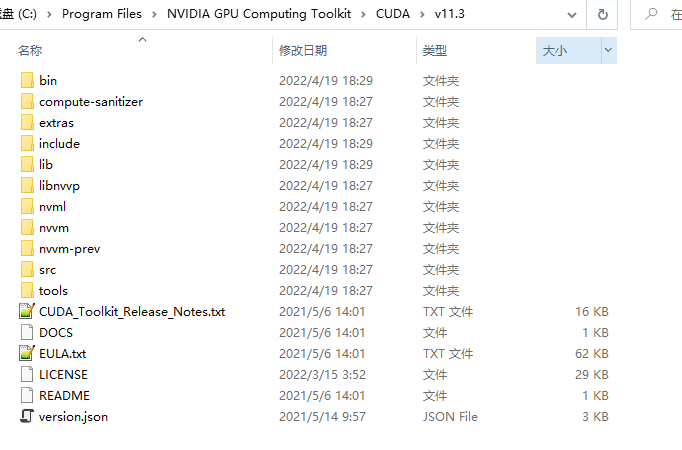
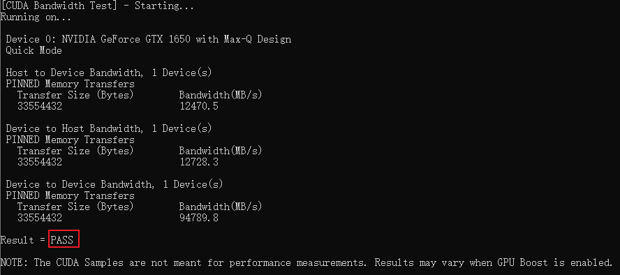
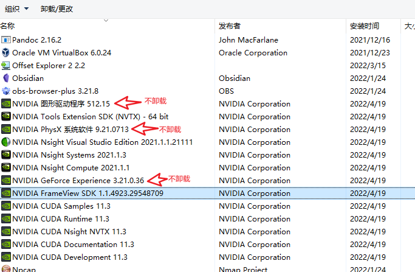

# 安装 CUDA

## 安装Nvidia显卡驱动

安装Nvidia显卡驱动前可以先检查Nvidia显卡驱动是否已安装。搜索 Nvidia控制面板 或 Nvidia Control Panel可以看到当前已经安装的显卡驱动及版本


如需安装显卡驱动，在官方驱动下载网站找到自己的显卡型号对应的驱动下载并安装: https://www.nvidia.cn/Download/index.aspx?lang=cn


## 安装Tookit和CuDNN

### 前言

windows10 版本安装 CUDA ，首先需要下载两个安装包

- CUDA toolkit（toolkit就是指工具包）
- cuDNN(cuDNN 是用于配置深度学习使用)

官方教程
CUDA：https://docs.nvidia.com/cuda/cuda-installation-guide-microsoft-windows/index.html

cuDNN：https://docs.nvidia.com/deeplearning/sdk/cudnn-install/index.html#installwindows

### 安装工具的准备

#### CUDA toolkit下载

CUDA toolkit下载地址: https://developer.nvidia.com/cuda-toolkit-archive

- 官网安装: https://developer.nvidia.com/cuda-downloads?target_os=Windows&target_arch=x86_64
- 官网说明文档: https://docs.nvidia.com/cuda/cuda-toolkit-release-notes/index.html

GA = General Availability,通用版本,指软件的通用版本。
RC=Release Candidate,含义 是"发布候选版",它不是最终的版本,而是最终版(RTM=Release To Manufacture)之前的最后一个版本

CUDA的版本是跟显卡型号有关还是驱动有关？

一般是驱动版本决定了能用的CUDA版本的上限，比如新版的显卡驱动可以支持老的CUDA runtime。但是老的显卡可能无法更新到最新的显卡驱动，比如Fermi显卡只能装到391驱动，因此只能用到CUDA9.1。除此之外，显卡硬件与CUDA compute capability相关，当然编译时也可以指定streaming multiprocessor。新的架构支持更多特性就是了。

| CUDA Toolkit                                      | Linux x86_64 Driver Version | Windows x86_64 Driver Version |
| ------------------------------------------------- | --------------------------- | ----------------------------- |
| CUDA 11.6 Update 2                                | >=510.47.03                 | >=511.65                      |
| CUDA 11.6 Update 1                                | >=510.47.03                 | >=511.65                      |
| CUDA 11.6 GA                                      | >=510.39.01                 | >=511.23                      |
| CUDA 11.5 Update 2                                | >=495.29.05                 | >=496.13                      |
| CUDA 11.5 Update 1                                | >=495.29.05                 | >=496.13                      |
| CUDA 11.5 GA                                      | >=495.29.05                 | >=496.04                      |
| CUDA 11.4 Update 4                                | >=470.82.01                 | >=472.50                      |
| CUDA 11.4 Update 3                                | >=470.82.01                 | >=472.50                      |
| CUDA 11.4 Update 2                                | >=470.57.02                 | >=471.41                      |
| CUDA 11.4 Update 1                                | >=470.57.02                 | >=471.41                      |
| CUDA 11.4.0 GA                                    | >=470.42.01                 | >=471.11                      |
| CUDA 11.3.1 Update 1                              | >=465.19.01                 | >=465.89                      |
| CUDA 11.3.0 GA                                    | >=465.19.01                 | >=465.89                      |
| CUDA 11.2.2 Update 2                              | >=460.32.03                 | >=461.33                      |
| CUDA 11.2.1 Update 1                              | >=460.32.03                 | >=461.09                      |
| CUDA 11.2.0 GA                                    | >=460.27.03                 | >=460.82                      |
| CUDA 11.1.1 Update 1                              | >=455.32                    | >=456.81                      |
| CUDA 11.1 GA                                      | >=455.23                    | >=456.38                      |
| CUDA 11.0.3 Update 1                              | >= 450.51.06                | >= 451.82                     |
| CUDA 11.0.2 GA                                    | >= 450.51.05                | >= 451.48                     |
| CUDA 11.0.1 RC                                    | >= 450.36.06                | >= 451.22                     |
| CUDA 10.2.89                                      | >= 440.33                   | >= 441.22                     |
| CUDA 10.1 (10.1.105 general release, and updates) | >= 418.39                   | >= 418.96                     |
| CUDA 10.0.130                                     | >= 410.48                   | >= 411.31                     |
| CUDA 9.2 (9.2.148 Update 1)                       | >= 396.37                   | >= 398.26                     |
| CUDA 9.2 (9.2.88)                                 | >= 396.26                   | >= 397.44                     |
| CUDA 9.1 (9.1.85)                                 | >= 390.46                   | >= 391.29                     |
| CUDA 9.0 (9.0.76)                                 | >= 384.81                   | >= 385.54                     |
| CUDA 8.0 (8.0.61 GA2)                             | >= 375.26                   | >= 376.51                     |
| CUDA 8.0 (8.0.44)                                 | >= 367.48                   | >= 369.30                     |
| CUDA 7.5 (7.5.16)                                 | >= 352.31                   | >= 353.66                     |
| CUDA 7.0 (7.0.28)                                 | >= 346.46                   | >= 347.62                     |

由于PyTorch最大只支持CUDA11.3，因此使用 CUDA 11.3.1 Update 1 版本


#### cuDNN下载

cuDNN地址如下，不过要注意的是，我们需要注册一个账号，才可以进入到下载界面。下载地址: https://developer.nvidia.com/rdp/cudnn-download

可以使用下面网址，查看适配的 cuDNN: https://developer.nvidia.com/rdp/cudnn-archive

由于在win10上使用CUDA 11.3，因此使用如下版本:


### CUDA 安装与配置过程

双击“exe文件”，选择下载路径，推荐默认路径，安装后该目录会自动被清理。


安装选项
- 如果你是第一次安装，尽量全选
- 如果你是第n次安装，尽量只选择第一个，不然会出现错误


不要选Visual Studio Integration，即使选了也不能成功安装。


记住安装位置，tensorflow要求配置环境


> 重点提醒：一定要记住这个路径，把这个路径保留下来，后面我们还会用到！！！

安装完成后，查看系统变量中是否添加了路径，如果没有需要自己添加。


测试环境是否安装成功。运行cmd，输入`nvcc --version`即可查看版本号；
set cuda，可以查看 CUDA 设置的环境变量。

```
C:\Users\as>nvcc --version
nvcc: NVIDIA (R) Cuda compiler driver
Copyright (c) 2005-2021 NVIDIA Corporation
Built on Mon_May__3_19:41:42_Pacific_Daylight_Time_2021
Cuda compilation tools, release 11.3, V11.3.109
Build cuda_11.3.r11.3/compiler.29920130_0

C:\Users\as>set cuda
CUDA_PATH=C:\Program Files\NVIDIA GPU Computing Toolkit\CUDA\v11.3
CUDA_PATH_V11_3=C:\Program Files\NVIDIA GPU Computing Toolkit\CUDA\v11.3
```

### cuDNN配置

1.解压
cuDNN叫配置更为准确，我们先把下载的 cuDNN 解压缩，会得到下面的文件：


下载后发现其实cudnn不是一个exe文件，而是一个压缩包，解压后，有三个文件夹，把三个文件夹拷贝到cuda的安装目录下。

CUDA 的安装路径在前面截图中有，或者打开电脑的环境变量查看，默认的安装路径如下：

```
C:\Program Files\NVIDIA GPU Computing Toolkit\CUDA\v11.3
```

后面那个v11.3是自己的版本号

CUDA 安装目录文件：



拷贝时看到，CUDA 的安装目录中，有和 cuDNN 解压缩后的同名文件夹，这里注意，不需要担心，直接复制即可。cuDNN 解压缩后的同名文件夹中的配置文件会添加到 CUDA安装目录中的同名文件夹中。


现在大家应该可以理解，cuDNN 其实就是 CUDA 的一个补丁而已，专为深度学习运算进行优化的。然后再参加环境变量

2.添加至系统变量
往系统环境变量中的 path 添加如下路径（根据自己的路径进行修改）

```
C:\Program Files\NVIDIA GPU Computing Toolkit\CUDA\v11.3\bin
C:\Program Files\NVIDIA GPU Computing Toolkit\CUDA\v11.3\include
C:\Program Files\NVIDIA GPU Computing Toolkit\CUDA\v11.3\lib
C:\Program Files\NVIDIA GPU Computing Toolkit\CUDA\v11.3\libnvvp
```

验证安装是否成功
配置完成后，我们可以验证是否配置成功，主要使用CUDA内置的deviceQuery.exe 和 bandwithTest.exe：
首先win+R启动cmd，cd到安装目录下的 `extras\demo_suite`,然后分别执行bandwidthTest.exe和deviceQuery.exe,应该得到下图:




## 安装PyTorch

PyTorch官网安装: https://pytorch.org/get-started/locally/

这里在win10上使用最新的PyTorch


# 卸载CUDA

如果CUDA Tookit装错了，那就需要卸载旧的CUDA Tookit，安装新的CUDA Tookit。

### 1.前言

别用杀毒软件来卸载这个。打开电脑的控制面板，找到程序，卸载程序
点击当天安装的时间，会找到刚才装的cuda软件，也包括以前NVIDIA的驱动软件，因为被更新了，所以也显示在当天安装的软件中。

### 2.卸载开始

对于含cuda字眼的，和结尾版本号是11.3 的可以卸载。
如果不确定那个程序能不能删除，可以搜索试试看，程序什么用途的。NVIDIA的软件一个个都有其独立卸载程序，不用担心卸载顺序。
**1.留下：**NVIDIA的图形驱动程序、NVIDIA Physx系统软件，NVIDIA GeForce Experience，如果你有这3个软件，就别卸载。
**2.卸载：** 

1. 推荐排序。 点击顶部时间小三角排序，可发现一个叫NVIDIA Nsight HUD Launcher 的带眼睛图标的排列在上面，挺大的。然后从下往上卸载，跳过保留的**NVIDIA图形驱动、NVIDIA Physx系统软件、NVIDIA GeForce Experience**。软件名含cuda的，11.3的，sdk，NVIDIA Nsight HUD等，这些都可以卸载掉。

   

2. 卸载完后，你会发现电脑—开始—所有程序，里面那个关于NVIDIA的程序文件不见了。存在的话，也可以看看里面还剩下什么，可以搜索看看。当然，C盘里面`C:\Program Files\NVIDIA GPU Computing Toolkit`文件也可以删除了。

3. 用杀毒软件垃圾扫描下，清理下电脑，主要是清理[注册表](https://so.csdn.net/so/search?q=注册表&spm=1001.2101.3001.7020)

4. 卸载结束

# 参考

1. [win10如何查看NVIDIA驱动的版本](https://blog.csdn.net/weixin_44997802/article/details/122197297)
2. [【CUDA】cuda安装 （windows10版）](https://blog.csdn.net/weixin_43848614/article/details/117221384)
2. [win10 卸载cuda](https://blog.csdn.net/u013066730/article/details/85054164)