# AI边缘项目开发

## 一. 第一个深度学习项目

相信很多人可能跟我一样，接触的第一个深度学习项目，应该就是**手写数字/汉字的识别。**

18年底面试目前的公司时，复试的考题就是**手写汉字识别**。

因为是第一个项目，所以对于考题现在还记忆犹新。

当时的考题主要是中文字符分类，提供了3755个汉字，每个汉字有若干个手写字符。

**题目很简单，而要求是：**

① 使用任意一种深度神经网络框架下，编写程序，实现识别字符的功能；

② 通过修改超参、网络参数、网络结构（替换或增加网络层）等方式，提高模型的分类准确率；

③ 完成报告，说明字符分类的原理、修改网络参数或结构的理由和具体操作、模型性能分析；

④ 提交完整可执行代码，附带代码执行说明文档。

当时对于AI行业还不是很熟，经过大量的检索及思考。

最终参考论文**《Deep Convolutional Network for Handwritten Chinese Character Recognition》**，选用了一个基于VGG和Alexet的M5网络（包含3个conv3卷积层和2个全连接层），并使用Tensorflow构建了一个3755类的图像分类器，完成了任务。

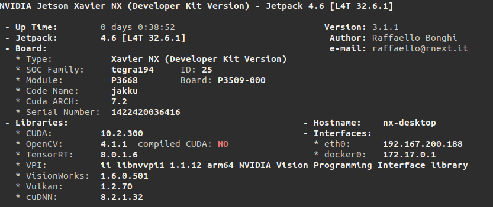

通过这个任务，在短时间内，我恶补了机器学习和深度学习相关的基本概念（如模型训练集、验证集、测试集等）。

厘清了人工神经网络和CNN的区别，并熟悉了深度学习软件环境的安装和使用，熟悉了在linux下开发编程的基本流程。

**那个时候，感觉学习的速度，和劲头是最足的。**

通过手写汉字识别，我算是简单入了门，了解了图像分类的基本原理，之后慢慢地也开始接触目标检测、特征提取、目标追踪等相关的模型和算法。

当时Pytorch还没有现在这么火，大家用的比较多的是Tensorflow和Caffe。

得益于Tensorflow完备的用户手册和官方教程，学习的路上省力不少。

慢慢地在一次次地编译Caffe、FFmpeg、Opencv和Debug中，对Linux系统、环境变量、软件多版本共存、库包依赖关系、Cmake、Makefile、CUDA等有了更加深刻的认识。

终于后来也可以用Caffe实现自定义算子和神经网络层了。

后来我加入了公司的的**项目工程化落地小组**，开始参与基础平台的研发和具体项目的开发：从视频编解码到模型推理加速，从Opencv到FFmpeg，从Gstreamer到DeepStream，从CUDA到Tensor RT。

慢慢地我开始认识到模型训练和推理仅仅是一个开始，在 AI项目落地的过程中，其实还有相当大一部分不AI的工作，这些工作甚至占据了项目开发的绝大部分时间。

**其中，也有很多值得我们思考和解决的问题：**

① 比如如何缩短项目开发周期，快速应对不同客户的多样需求，完成POC演示，推进项目落地？

② 针对不同的实际场景，如何对算法硬件平台进行选型？

③ 如何综合现有技术手段，解决CV以及深度学习算法无法解决的盲区问题，为客户提供最优的解决方案？

④ 如何充分挖掘边缘计算设备的算力，降低单路视频分析的成本？

⑤ 如何形成数据的闭环，在项目部署后便捷地采集数据，不断迭代优化模型，提高客户的满意度？

上面主要是工作中，对于AI项目的一些思考。

下面再回到本次分享的主题，聊聊在项目中，**为什么使用边缘计算设备？**

## 二. 从GPU到边缘计算设备

在详细介绍边缘设备前，我们先了解下AI项目的一般开发交付流程。

### 2.1 AI项目的一般开发交付流程

AI项目的开发过程中，**通常包括以下环节：**

**① 数据采集：**现场数据采集、数据标定、数据集校验；

**② 模型训练：**设计模型、训练模型；

**③ 模型部署：**模型转化、模型量化、模型裁剪、模型微调；

**④ 业务开发：**根据项目的需求，设计业务规则，完成相应业务逻辑处理代码的编写调试；

**⑤ 项目部署：**制作安装包或者docker镜像，安装部署在目标平台上；

**⑥ 模型优化：**根据现场的应用采集数据，优化模型

在整个流程有两个难点：**一是数据，二是需求。**

有时候没有数据，模型达不到理想的效果，可能客户都不给试用的机会，更别提数据采集优化模型了；

有时候客户很配合，数据不是问题，但是客户的需求很多，要求很高，甚至有些需求目前的AI根本做不到，但是为了生存也只能硬着头皮上，还要应对客户随时都可能“微调”的新要求。

**所以现实往往是：**

① 要么做了一堆没有客户愿意买单的POC项目，要么做了几个迟迟无法完成交付，钱也不多的小项目。

② 客户以为我们提供的是个拿来即用的成熟产品，然而事实却仅仅是个待采集数据进一步优化的试验品。

因此，面对纷繁复杂的应用场景，**客户自己也可能不太清楚的不确定需求。**

AI公司要想走出研发投入多、成本高、项目交付周期长的困局，必须要解决**规模复制效益**的问题，集中力量向某个方向发力，打造有技术壁垒或者市场壁垒的产品。

哪怕是做项目，也应当按照做产品的思维设计和组织，把项目开发变成搭积木，因为**只有可复制的产品，才能分摊高昂的研发成本，应对快速变化的市场需求。**

### 2.2 AI产品常见的三种交付形态

了解了AI项目开发的流程，再看一下客户产品的交付。

在工作中，面对不同的客户，通常需要交付不同的非标类产品，所以先聊一下常见的交付方式。

行业场景和客户需求虽然五花八门，但总的来说，**交付的产品通常有3种形态：**

**（1）服务Service：**

AI模型的部署服务，客户端可以通过HTTP/REST或GRPC的方式来请求服务。

输入一张图片/一段视频，输出图片/视频的分析结果，通常**按次数收费**或者**按时间段授权**。

比如百度AI市场上提供的各种API服务：

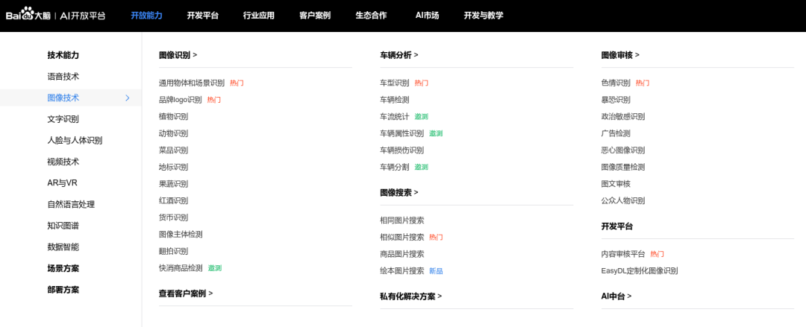

这种形式，业务流程相对是单一的，主要需要考虑的是充分利用GPU算力资源，能够提供**稳定的高吞吐量的服务。**

这种服务通常部署在GPU服务器上，可能是客户局域网内的服务器，也可能是公有云上的服务器。

市面上也有一些成熟的商用框架可以使用，如NVIDIA的Triton Inference Server, Google的TF Servering，百度的Paddle Serving等。

Triton是 NVIDIA 推出的 Inference Server，专门做 AI 模型的部署服务。

**而客户端可以通过HTTP/REST或GRPC的方式来请求服务**，特性包括以下方面：

① 支持多种框架，例如 Tensorflow、TensoRT、Pytorch、ONNX甚至自定义框架后端；

② 支持 GPU 和 CPU 方式运行，能最大化利用硬件资源；

③ 容器化部署，集成 k8s，可以方便的进行编排和扩展；

④ 支持并发模型，支持多种模型或同一模型的不同实例在同一GPU上运行；

⑤ 支持多种批处理算法，可以提高推理吞吐量；

**（2）开发包SDK或者功能组件：**

有的中间商或集成商以及一些传统的非AI公司，需要用**深度学习解决问题的能力。**

把基于深度学习的算法能力，集成到自己的业务系统中，为最终用户提供服务。

这时，他们会寻找第三方的合作伙伴，提供一套封装了**深度学习算法能力**的SDK或者功能组件。

向他们的业务系统赋能AI算法能力，比如百度的EasyDL-零门槛AI开发平台，云从科技的人脸识别服务等。

**下图是百度EasyDL开发平台的功能示意图：**

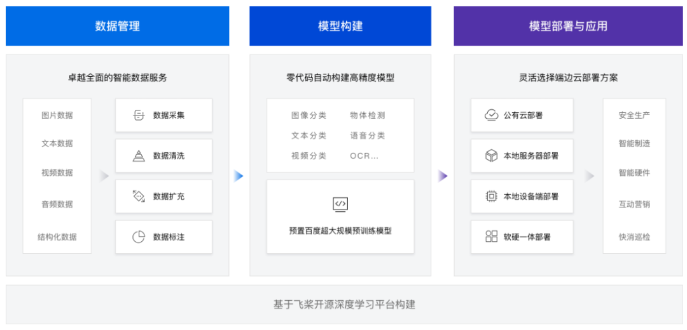

**（3）应用Application：**

这种形式的产品，通常面向的是**某个场景的最终用户。**

因此交付的产品，是一整套包括**交互界面在内的软件系统**，有时也会将硬件一起捆绑交付。

对这类产品，用户需要的其实只是**应用的分析输出结果。**

比如绘制了违规提醒框的实时画面，web、邮件甚至手机短信联动的告警消息，某个时段或者满足某种条件的数据分析报表等。

这类产品一方面需要提供友好的操作界面供用户查看使用，同时可能还需要提供对接用户第三方平台的接口，将分析产生的告警结果等信息，推送到用户的业务管理平台。

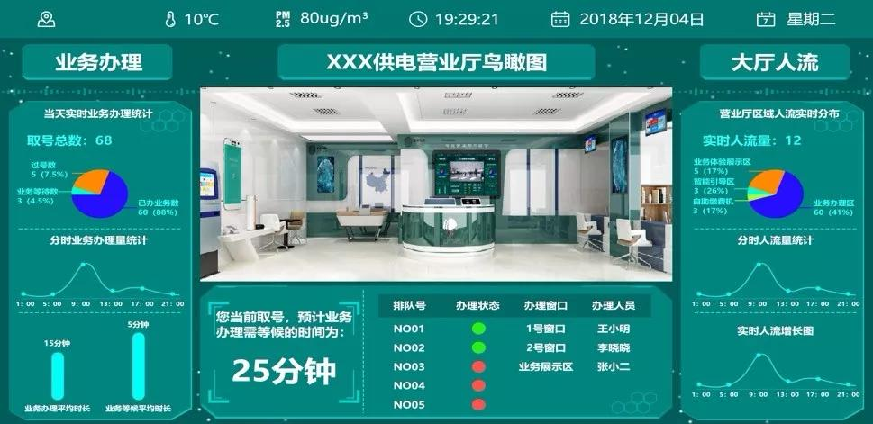

### 2.3 应用类产品的基本框架

当然对于大多数中小型公司来说，主要做的还是**应用类项目。**

这些项目，并不只是单个的功能，而是一套比较完整的系统。

以视频分析为例，通常包括：**视频结构化引擎**、**业务中台**、**管理平台**等。

**（1）视频结构化引擎：**

通过分析视频内容，生成包含了目标坐标、类别、属性、特征、追踪id等信息的结构化数据，供业务中台做进一步的业务逻辑处理。

为了简化开发流程，提高代码复用率，降低代码维护难度，视频结构化引擎作为一个基础平台，应当适配不同硬件平台，屏蔽硬件差异，向管理平台提供统一的接口，同时支持根据不同需求灵活配置任务流程。

视频结构化引擎主要分成三个部分：

**① 视频源接入：**支持多种接入，图片，视频文件，rtsp流，GB28181流，海康SDK（工业相机）

**② 流程Pipeline配置和创建：**

a. 输入数据预处理：对输入数据做尺寸缩放、归一化等；

b. 模型推理：使用多种硬件平台进行推理，如NVIDIA GPU、Jetson、Bitmain、Cambricon等

c. 输出数据后处理：对模型的结果，进行后处理，得到可以显示的结果；

**③ 结果输出：**终端打印、写入Redis、输出画面到屏幕、保存结果到视频文件、推送rtsp流等。

**（2）业务中台：**

主要对业务进行逻辑处理，通常由业务逻辑和对外接口构成。

**（3）管理平台：**

视频结构化引擎或者业务平台可能是分布式的，部署在同一局域网内的不同主机、甚至是不同局域网内的不同主机上，管理平台用来管理这些主机，通常包含以下部分：

**① 主机管理**

**② 视频源管理**

**③ 任务管理**

**④ 用户交互界面与结果查看**

**⑤ license认证与管理**

**比如下图是我们系统中，管理平台的图示。**

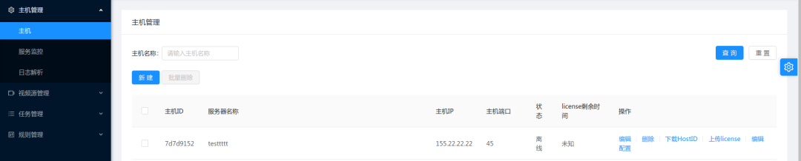

### 2.4 为什么选择边缘计算设备?

了解AI项目的开发流程、交付方式，以及基本架构，下面再回到本文的核心：**边缘计算设备。**

**边缘计算设备，其实是相对于云计算而言的。**

不同于云计算的中心式服务，边缘服务是指在靠近物或数据源头的一侧，采用网络、计算、存储、应用核心能力为一体的开放平台，**就近提供最近端服务。**

其应用程序在边缘侧发起，为了产生**更快的网络服务响应。**

满足行业在实时业务、应用智能、安全与隐私保护等方面的基本需求。

由于数据处理和分析，是在**传感器附近或设备产生数据的位置进行的**，因此称之为边缘计算。

**因此我们可以看出，边缘计算的优点：**

**① 低延迟：**计算能力部署在设备侧附近，设备请求实时响应；

**② 低带宽运行：**将工作迁移至更接近于用户，或是数据采集终端的能力，能够降低站点带宽限制所带来的影响；

**③ 隐私保护：**数据本地采集，本地分析，本地处理，有效减少了数据暴露在公共网络的机会，保护了数据隐私；

当然许多同学，可能都是使用GPU服务器做视频分析，对边缘计算设备接触不一定多，但是有的场景下**，直接使用GPU服务器做视频分析，存在几个问题：**

① 许多场景下，**数据源（摄像头）是分布式的**，可能分布在不同的子网内，甚至分布在不同的城市，使用GPU服务器集中处理延时大、带宽占用高、能耗高（因为传输的数据中大部分是无效信息）；

对于分散的工地或者连锁店店铺等场景，如果要集中处理，不仅要占用宝贵的专线带宽，还要内网穿透，麻烦且不经济；

② 有的场景下使用GPU，会造成算力过程、资源浪费，比如连锁店铺的客流统计，每个店铺可能只有2-4路摄像头，少的甚至只有1路，使用GPU显然大材小用；

③ 相比较纯软件的产品，客户更倾向于为软硬件一体的产品买单；

再举一个**更直观的案例**，更明显的看出边缘设备的优点，之前在知乎上看到的。

以波音787为例，其每一个飞行来回可产生TB级的数据。

美国每个月收集360万次飞行记录；监视所有飞机中的25000个引擎，每个引擎一天产生588GB的数据。

这样一个级别的数据，如果都通过远程，上传到云计算的服务器中，无论对于算力和带宽，都提出了苛刻的要求。

风力发电机装有测量风速、螺距、油温等多种传感器，每隔几毫秒测一次，用于检测叶片、变速箱、变频器等的磨损程度，一个具有500个风机的风场一年会产生2PB的数据。

如此级别的数据，如果实时上传到云计算中心并产生决策，无论从算力和带宽的角度，都提出了苛刻的要求，更不要说由于延迟而产生的即时响应问题。

面对这样的场景，边缘计算就体现出它的优势了。

由于部署在设备侧附近，**可以通过算法即时反馈决策**，并可以过滤绝大部分的数据，有效降低云端的负荷，使得海量连接和海量数据处理成为可能。

**因此，选择使用服务器还是边缘计算设备，主要还是考虑哪种方式更符合场景需求，哪种方式更便捷更经济。**

如果应用场景需要集中分析大量数据，比如**几十路甚至上百路摄像头**，那肯定还是应当选择x86服务器。

当然这种情况不一定只有Nvidia GPU一种选择，比特大陆、华为、寒武纪都有PCIE的计算加速卡可以选择；

如果应用场景分布在不同地点的节点，并且每个节点要分析的**摄像头数量在10-20路以下**，那么选择边缘计算设备显然更经济更有效；

有的时候甚至可以直接选用带AI处理芯片的智能摄像头。

### 2.5 边缘计算设备的特点

了解了选择边缘计算设备的原因，我们再来看一下**边缘计算设备的特点：**

**（1）算力有限：**常常在几T～几十T INT8 OPS之间

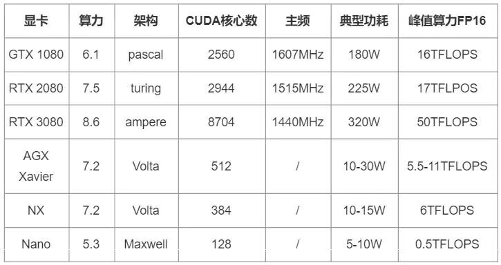

表格中的前3项是NVIDIA的GPU，其峰值算力为根据CUDA核心数、主频，折算为FP16而计算的理论值，估算公式为：

**计算能力的峰值 = 单核单周期计算次数 × 处理核个数 × 主频**

后三项为NVIDIA的边缘计算模组Jetson的不同产品，峰值算力为产品手册中给出的参考值。

这些峰值算力虽然并不完全准确，但也基本代表了设备的算力情况。

**不准确的原因主要有两方面：**

① 这些是理论值，实际中还要考虑线程调度、数据拷贝、异构同步等，实际算力肯定达不到理论值；

② 除了CUDA核心，设备内还会有其他加速单元，比如Tensor Core、DLA（深度学习加速器）。

以Jetson AGX Xavier为例，他还有48个Tensor Core，以及DLA，(2x) NVDLA Engines* | 5 TFLOPS (FP16)，相当于额外的5TFLOPS算力。

因此官方手册中会写AGX Xavier的AI算力是32TOPS INT8（16TOPS FP16）。

**（2） 功耗低：**通常边缘计算设备的功耗在5-30W，可以通过太阳能供电，进行户外移动作业。

**（3） 硬件接口丰富：**便于与其他设备/系统对接。

**（4） 体积小，重量轻：**安装简便灵活，便于分布式部署和扩展。

## 三. 几种边缘计算设备平台

掌握了边缘设备的一些基础知识，我们再了解市面上常用的一些边缘计算设备。

市场上推出商用深度学习计算加速设备的厂商其实有很多，只不过在**训练领域，**主要还是**英伟达**占据了大部分市场份额。

除此之外，比特大陆（算丰Sophon），寒武纪（思元MLU），华为（昇腾Ascend，海思），晶晨（Versillion），依图（QuestCore），还有英特尔（Movidius VPU），谷歌（TPU），百度，特斯拉（Dojo D1），赛灵思都有自己的深度学习处理器或者解决方案。

**（1） 训练平台：**通常以英伟达Nvidia-GPU为主；

**（2）推理平台：**云端和设备端，CPU(x86 arm)，GPU，NPU，TPU，FPGA，ASIC；

**下图是相关平台的图示：**

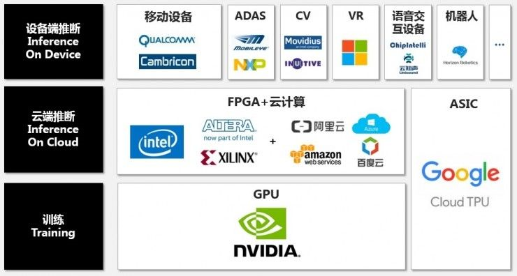

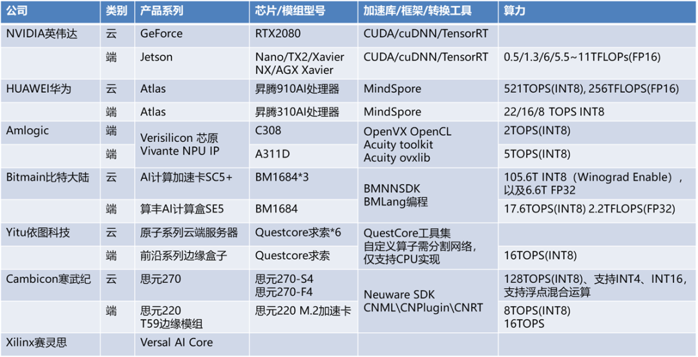

**下面，我再重点介绍一下几种常见的边缘计算设备。**

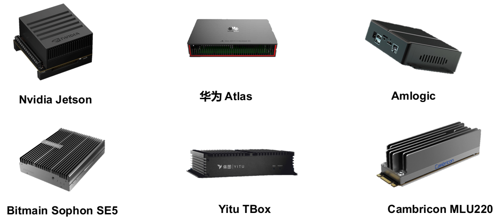

### 3.1 NVIDIA Jetson

**NVIDIA Jetson**是NVIDIA为新一代自主机器设计的嵌入式系统，是一个AI平台 ，这个系列已经有不少成员了。

**3.1.1 硬件参数**

目前Jseton系列也有很多不同的型号，下图是不同型号的相关参数：

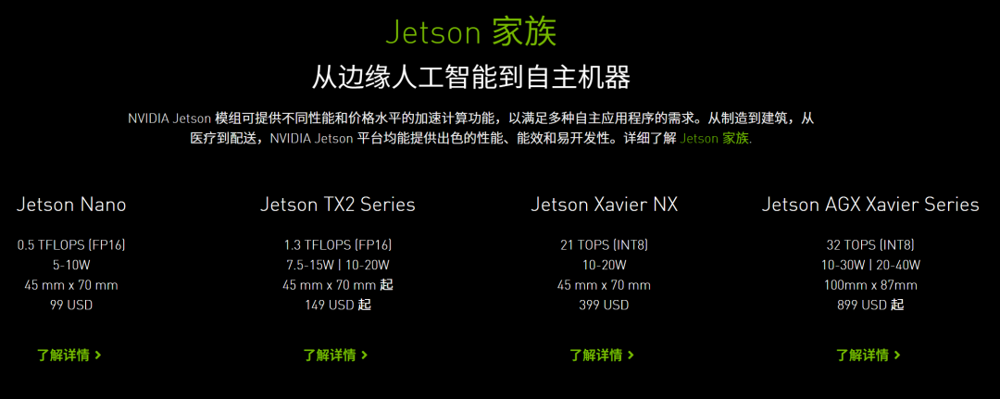

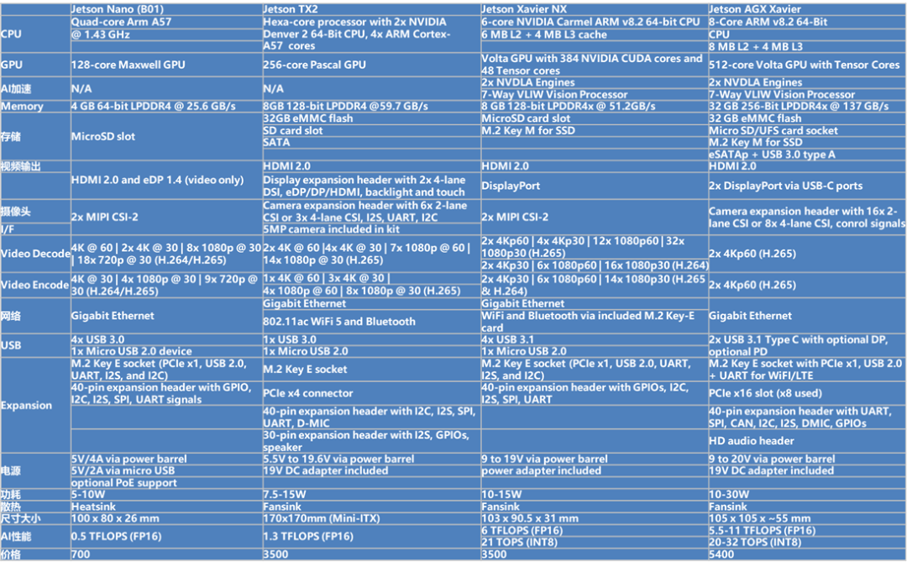

**3.1.2 开发工具链**

当然每个边缘设备平台，还有专门的开发工具链。

Jetson也是NVIDIA生态的一员，因此，也是基于CUDA、cuDNN以及TensorRT的。

与GPU不同，Jetson所依赖的软件库包是以Jetpack的形式整体打包提供的，其中包含了操作系统、CUDA、cuDNN、TensorRT、Opencv、视频编解码等丰富的库包及API接口。

目前，官方最新的版本是JetPack 4.6，其内的软件版本相关信息如下图：

其他需要的软件，比如支持支持CUDA的OpenCV、CUDA的Pytorch，可以通过源码交叉编译或者从NVIDIA的官方论坛下载。

英伟达提供了丰富的SDK包供各个领域和方向的用户选择，比如音视频分析中常用的**数据流分析工具包Deeptream。**

开发人员可以GStreamer插件的形式自定义插件，构建个性化的视频分析管道，通过硬件加速完成各种任务，实现深度学习任务的快速部署。

**比如下图就是一个典型的视频分析管道：**

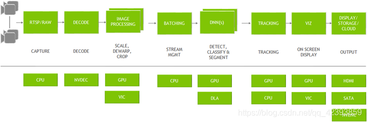

### 3.2 华为 atlas

Atlas是华为基于昇腾系列AI处理器和业界主流异构计算部件，打造的智能计算平台。

通过模块、板卡、小站、AI服务器等丰富的产品形态，打造面向“端、边、云”的全场景AI基础设施方案，可广泛用于“平安城市、智慧交通、智慧医疗、AI推理”等领域。

#### **3.2.1 硬件参数**

**下图是Atlas各个版本的相关参数及产品图示：**   

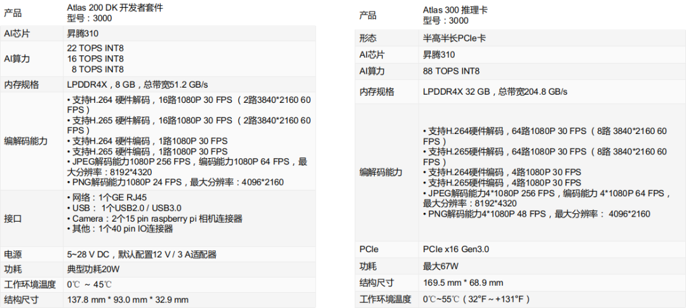

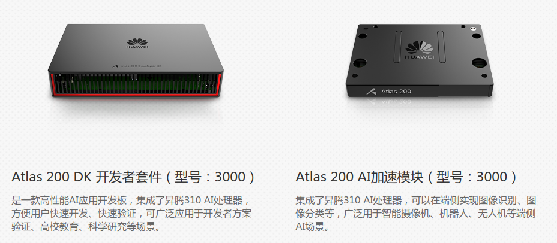

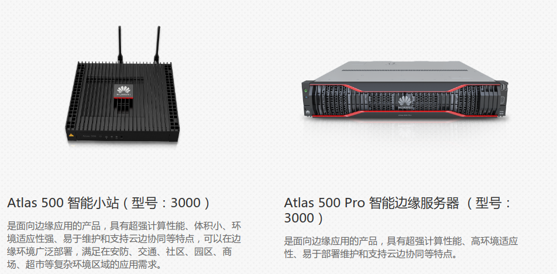

**3.2.2 开发工具链**

华为atlas的开发工具链主要有两部分：

**（1）mind studio：**这是基于**昇腾AI处理器的开发工具链平台**，提供了基于芯片的算子开发、调试、调优以及第三方算子的开发功能。

同时还提供了网络移植、优化和分析功能，另外在业务引擎层提供了一套可视化的AI引擎拖拽式编程服务，极大的降低了AI引擎的开发门槛。

不过mind studio是通过Web的方式向开发者提供一系列的服务，其实也不是个必需品，许多开发者在开发过程中只是用它来**查看日志。**

因为atlas的日志都是加密的，必须使用mind studio来查看。

**（2）DDK（Device Development Kit）：**设备开发工具包，为开发者提供基于昇腾AI处理器的相关算法开发工具包，旨在帮助开发者进行快速、高效的人工智能算法开发。

DDK可以用于构建相关工程的编译环境，集成了TE、DVPP、流程编排等昇腾AI处理器算法开发依赖的头文件和库文件、编译工具链、调试调优工具以及其他工具等。

**下图是华为atlas开发工具链的示意图：**

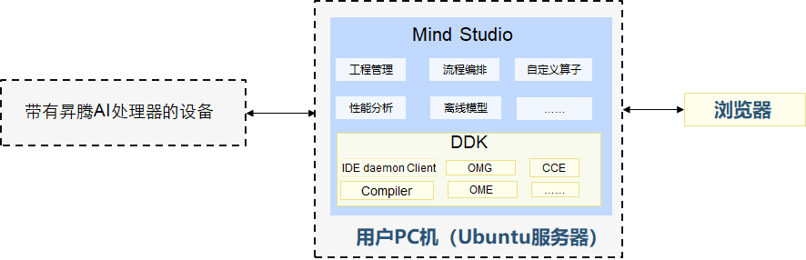

**需要注意的是，**Atlas500小站是主从架构的，主机端host侧为华为自研海思Hi3559A，从机端device侧为Atlas 200 AI加速模块，host和device上运行着2个相互独立的系统，也就是device侧的Atlas200上也是有arm cpu的。

这就导致，调试过程中有时很别扭，比如，程序运行过程中，想要查看Atlas200的打印信息，只能通过mind studio查看日志。

值得一提的是，为了高效使用Ascend 310芯片的算力，华为提供了Matrix框架来完成推理业务迁移，有点类似gstreamer的味道。

把每个功能节点抽象成流程的基本单元Engine，每个Engine对应着一个独立的线程。

在Graph配置文件中配置Engine节点间的串接和节点属性（运行该节点所需的参数）。

节点间数据的实际流向根据具体业务在节点中实现，通过向业务的开始节点输入数据激活Graph。

每个Graph是一个独立的进程。

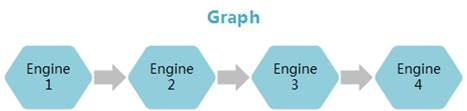

Mind Studio也提供了可视化的界面用于配置Graph：

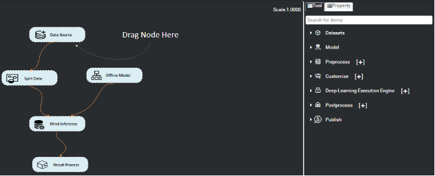

Atlas500智算小站整体开发体验良好，特别是Matrix框架，将场景抽象，便于灵活地应对不同业务需求。

但device侧在运行中崩溃以后问题不好排查，此外，Graph中各个Engine节点之间通信依赖的HDC如果崩溃，也会直接影响业务进程的运行。

### 3.3 比特大陆 Sophon SE5

比特大陆，对，就是那家做矿机起家的比特大陆，凭借其在矿机芯片领域积累的技术实力，也积极向人工智能方向发力，推出了一系列性能强劲的AI算力产品（Sophon系列），包括算力芯片、算力服务器、算力云，主要应用于区块链和人工智能领域。

**下图是其官网列出的主要产品：**

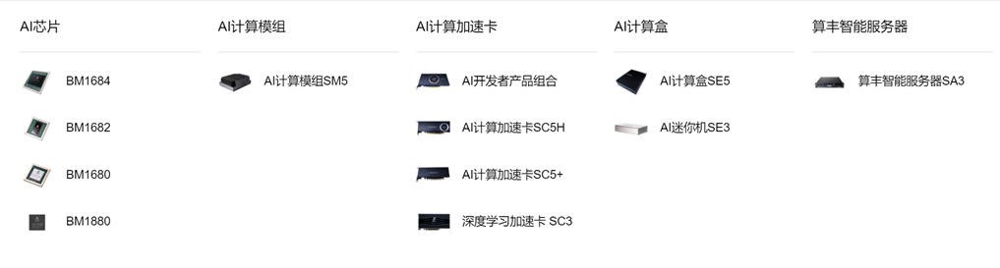

**3.3.1 硬件参数**

SOPHON SE5智算盒是一款高性能、低功耗边缘计算产品，搭载算丰科技自主研发的第三代TPU芯片BM1684，INT8算力高达17.6TOPS，可同时处理16路高清视频，支持38路1080P高清视频硬件解码与2路编码。

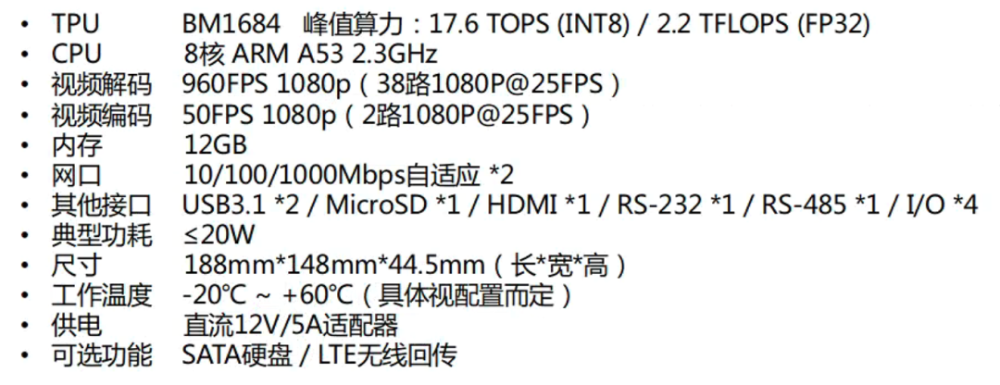

**3.3.2 开发工具链**

比特大陆提供了**BMNNSDK（SOPHON Neural Network SDK）一站式工具包**，提供底层驱动环境、编译器、推理部署工具等一系列软件工具。

BMNNSDK，涵盖了神经网络推理阶段所需的模型优化、高效运行时支持等能力，由**BMNet Compiler**和**BMRuntime**两部分组成。

BMNet Compiler 负责对各种深度神经网络模型（如caffemodel）进行优化和转换，充分平衡EU运算和访存时间，提升运算的并行度，并最终转换成算丰科技TPU支持的bmodel模型。BMNet Compiler支持Caffe、Darknet、Tensorflow、Pytorch、MXNet等框架模型的转换，暂不支持ONNX模型的直接转换。

如果转换失败，提供BMLang编程语言，通过CPU指令或者BMKernel底层语言实现不支持的算子或层。

BMRuntime 负责驱动TPU芯片，为上层应用程序提供统一的可编程接口，使程序可以通过bmodel模型进行神经网络推理，而用户**无需关心底层硬件实现细节。**

此外，BMNNSDK重新编译了FFmpeg和OpenCV，增加了硬件加速支持，同时提供了一套高级接口SAIL，支持通过C++、Python直接使用SAIL接口编程。

### 3.4 Amlogic

Amlogic，晶晨半导体是全球无晶圆半导体系统设计的领导者，为智能机顶盒、智能电视、智能家居等多个产品领域，提供**多媒体SoC芯片**和**系统级解决方案。**

下图是搭载了其A331D芯片的智能盒子NeuBoard的相关参数，具有功耗低、性价比高的优点，有需要的同学也可以参考：

Amlogic的A311D中集成了ARM、NPU、GPU、VPU，NPU，NPU IP是由芯原微电子（Versilicon）提供的Vivante® NPU IP。

**Versilicon**提供了一套基于OpenVX的工具套件，Acuity Toolset帮助用户将原生模型转换为Vivante® NPU IP支持的模型。

Acuity Toolset支持Tensorflow、Tensorflow-Lite、Caffe、PyTorch、ONNX、TVM、IREE/MLIR等框架。

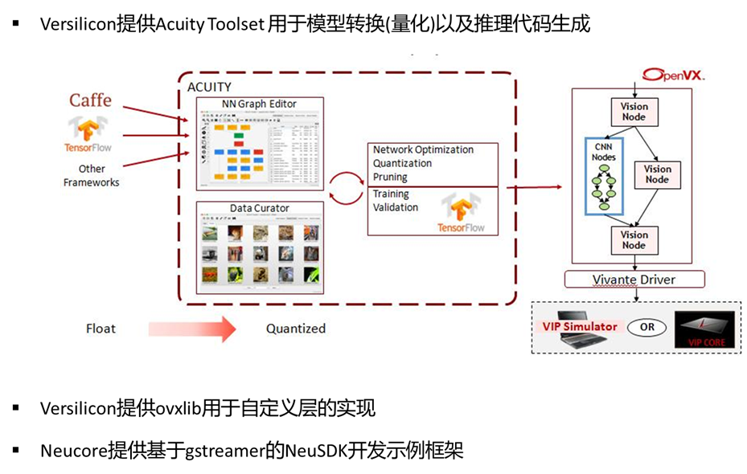

OPEN AI LAB 开源的针对嵌入式设备开发的轻量级、高性能并且模块化引擎Tengine就支持Vivante® NPU IP。

此外，**上海锘科智能科技（Neucore）**，Neucore也基于gstreamer开发了一套独有的HCS框架，提供Linux和Android下的NeuSDK，可帮助客户实现算法在CPU、NPU、GPU、DSP等多种架构的快速移植和部署。

NeuSDK中的Neucore Graph为客户提供了一种更加便捷灵活的pipeline搭建方式，用户可以使用SDK按照gstreamer插件的实现方式一样实现自定义插件，并在web界面中通过拖拽式的操作快速自定义一系列的算法流程，完成任务部署。

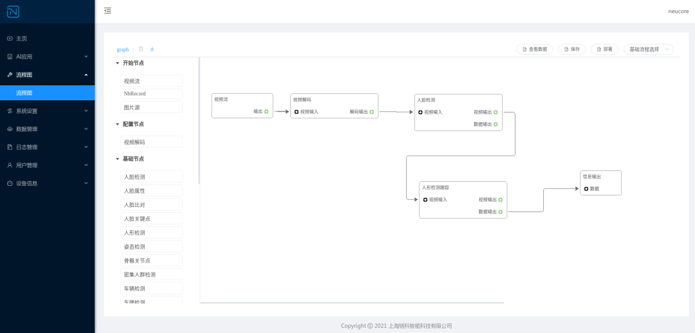

### 3.5 寒武纪 MLU

中科寒武纪其实是较早布局深度学习处理器的企业之一，也是目前国际上少数几家全面系统，掌握了通用型智能芯片及其基础系统软件研发和产品化核心技术的企业之一。

且能提供**云边端一体**、**软硬件协同**、**训练推理融合**、**具备统一生态的系列化智能芯片产品**和**平台化基础系统软件。**

寒武纪的产品线也比较丰富，但由于它本身是专注做芯片、模组与基础软件的，并不提供成品的边缘计算设备或服务器，如果需要，可以从其合作的下游厂商处购买。

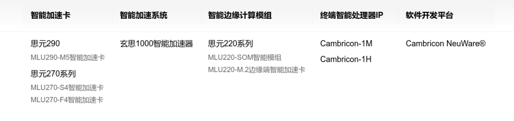

下图是寒武纪MLU第一到第三代的相关参数：

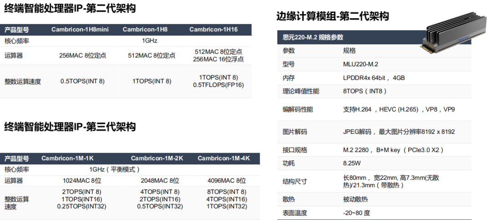

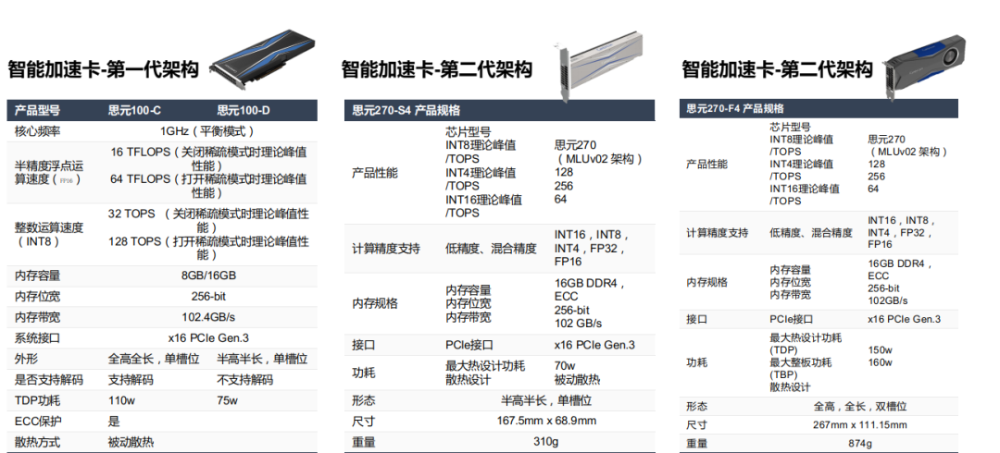

寒武纪人工智能开发平台（Cambricon NeuWare®）是寒武纪专门针对其云、边、端的智能处理器产品打造的软件开发平台， Neuware采用端云一体的架构，可同时支持寒武纪云、边、端的全系列产品。

**下图是寒武纪SDK的架构图及常用的工具包：**

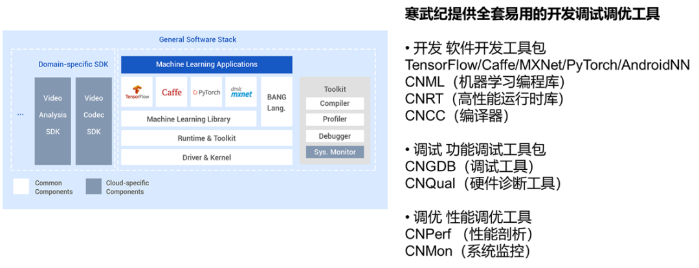

## 四. 边缘计算设备的使用

### 4.1 边缘计算设备的选型思路

通过前面边缘设备的介绍，我们知道市面上有很多款边缘计算设备。

那么针对各种不同的边缘设备，当算法训练完成，想要用边缘设备部署时，如何选型？**应该关注哪些参数和性能呢？**

**其实主要是以下几点：**

**① 性能：**arm核心数量和主频、内存与AI模组专用内存、深度学习推理能力、视频编解码能力、jpeg编解码以及其他视觉运算硬件加速能力。

**② 价格：**在性能都能满足要求的情况下，价格自然成为选型的决定因素。

特别是同一个AI模组，其实会有多家厂商竞品可供选择。

比如浪潮的EIS200和凌华的DLAP-211-JNX都是基于NVIDIA的Jetson NX模组；

**③ 工具链：**支持主流框架模型情况，算子及网络模型支持情况，接口易用程度，SDK、技术论坛完备程度和技术支持力度；

**④ 外围接口：**板载的外围接口是否能满足应用场景需求；

**⑤ 功耗：**有的客户可能因为作业环境的限制对功耗要求比较严格，比如是在野外使用太阳能供电，但通常较低的功耗也意味着较低的算力。

### 4.2 边缘计算设备比较

下图是我整理的，几种边缘设备主要参数的对比图：

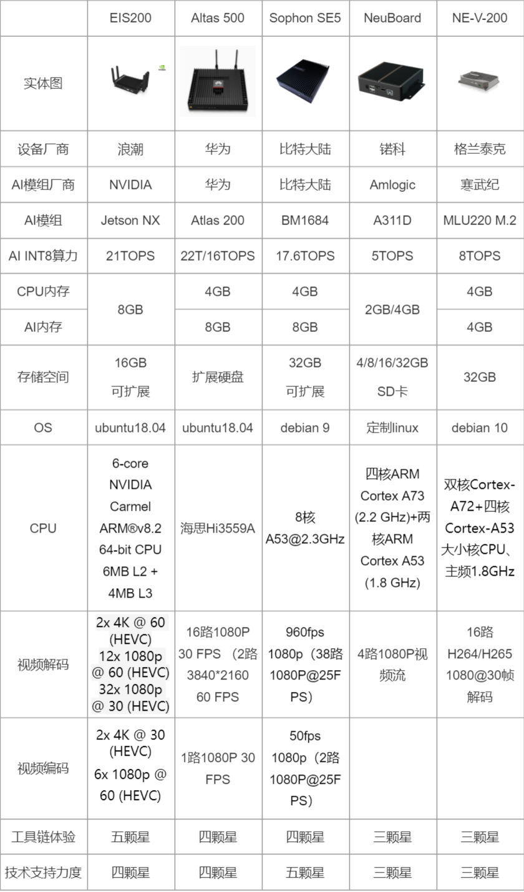

### 4.3 边缘计算设备开发与GPU服务器开发的区别

**我们再看一下，与GPU服务器相比，在边缘计算设备上的AI应用开发部署的主要区别有：**

**① CPU架构不同：**GPU服务器是x86架构，GPU插在主板的PCIE插槽内；

而边缘计算设备是基于aarch64的整体设备，其中有ARM CPU和GPU以及NPU、TPU、VPU等；

**② 资源有限：**边缘设备由于资源有限，底层要使用C/C++推理，程序需要充分优化，以压榨硬件资源性能；

**③ 交叉编译：**C/C++代码直接在边缘计算设备上编译比较耗时，有的甚至不支持在设备中编译，通常通过交叉编译的方式，在宿主机上生成代码，再拷贝到边缘计算设备中执行；

**④ 远程调试：**由于需要使用gdb server远程调试，VSCode很好用；

**⑤ 软件安装：**边缘计算设备通常运行的是裁剪/定制的linux，debian/ubuntu可以使用apt在线安装库包，但有的边缘计算设备内的linux是精简版的，没有包管理工具，安装软件只能源码交叉编译；

### 4.4 边缘计算设备的一般开发流程

了解了边缘设备的内容，我们再看一下边缘设备的一般开发流程，通常由**几部分组成：**

**（1）基础平台开发：**深度学习分析引擎、业务中台、管理平台；

**（2）模型转换、验证及优化：**使用硬件平台厂商提供的模型转换工具套件将caffe、tensorflow、pytorch、mxnet、darknet、onnx等模型转换为目标平台模型，必要时进行模型量化以及模型finetune；对不支持的模型或层，自定义算子、插件实现

**（3）视频结构化引擎代码适配：**主要是视频流及图片编解码、推理等模块，任务管理、流程控制、前后处理等其他代码通常都是跨平台的；

**（4）交叉编译及测试：**使用交叉编译工具链编译及调试代码，交叉编译工具工具链主要包括2部分内容，linaro gcc g++编译及调试器和包含了目标平台系统环境及软件库的所有代码文件；

**（5）业务代码实现：**针对不同场景的业务需求开发业务逻辑处理代码；

**（6）系统部署：**通常使用docker部署，使用docker-compose编排多个docker容器或使用K8S管理多个分布式节点。

### 4.5 常见问题

当然在开发过程中，还会存在一些常见的问题，这里也罗列一些问题和解决方式：

**（1）模型转换失败：**

**解决方案：**

① onnx模型转换失败，可能是**onnx和opset的版本不支持**，可以更换版本尝试；

② onnx模型转换失败，也可能是转换工具对onnx某些层**支持不好**，可以先使用onnx-simplifier简化模型，优化其中不必要的容易引起问题的层；

③ 如果是pytorch模型转换失败，需要注意pytorch有两种类型的保存格式，一种是只有权重的，一种是带有模型结构和权重的JIT模型；转换工具基本都要求JIT模型，应当使用torch.jit.trace保存。

④ 使用工具链提供的编程语言自定义算子实现不支持的层；

⑤ 将问题反馈给硬件厂商，询问是否有新版本的SDK或等待问题解决；

⑥ 反馈给算法同事，修改模型结构，尝试使用其他支持的等价算子，重新训练模型；

**（2）模型推理结果不对：**

**解决方案：**

① 检查前后处理（包括输入、输出层的scale因子）；

② 检查模型转换后输出tensor的顺序；

③ 使用工具链中提供的工具保存中间层结果，逐步排查解决。

**（3）模型量化精度损失：**

**解决方案：**

① 量化是一定会有精度损失的，这个无法避免；

② 数量更多和内容更均衡的量化集，可以在一定程序改善量化模型的精度；

③ 如果仍无法满足要求，重新训练量化后的模型（不是所有的平台都支持）

**（4）程序优化：**

**解决方案：**

① 首先，检查程序最耗时的部分是在哪里，找出制约性能的瓶颈：**视频解码？任务队列？数据拷贝？还是算力资源不够，模型需要进一步裁剪优化？**

② 然后，针对具体问题优化程序：使用更加高效的计算库或者硬件加速接口、优化多线程多进程、改进数据结构、使用多Batch推理或者根据任务实际设置合理的处理帧率等。

总之，优化的主要原则就是**减少不必要的数据拷贝、充分利用计算单元资源。**

③ 通常，观察AIPU（GPU/NPU/TPU）的利用率情况，如果一直比较平稳，说明计算资源得到了充分的利用；

如果起伏比较大，甚至有突然的高峰和低谷，说明某些时刻AIPU在等待数据；

④ 此外，某些AIPU可能对某种尺寸的数据、某些操作或特定参数的神经网络算子做了专门优化，在设计模型时应优先选用**高效的结构和参数。**

比如有的AI加速芯片的，若卷积层的输入不是8的倍数，底层会额外进行多次padding操作；stride为3的卷积核比其他卷积核要更高效；

输入尺寸是512的倍数时的计算效率 > 256的倍数时的计算效率 > 128的倍数时的计算效率等。

## 互动问答
### 问答1

Q：能简单说说交叉编译吗？典型场景是啥？

A：由于C/C++代码是依赖于硬件平台的二进制代码，源码需要经过编译器编译、链接，最终生成**可执行的二进制代码。**

当我们在一个架构的平台上，编译生成在另一个架构的平台上运行的代码的过程，就叫交叉编译。

交叉的意思就是**编译源码的平台与代码运行的目标平台不同**，比如我们要在x86的机器上编译生成在边缘计算盒子aarch64上的代码，就需要交叉编译。

### 问答2

Q：分享中从性能角度比较了几款边缘小站，从性价比角度，你觉得哪个更好？

或者这么说， 如果让你们公司挑选一个小站，把自有算法适配进去，以软硬一体的标准品卖出去，你会挑选哪个盒子？

A：关于盒子的选择，首选还是**推荐N****vidia的Jetson系列**。

无论从价格还是生态来说，对开发者都是最友好的，同时代码移植成本也最低。

这几款边缘计算设备，**华为官方的atlas****500小站**价格比较高，要1.2-1.6W；**amlogic的算力**相对比较低，要便宜一些；其他的几种差别不大，都在6000-8000，当然如果供货量大，价格应该可以商量。

此外，**NVIDIA的Jetson**盒子成品虽然价格比较高，但是官方出的模组并不贵，比如NX是3500，AGX是5000多，对于初学者和个人开发者比较友好。

总的来说**，推荐按照英伟达、比特大陆、华为、寒武纪、Amlogic**的顺序考察选定。

### 问答3

Q：在x86上的gnu工具是编译不出aarch64的目标代码的，需要用到对应aarch64的编译器版本吧？这个就叫工具链？

A：编译器是工具链中很重要的一部分，但是工具链中还有一部分就是目标平台的系统环境，其中包含了程序依赖的运行库。

这些依赖库分**为2部分：**

（1）一部分是属于linux系统的基本库，这部分库通常都跟编译器集成在一起；

（2）另一部分是特殊的库，比如我交叉编译在比特大陆边缘计算设备里的深度学习推理程序，还需要比特大陆的推理运行库，这部分库比特大陆会单独提供，包含在其提供的sdk  BMNNSDK中。

所以这些应该是一个整体，编译器+系统/依赖库。

### 问答4

Q：TensorRT部署比直接原生Pytorch，性能上有哪些优势？

A：首先，使用TensorRT部署和使用原生pytorch部署，其实并不是一个层面的概念，因为Pytorch也可以使用TensorRT。

与TensorRT部署相对应的，是直接使用CUDA；

与原生Pytorch部署相对应的，是使用libtorch或者其他框架比如DeepStream部署。

现在我们再来说说部署的问题。

**使用原生pytorch部署，主要有3个问题：**

① 依赖于Python环境和Pytorch环境，这其实一个比较重的依赖，会导致程序比较庞大；

② Python的执行效率没有C/C++高，虽然单从模型推理这部分来说，效率差异也许不是那么明显，毕竟就算是Python，底层很多库也都是用C/C++实现的。

但对于预处理、后处理以及视频文件或视频流的解码等操作，Python就和C/C++差别比较大了。

③ Python不利于代码的保护，虽然也有一些措施可以保护源码，比如使用Pyc或者通过修改Python解释器源码将py文件先加密解释执行时再解密，但效果有限，总的来说Python不如C/C++能够更高的保护代码。

针对这一问题，Pytorch提供了libtorch库，以方便开发人员使用C/C++代码完成部署。

**④ 使用TensorRT的好处：**

TensorRT是英伟达专门针对模型推理过程提供的优化推理引擎，它会将模型中的很多操作进行裁剪、整合、合并、并行化以及量化，使得模型推理速度提高2-10倍。

但在实际生产环境中，我们会更倾向于使用DeepStream，而不是libtorch，原因在于：

⑤ DeepStream使得构建任务流程变得更加简单灵活，他不仅仅可以执行推理，还可以利用英伟达优化过的插件执行视频编解码、多视频流分析等其他也很重要的工作。

⑥ 在生产环境中部署时，我们应尽可能使用硬件厂商提供的库或SDK，而尽量少的依赖于其他第三方提供的库，因为只有硬件厂商提供的库才是更新和维护最及时的。

### 问答5

Q：DeepStream框架怎么应用部署，有没有典型的参考案例？

A：DeepStream SDK随附了多个测试应用程序，包括预训练的模型，示例配置文件和可用于运行这些应用程序的示例视频流，具体可以查看解压后的文件夹下Samples文件夹下的内容。

DeepStream还内置了**人员检测、车辆检测、车辆分类、人脸检测识别、车牌识别等多个模型和组件。**

具体可以参考官方网站：https://developer.nvidia.com/deepstream-sdk。

官方论坛：https://www.nvidia.cn/forums/，Github上也有许多丰富的样例工程，CSDN上也有很多人撰写的教程及说明。

## 参考
1. [一文看懂AI项目流程及边缘设备开发](https://mp.weixin.qq.com/s/I8Ia7_DKR7OlhZ7z8VVsfg)