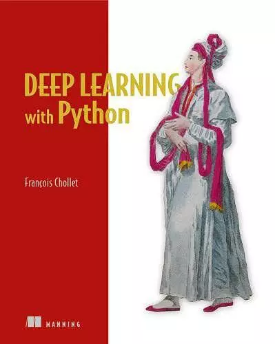
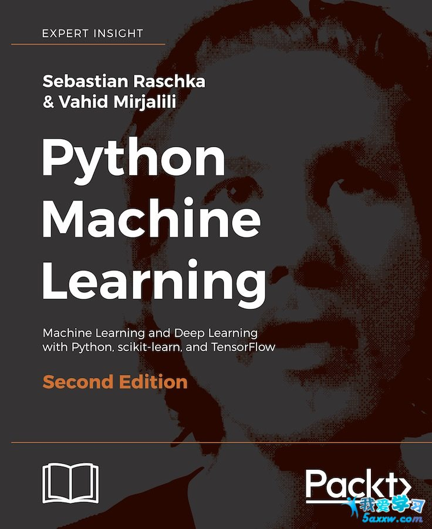
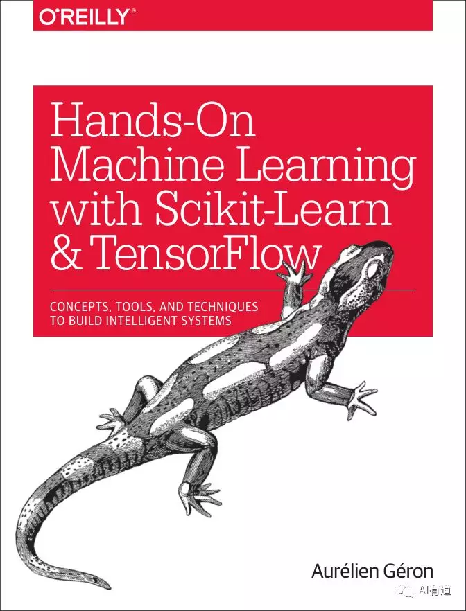
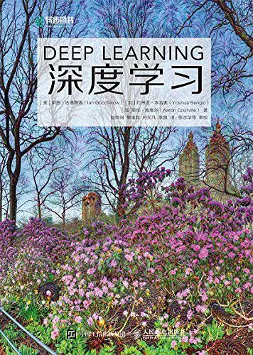

# 深度学习四大名著

**1. 《Deep Learning with Python》**

**推荐指数：★★★★☆**

本书自出版以来收到众多好评，因为是 Keras 作者写的书，所以全书基本围绕着 Keras 讲深度学习的各种实现，从 CNN，RNN 到 GAN 等，偏入门，但也承载着很多作者对深度学习整体性的思考。这是一本偏实战的书，教你使用 Keras 快速实现深度学习经典项目。看完这本书，基本能对 Keras 和深度学习实战有比较初步的掌握了。

源码 GitHub 地址：https://github.com/fchollet/deep-learning-with-python-notebooks

**2. 《Python Machine Learning》**

**推荐指数：★★★☆☆**

本书使用了 Scikit-Learn 和 TensorFlow，分别讲解机器学习和深度学习，并每章配备实操代码。还有一点是讲解了如何将机器学习模型发布到 Web 应用。整个知识体系相对更加完善，是一本比较全面的机器学习书籍。

源码 GitHub 地址: https://github.com/rasbt/python-machine-learning-book-2nd-edition

**3. 《Hands-On Machine Learning with Scikit-Learn & TensorFlow》**

**推荐指数：★★★★★**

本书中文译为《Scikit-Learn 与 TensorFlow 机器学习实用指南》。这本书最大的特色从理论上讲就是言简意赅，全书基本上没有太多复杂的数学公式推导，语言通俗易懂，很容易看得懂、看得下去。正本书兼顾理论与实战，是一本非常适合入门和实战的机器学习书籍。

源码 GitHub 地址：https://github.com/ageron/handson-ml

**4. 《Deep Learning》**

**推荐指数：★★★★☆**

又名“花书”。该书由三位大佬 Ian Goodfellow、Yoshua Bengio 和 Aaron Courville 撰写，是深度学习领域奠基性的经典教材。相信这本书大部分人入坑深度学习的都知道！